# Intermediate Level - Angular Material 3 Mastery

> **Level 2 of 5** | **Estimated Duration:** 8-12 weeks | **Difficulty:** 🟡🟡🟡

## 🎯 **Level Overview**

The intermediate level bridges the gap between basic implementation and advanced enterprise patterns. Here you'll master complex state management, advanced theming patterns, dynamic component architecture, and real-world application scenarios that mirror production environments.

## 🧠 **Learning Philosophy**

### **From Implementation to Architecture**
- **Beginner Level**: "How do I use this component?"
- **Intermediate Level**: "How do I architect scalable solutions?"
- **Focus Shift**: From individual components to system design

### **Real-World Complexity**
- Multi-user applications with complex state
- Advanced data visualization and interaction
- Performance optimization under load
- Internationalization and accessibility at scale

### **Production-Ready Patterns**
- Enterprise-grade error handling
- Advanced testing strategies
- Security considerations
- Scalable architecture patterns

## 📊 **Skill Progression Matrix**

```mermaid
graph TB
    subgraph "Intermediate Level Skills"
        A[State Management<br/>🎯 80%] --> B[Advanced Theming<br/>🎯 85%]
        B --> C[Dynamic Components<br/>🎯 75%]
        C --> D[Performance Optimization<br/>🎯 70%]
        D --> E[Enterprise Patterns<br/>🎯 65%]
    end
    
    subgraph "Supporting Skills"
        F[RxJS Mastery<br/>🎯 90%]
        G[TypeScript Advanced<br/>🎯 85%]
        H[Testing Strategy<br/>🎯 80%]
        I[Architecture Design<br/>🎯 75%]
    end
    
    subgraph "Outcome"
        J[Senior Developer<br/>Ready for Leadership]
    end
    
    A --> F
    B --> G
    C --> H
    D --> I
    E --> J
```



## 🏗️ **Project Portfolio**

### **Project 1: Advanced Task Management System**
- **Duration**: 3-4 weeks
- **Focus**: Complex state management, real-time updates
- **Key Technologies**: NgRx, WebSockets, Advanced RxJS
- **Deliverables**: Production-ready task management with team collaboration

### **Project 2: Multi-Tenant E-commerce Platform**
- **Duration**: 4-5 weeks  
- **Focus**: Dynamic theming, multi-tenant architecture
- **Key Technologies**: Dynamic theme switching, Micro-frontends
- **Deliverables**: Scalable e-commerce platform with custom branding

### **Project 3: Real-Time Analytics Dashboard**
- **Duration**: 3-4 weeks
- **Focus**: Data visualization, performance optimization
- **Key Technologies**: Chart.js integration, Virtual scrolling, WebWorkers
- **Deliverables**: High-performance dashboard with real-time data

### **Project 4: International Content Management System**
- **Duration**: 2-3 weeks
- **Focus**: Internationalization, content management
- **Key Technologies**: Angular i18n, Dynamic content loading
- **Deliverables**: Multi-language CMS with role-based access

## 🎯 **Learning Objectives**

### **🔧 Technical Mastery**
- [ ] **Advanced State Management**: NgRx architecture, effects, selectors
- [ ] **Dynamic Theming**: Runtime theme switching, theme inheritance
- [ ] **Performance Optimization**: Change detection, lazy loading, bundle optimization
- [ ] **Real-time Applications**: WebSocket integration, conflict resolution
- [ ] **Component Architecture**: Dynamic components, micro-frontend patterns

### **🏢 Enterprise Skills**
- [ ] **Scalable Architecture**: Modular design, separation of concerns
- [ ] **Security Patterns**: Authentication, authorization, data protection
- [ ] **Testing Strategy**: Advanced testing patterns, mocking strategies
- [ ] **Internationalization**: Multi-language support, RTL languages
- [ ] **Accessibility**: Advanced a11y patterns, screen reader optimization

### **🚀 Leadership Development**
- [ ] **Code Review**: Leading code reviews, mentoring junior developers
- [ ] **Architecture Decisions**: Making and documenting technical decisions
- [ ] **Performance Analysis**: Identifying and solving performance bottlenecks
- [ ] **Team Collaboration**: Working with designers, product managers, QA

## 📈 **Complexity Progression**

### **Week 1-2: Foundation Building**


### **Week 3-6: Core Development**


### **Week 7-10: Advanced Features**


### **Week 11-12: Integration & Polish**


## 🛠️ **Technology Stack Deep Dive**

### **State Management Ecosystem**
```typescript
// Advanced NgRx Architecture
interface AppState {
  auth: AuthState;
  tasks: TaskState;
  ui: UIState;
  themes: ThemeState;
  notifications: NotificationState;
}

// Feature-based store organization
const reducers: ActionReducerMap<AppState> = {
  auth: authReducer,
  tasks: taskReducer,
  ui: uiReducer,
  themes: themeReducer,
  notifications: notificationReducer
};
```

### **Advanced Theming Architecture**
```scss
// Dynamic theme system
:root {
  --primary-color: #{$primary-500};
  --secondary-color: #{$secondary-500};
  --surface-color: #{$surface};
  --on-surface-color: #{$on-surface};
}

[data-theme="dark"] {
  --primary-color: #{$primary-200};
  --secondary-color: #{$secondary-200};
  --surface-color: #{$surface-dark};
  --on-surface-color: #{$on-surface-dark};
}

[data-theme="custom"] {
  --primary-color: var(--custom-primary);
  --secondary-color: var(--custom-secondary);
  // ... dynamic theme variables
}
```

### **Performance Optimization Stack**
- **Change Detection**: OnPush strategy implementation
- **Bundle Optimization**: Route-based code splitting
- **Runtime Performance**: Virtual scrolling, lazy loading
- **Memory Management**: Subscription cleanup, object pooling

## 🎯 **Success Metrics**

### **Technical Proficiency**
- [ ] **Code Quality Score**: 90%+ (ESLint, SonarQube)
- [ ] **Test Coverage**: 85%+ (Unit, Integration, E2E)
- [ ] **Performance Score**: 90%+ (Lighthouse, Web Vitals)
- [ ] **Accessibility Score**: 95%+ (WCAG 2.1 AA)
- [ ] **Bundle Size**: Optimized for production

### **Project Delivery**
- [ ] **Feature Completeness**: All requirements implemented
- [ ] **Code Documentation**: Comprehensive inline and external docs
- [ ] **Deployment Ready**: CI/CD pipeline configured
- [ ] **Security Audit**: Passed security review
- [ ] **Performance Benchmarks**: Meets performance targets

### **Professional Development**
- [ ] **Mentoring**: Can guide junior developers
- [ ] **Technical Leadership**: Can lead technical decisions
- [ ] **Architecture Design**: Can design scalable solutions
- [ ] **Code Review**: Can conduct thorough code reviews
- [ ] **Problem Solving**: Can solve complex technical challenges

## 📚 **Advanced Learning Resources**

### **NgRx Mastery**
- [NgRx Workshop](https://ngrx.io/workshop)
- [Advanced NgRx Patterns](https://ngrx.io/guide/store/recipes)
- [RxJS Operators Deep Dive](https://rxjs.dev/guide/operators)

### **Performance Optimization**
- [Angular Performance Checklist](https://angular.io/guide/performance-checklist)
- [Web Performance Metrics](https://web.dev/metrics/)
- [Bundle Analysis Tools](https://webpack.js.org/guides/bundle-analysis/)

### **Enterprise Architecture**
- [Angular Architecture Guide](https://angular.io/guide/architecture)
- [Micro-frontend Architecture](https://micro-frontends.org/)
- [Design System Architecture](https://atomicdesign.bradfrost.com/)

## 🔄 **Continuous Learning Path**

### **Phase 1: Foundation (Weeks 1-2)**
- Review and solidify beginner concepts
- Set up advanced development environment
- Learn NgRx fundamentals
- Advanced RxJS operator patterns

### **Phase 2: Core Development (Weeks 3-8)**
- Build Task Management System
- Implement Multi-Tenant Platform
- Master advanced theming patterns
- Develop real-time features

### **Phase 3: Optimization (Weeks 9-10)**
- Performance profiling and optimization
- Advanced testing strategies
- Security implementation
- Accessibility enhancements

### **Phase 4: Integration (Weeks 11-12)**
- CMS development and internationalization
- Final project integration
- Portfolio preparation
- Preparation for advanced level

## 📊 **Progress Tracking Dashboard**

### **Weekly Milestones**


### **Skill Assessment Checkpoints**
- **Week 2**: Foundation Assessment (NgRx, RxJS, Architecture)
- **Week 6**: Mid-level Assessment (State Management, Theming)
- **Week 10**: Advanced Assessment (Performance, Real-time Features)
- **Week 12**: Final Assessment (Overall Integration, Leadership Skills)

## 🎯 **Ready to Level Up?**

### **Prerequisites Checklist**
- [ ] Completed all beginner level projects
- [ ] Solid understanding of Angular fundamentals
- [ ] Experience with TypeScript advanced features
- [ ] Basic understanding of state management concepts
- [ ] Familiarity with testing frameworks

### **Getting Started**
1. **Skill Assessment**: Complete the intermediate level assessment
2. **Environment Setup**: Configure advanced development environment
3. **Project Selection**: Choose your first intermediate project
4. **Mentorship**: Consider pairing with a senior developer
5. **Timeline Planning**: Create your personal learning schedule

---

## 🚀 **Next Steps**

Ready to begin your intermediate journey? Start with:

1. **[Project 1: Advanced Task Management System](./project-task-management/README.md)**
2. **[Advanced Theming Patterns](./advanced-theming-patterns/README.md)**
3. **[State Management Integration](./state-management-integration/README.md)**

**Welcome to the intermediate level!** This is where you transition from implementer to architect. Every project is designed to challenge you with real-world complexity while building the skills needed for senior-level development.

---

*"The intermediate level is where good developers become great developers. It's not just about writing code—it's about architecting solutions."*
