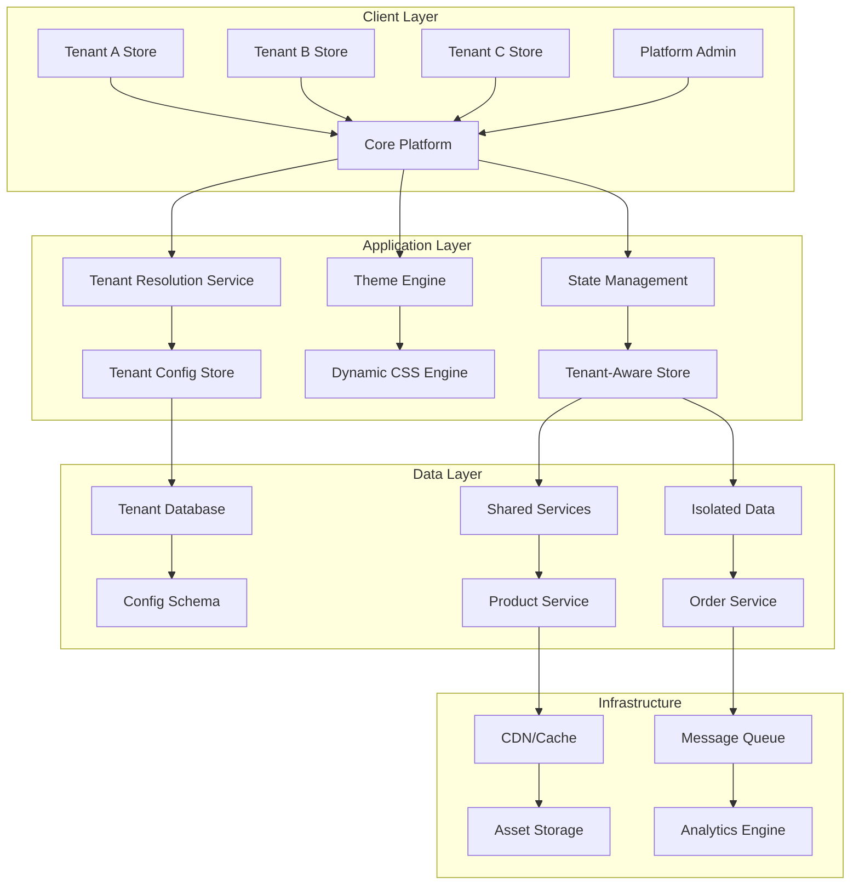

# Multi-Tenant E-commerce Platform

> **Project 2 of 4** - Intermediate Level | **Estimated Time:** 4-5 weeks | **Difficulty:** 🟡🟡🟡🟡🟡

## 🎯 **Project Overview**

Build a sophisticated multi-tenant e-commerce platform where multiple businesses can create their own branded online stores. This project focuses on dynamic theming, micro-frontend architecture, advanced state management, and scalable design patterns that support multiple tenants with isolated branding and functionality.

## 🧠 **Learning Objectives**

By completing this project, you will master:

- **🏢 Multi-Tenant Architecture**: Tenant isolation, dynamic configuration, shared resources
- **🎨 Dynamic Theming**: Runtime theme switching, brand customization, CSS generation
- **🔧 Micro-Frontend Patterns**: Module federation, shared libraries, independent deployments
- **📊 Advanced State Management**: Tenant-aware state, cross-tenant data isolation
- **🛡️ Security & Isolation**: Tenant data security, role-based access, domain management
- **⚡ Performance at Scale**: Optimized loading, caching strategies, resource sharing

## 🏢 **Business Requirements**

### **Core Multi-Tenant Features**
- Tenant onboarding and provisioning
- Custom domain support (subdomain and custom domains)
- Brand customization (themes, logos, colors, typography)
- Isolated product catalogs and inventory
- Tenant-specific user management
- Billing and subscription management
- Analytics and reporting per tenant

### **E-commerce Features**
- Product catalog management
- Shopping cart and checkout
- Order management and fulfillment
- Payment processing integration
- Inventory management
- Customer relationship management
- Marketing tools and promotions

### **Admin Features**
- Platform-wide tenant management
- System monitoring and analytics
- Global configuration management
- Resource usage tracking
- Security and compliance monitoring

## 🏗️ **Technical Architecture**

### **Multi-Tenant Architecture Diagram**


### **Module Federation Architecture**
```typescript
// Platform shell configuration
const ModuleFederationConfig = {
  name: 'shell',
  remotes: {
    'tenant-storefront': 'tenantStorefront@http://localhost:4201/remoteEntry.js',
    'admin-dashboard': 'adminDashboard@http://localhost:4202/remoteEntry.js',
    'analytics-module': 'analyticsModule@http://localhost:4203/remoteEntry.js'
  },
  shared: {
    '@angular/core': { singleton: true, strictVersion: true },
    '@angular/common': { singleton: true, strictVersion: true },
    '@angular/material': { singleton: true, strictVersion: true },
    '@ngrx/store': { singleton: true, strictVersion: true }
  }
};
```

## 📁 **Project Structure**

```
multi-tenant-ecommerce/
├── 📦 apps/
│   ├── shell/                          # Main platform shell
│   │   ├── src/
│   │   │   ├── app/
│   │   │   │   ├── core/
│   │   │   │   │   ├── tenant/
│   │   │   │   │   │   ├── tenant-resolver.service.ts
│   │   │   │   │   │   ├── tenant-config.service.ts
│   │   │   │   │   │   └── tenant.model.ts
│   │   │   │   │   ├── theming/
│   │   │   │   │   │   ├── dynamic-theme.service.ts
│   │   │   │   │   │   ├── css-generator.service.ts
│   │   │   │   │   │   └── theme.model.ts
│   │   │   │   │   └── security/
│   │   │   │   │       ├── tenant-guard.ts
│   │   │   │   │       └── isolation.service.ts
│   │   │   │   ├── shared/
│   │   │   │   │   ├── components/
│   │   │   │   │   ├── services/
│   │   │   │   │   └── utils/
│   │   │   │   └── features/
│   │   │   │       ├── tenant-selection/
│   │   │   │       └── platform-admin/
│   │   │   └── assets/
│   │   │       ├── themes/
│   │   │       └── tenant-assets/
│   │   └── webpack.config.js
│   ├── tenant-storefront/              # Tenant store microfrontend
│   │   ├── src/
│   │   │   ├── app/
│   │   │   │   ├── features/
│   │   │   │   │   ├── product-catalog/
│   │   │   │   │   ├── shopping-cart/
│   │   │   │   │   ├── checkout/
│   │   │   │   │   ├── user-account/
│   │   │   │   │   └── order-history/
│   │   │   │   ├── store/
│   │   │   │   │   ├── tenant/
│   │   │   │   │   ├── products/
│   │   │   │   │   ├── cart/
│   │   │   │   │   └── orders/
│   │   │   │   └── shared/
│   │   │   └── assets/
│   │   └── webpack.config.js
│   ├── admin-dashboard/                # Tenant admin microfrontend
│   │   ├── src/
│   │   │   ├── app/
│   │   │   │   ├── features/
│   │   │   │   │   ├── tenant-management/
│   │   │   │   │   ├── brand-customization/
│   │   │   │   │   ├── product-management/
│   │   │   │   │   ├── order-management/
│   │   │   │   │   └── analytics/
│   │   │   │   └── store/
│   │   │   └── assets/
│   │   └── webpack.config.js
│   └── analytics-module/               # Analytics microfrontend
│       ├── src/
│       │   ├── app/
│       │   │   ├── features/
│       │   │   │   ├── dashboard/
│       │   │   │   ├── reports/
│       │   │   │   └── real-time-analytics/
│       │   │   └── store/
│       │   └── assets/
│       └── webpack.config.js
├── 📚 libs/
│   ├── shared-ui/                      # Shared UI components
│   │   ├── src/
│   │   │   ├── lib/
│   │   │   │   ├── components/
│   │   │   │   ├── directives/
│   │   │   │   ├── pipes/
│   │   │   │   └── tokens/
│   │   │   └── public-api.ts
│   │   └── ng-package.json
│   ├── shared-models/                  # Shared data models
│   │   ├── src/
│   │   │   ├── lib/
│   │   │   │   ├── tenant/
│   │   │   │   ├── product/
│   │   │   │   ├── user/
│   │   │   │   └── order/
│   │   │   └── public-api.ts
│   │   └── ng-package.json
│   ├── shared-services/                # Shared services
│   │   ├── src/
│   │   │   ├── lib/
│   │   │   │   ├── api/
│   │   │   │   ├── cache/
│   │   │   │   ├── notification/
│   │   │   │   └── utils/
│   │   │   └── public-api.ts
│   │   └── ng-package.json
│   └── tenant-theming/                 # Theming engine
│       ├── src/
│       │   ├── lib/
│       │   │   ├── engines/
│       │   │   ├── generators/
│       │   │   ├── models/
│       │   │   └── services/
│       │   └── public-api.ts
│       └── ng-package.json
├── 🎨 design-system/                   # Design system documentation
│   ├── components/
│   ├── tokens/
│   ├── themes/
│   └── guidelines/
├── 🧪 e2e/                            # End-to-end tests
│   ├── tenant-workflows/
│   ├── admin-workflows/
│   └── multi-tenant-scenarios/
├── 📋 docs/                           # Project documentation
│   ├── architecture/
│   ├── deployment/
│   ├── api/
│   └── user-guides/
└── 🔧 tools/                          # Build and development tools
    ├── webpack/
    ├── scripts/
    └── generators/
```

## 🎨 **Dynamic Theming Engine**

### **Theme Model and Configuration**
```typescript
// libs/tenant-theming/src/lib/models/theme.model.ts
export interface TenantTheme {
  id: string;
  tenantId: string;
  name: string;
  displayName: string;
  description: string;
  isActive: boolean;
  
  // Color system
  colors: ThemeColors;
  
  // Typography
  typography: ThemeTypography;
  
  // Layout and spacing
  layout: ThemeLayout;
  
  // Component overrides
  components: ThemeComponents;
  
  // Custom CSS
  customCSS: string;
  
  // Assets
  assets: ThemeAssets;
  
  // Metadata
  createdAt: Date;
  updatedAt: Date;
  version: string;
}

export interface ThemeColors {
  // Material Design 3 color roles
  primary: ColorPalette;
  secondary: ColorPalette;
  tertiary: ColorPalette;
  error: ColorPalette;
  neutral: ColorPalette;
  neutralVariant: ColorPalette;
  
  // Custom brand colors
  brandPrimary: string;
  brandSecondary: string;
  brandAccent: string;
  
  // Semantic colors
  success: string;
  warning: string;
  info: string;
  
  // Surface colors
  surface: string;
  surfaceVariant: string;
  inverseSurface: string;
  
  // Background colors
  background: string;
  onBackground: string;
}

export interface ColorPalette {
  50: string;
  100: string;
  200: string;
  300: string;
  400: string;
  500: string; // Main color
  600: string;
  700: string;
  800: string;
  900: string;
  950: string;
}

export interface ThemeTypography {
  // Font families
  primaryFont: FontDefinition;
  secondaryFont: FontDefinition;
  monoFont: FontDefinition;
  
  // Typography scale
  scale: TypographyScale;
  
  // Line heights
  lineHeights: LineHeights;
  
  // Font weights
  fontWeights: FontWeights;
}

export interface ThemeLayout {
  // Container sizes
  containers: {
    xs: string;
    sm: string;
    md: string;
    lg: string;
    xl: string;
    xxl: string;
  };
  
  // Spacing scale
  spacing: {
    xs: string;
    sm: string;
    md: string;
    lg: string;
    xl: string;
    xxl: string;
  };
  
  // Border radius
  borderRadius: {
    none: string;
    sm: string;
    md: string;
    lg: string;
    xl: string;
    full: string;
  };
  
  // Shadows
  shadows: {
    sm: string;
    md: string;
    lg: string;
    xl: string;
  };
}

export interface ThemeComponents {
  // Component-specific overrides
  button: ComponentTheme;
  card: ComponentTheme;
  input: ComponentTheme;
  navigation: ComponentTheme;
  // ... other components
}

export interface ComponentTheme {
  styles: { [selector: string]: CSSStyleDeclaration };
  variants: { [variant: string]: CSSStyleDeclaration };
}

export interface ThemeAssets {
  logo: AssetDefinition;
  favicon: AssetDefinition;
  backgroundImages: AssetDefinition[];
  icons: { [name: string]: AssetDefinition };
}

export interface AssetDefinition {
  url: string;
  alt?: string;
  width?: number;
  height?: number;
  format?: string;
}
```

### **Dynamic CSS Generation Service**
```typescript
// libs/tenant-theming/src/lib/services/css-generator.service.ts
import { Injectable } from '@angular/core';
import { TenantTheme, ThemeColors } from '../models/theme.model';

@Injectable({
  providedIn: 'root'
})
export class CSSGeneratorService {
  
  generateThemeCSS(theme: TenantTheme): string {
    const cssRules: string[] = [];
    
    // Generate CSS custom properties
    cssRules.push(this.generateCSSCustomProperties(theme));
    
    // Generate component styles
    cssRules.push(this.generateComponentStyles(theme));
    
    // Generate typography styles
    cssRules.push(this.generateTypographyStyles(theme));
    
    // Generate layout styles
    cssRules.push(this.generateLayoutStyles(theme));
    
    // Add custom CSS
    if (theme.customCSS) {
      cssRules.push(theme.customCSS);
    }
    
    return cssRules.join('\n\n');
  }
  
  private generateCSSCustomProperties(theme: TenantTheme): string {
    const properties: string[] = [];
    
    // Color properties
    Object.entries(theme.colors).forEach(([colorName, colorValue]) => {
      if (typeof colorValue === 'string') {
        properties.push(`  --theme-${this.kebabCase(colorName)}: ${colorValue};`);
      } else if (typeof colorValue === 'object') {
        // Handle color palettes
        Object.entries(colorValue).forEach(([shade, value]) => {
          properties.push(`  --theme-${this.kebabCase(colorName)}-${shade}: ${value};`);
        });
      }
    });
    
    // Typography properties
    properties.push(`  --theme-font-primary: ${theme.typography.primaryFont.family};`);
    properties.push(`  --theme-font-secondary: ${theme.typography.secondaryFont.family};`);
    
    // Layout properties
    Object.entries(theme.layout.spacing).forEach(([size, value]) => {
      properties.push(`  --theme-spacing-${size}: ${value};`);
    });
    
    Object.entries(theme.layout.borderRadius).forEach(([size, value]) => {
      properties.push(`  --theme-radius-${size}: ${value};`);
    });
    
    return `:root {\n${properties.join('\n')}\n}`;
  }
  
  private generateComponentStyles(theme: TenantTheme): string {
    const componentStyles: string[] = [];
    
    // Button styles
    componentStyles.push(`
      .mat-mdc-button {
        border-radius: var(--theme-radius-md);
        font-family: var(--theme-font-primary);
        font-weight: 500;
        text-transform: none;
      }
      
      .mat-mdc-raised-button.mat-primary {
        background-color: var(--theme-primary-500);
        color: var(--theme-primary-50);
      }
      
      .mat-mdc-raised-button.mat-primary:hover {
        background-color: var(--theme-primary-600);
      }
    `);
    
    // Card styles
    componentStyles.push(`
      .mat-mdc-card {
        border-radius: var(--theme-radius-lg);
        box-shadow: var(--theme-shadow-md);
        border: 1px solid var(--theme-neutral-200);
      }
    `);
    
    // Navigation styles
    componentStyles.push(`
      .tenant-navigation {
        background-color: var(--theme-primary-500);
        color: var(--theme-primary-50);
      }
      
      .tenant-navigation .logo {
        content: url('${theme.assets.logo.url}');
        height: 40px;
        width: auto;
      }
    `);
    
    return componentStyles.join('\n\n');
  }
  
  private generateTypographyStyles(theme: TenantTheme): string {
    const typographyStyles: string[] = [];
    
    // Import fonts if needed
    if (theme.typography.primaryFont.url) {
      typographyStyles.push(`@import url('${theme.typography.primaryFont.url}');`);
    }
    
    if (theme.typography.secondaryFont.url) {
      typographyStyles.push(`@import url('${theme.typography.secondaryFont.url}');`);
    }
    
    // Typography scale
    Object.entries(theme.typography.scale).forEach(([level, config]) => {
      typographyStyles.push(`
        .typography-${level} {
          font-family: var(--theme-font-primary);
          font-size: ${config.fontSize};
          font-weight: ${config.fontWeight};
          line-height: ${config.lineHeight};
          letter-spacing: ${config.letterSpacing || 'normal'};
        }
      `);
    });
    
    return typographyStyles.join('\n\n');
  }
  
  private generateLayoutStyles(theme: TenantTheme): string {
    const layoutStyles: string[] = [];
    
    // Container styles
    Object.entries(theme.layout.containers).forEach(([size, width]) => {
      layoutStyles.push(`
        .container-${size} {
          max-width: ${width};
          margin: 0 auto;
          padding: 0 var(--theme-spacing-md);
        }
      `);
    });
    
    // Utility classes
    layoutStyles.push(`
      .shadow-sm { box-shadow: ${theme.layout.shadows.sm}; }
      .shadow-md { box-shadow: ${theme.layout.shadows.md}; }
      .shadow-lg { box-shadow: ${theme.layout.shadows.lg}; }
      .shadow-xl { box-shadow: ${theme.layout.shadows.xl}; }
    `);
    
    return layoutStyles.join('\n\n');
  }
  
  private kebabCase(str: string): string {
    return str.replace(/([a-z0-9]|(?=[A-Z]))([A-Z])/g, '$1-$2').toLowerCase();
  }
  
  // Method to inject CSS into the document
  injectThemeCSS(css: string, themeId: string): void {
    // Remove existing theme
    const existingStyle = document.getElementById(`theme-${themeId}`);
    if (existingStyle) {
      existingStyle.remove();
    }
    
    // Create new style element
    const styleElement = document.createElement('style');
    styleElement.id = `theme-${themeId}`;
    styleElement.textContent = css;
    
    // Inject into document head
    document.head.appendChild(styleElement);
  }
  
  // Method to generate CSS file for build-time optimization
  generateCSSFile(theme: TenantTheme): Blob {
    const css = this.generateThemeCSS(theme);
    return new Blob([css], { type: 'text/css' });
  }
}
```

### **Dynamic Theme Service**
```typescript
// apps/shell/src/app/core/theming/dynamic-theme.service.ts
import { Injectable, Inject } from '@angular/core';
import { BehaviorSubject, Observable } from 'rxjs';
import { DOCUMENT } from '@angular/common';
import { CSSGeneratorService } from '@tenant-theming/css-generator';
import { TenantTheme } from '@shared-models/tenant';

@Injectable({
  providedIn: 'root'
})
export class DynamicThemeService {
  private currentThemeSubject = new BehaviorSubject<TenantTheme | null>(null);
  private loadedThemes = new Map<string, TenantTheme>();
  
  currentTheme$ = this.currentThemeSubject.asObservable();
  
  constructor(
    private cssGenerator: CSSGeneratorService,
    @Inject(DOCUMENT) private document: Document
  ) {}
  
  async loadTheme(tenantId: string): Promise<void> {
    try {
      // Check if theme is already loaded
      if (this.loadedThemes.has(tenantId)) {
        const theme = this.loadedThemes.get(tenantId)!;
        this.applyTheme(theme);
        return;
      }
      
      // Load theme configuration
      const theme = await this.fetchThemeConfig(tenantId);
      
      // Cache the theme
      this.loadedThemes.set(tenantId, theme);
      
      // Apply the theme
      this.applyTheme(theme);
      
    } catch (error) {
      console.error('Failed to load theme:', error);
      // Fall back to default theme
      this.applyDefaultTheme();
    }
  }
  
  private async fetchThemeConfig(tenantId: string): Promise<TenantTheme> {
    // In a real app, this would fetch from an API
    const response = await fetch(`/api/tenants/${tenantId}/theme`);
    
    if (!response.ok) {
      throw new Error(`Failed to fetch theme for tenant ${tenantId}`);
    }
    
    return response.json();
  }
  
  private applyTheme(theme: TenantTheme): void {
    // Generate CSS for the theme
    const css = this.cssGenerator.generateThemeCSS(theme);
    
    // Inject CSS into document
    this.cssGenerator.injectThemeCSS(css, theme.tenantId);
    
    // Update current theme
    this.currentThemeSubject.next(theme);
    
    // Update document attributes for theme-specific styling
    this.document.documentElement.setAttribute('data-tenant', theme.tenantId);
    this.document.documentElement.setAttribute('data-theme', theme.name);
    
    // Update favicon
    this.updateFavicon(theme.assets.favicon.url);
    
    // Update document title if needed
    this.updateDocumentTitle(theme.displayName);
  }
  
  private applyDefaultTheme(): void {
    // Apply platform default theme
    const defaultTheme = this.getDefaultTheme();
    this.applyTheme(defaultTheme);
  }
  
  private getDefaultTheme(): TenantTheme {
    // Return a default theme configuration
    return {
      id: 'default',
      tenantId: 'platform',
      name: 'default',
      displayName: 'Platform Default',
      description: 'Default platform theme',
      isActive: true,
      colors: {
        // Default Material Design 3 colors
        primary: {
          50: '#e3f2fd',
          100: '#bbdefb',
          200: '#90caf9',
          300: '#64b5f6',
          400: '#42a5f5',
          500: '#2196f3',
          600: '#1e88e5',
          700: '#1976d2',
          800: '#1565c0',
          900: '#0d47a1',
          950: '#0a47a1'
        },
        // ... other default colors
      },
      // ... other default theme properties
    } as TenantTheme;
  }
  
  private updateFavicon(faviconUrl: string): void {
    const links = this.document.querySelectorAll('link[rel="icon"]');
    links.forEach(link => link.remove());
    
    const newLink = this.document.createElement('link');
    newLink.rel = 'icon';
    newLink.href = faviconUrl;
    this.document.head.appendChild(newLink);
  }
  
  private updateDocumentTitle(title: string): void {
    this.document.title = title;
  }
  
  // Method to preview theme changes without applying
  previewTheme(theme: TenantTheme): string {
    return this.cssGenerator.generateThemeCSS(theme);
  }
  
  // Method to validate theme configuration
  validateTheme(theme: TenantTheme): { isValid: boolean; errors: string[] } {
    const errors: string[] = [];
    
    // Validate required properties
    if (!theme.colors.primary) {
      errors.push('Primary color is required');
    }
    
    if (!theme.typography.primaryFont) {
      errors.push('Primary font is required');
    }
    
    // Validate color contrast ratios
    if (!this.validateColorContrast(theme.colors)) {
      errors.push('Color contrast ratios do not meet accessibility standards');
    }
    
    return {
      isValid: errors.length === 0,
      errors
    };
  }
  
  private validateColorContrast(colors: any): boolean {
    // Implement color contrast validation logic
    // This would check WCAG contrast ratios
    return true; // Simplified for example
  }
  
  // Method to export theme as downloadable CSS
  exportThemeCSS(theme: TenantTheme): void {
    const css = this.cssGenerator.generateThemeCSS(theme);
    const blob = new Blob([css], { type: 'text/css' });
    const url = URL.createObjectURL(blob);
    
    const link = this.document.createElement('a');
    link.href = url;
    link.download = `${theme.name}-theme.css`;
    link.click();
    
    URL.revokeObjectURL(url);
  }
}
```

## 🏢 **Tenant Resolution and Management**

### **Tenant Resolution Service**
```typescript
// apps/shell/src/app/core/tenant/tenant-resolver.service.ts
import { Injectable } from '@angular/core';
import { Observable, BehaviorSubject } from 'rxjs';
import { map, catchError, switchMap } from 'rxjs/operators';
import { Tenant, TenantConfig } from '@shared-models/tenant';

export interface TenantResolutionStrategy {
  type: 'subdomain' | 'domain' | 'path' | 'header';
  resolver: (context: any) => string | null;
}

@Injectable({
  providedIn: 'root'
})
export class TenantResolverService {
  private currentTenantSubject = new BehaviorSubject<Tenant | null>(null);
  private tenantCache = new Map<string, Tenant>();
  
  currentTenant$ = this.currentTenantSubject.asObservable();
  
  private resolutionStrategies: TenantResolutionStrategy[] = [
    {
      type: 'subdomain',
      resolver: (context) => this.resolveFromSubdomain(context.hostname)
    },
    {
      type: 'domain',
      resolver: (context) => this.resolveFromCustomDomain(context.hostname)
    },
    {
      type: 'path',
      resolver: (context) => this.resolveFromPath(context.pathname)
    },
    {
      type: 'header',
      resolver: (context) => this.resolveFromHeader(context.headers)
    }
  ];
  
  constructor() {}
  
  async resolveTenant(): Promise<Tenant | null> {
    const context = {
      hostname: window.location.hostname,
      pathname: window.location.pathname,
      headers: this.getRequestHeaders()
    };
    
    // Try each resolution strategy
    for (const strategy of this.resolutionStrategies) {
      const tenantIdentifier = strategy.resolver(context);
      
      if (tenantIdentifier) {
        const tenant = await this.loadTenant(tenantIdentifier);
        
        if (tenant) {
          this.currentTenantSubject.next(tenant);
          return tenant;
        }
      }
    }
    
    // No tenant found, use default
    const defaultTenant = await this.loadDefaultTenant();
    this.currentTenantSubject.next(defaultTenant);
    return defaultTenant;
  }
  
  private resolveFromSubdomain(hostname: string): string | null {
    // Extract subdomain from hostname
    // Example: tenant1.platform.com -> tenant1
    const parts = hostname.split('.');
    
    if (parts.length >= 3) {
      const subdomain = parts[0];
      
      // Skip common non-tenant subdomains
      if (['www', 'api', 'admin', 'app'].includes(subdomain)) {
        return null;
      }
      
      return subdomain;
    }
    
    return null;
  }
  
  private resolveFromCustomDomain(hostname: string): string | null {
    // Check if hostname is a custom domain
    // This would typically involve a lookup in a database
    // For now, return null as custom domains need special handling
    return null;
  }
  
  private resolveFromPath(pathname: string): string | null {
    // Extract tenant from path
    // Example: /tenant/tenant1/... -> tenant1
    const pathMatch = pathname.match(/^\/tenant\/([^\/]+)/);
    return pathMatch ? pathMatch[1] : null;
  }
  
  private resolveFromHeader(headers: any): string | null {
    // Extract tenant from custom header
    return headers['X-Tenant-ID'] || null;
  }
  
  private async loadTenant(identifier: string): Promise<Tenant | null> {
    try {
      // Check cache first
      if (this.tenantCache.has(identifier)) {
        return this.tenantCache.get(identifier)!;
      }
      
      // Load from API
      const response = await fetch(`/api/tenants/resolve/${identifier}`);
      
      if (!response.ok) {
        return null;
      }
      
      const tenant: Tenant = await response.json();
      
      // Validate tenant is active
      if (!tenant.isActive) {
        return null;
      }
      
      // Cache the tenant
      this.tenantCache.set(identifier, tenant);
      
      return tenant;
      
    } catch (error) {
      console.error('Failed to load tenant:', error);
      return null;
    }
  }
  
  private async loadDefaultTenant(): Promise<Tenant> {
    // Return platform default tenant configuration
    return {
      id: 'default',
      name: 'Platform',
      subdomain: 'www',
      customDomain: null,
      isActive: true,
      config: this.getDefaultTenantConfig(),
      // ... other properties
    } as Tenant;
  }
  
  private getDefaultTenantConfig(): TenantConfig {
    return {
      branding: {
        name: 'Multi-Tenant Platform',
        logo: '/assets/default-logo.png',
        favicon: '/assets/default-favicon.ico',
        primaryColor: '#2196f3',
        secondaryColor: '#f44336'
      },
      features: {
        ecommerce: true,
        analytics: true,
        customDomain: false,
        api: true
      },
      limits: {
        users: 100,
        products: 1000,
        storage: 1024, // MB
        bandwidth: 10240 // MB
      }
    };
  }
  
  private getRequestHeaders(): any {
    // In a real application, this would get headers from the HTTP request
    // For client-side resolution, we'll use a simplified approach
    return {};
  }
  
  // Method to switch tenant (for testing or admin purposes)
  async switchTenant(tenantId: string): Promise<boolean> {
    const tenant = await this.loadTenant(tenantId);
    
    if (tenant) {
      this.currentTenantSubject.next(tenant);
      return true;
    }
    
    return false;
  }
  
  // Method to get tenant configuration
  getTenantConfig(): TenantConfig | null {
    const currentTenant = this.currentTenantSubject.value;
    return currentTenant ? currentTenant.config : null;
  }
  
  // Method to check if feature is enabled for current tenant
  isFeatureEnabled(feature: string): boolean {
    const config = this.getTenantConfig();
    return config ? config.features[feature] || false : false;
  }
}
```

This Multi-Tenant E-commerce Platform project represents a significant step up in complexity from the Task Management System. It introduces enterprise-level concepts like multi-tenancy, dynamic theming, and micro-frontend architecture that are crucial for building scalable SaaS applications.

The project builds upon intermediate concepts while introducing advanced architectural patterns that bridge toward expert-level development. Students completing this project will have hands-on experience with:

- Complex multi-tenant architecture patterns
- Dynamic theme generation and runtime CSS manipulation
- Module federation and micro-frontend patterns
- Advanced state management with tenant isolation
- Scalable Angular application architecture

Continue to see the implementation guide and additional components?
