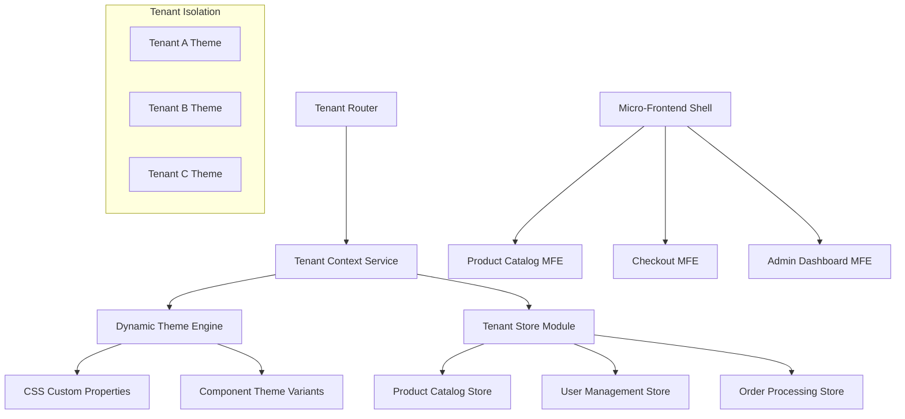

# Multi-Tenant E-commerce Platform - Implementation Guide

## 🎯 **Project Overview**

Build a sophisticated multi-tenant e-commerce platform with dynamic theming, tenant isolation, and micro-frontend architecture. This project demonstrates advanced Angular patterns, state management, and scalable architecture design.

## 🏗️ **Architecture Overview**



## 📋 **Implementation Phases**

### **Phase 1: Multi-Tenant Foundation** (Week 1)

#### **1.1 Project Setup & Architecture**

```bash
# Create the project
ng new multi-tenant-ecommerce --routing --style=scss --standalone
cd multi-tenant-ecommerce

# Install dependencies
npm install @angular/material @angular/cdk @ngrx/store @ngrx/effects @ngrx/entity @ngrx/router-store
npm install @angular/flex-layout @angular/google-maps
npm install rxjs lodash-es uuid
npm install -D @types/lodash-es @types/uuid
```

#### **1.2 Core Architecture Setup**

**Create Tenant Service:**
```typescript
// src/app/core/services/tenant.service.ts
import { Injectable, inject } from '@angular/core';
import { BehaviorSubject, Observable } from 'rxjs';
import { Router } from '@angular/router';

export interface TenantConfig {
  id: string;
  name: string;
  domain: string;
  theme: TenantTheme;
  features: TenantFeatures;
  branding: TenantBranding;
}

export interface TenantTheme {
  primary: string;
  secondary: string;
  accent: string;
  warn: string;
  background: string;
  surface: string;
  typography: TypographyConfig;
}

export interface TenantFeatures {
  multiCurrency: boolean;
  advancedSearch: boolean;
  wishlist: boolean;
  reviews: boolean;
  socialLogin: boolean;
}

export interface TenantBranding {
  logo: string;
  favicon: string;
  companyName: string;
  tagline: string;
  footerText: string;
}

@Injectable({
  providedIn: 'root'
})
export class TenantService {
  private readonly router = inject(Router);
  
  private currentTenantSubject = new BehaviorSubject<TenantConfig | null>(null);
  public currentTenant$ = this.currentTenantSubject.asObservable();

  private tenantConfigs: Map<string, TenantConfig> = new Map([
    ['electronics-plus', {
      id: 'electronics-plus',
      name: 'Electronics Plus',
      domain: 'electronics-plus.local',
      theme: {
        primary: '#1976d2',
        secondary: '#424242',
        accent: '#82b1ff',
        warn: '#f44336',
        background: '#fafafa',
        surface: '#ffffff',
        typography: {
          fontFamily: 'Roboto, sans-serif',
          headingWeight: 500,
          bodyWeight: 400
        }
      },
      features: {
        multiCurrency: true,
        advancedSearch: true,
        wishlist: true,
        reviews: true,
        socialLogin: true
      },
      branding: {
        logo: '/assets/tenants/electronics-plus/logo.svg',
        favicon: '/assets/tenants/electronics-plus/favicon.ico',
        companyName: 'Electronics Plus',
        tagline: 'Premium Electronics for Everyone',
        footerText: '© 2024 Electronics Plus. All rights reserved.'
      }
    }],
    ['fashion-hub', {
      id: 'fashion-hub',
      name: 'Fashion Hub',
      domain: 'fashion-hub.local',
      theme: {
        primary: '#e91e63',
        secondary: '#9c27b0',
        accent: '#ff4081',
        warn: '#f44336',
        background: '#fce4ec',
        surface: '#ffffff',
        typography: {
          fontFamily: 'Montserrat, sans-serif',
          headingWeight: 600,
          bodyWeight: 400
        }
      },
      features: {
        multiCurrency: false,
        advancedSearch: true,
        wishlist: true,
        reviews: true,
        socialLogin: true
      },
      branding: {
        logo: '/assets/tenants/fashion-hub/logo.svg',
        favicon: '/assets/tenants/fashion-hub/favicon.ico',
        companyName: 'Fashion Hub',
        tagline: 'Style Meets Comfort',
        footerText: '© 2024 Fashion Hub. Trendsetting since 2020.'
      }
    }]
  ]);

  initializeTenant(tenantId?: string): void {
    // Determine tenant from subdomain, route param, or default
    const resolvedTenantId = tenantId || this.resolveTenantFromContext();
    const tenant = this.tenantConfigs.get(resolvedTenantId);
    
    if (tenant) {
      this.currentTenantSubject.next(tenant);
      this.applyTenantTheme(tenant.theme);
      this.updatePageBranding(tenant.branding);
    }
  }

  private resolveTenantFromContext(): string {
    // Check URL parameters, subdomain, or localStorage
    const urlParams = new URLSearchParams(window.location.search);
    const tenantParam = urlParams.get('tenant');
    
    if (tenantParam && this.tenantConfigs.has(tenantParam)) {
      return tenantParam;
    }
    
    // Default tenant
    return 'electronics-plus';
  }

  private applyTenantTheme(theme: TenantTheme): void {
    const root = document.documentElement;
    
    // Apply CSS custom properties
    root.style.setProperty('--tenant-primary', theme.primary);
    root.style.setProperty('--tenant-secondary', theme.secondary);
    root.style.setProperty('--tenant-accent', theme.accent);
    root.style.setProperty('--tenant-warn', theme.warn);
    root.style.setProperty('--tenant-background', theme.background);
    root.style.setProperty('--tenant-surface', theme.surface);
    root.style.setProperty('--tenant-font-family', theme.typography.fontFamily);
  }

  private updatePageBranding(branding: TenantBranding): void {
    // Update page title and favicon
    document.title = branding.companyName;
    
    const favicon = document.querySelector('link[rel="icon"]') as HTMLLinkElement;
    if (favicon) {
      favicon.href = branding.favicon;
    }
  }
}
```

#### **1.3 Dynamic Theme Engine**

```typescript
// src/app/core/services/dynamic-theme.service.ts
import { Injectable, inject } from '@angular/core';
import { TenantService, TenantTheme } from './tenant.service';
import { BehaviorSubject } from 'rxjs';

@Injectable({
  providedIn: 'root'
})
export class DynamicThemeService {
  private readonly tenantService = inject(TenantService);
  
  private themeClassSubject = new BehaviorSubject<string>('');
  public themeClass$ = this.themeClassSubject.asObservable();

  constructor() {
    this.tenantService.currentTenant$.subscribe(tenant => {
      if (tenant) {
        this.generateDynamicTheme(tenant.theme);
        this.themeClassSubject.next(`tenant-${tenant.id}`);
      }
    });
  }

  private generateDynamicTheme(theme: TenantTheme): void {
    const styleId = 'dynamic-tenant-theme';
    let styleElement = document.getElementById(styleId) as HTMLStyleElement;
    
    if (!styleElement) {
      styleElement = document.createElement('style');
      styleElement.id = styleId;
      document.head.appendChild(styleElement);
    }

    const css = this.generateThemeCSS(theme);
    styleElement.textContent = css;
  }

  private generateThemeCSS(theme: TenantTheme): string {
    return `
      .mat-mdc-button.mat-primary {
        --mdc-text-button-label-text-color: ${theme.primary};
        --mdc-outlined-button-outline-color: ${theme.primary};
      }
      
      .mat-mdc-raised-button.mat-primary {
        --mdc-filled-button-container-color: ${theme.primary};
      }
      
      .mat-mdc-card {
        --mdc-card-container-color: ${theme.surface};
      }
      
      .tenant-header {
        background: linear-gradient(135deg, ${theme.primary}, ${theme.secondary});
      }
      
      .tenant-accent {
        color: ${theme.accent};
      }
      
      .tenant-background {
        background-color: ${theme.background};
      }
      
      body {
        font-family: ${theme.typography.fontFamily};
        background-color: ${theme.background};
      }
      
      h1, h2, h3, h4, h5, h6 {
        font-weight: ${theme.typography.headingWeight};
      }
    `;
  }
}
```

### **Phase 2: Micro-Frontend Architecture** (Week 2)

#### **2.1 Module Federation Setup**

```typescript
// webpack.config.js
const ModuleFederationPlugin = require("@module-federation/webpack");

module.exports = {
  mode: "development",
  plugins: [
    new ModuleFederationPlugin({
      name: "shell",
      remotes: {
        "product-catalog": "productCatalog@http://localhost:4201/remoteEntry.js",
        "checkout": "checkout@http://localhost:4202/remoteEntry.js",
        "admin-dashboard": "adminDashboard@http://localhost:4203/remoteEntry.js",
      },
      shared: {
        "@angular/core": { singleton: true, strictVersion: true },
        "@angular/common": { singleton: true, strictVersion: true },
        "@angular/material": { singleton: true, strictVersion: true },
        "@ngrx/store": { singleton: true, strictVersion: true },
      },
    }),
  ],
};
```

#### **2.2 Micro-Frontend Loader Service**

```typescript
// src/app/core/services/micro-frontend.service.ts
import { Injectable, ComponentRef, ViewContainerRef } from '@angular/core';
import { loadRemoteModule } from '@angular-architects/module-federation';

export interface MicroFrontendConfig {
  remoteName: string;
  exposedModule: string;
  componentName: string;
  route?: string;
}

@Injectable({
  providedIn: 'root'
})
export class MicroFrontendService {
  private loadedModules = new Map<string, any>();

  async loadMicroFrontend(
    config: MicroFrontendConfig,
    container: ViewContainerRef,
    inputs?: any
  ): Promise<ComponentRef<any>> {
    try {
      let module = this.loadedModules.get(config.remoteName);
      
      if (!module) {
        module = await loadRemoteModule({
          type: 'module',
          remoteEntry: `http://localhost:4201/remoteEntry.js`,
          exposedModule: config.exposedModule
        });
        this.loadedModules.set(config.remoteName, module);
      }

      const component = module[config.componentName];
      const componentRef = container.createComponent(component);
      
      if (inputs) {
        Object.keys(inputs).forEach(key => {
          componentRef.instance[key] = inputs[key];
        });
      }

      return componentRef;
    } catch (error) {
      console.error('Failed to load micro-frontend:', error);
      throw error;
    }
  }
}
```

### **Phase 3: Advanced State Management** (Week 3)

#### **3.1 Multi-Tenant Store Architecture**

```typescript
// src/app/store/tenant/tenant.state.ts
import { createFeatureSelector, createSelector } from '@ngrx/store';
import { TenantConfig } from '../../core/services/tenant.service';

export interface TenantState {
  currentTenant: TenantConfig | null;
  availableTenants: TenantConfig[];
  loading: boolean;
  error: string | null;
}

export const initialTenantState: TenantState = {
  currentTenant: null,
  availableTenants: [],
  loading: false,
  error: null
};

export const selectTenantState = createFeatureSelector<TenantState>('tenant');

export const selectCurrentTenant = createSelector(
  selectTenantState,
  state => state.currentTenant
);

export const selectTenantTheme = createSelector(
  selectCurrentTenant,
  tenant => tenant?.theme || null
);

export const selectTenantFeatures = createSelector(
  selectCurrentTenant,
  tenant => tenant?.features || null
);
```

#### **3.2 Product Catalog Store with Tenant Context**

```typescript
// src/app/store/products/products.state.ts
import { createEntityAdapter, EntityAdapter, EntityState } from '@ngrx/entity';
import { createFeatureSelector, createSelector } from '@ngrx/store';

export interface Product {
  id: string;
  tenantId: string;
  name: string;
  description: string;
  price: number;
  currency: string;
  category: string;
  images: string[];
  inStock: boolean;
  rating: number;
  reviewCount: number;
  specifications: Record<string, any>;
  createdAt: Date;
  updatedAt: Date;
}

export interface ProductsState extends EntityState<Product> {
  selectedProductId: string | null;
  loading: boolean;
  error: string | null;
  filters: {
    category?: string;
    priceRange?: [number, number];
    inStock?: boolean;
    rating?: number;
  };
  searchQuery: string;
  currentTenantId: string | null;
}

export const productsAdapter: EntityAdapter<Product> = createEntityAdapter<Product>();

export const initialProductsState: ProductsState = productsAdapter.getInitialState({
  selectedProductId: null,
  loading: false,
  error: null,
  filters: {},
  searchQuery: '',
  currentTenantId: null
});

export const selectProductsState = createFeatureSelector<ProductsState>('products');

export const {
  selectIds: selectProductIds,
  selectEntities: selectProductEntities,
  selectAll: selectAllProducts,
  selectTotal: selectProductsTotal,
} = productsAdapter.getSelectors(selectProductsState);

export const selectCurrentTenantProducts = createSelector(
  selectAllProducts,
  selectProductsState,
  (products, state) => products.filter(product => 
    product.tenantId === state.currentTenantId
  )
);

export const selectFilteredProducts = createSelector(
  selectCurrentTenantProducts,
  selectProductsState,
  (products, state) => {
    let filtered = products;
    
    if (state.searchQuery) {
      const query = state.searchQuery.toLowerCase();
      filtered = filtered.filter(product =>
        product.name.toLowerCase().includes(query) ||
        product.description.toLowerCase().includes(query)
      );
    }
    
    if (state.filters.category) {
      filtered = filtered.filter(product => 
        product.category === state.filters.category
      );
    }
    
    if (state.filters.priceRange) {
      const [min, max] = state.filters.priceRange;
      filtered = filtered.filter(product => 
        product.price >= min && product.price <= max
      );
    }
    
    if (state.filters.inStock !== undefined) {
      filtered = filtered.filter(product => 
        product.inStock === state.filters.inStock
      );
    }
    
    if (state.filters.rating) {
      filtered = filtered.filter(product => 
        product.rating >= state.filters.rating
      );
    }
    
    return filtered;
  }
);
```

### **Phase 4: Advanced Components & Features** (Week 4)

#### **4.1 Tenant-Aware Product Card Component**

```typescript
// src/app/shared/components/product-card/product-card.component.ts
import { Component, Input, inject, computed } from '@angular/core';
import { CommonModule } from '@angular/common';
import { MatCardModule } from '@angular/material/card';
import { MatButtonModule } from '@angular/material/button';
import { MatIconModule } from '@angular/material/icon';
import { MatChipsModule } from '@angular/material/chips';
import { TenantService } from '../../../core/services/tenant.service';
import { Product } from '../../../store/products/products.state';

@Component({
  selector: 'app-product-card',
  standalone: true,
  imports: [
    CommonModule,
    MatCardModule,
    MatButtonModule,
    MatIconModule,
    MatChipsModule
  ],
  template: `
    <mat-card class="product-card" [class]="tenantClass()">
      <mat-card-header>
        
      </mat-card-header>
      
      <mat-card-content>
        <h3 class="product-title">{{ product.name }}</h3>
        <p class="product-description">{{ product.description }}</p>
        
        <div class="product-details">
          <div class="price-section">
            <span class="price">{{ formatPrice(product.price, product.currency) }}</span>
            @if (showCurrency()) {
              <span class="currency">{{ product.currency }}</span>
            }
          </div>
          
          <div class="rating-section" *ngIf="tenantFeatures()?.reviews">
            <mat-icon class="star-icon">star</mat-icon>
            <span>{{ product.rating }} ({{ product.reviewCount }})</span>
          </div>
        </div>
        
        <div class="product-chips">
          <mat-chip class="category-chip">{{ product.category }}</mat-chip>
          @if (!product.inStock) {
            <mat-chip class="stock-chip out-of-stock">Out of Stock</mat-chip>
          }
        </div>
      </mat-card-content>
      
      <mat-card-actions>
        @if (tenantFeatures()?.wishlist) {
          <button 
            mat-icon-button 
            class="wishlist-btn"
            (click)="toggleWishlist()"
            [class.active]="isInWishlist"
          >
            <mat-icon>{{ isInWishlist ? 'favorite' : 'favorite_border' }}</mat-icon>
          </button>
        }
        
        <button 
          mat-raised-button 
          color="primary"
          class="add-to-cart-btn"
          [disabled]="!product.inStock"
          (click)="addToCart()"
        >
          Add to Cart
        </button>
      </mat-card-actions>
    </mat-card>
  `,
  styles: [`
    .product-card {
      height: 100%;
      display: flex;
      flex-direction: column;
      transition: transform 0.2s ease-in-out, box-shadow 0.2s ease-in-out;
      
      &:hover {
        transform: translateY(-4px);
        box-shadow: 0 8px 24px rgba(0,0,0,0.12);
      }
      
      &.tenant-electronics-plus {
        border-left: 4px solid var(--tenant-primary);
      }
      
      &.tenant-fashion-hub {
        border-radius: 16px;
        background: linear-gradient(135deg, #fff 0%, #fce4ec 100%);
      }
    }
    
    .product-image {
      width: 100%;
      height: 200px;
      object-fit: cover;
    }
    
    .product-title {
      font-weight: 600;
      margin: 0 0 8px 0;
      color: var(--tenant-primary);
    }
    
    .product-description {
      color: rgba(0,0,0,0.6);
      font-size: 14px;
      line-height: 1.4;
      margin-bottom: 12px;
    }
    
    .product-details {
      display: flex;
      justify-content: space-between;
      align-items: center;
      margin-bottom: 12px;
    }
    
    .price-section {
      display: flex;
      align-items: baseline;
      gap: 4px;
      
      .price {
        font-size: 18px;
        font-weight: 600;
        color: var(--tenant-accent);
      }
      
      .currency {
        font-size: 12px;
        color: rgba(0,0,0,0.6);
      }
    }
    
    .rating-section {
      display: flex;
      align-items: center;
      gap: 4px;
      font-size: 14px;
      
      .star-icon {
        color: #ffc107;
        font-size: 16px;
        width: 16px;
        height: 16px;
      }
    }
    
    .product-chips {
      display: flex;
      gap: 8px;
      flex-wrap: wrap;
      margin-bottom: 12px;
      
      .category-chip {
        background-color: var(--tenant-primary);
        color: white;
      }
      
      .out-of-stock {
        background-color: var(--tenant-warn);
        color: white;
      }
    }
    
    mat-card-actions {
      margin-top: auto;
      display: flex;
      justify-content: space-between;
      align-items: center;
      padding: 16px;
    }
    
    .wishlist-btn {
      &.active {
        color: var(--tenant-accent);
        
        mat-icon {
          color: #e91e63;
        }
      }
    }
    
    .add-to-cart-btn {
      flex: 1;
      margin-left: 8px;
    }
  `]
})
export class ProductCardComponent {
  @Input() product!: Product;
  @Input() isInWishlist = false;
  
  private tenantService = inject(TenantService);
  
  tenantClass = computed(() => {
    const tenant = this.tenantService.currentTenant$;
    // This would need to be a signal in a real implementation
    return `tenant-${tenant}`;
  });
  
  tenantFeatures = computed(() => {
    // Access tenant features from service
    return null; // Simplified for example
  });
  
  showCurrency = computed(() => {
    const features = this.tenantFeatures();
    return features?.multiCurrency ?? false;
  });

  formatPrice(price: number, currency: string): string {
    return new Intl.NumberFormat('en-US', {
      style: 'currency',
      currency: currency
    }).format(price);
  }

  toggleWishlist(): void {
    // Implement wishlist toggle logic
    console.log('Toggle wishlist for product:', this.product.id);
  }

  addToCart(): void {
    // Implement add to cart logic
    console.log('Add to cart:', this.product.id);
  }
}
```

## 🧪 **Testing Strategy**

### **Unit Testing**
```typescript
// src/app/core/services/tenant.service.spec.ts
import { TestBed } from '@angular/core/testing';
import { TenantService } from './tenant.service';

describe('TenantService', () => {
  let service: TenantService;
  
  beforeEach(() => {
    TestBed.configureTestingModule({});
    service = TestBed.inject(TenantService);
  });
  
  it('should initialize with default tenant', () => {
    service.initializeTenant();
    
    service.currentTenant$.subscribe(tenant => {
      expect(tenant).toBeTruthy();
      expect(tenant?.id).toBe('electronics-plus');
    });
  });
  
  it('should apply tenant theme to DOM', () => {
    service.initializeTenant('fashion-hub');
    
    const root = document.documentElement;
    expect(root.style.getPropertyValue('--tenant-primary')).toBe('#e91e63');
  });
});
```

### **Integration Testing**
```typescript
// src/app/shared/components/product-card/product-card.component.spec.ts
import { ComponentFixture, TestBed } from '@angular/core/testing';
import { ProductCardComponent } from './product-card.component';
import { TenantService } from '../../../core/services/tenant.service';

describe('ProductCardComponent', () => {
  let component: ProductCardComponent;
  let fixture: ComponentFixture<ProductCardComponent>;
  let tenantService: jasmine.SpyObj<TenantService>;

  beforeEach(async () => {
    const tenantServiceSpy = jasmine.createSpyObj('TenantService', ['currentTenant$']);

    await TestBed.configureTestingModule({
      imports: [ProductCardComponent],
      providers: [
        { provide: TenantService, useValue: tenantServiceSpy }
      ]
    }).compileComponents();

    fixture = TestBed.createComponent(ProductCardComponent);
    component = fixture.componentInstance;
    tenantService = TestBed.inject(TenantService) as jasmine.SpyObj<TenantService>;
  });

  it('should display product information correctly', () => {
    component.product = {
      id: '1',
      tenantId: 'electronics-plus',
      name: 'Test Product',
      description: 'Test Description',
      price: 99.99,
      currency: 'USD',
      category: 'Electronics',
      images: ['test-image.jpg'],
      inStock: true,
      rating: 4.5,
      reviewCount: 100,
      specifications: {},
      createdAt: new Date(),
      updatedAt: new Date()
    };

    fixture.detectChanges();

    expect(fixture.nativeElement.querySelector('.product-title').textContent).toContain('Test Product');
    expect(fixture.nativeElement.querySelector('.product-description').textContent).toContain('Test Description');
  });
});
```

## 📊 **Performance Optimization**

### **Lazy Loading Strategy**
```typescript
// src/app/app.routes.ts
import { Routes } from '@angular/router';

export const routes: Routes = [
  {
    path: '',
    loadComponent: () => import('./pages/home/home.component').then(m => m.HomeComponent)
  },
  {
    path: 'products',
    loadChildren: () => import('./features/products/products.routes').then(m => m.PRODUCTS_ROUTES)
  },
  {
    path: 'cart',
    loadComponent: () => import('./features/cart/cart.component').then(m => m.CartComponent)
  },
  {
    path: 'admin',
    loadChildren: () => import('./features/admin/admin.routes').then(m => m.ADMIN_ROUTES),
    canActivate: [AdminGuard]
  }
];
```

### **Virtual Scrolling for Large Catalogs**
```typescript
// src/app/features/products/components/product-list/product-list.component.ts
import { Component, inject, signal } from '@angular/core';
import { ScrollingModule } from '@angular/cdk/scrolling';
import { Store } from '@ngrx/store';
import { selectFilteredProducts } from '../../../../store/products/products.state';

@Component({
  selector: 'app-product-list',
  standalone: true,
  imports: [ScrollingModule, ProductCardComponent],
  template: `
    <cdk-virtual-scroll-viewport 
      itemSize="350" 
      class="product-viewport"
      [style.height.px]="viewportHeight()"
    >
      <div 
        class="product-grid"
        *cdkVirtualFor="let product of products(); trackBy: trackByProductId"
      >
        <app-product-card 
          [product]="product"
          [isInWishlist]="isInWishlist(product.id)"
        />
      </div>
    </cdk-virtual-scroll-viewport>
  `,
  styles: [`
    .product-viewport {
      width: 100%;
    }
    
    .product-grid {
      display: grid;
      grid-template-columns: repeat(auto-fill, minmax(300px, 1fr));
      gap: 24px;
      padding: 24px;
    }
  `]
})
export class ProductListComponent {
  private store = inject(Store);
  
  products = signal(this.store.selectSignal(selectFilteredProducts));
  viewportHeight = signal(window.innerHeight - 200);

  trackByProductId(index: number, product: Product): string {
    return product.id;
  }

  isInWishlist(productId: string): boolean {
    // Implement wishlist check logic
    return false;
  }
}
```

## 🔒 **Security Considerations**

### **Tenant Isolation Security**
```typescript
// src/app/core/guards/tenant-isolation.guard.ts
import { Injectable, inject } from '@angular/core';
import { CanActivate, Router, ActivatedRouteSnapshot } from '@angular/router';
import { TenantService } from '../services/tenant.service';
import { map, take } from 'rxjs/operators';

@Injectable({
  providedIn: 'root'
})
export class TenantIsolationGuard implements CanActivate {
  private tenantService = inject(TenantService);
  private router = inject(Router);

  canActivate(route: ActivatedRouteSnapshot) {
    return this.tenantService.currentTenant$.pipe(
      take(1),
      map(tenant => {
        const requiredTenantId = route.params['tenantId'] || route.data['requiredTenant'];
        
        if (!tenant || (requiredTenantId && tenant.id !== requiredTenantId)) {
          this.router.navigate(['/unauthorized']);
          return false;
        }
        
        return true;
      })
    );
  }
}
```

## 📈 **Analytics & Monitoring**

### **Tenant-Specific Analytics**
```typescript
// src/app/core/services/analytics.service.ts
import { Injectable, inject } from '@angular/core';
import { TenantService } from './tenant.service';

@Injectable({
  providedIn: 'root'
})
export class AnalyticsService {
  private tenantService = inject(TenantService);

  trackEvent(eventName: string, properties?: Record<string, any>): void {
    this.tenantService.currentTenant$.pipe(take(1)).subscribe(tenant => {
      if (tenant) {
        const enrichedProperties = {
          ...properties,
          tenantId: tenant.id,
          tenantName: tenant.name,
          timestamp: new Date().toISOString()
        };

        // Send to analytics service
        this.sendAnalytics(eventName, enrichedProperties);
      }
    });
  }

  private sendAnalytics(event: string, properties: Record<string, any>): void {
    // Implementation for sending to analytics platform
    console.log('Analytics Event:', { event, properties });
  }
}
```

This implementation guide provides a comprehensive foundation for building a sophisticated multi-tenant e-commerce platform with Angular Material 3. The architecture supports dynamic theming, tenant isolation, micro-frontend patterns, and enterprise-grade security and performance optimizations.
