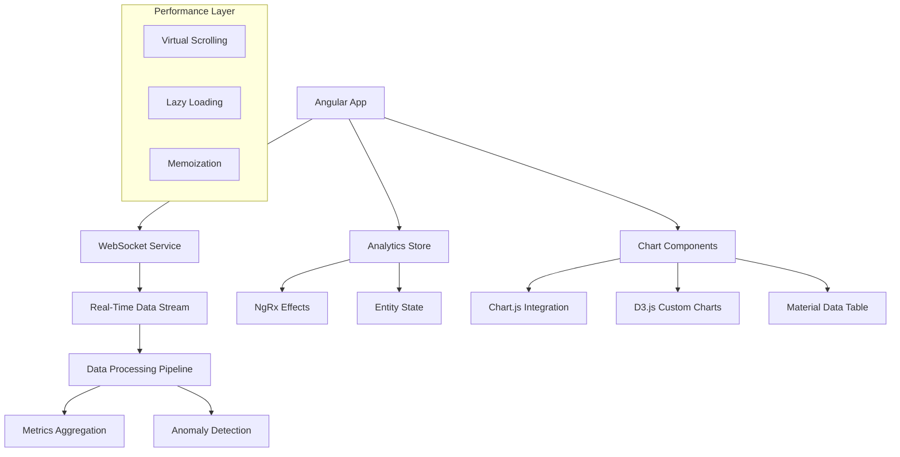

# Real-Time Analytics Dashboard - Implementation Guide

## 🎯 **Project Overview**

Build a sophisticated real-time analytics dashboard with live data visualization, interactive charts, and advanced filtering capabilities. This guide provides step-by-step instructions for creating a production-ready analytics platform.

## 🏗️ **Architecture Overview**



## 📋 **Implementation Phases**

### **Phase 1: Project Setup & Foundation** (Week 1)

#### **1.1 Project Initialization**

```bash
# Create the project
ng new realtime-analytics-dashboard --routing --style=scss --standalone
cd realtime-analytics-dashboard

# Install core dependencies
npm install @angular/material @angular/cdk @angular/flex-layout
npm install @ngrx/store @ngrx/effects @ngrx/entity @ngrx/store-devtools
npm install rxjs lodash-es uuid

# Install visualization libraries
npm install chart.js ng2-charts d3 @types/d3
npm install socket.io-client @types/socket.io-client

# Install development dependencies
npm install -D @types/lodash-es @types/uuid
npm install -D jest @types/jest ts-jest
npm install -D cypress @cypress/schematic
```

#### **1.2 Core Services Setup**

**WebSocket Service:**
```typescript
// src/app/core/services/websocket.service.ts
import { Injectable, OnDestroy } from '@angular/core';
import { Observable, Subject, BehaviorSubject } from 'rxjs';
import { filter, map, catchError } from 'rxjs/operators';
import { io, Socket } from 'socket.io-client';

export interface MetricData {
  id: string;
  name: string;
  value: number;
  timestamp: Date;
  category: string;
  metadata?: Record<string, any>;
}

export interface AlertData {
  id: string;
  message: string;
  severity: 'info' | 'warning' | 'error' | 'critical';
  timestamp: Date;
  resolved: boolean;
}

@Injectable({
  providedIn: 'root'
})
export class WebSocketService implements OnDestroy {
  private socket: Socket;
  private connectionStatus = new BehaviorSubject<boolean>(false);
  private metricsSubject = new Subject<MetricData>();
  private alertsSubject = new Subject<AlertData>();

  public connectionStatus$ = this.connectionStatus.asObservable();
  public metrics$ = this.metricsSubject.asObservable();
  public alerts$ = this.alertsSubject.asObservable();

  constructor() {
    this.initializeConnection();
  }

  private initializeConnection(): void {
    this.socket = io('ws://localhost:3001', {
      transports: ['websocket'],
      autoConnect: true,
      reconnection: true,
      reconnectionAttempts: 5,
      reconnectionDelay: 1000
    });

    this.socket.on('connect', () => {
      console.log('WebSocket connected');
      this.connectionStatus.next(true);
    });

    this.socket.on('disconnect', () => {
      console.log('WebSocket disconnected');
      this.connectionStatus.next(false);
    });

    this.socket.on('metrics', (data: MetricData) => {
      this.metricsSubject.next({
        ...data,
        timestamp: new Date(data.timestamp)
      });
    });

    this.socket.on('alerts', (data: AlertData) => {
      this.alertsSubject.next({
        ...data,
        timestamp: new Date(data.timestamp)
      });
    });

    this.socket.on('error', (error: any) => {
      console.error('WebSocket error:', error);
    });
  }

  subscribeToMetrics(metricIds: string[]): void {
    if (this.socket.connected) {
      this.socket.emit('subscribe_metrics', { metricIds });
    }
  }

  unsubscribeFromMetrics(metricIds: string[]): void {
    if (this.socket.connected) {
      this.socket.emit('unsubscribe_metrics', { metricIds });
    }
  }

  requestHistoricalData(metricId: string, timeRange: string): void {
    if (this.socket.connected) {
      this.socket.emit('historical_data', { metricId, timeRange });
    }
  }

  ngOnDestroy(): void {
    if (this.socket) {
      this.socket.disconnect();
    }
    this.metricsSubject.complete();
    this.alertsSubject.complete();
    this.connectionStatus.complete();
  }
}
```

#### **1.3 Analytics Data Service**

```typescript
// src/app/core/services/analytics-data.service.ts
import { Injectable, inject } from '@angular/core';
import { HttpClient } from '@angular/common/http';
import { Observable, combineLatest, timer } from 'rxjs';
import { map, switchMap, startWith } from 'rxjs/operators';
import { WebSocketService, MetricData } from './websocket.service';

export interface MetricConfig {
  id: string;
  name: string;
  category: string;
  unit: string;
  chartType: 'line' | 'bar' | 'pie' | 'gauge' | 'area';
  color: string;
  thresholds: {
    warning: number;
    critical: number;
  };
  aggregation: 'sum' | 'avg' | 'min' | 'max' | 'count';
}

export interface DashboardConfig {
  id: string;
  name: string;
  layout: WidgetLayout[];
  filters: FilterConfig[];
  refreshInterval: number;
}

export interface WidgetLayout {
  id: string;
  metricId: string;
  position: { x: number; y: number };
  size: { width: number; height: number };
  chartType: string;
  config: Record<string, any>;
}

export interface FilterConfig {
  field: string;
  operator: 'eq' | 'gt' | 'lt' | 'contains' | 'between';
  value: any;
}

@Injectable({
  providedIn: 'root'
})
export class AnalyticsDataService {
  private http = inject(HttpClient);
  private wsService = inject(WebSocketService);
  
  private readonly apiUrl = 'http://localhost:3001/api';

  getMetricConfigs(): Observable<MetricConfig[]> {
    return this.http.get<MetricConfig[]>(`${this.apiUrl}/metrics/config`);
  }

  getDashboardConfig(dashboardId: string): Observable<DashboardConfig> {
    return this.http.get<DashboardConfig>(`${this.apiUrl}/dashboards/${dashboardId}`);
  }

  saveDashboardConfig(config: DashboardConfig): Observable<DashboardConfig> {
    return this.http.post<DashboardConfig>(`${this.apiUrl}/dashboards`, config);
  }

  getHistoricalData(metricId: string, timeRange: string): Observable<MetricData[]> {
    return this.http.get<MetricData[]>(`${this.apiUrl}/metrics/${metricId}/history`, {
      params: { timeRange }
    }).pipe(
      map(data => data.map(item => ({
        ...item,
        timestamp: new Date(item.timestamp)
      })))
    );
  }

  getRealTimeMetrics(metricIds: string[]): Observable<MetricData[]> {
    return combineLatest([
      this.wsService.connectionStatus$,
      timer(0, 1000).pipe(startWith(0))
    ]).pipe(
      switchMap(([connected]) => {
        if (connected) {
          this.wsService.subscribeToMetrics(metricIds);
          return this.wsService.metrics$;
        }
        return [];
      }),
      map(metric => [metric]),
      startWith([])
    );
  }

  aggregateMetrics(
    metrics: MetricData[], 
    aggregation: 'sum' | 'avg' | 'min' | 'max' | 'count',
    groupBy?: string
  ): MetricData[] {
    if (!groupBy) {
      const aggregatedValue = this.calculateAggregation(metrics.map(m => m.value), aggregation);
      return [{
        id: 'aggregated',
        name: 'Aggregated',
        value: aggregatedValue,
        timestamp: new Date(),
        category: 'aggregated'
      }];
    }

    // Group by field and aggregate each group
    const groups = this.groupBy(metrics, groupBy);
    return Object.entries(groups).map(([key, groupMetrics]) => ({
      id: `${key}-aggregated`,
      name: key,
      value: this.calculateAggregation(groupMetrics.map(m => m.value), aggregation),
      timestamp: new Date(),
      category: groupBy
    }));
  }

  private calculateAggregation(values: number[], type: string): number {
    switch (type) {
      case 'sum':
        return values.reduce((acc, val) => acc + val, 0);
      case 'avg':
        return values.reduce((acc, val) => acc + val, 0) / values.length;
      case 'min':
        return Math.min(...values);
      case 'max':
        return Math.max(...values);
      case 'count':
        return values.length;
      default:
        return 0;
    }
  }

  private groupBy<T>(array: T[], key: string): Record<string, T[]> {
    return array.reduce((groups, item) => {
      const group = (item as any)[key];
      groups[group] = groups[group] || [];
      groups[group].push(item);
      return groups;
    }, {} as Record<string, T[]>);
  }
}
```

### **Phase 2: State Management** (Week 2)

#### **2.1 Analytics Store**

```typescript
// src/app/store/analytics/analytics.state.ts
import { createEntityAdapter, EntityAdapter, EntityState } from '@ngrx/entity';
import { createFeatureSelector, createSelector } from '@ngrx/store';
import { MetricData, MetricConfig } from '../../core/services/analytics-data.service';

export interface AnalyticsState extends EntityState<MetricData> {
  metricConfigs: MetricConfig[];
  selectedMetrics: string[];
  timeRange: string;
  filters: Record<string, any>;
  loading: boolean;
  error: string | null;
  realTimeEnabled: boolean;
  lastUpdate: Date | null;
}

export const analyticsAdapter: EntityAdapter<MetricData> = createEntityAdapter<MetricData>({
  selectId: (metric: MetricData) => `${metric.id}-${metric.timestamp.getTime()}`,
  sortComparer: (a: MetricData, b: MetricData) => 
    b.timestamp.getTime() - a.timestamp.getTime()
});

export const initialAnalyticsState: AnalyticsState = analyticsAdapter.getInitialState({
  metricConfigs: [],
  selectedMetrics: [],
  timeRange: '1h',
  filters: {},
  loading: false,
  error: null,
  realTimeEnabled: true,
  lastUpdate: null
});

export const selectAnalyticsState = createFeatureSelector<AnalyticsState>('analytics');

export const {
  selectIds: selectMetricIds,
  selectEntities: selectMetricEntities,
  selectAll: selectAllMetrics,
  selectTotal: selectMetricsTotal,
} = analyticsAdapter.getSelectors(selectAnalyticsState);

export const selectMetricConfigs = createSelector(
  selectAnalyticsState,
  state => state.metricConfigs
);

export const selectSelectedMetrics = createSelector(
  selectAnalyticsState,
  state => state.selectedMetrics
);

export const selectMetricsByCategory = createSelector(
  selectAllMetrics,
  (metrics: MetricData[]) => {
    return metrics.reduce((acc, metric) => {
      acc[metric.category] = acc[metric.category] || [];
      acc[metric.category].push(metric);
      return acc;
    }, {} as Record<string, MetricData[]>);
  }
);

export const selectLatestMetrics = createSelector(
  selectAllMetrics,
  selectSelectedMetrics,
  (metrics: MetricData[], selectedIds: string[]) => {
    const latestMetrics = new Map<string, MetricData>();
    
    metrics.forEach(metric => {
      if (selectedIds.includes(metric.id)) {
        const existing = latestMetrics.get(metric.id);
        if (!existing || metric.timestamp > existing.timestamp) {
          latestMetrics.set(metric.id, metric);
        }
      }
    });
    
    return Array.from(latestMetrics.values());
  }
);
```

#### **2.2 Analytics Effects**

```typescript
// src/app/store/analytics/analytics.effects.ts
import { Injectable, inject } from '@angular/core';
import { Actions, createEffect, ofType } from '@ngrx/effects';
import { Store } from '@ngrx/store';
import { of, timer, EMPTY } from 'rxjs';
import { 
  switchMap, 
  map, 
  catchError, 
  withLatestFrom, 
  takeUntil,
  filter
} from 'rxjs/operators';
import { AnalyticsDataService } from '../../core/services/analytics-data.service';
import { WebSocketService } from '../../core/services/websocket.service';
import * as AnalyticsActions from './analytics.actions';
import { selectAnalyticsState } from './analytics.state';

@Injectable()
export class AnalyticsEffects {
  private actions$ = inject(Actions);
  private store = inject(Store);
  private analyticsService = inject(AnalyticsDataService);
  private wsService = inject(WebSocketService);

  loadMetricConfigs$ = createEffect(() =>
    this.actions$.pipe(
      ofType(AnalyticsActions.loadMetricConfigs),
      switchMap(() =>
        this.analyticsService.getMetricConfigs().pipe(
          map(configs => AnalyticsActions.loadMetricConfigsSuccess({ configs })),
          catchError(error => of(AnalyticsActions.loadMetricConfigsFailure({ error: error.message })))
        )
      )
    )
  );

  loadHistoricalData$ = createEffect(() =>
    this.actions$.pipe(
      ofType(AnalyticsActions.loadHistoricalData),
      switchMap(({ metricId, timeRange }) =>
        this.analyticsService.getHistoricalData(metricId, timeRange).pipe(
          map(data => AnalyticsActions.loadHistoricalDataSuccess({ metricId, data })),
          catchError(error => of(AnalyticsActions.loadHistoricalDataFailure({ error: error.message })))
        )
      )
    )
  );

  startRealTimeUpdates$ = createEffect(() =>
    this.actions$.pipe(
      ofType(AnalyticsActions.enableRealTime),
      withLatestFrom(this.store.select(selectAnalyticsState)),
      switchMap(([action, state]) => {
        if (state.selectedMetrics.length === 0) {
          return EMPTY;
        }

        return this.wsService.metrics$.pipe(
          filter(metric => state.selectedMetrics.includes(metric.id)),
          map(metric => AnalyticsActions.receiveRealTimeMetric({ metric })),
          takeUntil(
            this.actions$.pipe(ofType(AnalyticsActions.disableRealTime))
          )
        );
      })
    )
  );

  subscribeToMetrics$ = createEffect(() =>
    this.actions$.pipe(
      ofType(AnalyticsActions.selectMetrics),
      withLatestFrom(this.store.select(selectAnalyticsState)),
      filter(([action, state]) => state.realTimeEnabled),
      switchMap(([{ metricIds }]) => {
        this.wsService.subscribeToMetrics(metricIds);
        return EMPTY;
      })
    ), { dispatch: false }
  );

  handleConnectionStatus$ = createEffect(() =>
    this.wsService.connectionStatus$.pipe(
      map(connected => 
        connected 
          ? AnalyticsActions.webSocketConnected()
          : AnalyticsActions.webSocketDisconnected()
      )
    )
  );

  autoRefresh$ = createEffect(() =>
    this.actions$.pipe(
      ofType(AnalyticsActions.enableAutoRefresh),
      switchMap(({ interval }) =>
        timer(0, interval * 1000).pipe(
          withLatestFrom(this.store.select(selectAnalyticsState)),
          filter(([, state]) => !state.realTimeEnabled && state.selectedMetrics.length > 0),
          switchMap(([, state]) =>
            state.selectedMetrics.map(metricId =>
              AnalyticsActions.loadHistoricalData({ metricId, timeRange: state.timeRange })
            )
          ),
          takeUntil(this.actions$.pipe(ofType(AnalyticsActions.disableAutoRefresh)))
        )
      )
    )
  );
}
```

### **Phase 3: Chart Components** (Week 3)

#### **3.1 Base Chart Component**

```typescript
// src/app/shared/components/chart-base/chart-base.component.ts
import { 
  Component, 
  Input, 
  Output, 
  EventEmitter, 
  OnInit, 
  OnDestroy, 
  OnChanges, 
  SimpleChanges,
  ViewChild,
  ElementRef,
  ChangeDetectionStrategy
} from '@angular/core';
import { CommonModule } from '@angular/common';
import { MatCardModule } from '@angular/material/card';
import { MatButtonModule } from '@angular/material/button';
import { MatIconModule } from '@angular/material/icon';
import { MatMenuModule } from '@angular/material/menu';
import { Subject } from 'rxjs';
import { MetricData } from '../../../core/services/analytics-data.service';

export interface ChartConfig {
  title: string;
  type: 'line' | 'bar' | 'pie' | 'gauge' | 'area';
  colors: string[];
  animation: boolean;
  responsive: boolean;
  showLegend: boolean;
  showGrid: boolean;
  yAxisLabel?: string;
  xAxisLabel?: string;
  [key: string]: any;
}

export interface ChartDataPoint {
  label: string;
  value: number;
  timestamp?: Date;
  metadata?: Record<string, any>;
}

@Component({
  selector: 'app-chart-base',
  standalone: true,
  imports: [
    CommonModule,
    MatCardModule,
    MatButtonModule,
    MatIconModule,
    MatMenuModule
  ],
  template: `
    <mat-card class="chart-container" [class.loading]="loading">
      <mat-card-header>
        <mat-card-title>{{ config.title }}</mat-card-title>
        <mat-card-subtitle *ngIf="subtitle">{{ subtitle }}</mat-card-subtitle>
        
        <div class="chart-actions">
          <button 
            mat-icon-button 
            [matMenuTriggerFor]="chartMenu"
            aria-label="Chart options"
          >
            <mat-icon>more_vert</mat-icon>
          </button>
          
          <mat-menu #chartMenu="matMenu">
            <button mat-menu-item (click)="exportChart('png')">
              <mat-icon>image</mat-icon>
              <span>Export as PNG</span>
            </button>
            <button mat-menu-item (click)="exportChart('csv')">
              <mat-icon>table_chart</mat-icon>
              <span>Export as CSV</span>
            </button>
            <button mat-menu-item (click)="toggleFullscreen()">
              <mat-icon>fullscreen</mat-icon>
              <span>Fullscreen</span>
            </button>
            <button mat-menu-item (click)="refreshChart()">
              <mat-icon>refresh</mat-icon>
              <span>Refresh</span>
            </button>
          </mat-menu>
        </div>
      </mat-card-header>
      
      <mat-card-content>
        <div class="chart-wrapper" #chartWrapper>
          <canvas 
            #chartCanvas
            [width]="chartWidth"
            [height]="chartHeight"
            class="chart-canvas"
          ></canvas>
          
          <div *ngIf="loading" class="loading-overlay">
            <mat-spinner diameter="40"></mat-spinner>
          </div>
          
          <div *ngIf="error" class="error-state">
            <mat-icon>error</mat-icon>
            <p>{{ error }}</p>
            <button mat-stroked-button (click)="retryLoad()">Retry</button>
          </div>
          
          <div *ngIf="!data || data.length === 0" class="empty-state">
            <mat-icon>bar_chart</mat-icon>
            <p>No data available</p>
          </div>
        </div>
      </mat-card-content>
    </mat-card>
  `,
  styles: [`
    .chart-container {
      height: 100%;
      display: flex;
      flex-direction: column;
      
      &.loading {
        opacity: 0.7;
      }
    }
    
    mat-card-header {
      display: flex;
      justify-content: space-between;
      align-items: flex-start;
      
      .chart-actions {
        flex-shrink: 0;
      }
    }
    
    mat-card-content {
      flex: 1;
      display: flex;
      flex-direction: column;
    }
    
    .chart-wrapper {
      position: relative;
      flex: 1;
      min-height: 200px;
      display: flex;
      align-items: center;
      justify-content: center;
    }
    
    .chart-canvas {
      max-width: 100%;
      max-height: 100%;
    }
    
    .loading-overlay {
      position: absolute;
      top: 50%;
      left: 50%;
      transform: translate(-50%, -50%);
      background: rgba(255, 255, 255, 0.8);
      padding: 20px;
      border-radius: 8px;
      display: flex;
      align-items: center;
      justify-content: center;
    }
    
    .error-state, .empty-state {
      display: flex;
      flex-direction: column;
      align-items: center;
      justify-content: center;
      gap: 16px;
      color: rgba(0, 0, 0, 0.6);
      text-align: center;
      
      mat-icon {
        font-size: 48px;
        width: 48px;
        height: 48px;
        opacity: 0.5;
      }
    }
    
    .error-state {
      color: #f44336;
      
      mat-icon {
        color: #f44336;
      }
    }
  `],
  changeDetection: ChangeDetectionStrategy.OnPush
})
export class ChartBaseComponent implements OnInit, OnDestroy, OnChanges {
  @Input() data: ChartDataPoint[] = [];
  @Input() config: ChartConfig = {
    title: 'Chart',
    type: 'line',
    colors: ['#1976d2'],
    animation: true,
    responsive: true,
    showLegend: true,
    showGrid: true
  };
  @Input() loading = false;
  @Input() error: string | null = null;
  @Input() subtitle: string | null = null;
  
  @Output() dataPointClick = new EventEmitter<ChartDataPoint>();
  @Output() chartExport = new EventEmitter<{ format: string; data: any }>();
  @Output() refreshRequested = new EventEmitter<void>();
  
  @ViewChild('chartCanvas', { static: true }) chartCanvas!: ElementRef<HTMLCanvasElement>;
  @ViewChild('chartWrapper', { static: true }) chartWrapper!: ElementRef<HTMLDivElement>;
  
  chartWidth = 400;
  chartHeight = 300;
  
  protected chart: any;
  private destroy$ = new Subject<void>();

  ngOnInit(): void {
    this.initializeChart();
    this.updateChartSize();
  }

  ngOnChanges(changes: SimpleChanges): void {
    if (changes['data'] && this.chart) {
      this.updateChartData();
    }
    
    if (changes['config'] && this.chart) {
      this.updateChartConfig();
    }
  }

  ngOnDestroy(): void {
    this.destroy$.next();
    this.destroy$.complete();
    
    if (this.chart) {
      this.chart.destroy();
    }
  }

  protected initializeChart(): void {
    // To be implemented by child components
  }

  protected updateChartData(): void {
    // To be implemented by child components
  }

  protected updateChartConfig(): void {
    // To be implemented by child components
  }

  private updateChartSize(): void {
    const wrapper = this.chartWrapper.nativeElement;
    const rect = wrapper.getBoundingClientRect();
    this.chartWidth = rect.width || 400;
    this.chartHeight = rect.height || 300;
  }

  exportChart(format: 'png' | 'csv'): void {
    if (format === 'png' && this.chartCanvas) {
      const canvas = this.chartCanvas.nativeElement;
      const dataUrl = canvas.toDataURL('image/png');
      this.downloadFile(dataUrl, `${this.config.title}.png`);
    } else if (format === 'csv') {
      const csvData = this.convertToCSV(this.data);
      const blob = new Blob([csvData], { type: 'text/csv' });
      const url = URL.createObjectURL(blob);
      this.downloadFile(url, `${this.config.title}.csv`);
    }
    
    this.chartExport.emit({ format, data: this.data });
  }

  private convertToCSV(data: ChartDataPoint[]): string {
    const headers = ['Label', 'Value', 'Timestamp'];
    const rows = data.map(point => [
      point.label,
      point.value.toString(),
      point.timestamp?.toISOString() || ''
    ]);
    
    return [headers, ...rows]
      .map(row => row.map(cell => `"${cell}"`).join(','))
      .join('\n');
  }

  private downloadFile(url: string, filename: string): void {
    const link = document.createElement('a');
    link.href = url;
    link.download = filename;
    document.body.appendChild(link);
    link.click();
    document.body.removeChild(link);
    
    if (url.startsWith('blob:')) {
      URL.revokeObjectURL(url);
    }
  }

  toggleFullscreen(): void {
    const element = this.chartWrapper.nativeElement;
    if (document.fullscreenElement) {
      document.exitFullscreen();
    } else {
      element.requestFullscreen();
    }
  }

  refreshChart(): void {
    this.refreshRequested.emit();
  }

  retryLoad(): void {
    this.refreshRequested.emit();
  }
}
```

#### **3.2 Line Chart Component**

```typescript
// src/app/shared/components/line-chart/line-chart.component.ts
import { Component, OnInit, inject } from '@angular/core';
import { Chart, ChartConfiguration, registerables } from 'chart.js';
import { ChartBaseComponent, ChartDataPoint, ChartConfig } from '../chart-base/chart-base.component';

Chart.register(...registerables);

@Component({
  selector: 'app-line-chart',
  standalone: true,
  imports: [],
  template: ``,
  extends: ChartBaseComponent
})
export class LineChartComponent extends ChartBaseComponent implements OnInit {
  
  protected override initializeChart(): void {
    const ctx = this.chartCanvas.nativeElement.getContext('2d');
    if (!ctx) return;

    const chartConfig: ChartConfiguration<'line'> = {
      type: 'line',
      data: {
        labels: [],
        datasets: [{
          label: this.config.title,
          data: [],
          borderColor: this.config.colors[0] || '#1976d2',
          backgroundColor: this.config.colors[0] + '20' || '#1976d220',
          borderWidth: 2,
          fill: this.config.type === 'area',
          tension: 0.4,
          pointRadius: 4,
          pointHoverRadius: 6
        }]
      },
      options: {
        responsive: this.config.responsive,
        maintainAspectRatio: false,
        animation: {
          duration: this.config.animation ? 750 : 0
        },
        scales: {
          x: {
            display: this.config.showGrid,
            title: {
              display: !!this.config.xAxisLabel,
              text: this.config.xAxisLabel
            },
            grid: {
              display: this.config.showGrid
            }
          },
          y: {
            display: this.config.showGrid,
            title: {
              display: !!this.config.yAxisLabel,
              text: this.config.yAxisLabel
            },
            grid: {
              display: this.config.showGrid
            }
          }
        },
        plugins: {
          legend: {
            display: this.config.showLegend
          },
          tooltip: {
            enabled: true,
            callbacks: {
              afterLabel: (context) => {
                const dataPoint = this.data[context.dataIndex];
                if (dataPoint?.metadata) {
                  return Object.entries(dataPoint.metadata)
                    .map(([key, value]) => `${key}: ${value}`)
                    .join('\n');
                }
                return '';
              }
            }
          }
        },
        onClick: (event, elements) => {
          if (elements.length > 0) {
            const dataIndex = elements[0].index;
            this.dataPointClick.emit(this.data[dataIndex]);
          }
        }
      }
    };

    this.chart = new Chart(ctx, chartConfig);
    this.updateChartData();
  }

  protected override updateChartData(): void {
    if (!this.chart) return;

    const labels = this.data.map(point => point.label);
    const values = this.data.map(point => point.value);

    this.chart.data.labels = labels;
    this.chart.data.datasets[0].data = values;
    
    // Update colors if multiple datasets
    if (this.config.colors.length > 1) {
      this.chart.data.datasets[0].borderColor = this.config.colors[0];
      this.chart.data.datasets[0].backgroundColor = this.config.colors[0] + '20';
    }

    this.chart.update('none'); // No animation for real-time updates
  }

  protected override updateChartConfig(): void {
    if (!this.chart) return;

    // Update chart options
    this.chart.options.animation!.duration = this.config.animation ? 750 : 0;
    this.chart.options.plugins!.legend!.display = this.config.showLegend;
    this.chart.options.scales!.x!.grid!.display = this.config.showGrid;
    this.chart.options.scales!.y!.grid!.display = this.config.showGrid;

    // Update dataset styling
    if (this.chart.data.datasets[0]) {
      this.chart.data.datasets[0].borderColor = this.config.colors[0] || '#1976d2';
      this.chart.data.datasets[0].backgroundColor = (this.config.colors[0] || '#1976d2') + '20';
      this.chart.data.datasets[0].fill = this.config.type === 'area';
    }

    this.chart.update();
  }
}
```

## 🧪 **Testing Strategy**

### **Unit Testing**
```typescript
// src/app/core/services/websocket.service.spec.ts
import { TestBed } from '@angular/core/testing';
import { WebSocketService } from './websocket.service';

describe('WebSocketService', () => {
  let service: WebSocketService;
  let mockSocket: any;

  beforeEach(() => {
    mockSocket = {
      on: jasmine.createSpy('on'),
      emit: jasmine.createSpy('emit'),
      connected: true,
      disconnect: jasmine.createSpy('disconnect')
    };

    TestBed.configureTestingModule({});
    service = TestBed.inject(WebSocketService);
    (service as any).socket = mockSocket;
  });

  it('should connect to WebSocket server', () => {
    expect(mockSocket.on).toHaveBeenCalledWith('connect', jasmine.any(Function));
    expect(mockSocket.on).toHaveBeenCalledWith('disconnect', jasmine.any(Function));
    expect(mockSocket.on).toHaveBeenCalledWith('metrics', jasmine.any(Function));
  });

  it('should subscribe to metrics', () => {
    const metricIds = ['metric1', 'metric2'];
    service.subscribeToMetrics(metricIds);
    
    expect(mockSocket.emit).toHaveBeenCalledWith('subscribe_metrics', { metricIds });
  });

  it('should handle incoming metrics', (done) => {
    const testMetric = {
      id: 'test-metric',
      name: 'Test Metric',
      value: 100,
      timestamp: new Date(),
      category: 'test'
    };

    service.metrics$.subscribe(metric => {
      expect(metric).toEqual(testMetric);
      done();
    });

    // Simulate socket event
    const metricsCallback = mockSocket.on.calls.argsFor(2)[1];
    metricsCallback(testMetric);
  });
});
```

This implementation guide provides a comprehensive foundation for building a sophisticated real-time analytics dashboard. The architecture supports live data streaming, interactive visualizations, and advanced performance optimizations while maintaining clean, testable code.
