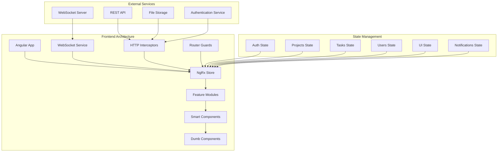

# Advanced Task Management System

> **Project 1 of 4** - Intermediate Level | **Estimated Time:** 3-4 weeks | **Difficulty:** 🟡🟡🟡🟡

## 🎯 **Project Overview**

Build a sophisticated task management system that rivals enterprise solutions like Jira, Asana, or Monday.com. This project focuses on complex state management, real-time collaboration, advanced UI patterns, and scalable architecture.

## 🧠 **Learning Objectives**

By completing this project, you will master:

- **🏗️ Enterprise Architecture**: NgRx store design, feature modules, lazy loading
- **🔄 Real-time Collaboration**: WebSocket integration, conflict resolution, live updates
- **🎨 Advanced UI Patterns**: Drag-and-drop, virtual scrolling, dynamic layouts
- **📊 Data Visualization**: Charts, progress tracking, timeline views
- **🔐 Security & Performance**: Role-based access, optimization strategies
- **🧪 Advanced Testing**: Complex state testing, integration testing, E2E scenarios

## 🏢 **Business Requirements**

### **Core Features**
- Multi-project task management
- Team collaboration with real-time updates
- Advanced filtering and search
- Time tracking and reporting
- File attachments and comments
- Custom workflows and automation

### **User Roles & Permissions**
- **Admin**: Full system access, user management
- **Project Manager**: Project oversight, team management
- **Team Lead**: Task assignment, progress monitoring
- **Developer**: Task execution, time tracking
- **Viewer**: Read-only access to assigned projects

### **Performance Requirements**
- Handle 10,000+ tasks per project
- Real-time updates with <100ms latency
- Responsive design for all devices
- Offline capability for core features

## 🏗️ **Technical Architecture**

### **High-Level Architecture**


### **NgRx Architecture Design**
```typescript
// Store Structure
interface AppState {
  auth: AuthState;
  projects: ProjectsState;
  tasks: TasksState;
  users: UsersState;
  ui: UIState;
  notifications: NotificationsState;
  realtime: RealtimeState;
}

// Feature State Example
interface TasksState {
  entities: { [id: string]: Task };
  ids: string[];
  selectedTaskId: string | null;
  filters: TaskFilters;
  sorting: TaskSorting;
  loading: boolean;
  error: string | null;
  searchTerm: string;
  dragState: DragState;
  bulkOperations: BulkOperationsState;
}
```

## 📁 **Project Structure**

```
src/
├── app/
│   ├── core/
│   │   ├── auth/
│   │   │   ├── guards/
│   │   │   ├── interceptors/
│   │   │   └── services/
│   │   ├── models/
│   │   │   ├── task.model.ts
│   │   │   ├── project.model.ts
│   │   │   ├── user.model.ts
│   │   │   └── notification.model.ts
│   │   ├── services/
│   │   │   ├── websocket.service.ts
│   │   │   ├── api.service.ts
│   │   │   └── notification.service.ts
│   │   └── utils/
│   ├── store/
│   │   ├── auth/
│   │   ├── projects/
│   │   ├── tasks/
│   │   ├── users/
│   │   ├── ui/
│   │   └── app.state.ts
│   ├── shared/
│   │   ├── components/
│   │   │   ├── task-card/
│   │   │   ├── user-avatar/
│   │   │   ├── priority-indicator/
│   │   │   ├── progress-bar/
│   │   │   └── comment-thread/
│   │   ├── directives/
│   │   │   ├── drag-drop.directive.ts
│   │   │   └── auto-focus.directive.ts
│   │   ├── pipes/
│   │   │   ├── relative-time.pipe.ts
│   │   │   ├── task-status.pipe.ts
│   │   │   └── user-name.pipe.ts
│   │   └── validators/
│   ├── features/
│   │   ├── dashboard/
│   │   │   ├── components/
│   │   │   │   ├── dashboard-overview/
│   │   │   │   ├── recent-tasks/
│   │   │   │   ├── team-activity/
│   │   │   │   └── performance-charts/
│   │   │   └── pages/
│   │   ├── projects/
│   │   │   ├── components/
│   │   │   │   ├── project-list/
│   │   │   │   ├── project-card/
│   │   │   │   └── project-settings/
│   │   │   └── pages/
│   │   ├── tasks/
│   │   │   ├── components/
│   │   │   │   ├── kanban-board/
│   │   │   │   ├── task-list/
│   │   │   │   ├── task-detail/
│   │   │   │   ├── task-editor/
│   │   │   │   └── task-timeline/
│   │   │   └── pages/
│   │   ├── users/
│   │   │   ├── components/
│   │   │   └── pages/
│   │   └── reports/
│   │       ├── components/
│   │       └── pages/
│   └── layout/
│       ├── header/
│       ├── sidebar/
│       ├── breadcrumbs/
│       └── notification-panel/
├── assets/
│   ├── themes/
│   │   ├── task-management-theme.scss
│   │   └── dark-theme.scss
│   ├── icons/
│   └── images/
└── styles/
    ├── abstracts/
    ├── base/
    ├── components/
    ├── layout/
    └── themes/
```

## 🎨 **Advanced UI Components**

### **1. Drag-and-Drop Kanban Board**
```typescript
@Component({
  selector: 'app-kanban-board',
  template: `
    <div class="kanban-board" cdkDropListGroup>
      <div 
        *ngFor="let column of columns$ | async; trackBy: trackByColumnId"
        class="kanban-column"
        [class.highlight]="column.id === dragOverColumn"
        cdkDropList
        [cdkDropListData]="column.tasks"
        [id]="column.id"
        (cdkDropListDropped)="onTaskDrop($event)"
        (cdkDropListEntered)="onDragEnter(column.id)"
        (cdkDropListExited)="onDragExit()">
        
        <div class="column-header">
          <h3 class="column-title">{{ column.name }}</h3>
          <span class="task-count">{{ column.tasks.length }}</span>
          <button mat-icon-button [matMenuTriggerFor]="columnMenu">
            <mat-icon>more_vert</mat-icon>
          </button>
        </div>
        
        <cdk-virtual-scroll-viewport 
          itemSize="120" 
          class="column-tasks"
          [style.height.px]="virtualScrollHeight">
          
          <div 
            *cdkVirtualFor="let task of column.tasks; trackBy: trackByTaskId"
            class="task-container"
            cdkDrag
            [cdkDragData]="task"
            [cdkDragDisabled]="!canDragTask(task)"
            (cdkDragStarted)="onDragStart(task)"
            (cdkDragEnded)="onDragEnd()">
            
            <app-task-card 
              [task]="task"
              [isSelected]="selectedTaskId === task.id"
              [isDragging]="draggingTaskId === task.id"
              (taskClick)="selectTask(task)"
              (taskEdit)="editTask(task)"
              (taskDelete)="deleteTask(task)">
            </app-task-card>
            
            <div class="drag-placeholder" *cdkDragPlaceholder></div>
          </div>
        </cdk-virtual-scroll-viewport>
        
        <button 
          mat-stroked-button 
          class="add-task-btn"
          (click)="addTaskToColumn(column.id)">
          <mat-icon>add</mat-icon>
          Add Task
        </button>
      </div>
    </div>
  `,
  styles: [`
    .kanban-board {
      display: flex;
      gap: 1rem;
      padding: 1rem;
      height: calc(100vh - 200px);
      overflow-x: auto;
    }
    
    .kanban-column {
      flex: 0 0 320px;
      background: var(--surface-color);
      border-radius: 8px;
      border: 2px solid transparent;
      transition: all 0.3s ease;
      
      &.highlight {
        border-color: var(--primary-color);
        background: var(--primary-50);
      }
    }
    
    .column-header {
      display: flex;
      align-items: center;
      padding: 1rem;
      border-bottom: 1px solid var(--outline-color);
      gap: 0.5rem;
    }
    
    .column-title {
      flex: 1;
      margin: 0;
      font-weight: 600;
    }
    
    .task-count {
      background: var(--outline-color);
      color: var(--on-surface-color);
      padding: 0.25rem 0.5rem;
      border-radius: 12px;
      font-size: 0.875rem;
    }
    
    .column-tasks {
      height: calc(100% - 120px);
      padding: 0.5rem;
    }
    
    .task-container {
      margin-bottom: 0.5rem;
      
      &.cdk-drag-animating {
        transition: transform 250ms cubic-bezier(0, 0, 0.2, 1);
      }
    }
    
    .drag-placeholder {
      background: var(--primary-100);
      border: 2px dashed var(--primary-color);
      border-radius: 8px;
      height: 120px;
      margin-bottom: 0.5rem;
    }
    
    .add-task-btn {
      width: 100%;
      margin: 0.5rem;
      justify-content: flex-start;
      gap: 0.5rem;
    }
  `]
})
export class KanbanBoardComponent implements OnInit, OnDestroy {
  @Input() projectId!: string;
  
  columns$ = this.store.select(selectKanbanColumns);
  selectedTaskId$ = this.store.select(selectSelectedTaskId);
  draggingTaskId$ = this.store.select(selectDraggingTaskId);
  
  dragOverColumn: string | null = null;
  virtualScrollHeight = 600;
  
  private destroy$ = new Subject<void>();

  constructor(
    private store: Store<AppState>,
    private taskService: TaskService,
    @Inject(DOCUMENT) private document: Document
  ) {}

  ngOnInit() {
    this.store.dispatch(TasksActions.loadKanbanColumns({ projectId: this.projectId }));
    this.calculateVirtualScrollHeight();
  }

  ngOnDestroy() {
    this.destroy$.next();
    this.destroy$.complete();
  }

  onTaskDrop(event: CdkDragDrop<Task[]>) {
    const { previousContainer, container, previousIndex, currentIndex } = event;
    
    if (previousContainer === container) {
      // Reorder within same column
      this.store.dispatch(TasksActions.reorderTasks({
        columnId: container.id,
        previousIndex,
        currentIndex
      }));
    } else {
      // Move between columns
      this.store.dispatch(TasksActions.moveTask({
        taskId: event.item.data.id,
        fromColumnId: previousContainer.id,
        toColumnId: container.id,
        previousIndex,
        currentIndex
      }));
    }
  }

  onDragStart(task: Task) {
    this.store.dispatch(UIActions.setDraggingTask({ taskId: task.id }));
  }

  onDragEnd() {
    this.store.dispatch(UIActions.clearDraggingTask());
    this.dragOverColumn = null;
  }

  onDragEnter(columnId: string) {
    this.dragOverColumn = columnId;
  }

  onDragExit() {
    this.dragOverColumn = null;
  }

  canDragTask(task: Task): boolean {
    // Implement permission logic
    return !task.locked && this.hasEditPermission(task);
  }

  private hasEditPermission(task: Task): boolean {
    // Implement role-based permission check
    return true;
  }

  private calculateVirtualScrollHeight() {
    const headerHeight = 120;
    const footerHeight = 60;
    const availableHeight = window.innerHeight - headerHeight - footerHeight;
    this.virtualScrollHeight = Math.max(400, availableHeight);
  }

  trackByColumnId(index: number, column: KanbanColumn): string {
    return column.id;
  }

  trackByTaskId(index: number, task: Task): string {
    return task.id;
  }
}
```

### **2. Advanced Task Card Component**
```typescript
@Component({
  selector: 'app-task-card',
  template: `
    <mat-card 
      class="task-card"
      [class.selected]="isSelected"
      [class.dragging]="isDragging"
      [class.overdue]="isOverdue"
      [class.high-priority]="task.priority === 'high'"
      (click)="onTaskClick()"
      (contextmenu)="onRightClick($event)">
      
      <mat-card-header class="task-header">
        <div class="task-priority">
          <app-priority-indicator [priority]="task.priority"></app-priority-indicator>
        </div>
        
        <div class="task-meta">
          <span class="task-id">#{{ task.number }}</span>
          <button 
            mat-icon-button 
            class="task-menu-btn"
            [matMenuTriggerFor]="taskMenu"
            (click)="$event.stopPropagation()">
            <mat-icon>more_vert</mat-icon>
          </button>
        </div>
      </mat-card-header>
      
      <mat-card-content class="task-content">
        <h4 class="task-title" [title]="task.title">{{ task.title }}</h4>
        
        <div class="task-description" *ngIf="task.description">
          <p>{{ task.description | slice:0:100 }}{{ task.description.length > 100 ? '...' : '' }}</p>
        </div>
        
        <div class="task-labels" *ngIf="task.labels.length">
          <mat-chip-set>
            <mat-chip 
              *ngFor="let label of task.labels | slice:0:3"
              [style.background-color]="label.color"
              [style.color]="getContrastColor(label.color)">
              {{ label.name }}
            </mat-chip>
          </mat-chip-set>
        </div>
        
        <div class="task-progress" *ngIf="task.subtasks.length">
          <app-progress-bar 
            [value]="getCompletionPercentage()"
            [color]="getProgressColor()">
          </app-progress-bar>
          <span class="progress-text">
            {{ getCompletedSubtasks() }}/{{ task.subtasks.length }} subtasks
          </span>
        </div>
      </mat-card-content>
      
      <mat-card-actions class="task-actions">
        <div class="task-assignees">
          <app-user-avatar 
            *ngFor="let assignee of task.assignees | slice:0:3"
            [user]="assignee"
            [size]="24">
          </app-user-avatar>
          <span 
            *ngIf="task.assignees.length > 3" 
            class="extra-assignees">
            +{{ task.assignees.length - 3 }}
          </span>
        </div>
        
        <div class="task-meta-info">
          <div class="task-due-date" *ngIf="task.dueDate">
            <mat-icon [class.overdue]="isOverdue">schedule</mat-icon>
            <span>{{ task.dueDate | date:'MMM d' }}</span>
          </div>
          
          <div class="task-comments" *ngIf="task.commentCount">
            <mat-icon>comment</mat-icon>
            <span>{{ task.commentCount }}</span>
          </div>
          
          <div class="task-attachments" *ngIf="task.attachmentCount">
            <mat-icon>attach_file</mat-icon>
            <span>{{ task.attachmentCount }}</span>
          </div>
        </div>
      </mat-card-actions>
    </mat-card>
    
    <!-- Context Menu -->
    <mat-menu #taskMenu="matMenu">
      <button mat-menu-item (click)="onEdit()">
        <mat-icon>edit</mat-icon>
        <span>Edit Task</span>
      </button>
      <button mat-menu-item (click)="onDuplicate()">
        <mat-icon>content_copy</mat-icon>
        <span>Duplicate</span>
      </button>
      <button mat-menu-item (click)="onAssign()">
        <mat-icon>person_add</mat-icon>
        <span>Assign</span>
      </button>
      <mat-divider></mat-divider>
      <button mat-menu-item (click)="onArchive()" class="warn-action">
        <mat-icon>archive</mat-icon>
        <span>Archive</span>
      </button>
      <button mat-menu-item (click)="onDelete()" class="danger-action">
        <mat-icon>delete</mat-icon>
        <span>Delete</span>
      </button>
    </mat-menu>
  `,
  styles: [`
    .task-card {
      cursor: pointer;
      transition: all 0.3s ease;
      border: 2px solid transparent;
      position: relative;
      
      &:hover {
        transform: translateY(-2px);
        box-shadow: 0 4px 12px rgba(0, 0, 0, 0.15);
      }
      
      &.selected {
        border-color: var(--primary-color);
        box-shadow: 0 0 0 1px var(--primary-color);
      }
      
      &.dragging {
        opacity: 0.5;
        transform: rotate(5deg);
      }
      
      &.overdue {
        border-left: 4px solid var(--error-color);
      }
      
      &.high-priority {
        border-top: 3px solid var(--error-color);
      }
    }
    
    .task-header {
      display: flex;
      justify-content: space-between;
      align-items: flex-start;
      padding: 8px 12px;
      min-height: auto;
    }
    
    .task-priority {
      flex: 0 0 auto;
    }
    
    .task-meta {
      display: flex;
      align-items: center;
      gap: 0.5rem;
    }
    
    .task-id {
      font-size: 0.75rem;
      color: var(--outline-color);
      font-weight: 500;
    }
    
    .task-menu-btn {
      width: 24px;
      height: 24px;
      line-height: 24px;
      
      mat-icon {
        font-size: 16px;
        width: 16px;
        height: 16px;
      }
    }
    
    .task-content {
      padding: 0 12px 8px;
    }
    
    .task-title {
      margin: 0 0 8px 0;
      font-size: 0.875rem;
      font-weight: 600;
      line-height: 1.3;
      display: -webkit-box;
      -webkit-line-clamp: 2;
      -webkit-box-orient: vertical;
      overflow: hidden;
    }
    
    .task-description {
      margin-bottom: 8px;
      
      p {
        margin: 0;
        font-size: 0.75rem;
        color: var(--outline-color);
        line-height: 1.4;
      }
    }
    
    .task-labels {
      margin-bottom: 8px;
      
      mat-chip-set {
        display: flex;
        flex-wrap: wrap;
        gap: 4px;
      }
      
      mat-chip {
        font-size: 0.625rem;
        padding: 2px 6px;
        height: auto;
        min-height: 20px;
      }
    }
    
    .task-progress {
      margin-bottom: 8px;
      
      .progress-text {
        font-size: 0.625rem;
        color: var(--outline-color);
        margin-top: 2px;
        display: block;
      }
    }
    
    .task-actions {
      display: flex;
      justify-content: space-between;
      align-items: center;
      padding: 8px 12px;
    }
    
    .task-assignees {
      display: flex;
      align-items: center;
      gap: -8px;
      
      app-user-avatar {
        border: 2px solid white;
        border-radius: 50%;
        
        &:not(:first-child) {
          margin-left: -8px;
        }
      }
      
      .extra-assignees {
        background: var(--outline-color);
        color: white;
        font-size: 0.625rem;
        padding: 2px 6px;
        border-radius: 12px;
        margin-left: 4px;
      }
    }
    
    .task-meta-info {
      display: flex;
      align-items: center;
      gap: 8px;
    }
    
    .task-due-date,
    .task-comments,
    .task-attachments {
      display: flex;
      align-items: center;
      gap: 2px;
      font-size: 0.625rem;
      color: var(--outline-color);
      
      mat-icon {
        font-size: 12px;
        width: 12px;
        height: 12px;
        
        &.overdue {
          color: var(--error-color);
        }
      }
    }
    
    .warn-action {
      color: var(--warn-color);
    }
    
    .danger-action {
      color: var(--error-color);
    }
  `]
})
export class TaskCardComponent implements OnInit {
  @Input() task!: Task;
  @Input() isSelected = false;
  @Input() isDragging = false;
  
  @Output() taskClick = new EventEmitter<Task>();
  @Output() taskEdit = new EventEmitter<Task>();
  @Output() taskDelete = new EventEmitter<Task>();

  get isOverdue(): boolean {
    return this.task.dueDate ? new Date(this.task.dueDate) < new Date() : false;
  }

  ngOnInit() {
    // Initialize component
  }

  onTaskClick() {
    this.taskClick.emit(this.task);
  }

  onRightClick(event: MouseEvent) {
    event.preventDefault();
    // Handle right-click context menu
  }

  onEdit() {
    this.taskEdit.emit(this.task);
  }

  onDuplicate() {
    // Implement duplicate logic
  }

  onAssign() {
    // Implement assign logic
  }

  onArchive() {
    // Implement archive logic
  }

  onDelete() {
    this.taskDelete.emit(this.task);
  }

  getCompletionPercentage(): number {
    if (!this.task.subtasks.length) return 0;
    const completed = this.task.subtasks.filter(st => st.completed).length;
    return (completed / this.task.subtasks.length) * 100;
  }

  getCompletedSubtasks(): number {
    return this.task.subtasks.filter(st => st.completed).length;
  }

  getProgressColor(): string {
    const percentage = this.getCompletionPercentage();
    if (percentage === 100) return 'var(--success-color)';
    if (percentage > 50) return 'var(--primary-color)';
    return 'var(--warn-color)';
  }

  getContrastColor(backgroundColor: string): string {
    // Calculate contrast color for label text
    const color = backgroundColor.replace('#', '');
    const r = parseInt(color.substr(0, 2), 16);
    const g = parseInt(color.substr(2, 2), 16);
    const b = parseInt(color.substr(4, 2), 16);
    const brightness = (r * 299 + g * 587 + b * 114) / 1000;
    return brightness > 128 ? '#000000' : '#ffffff';
  }
}
```

## 🔄 **Real-time Collaboration**

### **WebSocket Integration**
```typescript
@Injectable({
  providedIn: 'root'
})
export class RealtimeService {
  private socket: WebSocket | null = null;
  private reconnectAttempts = 0;
  private maxReconnectAttempts = 5;
  private reconnectInterval = 1000;

  private messagesSubject = new Subject<RealtimeMessage>();
  public messages$ = this.messagesSubject.asObservable();

  constructor(
    private store: Store<AppState>,
    private authService: AuthService
  ) {
    this.initializeConnection();
  }

  private initializeConnection() {
    this.authService.currentUser$.pipe(
      filter(user => !!user),
      take(1)
    ).subscribe(user => {
      this.connect(user.token);
    });
  }

  private connect(token: string) {
    const wsUrl = `${environment.wsUrl}?token=${token}`;
    this.socket = new WebSocket(wsUrl);

    this.socket.onopen = () => {
      console.log('WebSocket connected');
      this.reconnectAttempts = 0;
      this.store.dispatch(RealtimeActions.connectionEstablished());
    };

    this.socket.onmessage = (event) => {
      const message: RealtimeMessage = JSON.parse(event.data);
      this.handleMessage(message);
    };

    this.socket.onclose = (event) => {
      console.log('WebSocket disconnected', event);
      this.store.dispatch(RealtimeActions.connectionLost());
      this.attemptReconnect();
    };

    this.socket.onerror = (error) => {
      console.error('WebSocket error', error);
      this.store.dispatch(RealtimeActions.connectionError({ error: error.toString() }));
    };
  }

  private handleMessage(message: RealtimeMessage) {
    this.messagesSubject.next(message);

    switch (message.type) {
      case 'TASK_UPDATED':
        this.store.dispatch(TasksActions.taskUpdatedRealtime({ 
          task: message.payload.task,
          userId: message.userId 
        }));
        break;

      case 'TASK_MOVED':
        this.store.dispatch(TasksActions.taskMovedRealtime({ 
          taskId: message.payload.taskId,
          fromColumn: message.payload.fromColumn,
          toColumn: message.payload.toColumn,
          userId: message.userId 
        }));
        break;

      case 'USER_PRESENCE':
        this.store.dispatch(UsersActions.updateUserPresence({ 
          userId: message.payload.userId,
          presence: message.payload.presence 
        }));
        break;

      case 'COMMENT_ADDED':
        this.store.dispatch(TasksActions.commentAddedRealtime({ 
          taskId: message.payload.taskId,
          comment: message.payload.comment 
        }));
        break;

      case 'CONFLICT_DETECTED':
        this.store.dispatch(RealtimeActions.conflictDetected({ 
          conflict: message.payload.conflict 
        }));
        break;
    }
  }

  sendMessage(message: Omit<RealtimeMessage, 'timestamp' | 'id'>) {
    if (this.socket && this.socket.readyState === WebSocket.OPEN) {
      const fullMessage: RealtimeMessage = {
        ...message,
        id: this.generateMessageId(),
        timestamp: new Date().toISOString()
      };
      
      this.socket.send(JSON.stringify(fullMessage));
    }
  }

  private attemptReconnect() {
    if (this.reconnectAttempts < this.maxReconnectAttempts) {
      this.reconnectAttempts++;
      const delay = this.reconnectInterval * Math.pow(2, this.reconnectAttempts - 1);
      
      setTimeout(() => {
        this.authService.currentUser$.pipe(
          filter(user => !!user),
          take(1)
        ).subscribe(user => {
          this.connect(user.token);
        });
      }, delay);
    }
  }

  private generateMessageId(): string {
    return `${Date.now()}-${Math.random().toString(36).substr(2, 9)}`;
  }

  disconnect() {
    if (this.socket) {
      this.socket.close();
      this.socket = null;
    }
  }
}
```

This comprehensive Task Management System project sets the foundation for intermediate-level Angular Material mastery. It incorporates enterprise-grade patterns, real-time collaboration, and complex state management that developers will encounter in professional environments.

The project continues to build upon beginner concepts while introducing sophisticated architectural patterns that bridge toward advanced and expert-level development.

Continue to the next part to see the implementation guide and completion checklist?
