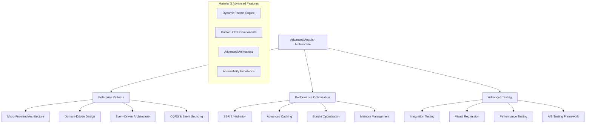

# Advanced Level - Angular Material 3 Mastery

## 🔴 **Advanced Level Overview**

Welcome to the **Advanced Level** of Angular Material 3 Mastery! This level is designed for developers who have completed the intermediate projects and are ready to tackle enterprise-grade challenges with sophisticated architecture patterns, performance optimization, and cutting-edge Angular features.

## 🎯 **Advanced Level Philosophy**

### **Enterprise-First Approach**
At the advanced level, we shift from building functional applications to creating **enterprise-grade systems** that can scale to thousands of users, handle complex business requirements, and maintain high performance under load.

### **Architecture-Driven Development**
Every project at this level emphasizes **architectural excellence**, design patterns, and best practices that prepare you for tech lead and architect roles in large organizations.

### **Performance & Scalability Focus**
Advanced projects require **deep performance optimization** knowledge, including micro-frontend architecture, server-side rendering, advanced caching strategies, and memory management.

## 🏗️ **Advanced Architecture Patterns**

## 📋 **Advanced Projects Portfolio**

### **🏢 Project 1: Enterprise Dashboard Platform** (4-5 weeks)
**Complexity**: ⭐⭐⭐⭐⭐ **Very High**

Build a comprehensive enterprise dashboard platform with:
- **Micro-frontend architecture** with module federation
- **Advanced data visualization** with D3.js and custom charts
- **Real-time collaboration** with WebSocket integration
- **Multi-tenant theming** with dynamic theme generation
- **SSR optimization** for enterprise performance requirements

**Key Technologies**: Angular 18+, NgRx, D3.js, Module Federation, WebSockets, Server-Side Rendering

### **🎨 Project 2: Advanced Design System Builder** (4-5 weeks)
**Complexity**: ⭐⭐⭐⭐⭐ **Very High**

Create a visual design system builder tool with:
- **Visual theme editor** with real-time preview
- **Token management system** with design token generation
- **Component library generator** with automatic documentation
- **Cross-platform export** (Web, iOS, Android design tokens)
- **Collaborative design workflows** with version control

**Key Technologies**: Angular CDK, Design Tokens, Canvas API, WebGL, Git Integration

### **🚀 Project 3: High-Performance SaaS Platform** (5-6 weeks)
**Complexity**: ⭐⭐⭐⭐⭐ **Very High**

Develop a high-performance SaaS platform with:
- **Advanced state management** with complex business logic
- **Performance monitoring** with real-time metrics
- **A/B testing framework** with statistical analysis
- **Advanced security patterns** with OAuth 2.0 and JWT
- **Scalable architecture** supporting millions of users

**Key Technologies**: NgRx, RxJS, Performance APIs, OAuth 2.0, Analytics Integration

### **🌐 Project 4: Global Collaboration Platform** (4-5 weeks)
**Complexity**: ⭐⭐⭐⭐⭐ **Very High**

Build a real-time global collaboration platform with:
- **Real-time collaborative editing** with operational transformation
- **Advanced internationalization** with 50+ languages
- **Offline-first architecture** with background sync
- **Progressive Web App** with native-like performance
- **Cross-platform compatibility** (Web, Electron, Mobile)

**Key Technologies**: WebRTC, ServiceWorkers, PWA, Electron, Capacitor

## 🎓 **Advanced Learning Objectives**

### **🏗️ Enterprise Architecture Mastery**
- **Micro-Frontend Patterns**: Module federation, shared libraries, independent deployments
- **Domain-Driven Design**: Bounded contexts, aggregates, and domain services
- **Event-Driven Architecture**: Event sourcing, CQRS, and saga patterns
- **Scalability Patterns**: Load balancing, caching strategies, and database optimization

### **⚡ Performance Engineering Excellence**
- **Advanced Bundle Optimization**: Tree shaking, code splitting, and lazy loading
- **Server-Side Rendering**: SSR strategies, hydration optimization, and caching
- **Memory Management**: Leak detection, garbage collection optimization, and profiling
- **Real-Time Performance**: WebSocket optimization, data streaming, and conflict resolution

### **🧪 Advanced Testing Strategies**
- **Testing Architecture**: Test pyramids, test strategies, and automation frameworks
- **Visual Regression Testing**: Automated screenshot comparison and UI consistency
- **Performance Testing**: Load testing, stress testing, and performance regression
- **A/B Testing**: Statistical analysis, feature flags, and experimentation frameworks

### **🎨 Advanced Material Design**
- **Dynamic Theme Generation**: Algorithmic color generation and accessibility optimization
- **Custom CDK Components**: Building reusable component libraries with Angular CDK
- **Advanced Animations**: Complex motion design and performance-optimized animations
- **Accessibility Excellence**: WCAG 2.1 AAA compliance and inclusive design patterns

## ⏱️ **Time Investment & Complexity**

### **Estimated Duration**: 16-21 weeks total
- **Project 1**: 4-5 weeks (Enterprise Dashboard)
- **Project 2**: 4-5 weeks (Design System Builder)
- **Project 3**: 5-6 weeks (SaaS Platform)
- **Project 4**: 4-5 weeks (Collaboration Platform)

### **Complexity Breakdown**
- **Architecture Complexity**: ⭐⭐⭐⭐⭐ (Very High)
- **Performance Requirements**: ⭐⭐⭐⭐⭐ (Very High)
- **Business Logic Complexity**: ⭐⭐⭐⭐⭐ (Very High)
- **Testing Complexity**: ⭐⭐⭐⭐⭐ (Very High)
- **Deployment Complexity**: ⭐⭐⭐⭐⭐ (Very High)

### **Prerequisites Assessment**
- **Required**: Completion of all intermediate-level projects
- **Angular Expertise**: Advanced knowledge of Angular concepts and patterns
- **State Management**: Expert-level NgRx and RxJS skills
- **Performance Optimization**: Understanding of browser performance and optimization
- **Testing**: Experience with comprehensive testing strategies
- **DevOps**: Basic understanding of CI/CD and deployment processes

## 📊 **Skill Development Matrix**

### **Technical Skills Advancement**
| Skill Category | Beginner → Intermediate | Intermediate → Advanced |
|---|---|---|
| **Architecture** | Component composition | Enterprise patterns |
| **Performance** | Basic optimization | Advanced profiling |
| **Testing** | Unit testing | Full testing pyramid |
| **State Management** | NgRx basics | Complex business logic |
| **Security** | Basic auth | OAuth 2.0, JWT, encryption |
| **Deployment** | Simple hosting | CI/CD, containerization |

### **Material 3 Mastery Progression**
| Component Area | Intermediate Level | Advanced Level |
|---|---|---|
| **Theming** | Custom themes | Dynamic theme generation |
| **Components** | Component customization | CDK-based components |
| **Layout** | Responsive layouts | Complex grid systems |
| **Animation** | Basic transitions | Advanced motion design |
| **Accessibility** | WCAG AA compliance | WCAG AAA excellence |

## 🎯 **Success Metrics & Assessment**

### **Technical Excellence Criteria**
- **Performance**: Sub-second load times, 60fps animations
- **Scalability**: Support for 10,000+ concurrent users
- **Accessibility**: WCAG 2.1 AAA compliance across all features
- **Test Coverage**: 95%+ code coverage with comprehensive E2E tests
- **Code Quality**: Maintainability index > 85, zero critical vulnerabilities

### **Business Impact Measurements**
- **User Experience**: Measured improvement in user engagement metrics
- **Developer Experience**: Reduced development time for new features
- **Operational Excellence**: Monitoring, alerting, and automated recovery
- **Security Posture**: Zero security vulnerabilities in production
- **Performance Benchmarks**: Lighthouse scores > 95 across all metrics

## 🔄 **Advanced Development Workflow**

### **Pre-Development Phase**
1. **Architecture Review**: Design review with stakeholders
2. **Performance Planning**: Performance budget and optimization strategy
3. **Security Assessment**: Threat modeling and security requirements
4. **Testing Strategy**: Comprehensive testing plan and automation
5. **Deployment Planning**: CI/CD pipeline and monitoring setup

### **Development Phase**
1. **Feature-Driven Development**: Incremental feature delivery
2. **Continuous Integration**: Automated testing and quality gates
3. **Performance Monitoring**: Real-time performance tracking
4. **Security Scanning**: Automated vulnerability assessment
5. **Code Review Process**: Peer review and architectural validation

### **Post-Development Phase**
1. **Performance Optimization**: Profiling and optimization cycles
2. **Security Hardening**: Penetration testing and security review
3. **Documentation**: Architecture documentation and runbooks
4. **Knowledge Transfer**: Team training and best practices sharing
5. **Production Monitoring**: Observability and alerting setup

## 📚 **Advanced Resources & References**

### **Architecture Patterns**
- [Micro-Frontend Architecture Guide](https://micro-frontends.org/)
- [Domain-Driven Design in Angular](https://angular.io/guide/architecture)
- [Event-Driven Architecture Patterns](https://martinfowler.com/articles/201701-event-driven.html)

### **Performance Optimization**
- [Angular Performance Checklist](https://angular.io/guide/performance-optimization)
- [Web Performance Best Practices](https://web.dev/performance/)
- [Memory Management in JavaScript](https://developer.mozilla.org/en-US/docs/Web/JavaScript/Memory_Management)

### **Advanced Testing**
- [Testing Angular Applications](https://angular.io/guide/testing)
- [Visual Regression Testing Guide](https://storybook.js.org/docs/react/writing-tests/visual-testing)
- [Performance Testing Strategies](https://web.dev/performance-testing/)

## 🚀 **Ready for Advanced Challenges?**

### **Self-Assessment Checklist**
Before starting advanced projects, ensure you can confidently answer "yes" to:

- [ ] **Architecture**: Can you design scalable, maintainable system architectures?
- [ ] **Performance**: Do you understand performance profiling and optimization techniques?
- [ ] **Testing**: Can you design and implement comprehensive testing strategies?
- [ ] **Security**: Are you familiar with modern web security practices?
- [ ] **DevOps**: Do you understand CI/CD pipelines and deployment strategies?

### **Getting Started**
1. **Choose Your Project**: Select based on your career goals and interests
2. **Set Up Advanced Tooling**: Configure profiling, monitoring, and testing tools
3. **Create Learning Plan**: Break down the project into weekly milestones
4. **Join Advanced Community**: Connect with other developers tackling similar challenges
5. **Document Your Journey**: Share learnings and insights with the community

---

**Welcome to the Advanced Level!** 🔴

*At this level, you're not just building applications – you're architecting systems that can scale, perform, and evolve with the needs of modern enterprises. Every decision you make will impact thousands of users and fellow developers.*

**Let's build something extraordinary together!** 🚀
