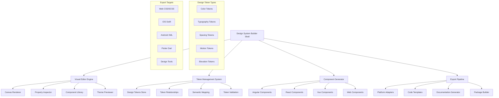

# Advanced Design System Builder

## 🎨 **Project Overview**

Create a sophisticated visual design system builder that empowers design teams and developers to collaboratively create, maintain, and deploy design systems at scale. This project demonstrates mastery of advanced Angular CDK patterns, design token management, visual editing interfaces, and cross-platform design system generation.

## 🎯 **Design System Context**

### **Industry Problem**
Modern organizations struggle with design consistency across multiple products, platforms, and teams. Traditional design tools often create silos between designers and developers, leading to:
- **Design Drift**: Inconsistent implementation of design specifications
- **Development Overhead**: Manual translation of designs to code
- **Maintenance Complexity**: Difficulty updating design systems across projects
- **Cross-Platform Fragmentation**: Different design implementations for web, mobile, and desktop

### **Solution Vision**
Build a comprehensive design system builder that bridges the gap between design and development by providing:
- **Visual Design Interface**: Drag-and-drop design system creation
- **Real-Time Code Generation**: Automatic component and theme code generation
- **Cross-Platform Export**: Support for Web, iOS, Android, and Flutter
- **Collaborative Workflows**: Version control and team collaboration features
- **Enterprise Integration**: API-first architecture for existing toolchains

## 🏗️ **Architecture Overview**



## 🚀 **Core Features**

### **Visual Design Interface**
- **Drag-and-Drop Editor**: Intuitive component composition and layout
- **Real-Time Preview**: Live preview across multiple devices and themes
- **Component Variants**: Visual creation of component states and variations
- **Interactive Prototyping**: Clickable prototypes with state transitions
- **Collaborative Cursors**: Real-time multi-user editing with presence awareness
- **Version History**: Visual diff and rollback capabilities

### **Advanced Token Management**
- **Hierarchical Tokens**: Global, semantic, and component-level token organization
- **Relationship Mapping**: Automatic detection of token dependencies
- **Accessibility Validation**: WCAG compliance checking for color contrast
- **Cross-Reference Analysis**: Impact analysis for token changes
- **Semantic Naming**: AI-powered token naming suggestions
- **Token Documentation**: Automatic usage documentation generation

### **Intelligent Code Generation**
- **Framework Adapters**: Native component generation for multiple frameworks
- **Theme Optimization**: Automatic CSS custom property optimization
- **Tree Shaking**: Dead code elimination for production bundles
- **TypeScript Types**: Automatic type generation for design tokens
- **Documentation**: Automatic Storybook and documentation generation
- **Testing**: Automated visual regression test generation

## 🎨 **Advanced Material 3 Integration**

### **Dynamic Theme Engine**
```typescript
export interface AdvancedThemeDefinition {
  foundation: {
    colorScheme: 'light' | 'dark' | 'auto';
    seedColor: string;
    contrastLevel: 'standard' | 'medium' | 'high';
    adaptiveColors: boolean;
  };
  tokens: {
    colors: MaterialColorTokens;
    typography: MaterialTypographyTokens;
    elevation: MaterialElevationTokens;
    motion: MaterialMotionTokens;
    shape: MaterialShapeTokens;
  };
  customization: {
    componentOverrides: Record<string, ComponentThemeOverride>;
    breakpoints: Record<string, number>;
    spacing: SpacingScale;
    zIndex: ZIndexScale;
  };
  platforms: {
    web: WebPlatformConfig;
    ios: IosPlatformConfig;
    android: AndroidPlatformConfig;
    flutter: FlutterPlatformConfig;
  };
}
```

### **Component System Architecture**
- **Base Components**: Foundational building blocks with token integration
- **Composite Components**: Complex components built from base components
- **Layout Components**: Grid systems, containers, and spacing utilities
- **Pattern Components**: Common UI patterns as reusable components
- **Utility Components**: Helper components for accessibility and interaction

### **Token Relationship Engine**
```typescript
export interface TokenRelationship {
  source: DesignToken;
  target: DesignToken;
  relationship: 'derives' | 'references' | 'computes' | 'inherits';
  transformation?: TokenTransformation;
  conditions?: TokenCondition[];
}

export interface TokenTransformation {
  type: 'opacity' | 'lighten' | 'darken' | 'scale' | 'compute';
  parameters: Record<string, any>;
  formula?: string;
}
```

## 🔧 **Technology Stack**

### **Core Framework & UI**
- **Angular 18+**: Advanced CDK patterns and custom component development
- **Angular Material 3**: Extended with custom design system components
- **Canvas API**: High-performance rendering for visual editor
- **WebGL**: Hardware acceleration for complex visual operations
- **Web Components**: Standards-based component architecture

### **Design System Architecture**
- **Design Tokens**: W3C Community Group design token specification
- **Style Dictionary**: Token transformation and platform generation
- **Figma API**: Integration with design tool ecosystems
- **Monaco Editor**: Advanced code editing with syntax highlighting
- **AST Manipulation**: TypeScript compiler API for code generation

### **Visual Editor Engine**
- **Fabric.js**: Advanced canvas manipulation and object management
- **Konva.js**: 2D canvas rendering with high performance
- **RxJS**: Reactive programming for editor state management
- **Intersection Observer**: Efficient viewport-based optimizations
- **ResizeObserver**: Responsive canvas and component sizing

### **Code Generation & Export**
- **TypeScript Compiler API**: Advanced AST manipulation and code generation
- **Babel**: JavaScript transformation and optimization
- **PostCSS**: CSS processing and optimization
- **Rollup**: Module bundling for generated components
- **ESBuild**: High-performance TypeScript compilation

### **Collaboration & Persistence**
- **WebRTC**: Peer-to-peer collaboration and real-time sync
- **Yjs**: Conflict-free replicated data types for collaborative editing
- **IndexedDB**: Client-side storage for offline capabilities
- **Git Integration**: Version control for design system assets
- **WebSocket**: Real-time collaboration server communication

## 🎯 **Advanced Features**

### **AI-Powered Design Assistance**
- **Color Palette Generation**: AI-generated accessible color palettes
- **Typography Pairing**: Intelligent font combination suggestions
- **Component Suggestions**: ML-powered component recommendations
- **Accessibility Auditing**: Automated accessibility issue detection
- **Design Pattern Recognition**: Pattern analysis and optimization suggestions

### **Cross-Platform Token Export**

#### **Web Platform Export**
```scss
// Generated SCSS tokens
$color-primary: #1976d2;
$color-primary-container: #e3f2fd;
$typography-headline-large: (
  font-family: 'Roboto',
  font-size: 2rem,
  font-weight: 400,
  line-height: 1.2,
  letter-spacing: 0
);
```

#### **iOS Platform Export**
```swift
// Generated Swift tokens
public enum ColorTokens {
    public static let primary = UIColor(red: 0.098, green: 0.463, blue: 0.824, alpha: 1.0)
    public static let primaryContainer = UIColor(red: 0.890, green: 0.949, blue: 0.992, alpha: 1.0)
}

public enum TypographyTokens {
    public static let headlineLarge = UIFont.systemFont(ofSize: 32, weight: .regular)
}
```

#### **Android Platform Export**
```xml
<!-- Generated Android resources -->
<resources>
    <color name="color_primary">#1976D2</color>
    <color name="color_primary_container">#E3F2FD</color>
    
    <style name="Typography.HeadlineLarge">
        <item name="fontFamily">@font/roboto_regular</item>
        <item name="android:textSize">32sp</item>
    </style>
</resources>
```

### **Advanced Component Generation**

#### **Angular Component Template**
```typescript
// Generated Angular component
@Component({
  selector: 'ds-button',
  template: `
    <button 
      [class]="buttonClasses"
      [disabled]="disabled"
      (click)="onClick.emit($event)"
    >
      <ng-content></ng-content>
    </button>
  `,
  styles: [`
    :host {
      --button-primary-color: var(--color-primary);
      --button-primary-container: var(--color-primary-container);
    }
    
    .ds-button {
      background-color: var(--button-primary-container);
      color: var(--button-primary-color);
      border-radius: var(--shape-corner-full);
      padding: var(--spacing-md) var(--spacing-lg);
    }
  `]
})
export class DesignSystemButtonComponent {
  @Input() variant: 'filled' | 'outlined' | 'text' = 'filled';
  @Input() disabled = false;
  @Output() onClick = new EventEmitter<MouseEvent>();
  
  get buttonClasses(): string {
    return `ds-button ds-button--${this.variant}`;
  }
}
```

## ⏱️ **Development Timeline**

### **Week 1-2: Foundation & Architecture**
- **Visual Editor Engine**: Canvas-based editing infrastructure
- **Token Management**: Design token storage and relationship system
- **Component Architecture**: Base component system and theme integration
- **Real-Time Collaboration**: WebRTC setup and collaborative editing foundation

### **Week 3-4: Visual Interface**
- **Drag-and-Drop Editor**: Component composition and layout tools
- **Property Inspector**: Dynamic property editing with live preview
- **Theme Previewer**: Multi-device and multi-theme preview system
- **Component Library**: Searchable component palette and variants

### **Week 5-6: Code Generation**
- **Platform Adapters**: Framework-specific component generation
- **Token Export**: Cross-platform token transformation
- **Documentation Generator**: Automatic documentation and examples
- **Testing Framework**: Visual regression and unit test generation

### **Week 7-8: Advanced Features**
- **AI Integration**: Intelligent design assistance and recommendations
- **Version Control**: Git integration and design system versioning
- **Performance Optimization**: Bundle optimization and caching strategies
- **Enterprise Integration**: API development and third-party tool integration

### **Week 9: Testing & Polish**
- **Comprehensive Testing**: Unit, integration, and E2E testing
- **Performance Auditing**: Profiling and optimization
- **Accessibility Validation**: WCAG compliance verification
- **Documentation**: User guides and developer documentation

## 🎓 **Learning Objectives**

### **Primary Objectives**
1. **Master Advanced Angular CDK** for custom component development
2. **Build Visual Editing Interfaces** with canvas and WebGL technologies
3. **Implement Design Token Systems** following W3C specifications
4. **Create Cross-Platform Code Generation** for multiple frameworks
5. **Develop Real-Time Collaborative Features** with WebRTC and CRDT

### **Secondary Objectives**
1. **Integrate AI/ML Capabilities** for design assistance
2. **Build Scalable Visual Editor Architecture** for complex interfaces
3. **Implement Advanced Testing Strategies** for visual components
4. **Create Enterprise Integration APIs** for existing toolchains
5. **Optimize Performance** for large-scale design systems

## 📚 **Skills Development**

### **Advanced Angular CDK Skills**
- **Custom Component Development**: Building complex, reusable components
- **Portal System**: Dynamic component instantiation and management
- **Overlay System**: Advanced positioning and layering strategies
- **Accessibility**: ARIA patterns and keyboard navigation
- **Drag and Drop**: Advanced drag-and-drop interactions

### **Visual Editor Development**
- **Canvas Manipulation**: Advanced canvas API usage and optimization
- **WebGL Integration**: Hardware-accelerated graphics and rendering
- **Geometric Calculations**: Collision detection and spatial relationships
- **Animation Systems**: Complex animations and state transitions
- **Performance Optimization**: Efficient rendering and memory management

### **Design System Architecture**
- **Token Architecture**: Hierarchical token systems and relationships
- **Theme Generation**: Algorithmic theme creation and optimization
- **Component APIs**: Flexible and extensible component interfaces
- **Cross-Platform Compatibility**: Platform-specific adaptations
- **Documentation Systems**: Automated documentation generation

## 🎯 **Success Metrics**

### **Technical Metrics**
- **Performance**: Visual editor operates at 60fps with 1000+ components
- **Code Generation**: Generates production-ready code for 5+ platforms
- **Collaboration**: Supports 20+ simultaneous collaborative editors
- **Token Management**: Handles 1000+ design tokens with complex relationships
- **Export Speed**: Platform exports complete in under 30 seconds

### **User Experience Metrics**
- **Design Efficiency**: 50% reduction in design-to-code time
- **Consistency**: 90% reduction in design inconsistencies
- **Adoption**: High user adoption across design and development teams
- **Collaboration**: Improved designer-developer collaboration metrics
- **Quality**: Reduced design system maintenance overhead

## 📋 **Prerequisites**

### **Required Knowledge**
- Advanced Angular and Angular CDK expertise
- Canvas API and 2D graphics programming
- Design system principles and token architecture
- TypeScript advanced features and AST manipulation
- Web performance optimization techniques

### **Recommended Experience**
- Previous visual editor or design tool development
- Experience with design systems and component libraries
- Knowledge of multiple frontend frameworks (React, Vue, etc.)
- Understanding of cross-platform development
- Familiarity with design tools (Figma, Sketch, Adobe XD)

## 📋 **Next Steps**

1. **Study Design System Principles**: Understand design token specifications and best practices
2. **Learn Canvas and WebGL**: Master visual programming and hardware acceleration
3. **Explore Code Generation**: Study AST manipulation and template systems
4. **Research Collaboration Patterns**: Understand CRDT and real-time synchronization
5. **Start with Project Guide**: Follow the detailed implementation roadmap

---

This project represents the cutting edge of design system tooling, combining advanced visual editing capabilities with sophisticated code generation and cross-platform compatibility. It demonstrates mastery of complex Angular patterns while solving real-world problems in design system management and collaboration.
