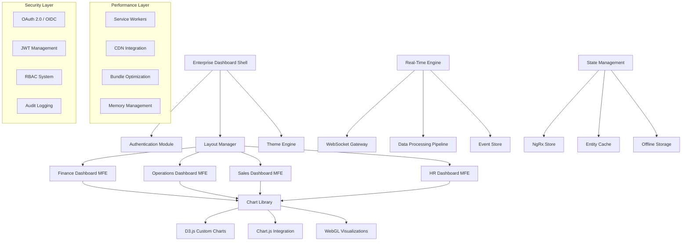

# Enterprise Dashboard Platform

## 🏢 **Project Overview**

Build a comprehensive enterprise dashboard platform that serves as the central command center for large organizations. This project demonstrates mastery of micro-frontend architecture, advanced data visualization, real-time collaboration, and enterprise-grade performance optimization.

## 🎯 **Enterprise Context**

### **Business Requirements**
- **Multi-Department Support**: Finance, Operations, Sales, HR, and IT departments
- **Real-Time Monitoring**: System health, KPIs, and business metrics
- **Collaborative Decision Making**: Shared dashboards with commenting and annotations
- **Scalable Architecture**: Support for 10,000+ concurrent users
- **Global Deployment**: Multi-region support with low latency
- **Security & Compliance**: SOC 2, GDPR, and enterprise security standards

### **Technical Challenges**
- **Data Volume**: Processing millions of data points in real-time
- **Performance**: Sub-second response times for complex queries
- **Modularity**: Independent development and deployment of dashboard modules
- **Customization**: Per-tenant dashboard configurations and branding
- **Integration**: Seamless integration with existing enterprise systems

## 🏗️ **Architecture Overview**



## 🚀 **Key Features**

### **Core Dashboard Features**
- **Modular Architecture**: Independent micro-frontend modules for each department
- **Drag-and-Drop Designer**: Visual dashboard builder with widget library
- **Real-Time Collaboration**: Shared cursors, comments, and annotations
- **Advanced Filtering**: Multi-dimensional data filtering with saved queries
- **Export Capabilities**: PDF reports, Excel exports, and scheduled deliveries
- **Mobile Optimization**: Touch-friendly interface with offline capabilities

### **Advanced Visualization Features**
- **Custom D3.js Charts**: Bespoke visualizations for complex business data
- **WebGL Performance**: Hardware-accelerated rendering for large datasets
- **Interactive Drilling**: Click-through navigation from summary to detailed views
- **Animation Engine**: Smooth transitions and meaningful micro-interactions
- **Responsive Charts**: Adaptive visualizations for different screen sizes
- **Accessibility Excellence**: Screen reader support and keyboard navigation

### **Enterprise Integration**
- **SSO Integration**: SAML 2.0, OAuth 2.0, and OpenID Connect support
- **API Gateway**: Centralized API management with rate limiting and caching
- **Audit Trail**: Comprehensive logging of user actions and data access
- **Data Governance**: Data lineage tracking and compliance reporting
- **Multi-Tenant Support**: Isolated data and customizable branding per tenant

## 📊 **Advanced Technical Features**

### **Micro-Frontend Architecture**
- **Module Federation**: Webpack 5 module federation for independent deployments
- **Shared Libraries**: Common utilities and components across micro-frontends
- **Version Management**: Semantic versioning and backward compatibility
- **Dynamic Loading**: Runtime loading of dashboard modules based on permissions
- **Fallback Strategies**: Graceful degradation when modules are unavailable

### **Performance Optimization**
- **Bundle Analysis**: Automated bundle size monitoring and optimization
- **Code Splitting**: Route-based and component-based code splitting
- **Virtual Scrolling**: Efficient rendering of large data tables and lists
- **Memoization**: Strategic caching of expensive computations
- **Service Workers**: Background data sync and offline functionality

### **Real-Time Capabilities**
- **WebSocket Management**: Connection pooling and automatic reconnection
- **Event Sourcing**: Immutable event log for data consistency
- **Conflict Resolution**: Operational transformation for collaborative editing
- **Push Notifications**: Browser notifications for critical alerts
- **Live Cursors**: Real-time cursor positions for collaborative sessions

## 🎨 **Advanced Material 3 Implementation**

### **Dynamic Theme Engine**
```typescript
interface EnterpriseTheme {
  department: 'finance' | 'operations' | 'sales' | 'hr' | 'it';
  brandColors: {
    primary: string;
    secondary: string;
    accent: string;
    success: string;
    warning: string;
    error: string;
  };
  dataColors: {
    charts: string[];
    categories: Record<string, string>;
    severity: Record<'low' | 'medium' | 'high' | 'critical', string>;
  };
  typography: {
    dashboard: FontConfig;
    reports: FontConfig;
    presentations: FontConfig;
  };
  layout: {
    density: 'compact' | 'comfortable' | 'spacious';
    gridSystem: '12-column' | '16-column' | '24-column';
    breakpoints: Record<string, number>;
  };
}
```

### **Accessibility Excellence**
- **WCAG 2.1 AAA**: Highest level of accessibility compliance
- **Screen Reader Optimization**: Structured content with ARIA landmarks
- **Keyboard Navigation**: Complete keyboard accessibility for all features
- **High Contrast Mode**: Automatic detection and theme adaptation
- **Voice Control**: Integration with browser voice control APIs

### **Advanced Component Library**
- **Chart Components**: Reusable, accessible chart components with Material 3 styling
- **Data Grid**: Enterprise-grade data table with sorting, filtering, and editing
- **Dashboard Widgets**: Modular widgets with consistent design language
- **Form Controls**: Advanced form components with validation and error handling
- **Navigation Systems**: Multi-level navigation with breadcrumbs and contextual menus

## 🔧 **Technology Stack**

### **Core Framework**
- **Angular 18+**: Latest Angular features with standalone components and signals
- **Angular Material 3**: MDC-based components with enterprise customizations
- **Angular CDK**: Advanced component development patterns
- **TypeScript 5+**: Latest TypeScript features with strict mode

### **Architecture & State Management**
- **Module Federation**: Webpack 5 for micro-frontend architecture
- **NgRx**: Advanced state management with entity patterns
- **RxJS 7+**: Reactive programming with advanced operators
- **Akita**: Alternative state management for specific use cases

### **Visualization & Charts**
- **D3.js 7+**: Custom data visualizations and advanced interactions
- **Chart.js 4+**: Standard chart types with Material 3 theming
- **Three.js**: 3D visualizations and WebGL performance
- **Canvas API**: High-performance custom graphics rendering

### **Real-Time & Communication**
- **Socket.IO**: WebSocket communication with automatic fallbacks
- **WebRTC**: Peer-to-peer communication for collaboration features
- **Server-Sent Events**: One-way real-time updates for notifications
- **GraphQL Subscriptions**: Real-time data subscriptions

### **Performance & Optimization**
- **Service Workers**: Caching, offline functionality, and background sync
- **IndexedDB**: Client-side data storage and offline capabilities
- **Web Workers**: Heavy computations in background threads
- **Intersection Observer**: Efficient scroll-based optimizations

### **Testing & Quality**
- **Jest**: Unit testing with advanced mocking strategies
- **Cypress**: End-to-end testing with visual regression
- **Playwright**: Cross-browser testing and performance monitoring
- **Storybook**: Component development and visual testing

## ⏱️ **Development Timeline**

### **Week 1: Architecture & Setup**
- **Days 1-2**: Project setup, micro-frontend architecture
- **Days 3-4**: Module federation configuration and shared libraries
- **Days 5-7**: Authentication integration and security setup

### **Week 2: Core Dashboard Foundation**
- **Days 8-10**: Layout manager and dashboard shell
- **Days 11-12**: Theme engine and dynamic theming
- **Days 13-14**: Basic widget system and drag-and-drop

### **Week 3: Data Visualization**
- **Days 15-17**: Chart library integration and custom D3.js components
- **Days 18-19**: WebGL visualizations for performance
- **Days 20-21**: Interactive features and drill-down capabilities

### **Week 4: Real-Time Features**
- **Days 22-24**: WebSocket integration and real-time data streams
- **Days 25-26**: Collaborative features and conflict resolution
- **Days 27-28**: Push notifications and alert system

### **Week 5: Performance & Testing**
- **Days 29-31**: Performance optimization and profiling
- **Days 32-33**: Comprehensive testing suite
- **Days 34-35**: Security audit and compliance validation

## 🎯 **Learning Objectives**

### **Primary Objectives**
1. **Master Micro-Frontend Architecture** with Module Federation
2. **Implement Advanced Data Visualizations** with D3.js and WebGL
3. **Build Real-Time Collaborative Features** with WebSocket and WebRTC
4. **Optimize Enterprise-Grade Performance** with advanced caching and bundling
5. **Achieve Security Excellence** with OAuth 2.0, RBAC, and audit trails

### **Secondary Objectives**
1. **Design Scalable State Management** for complex business logic
2. **Implement Advanced Testing Strategies** for enterprise applications
3. **Create Accessible Visualizations** following WCAG 2.1 AAA guidelines
4. **Build Monitoring and Observability** into the application architecture
5. **Optimize for Global Deployment** with CDN and edge caching

## 📚 **Skills Development**

### **Enterprise Architecture Skills**
- **System Design**: Large-scale system architecture and design patterns
- **Micro-Frontend Patterns**: Independent development and deployment strategies
- **Security Architecture**: Enterprise security patterns and compliance
- **Performance Engineering**: Advanced optimization techniques and profiling
- **DevOps Integration**: CI/CD pipelines and infrastructure as code

### **Advanced Angular Skills**
- **Module Federation**: Micro-frontend architecture with Webpack 5
- **Advanced NgRx**: Complex state management with entity patterns
- **Custom CDK Components**: Building reusable component libraries
- **Performance Optimization**: Bundle optimization and runtime performance
- **Security Implementation**: Authentication, authorization, and data protection

## 🎓 **Prerequisites**

### **Required Knowledge**
- Advanced Angular (Components, Services, Guards, Interceptors)
- Expert-level NgRx (Actions, Reducers, Effects, Selectors, Entity)
- Advanced RxJS (Custom operators, error handling, performance optimization)
- Data visualization principles and D3.js basics
- Web security fundamentals (OAuth 2.0, JWT, CORS)

### **Recommended Experience**
- Previous enterprise application development
- Micro-frontend or micro-service architecture experience
- Real-time application development (WebSocket, WebRTC)
- Advanced CSS and SCSS (animations, custom properties)
- Performance optimization and profiling tools

## 📊 **Success Metrics**

### **Technical Metrics**
- **Performance**: Dashboard loads in under 1 second
- **Scalability**: Supports 10,000+ concurrent users
- **Real-Time**: Data updates with less than 50ms latency
- **Accessibility**: WCAG 2.1 AAA compliance across all features
- **Test Coverage**: 95%+ code coverage with E2E tests

### **Business Metrics**
- **User Engagement**: Increased dashboard usage and interaction
- **Decision Speed**: Faster business decision-making processes
- **Operational Efficiency**: Reduced manual reporting and data analysis
- **Cost Savings**: Lower infrastructure costs through optimization
- **Security Posture**: Zero security incidents in production

## 📋 **Next Steps**

1. **Review Prerequisites**: Ensure advanced Angular and enterprise development knowledge
2. **Study Architecture Patterns**: Understand micro-frontend and enterprise patterns
3. **Set Up Development Environment**: Configure advanced tooling and monitoring
4. **Start with Project Guide**: Follow the detailed implementation roadmap
5. **Join Enterprise Community**: Connect with enterprise Angular developers

---

This project represents the pinnacle of Angular Material 3 development, combining enterprise architecture, advanced visualizations, real-time collaboration, and performance excellence into a comprehensive dashboard platform that serves as the digital nerve center for modern organizations.
