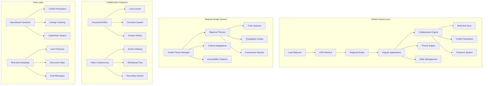

# Global Collaboration Platform - Real-time Multi-User Environment

## 🎯 **Project Overview**

Build a sophisticated global collaboration platform with real-time synchronization, advanced Material Design components, and international theming support. This project showcases enterprise-level Angular Material 3 implementation with complex state management and real-time features.

## 🌐 **Architecture Diagram**



## 🎨 **Features & Components**

### **Core Collaboration Features**
- **Real-time Document Editing** - Operational Transform implementation
- **Multi-user Cursors** - Live user presence with avatars
- **Advanced Comments** - Threaded discussions with reactions
- **Video Conferencing** - Integrated WebRTC with Material UI
- **Digital Whiteboard** - Collaborative drawing with Material tools
- **Global Chat System** - Real-time messaging with translation

### **Advanced Material Components**
- Custom Material editor with rich formatting
- Advanced data tables with real-time updates
- Interactive timeline components
- Material-themed video conferencing UI
- Responsive collaboration panels
- International form components

## 🛠️ **Technical Implementation**

### **Project Structure**
```
src/
├── app/
│   ├── core/
│   │   ├── collaboration/
│   │   │   ├── operational-transform.service.ts
│   │   │   ├── presence.service.ts
│   │   │   ├── conflict-resolution.service.ts
│   │   │   └── real-time-sync.service.ts
│   │   ├── internationalization/
│   │   │   ├── i18n.service.ts
│   │   │   ├── theme-localization.service.ts
│   │   │   └── cultural-adaptation.service.ts
│   │   └── communication/
│   │       ├── webrtc.service.ts
│   │       ├── websocket.service.ts
│   │       └── chat.service.ts
│   ├── shared/
│   │   ├── components/
│   │   │   ├── collaborative-editor/
│   │   │   ├── user-presence/
│   │   │   ├── comment-system/
│   │   │   ├── video-conference/
│   │   │   └── digital-whiteboard/
│   │   └── theming/
│   │       ├── global-theme.service.ts
│   │       ├── cultural-themes/
│   │       └── accessibility-themes/
│   ├── features/
│   │   ├── workspace/
│   │   ├── document-editor/
│   │   ├── video-conference/
│   │   ├── whiteboard/
│   │   └── chat/
│   └── theming/
│       ├── global-themes/
│       ├── cultural-variants/
│       └── accessibility-modes/
```

### **Advanced Collaboration Architecture**

#### **1. Operational Transform Service**
```typescript
@Injectable({ providedIn: 'root' })
export class OperationalTransformService {
  private documentState$ = new BehaviorSubject<DocumentState>(null);
  private pendingOperations: Operation[] = [];
  
  constructor(
    private websocketService: WebSocketService,
    private conflictResolver: ConflictResolutionService
  ) {
    this.initializeOperationalTransform();
  }
  
  applyOperation(operation: Operation): void {
    // Transform operation against pending operations
    const transformedOp = this.transformOperation(operation);
    
    // Apply to local document state
    this.applyLocalOperation(transformedOp);
    
    // Send to server for synchronization
    this.websocketService.send({
      type: 'OPERATION',
      operation: transformedOp,
      documentId: this.getCurrentDocumentId(),
      userId: this.getCurrentUserId(),
      timestamp: Date.now()
    });
    
    // Add to pending operations
    this.pendingOperations.push(transformedOp);
  }
  
  private transformOperation(operation: Operation): Operation {
    return this.pendingOperations.reduce(
      (transformedOp, pendingOp) => {
        return this.operationalTransform(transformedOp, pendingOp);
      },
      operation
    );
  }
  
  private operationalTransform(op1: Operation, op2: Operation): Operation {
    // Implement operational transform algorithm
    switch (op1.type) {
      case 'INSERT':
        return this.transformInsert(op1 as InsertOperation, op2);
      case 'DELETE':
        return this.transformDelete(op1 as DeleteOperation, op2);
      case 'RETAIN':
        return this.transformRetain(op1 as RetainOperation, op2);
      default:
        return op1;
    }
  }
  
  private transformInsert(insert: InsertOperation, other: Operation): Operation {
    if (other.type === 'INSERT' && other.position <= insert.position) {
      return {
        ...insert,
        position: insert.position + other.content.length
      };
    }
    
    if (other.type === 'DELETE' && other.position < insert.position) {
      return {
        ...insert,
        position: Math.max(0, insert.position - other.length)
      };
    }
    
    return insert;
  }
}
```

#### **2. Real-time Presence System**
```typescript
@Injectable({ providedIn: 'root' })
export class PresenceService {
  private users$ = new BehaviorSubject<CollaboratorPresence[]>([]);
  private currentUser$ = new BehaviorSubject<UserPresence>(null);
  
  constructor(
    private websocketService: WebSocketService,
    private themeService: GlobalThemeService
  ) {
    this.initializePresence();
  }
  
  updateCursorPosition(position: CursorPosition): void {
    const presence: UserPresence = {
      ...this.currentUser$.value,
      cursor: {
        position,
        selection: this.getSelection(),
        timestamp: Date.now()
      }
    };
    
    this.websocketService.send({
      type: 'PRESENCE_UPDATE',
      presence,
      documentId: this.getCurrentDocumentId()
    });
    
    this.currentUser$.next(presence);
  }
  
  private initializePresence(): void {
    this.websocketService.messages$.pipe(
      filter(message => message.type === 'PRESENCE_UPDATE')
    ).subscribe(message => {
      this.updateUserPresence(message.presence);
    });
    
    // Send periodic heartbeat
    interval(5000).subscribe(() => {
      this.sendHeartbeat();
    });
  }
  
  private updateUserPresence(presence: UserPresence): void {
    const currentUsers = this.users$.value;
    const userIndex = currentUsers.findIndex(u => u.id === presence.userId);
    
    if (userIndex >= 0) {
      currentUsers[userIndex] = {
        ...currentUsers[userIndex],
        ...presence,
        lastSeen: Date.now()
      };
    } else {
      currentUsers.push({
        id: presence.userId,
        name: presence.userName,
        avatar: presence.userAvatar,
        cursor: presence.cursor,
        color: this.assignUserColor(presence.userId),
        lastSeen: Date.now()
      });
    }
    
    this.users$.next([...currentUsers]);
  }
  
  private assignUserColor(userId: string): string {
    const colors = this.themeService.getCollaborationColors();
    const hash = this.hashUserId(userId);
    return colors[hash % colors.length];
  }
}
```

#### **3. Collaborative Editor Component**
```typescript
@Component({
  selector: 'app-collaborative-editor',
  template: `
    <div class="collaborative-editor" 
         [class.focus-mode]="focusMode"
         (click)="updateCursorPosition($event)">
      
      <!-- Toolbar -->
      <mat-toolbar class="editor-toolbar" color="primary">
        <mat-toolbar-row>
          <mat-button-toggle-group [value]="currentFormat" multiple>
            <mat-button-toggle value="bold">
              <mat-icon>format_bold</mat-icon>
            </mat-button-toggle>
            <mat-button-toggle value="italic">
              <mat-icon>format_italic</mat-icon>
            </mat-button-toggle>
            <mat-button-toggle value="underline">
              <mat-icon>format_underlined</mat-icon>
            </mat-button-toggle>
          </mat-button-toggle-group>
          
          <span class="toolbar-spacer"></span>
          
          <!-- User presence indicators -->
          <div class="user-presence">
            <mat-chip-list>
              <mat-chip *ngFor="let user of collaborators$ | async"
                       [style.background-color]="user.color"
                       class="user-chip">
                
                {{user.name}}
              </mat-chip>
            </mat-chip-list>
          </div>
        </mat-toolbar-row>
      </mat-toolbar>
      
      <!-- Editor content -->
      <div class="editor-content" 
           contenteditable="true"
           #editorContent
           (input)="onContentChange($event)"
           (selectionchange)="onSelectionChange($event)">
        
        <!-- Real-time cursors -->
        <div *ngFor="let user of collaborators$ | async"
             class="user-cursor"
             [style.left.px]="user.cursor.x"
             [style.top.px]="user.cursor.y"
             [style.border-color]="user.color">
          
          <div class="cursor-line" [style.background-color]="user.color"></div>
          <div class="cursor-label" [style.background-color]="user.color">
            {{user.name}}
          </div>
        </div>
        
        <!-- Comments overlay -->
        <div *ngFor="let comment of comments$ | async"
             class="comment-marker"
             [style.left.px]="comment.position.x"
             [style.top.px]="comment.position.y"
             (click)="openComment(comment)">
          <mat-icon class="comment-icon">comment</mat-icon>
          <span class="comment-count">{{comment.replies.length}}</span>
        </div>
      </div>
      
      <!-- Comments sidebar -->
      <mat-sidenav-container class="comments-container">
        <mat-sidenav #commentsSidenav 
                     mode="side" 
                     position="end"
                     [opened]="showComments">
          <mat-toolbar color="accent">
            <mat-toolbar-row>
              <span>Comments</span>
              <span class="toolbar-spacer"></span>
              <button mat-icon-button (click)="commentsSidenav.close()">
                <mat-icon>close</mat-icon>
              </button>
            </mat-toolbar-row>
          </mat-toolbar>
          
          <div class="comments-list">
            <mat-card *ngFor="let comment of comments$ | async" 
                      class="comment-card">
              <mat-card-header>
                
                <mat-card-title>{{comment.author.name}}</mat-card-title>
                <mat-card-subtitle>
                  {{comment.timestamp | date:'short'}}
                </mat-card-subtitle>
              </mat-card-header>
              
              <mat-card-content>
                <p>{{comment.content}}</p>
                
                <!-- Replies -->
                <div class="comment-replies" *ngIf="comment.replies.length">
                  <mat-card *ngFor="let reply of comment.replies" 
                            class="reply-card">
                    <mat-card-header>
                      
                      <mat-card-title>{{reply.author.name}}</mat-card-title>
                      <mat-card-subtitle>
                        {{reply.timestamp | date:'short'}}
                      </mat-card-subtitle>
                    </mat-card-header>
                    <mat-card-content>
                      <p>{{reply.content}}</p>
                    </mat-card-content>
                  </mat-card>
                </div>
                
                <!-- Reply form -->
                <mat-form-field class="reply-input" appearance="outline">
                  <mat-label>Add a reply...</mat-label>
                  <textarea matInput 
                           [(ngModel)]="replyText[comment.id]"
                           (keydown.enter)="addReply(comment.id, $event)">
                  </textarea>
                </mat-form-field>
              </mat-card-content>
              
              <mat-card-actions>
                <button mat-button color="primary">
                  <mat-icon>thumb_up</mat-icon>
                  Like ({{comment.likes}})
                </button>
                <button mat-button>
                  <mat-icon>reply</mat-icon>
                  Reply
                </button>
                <button mat-button color="warn" *ngIf="comment.canDelete">
                  <mat-icon>delete</mat-icon>
                  Delete
                </button>
              </mat-card-actions>
            </mat-card>
          </div>
        </mat-sidenav>
        
        <mat-sidenav-content>
          <!-- Main editor area -->
        </mat-sidenav-content>
      </mat-sidenav-container>
    </div>
  `,
  styleUrls: ['./collaborative-editor.component.scss']
})
export class CollaborativeEditorComponent implements OnInit, OnDestroy {
  @ViewChild('editorContent') editorContent!: ElementRef;
  
  collaborators$ = this.presenceService.getCollaborators();
  comments$ = this.commentService.getComments();
  
  currentFormat: string[] = [];
  showComments = false;
  focusMode = false;
  replyText: { [commentId: string]: string } = {};
  
  private destroy$ = new Subject<void>();
  
  constructor(
    private operationalTransform: OperationalTransformService,
    private presenceService: PresenceService,
    private commentService: CommentService,
    private themeService: GlobalThemeService
  ) {}
  
  ngOnInit(): void {
    this.initializeEditor();
  }
  
  ngOnDestroy(): void {
    this.destroy$.next();
    this.destroy$.complete();
  }
  
  onContentChange(event: Event): void {
    const target = event.target as HTMLElement;
    const operation = this.createInsertOperation(target.innerText);
    this.operationalTransform.applyOperation(operation);
  }
  
  onSelectionChange(event: Event): void {
    const selection = window.getSelection();
    if (selection && selection.rangeCount > 0) {
      const range = selection.getRangeAt(0);
      const position = this.calculateCursorPosition(range);
      this.presenceService.updateCursorPosition(position);
    }
  }
  
  updateCursorPosition(event: MouseEvent): void {
    const position = {
      x: event.clientX,
      y: event.clientY,
      offset: this.getTextOffset(event)
    };
    
    this.presenceService.updateCursorPosition(position);
  }
  
  openComment(comment: Comment): void {
    this.showComments = true;
    // Scroll to comment in sidebar
    setTimeout(() => {
      const commentElement = document.getElementById(`comment-${comment.id}`);
      commentElement?.scrollIntoView({ behavior: 'smooth' });
    }, 100);
  }
  
  addReply(commentId: string, event: KeyboardEvent): void {
    if (event.shiftKey) return; // Allow shift+enter for new lines
    
    event.preventDefault();
    const replyText = this.replyText[commentId];
    
    if (replyText?.trim()) {
      this.commentService.addReply(commentId, replyText);
      this.replyText[commentId] = '';
    }
  }
  
  private initializeEditor(): void {
    // Initialize collaborative features
    this.operationalTransform.documentState$.pipe(
      takeUntil(this.destroy$)
    ).subscribe(state => {
      if (state) {
        this.updateEditorContent(state);
      }
    });
    
    // Handle keyboard shortcuts
    fromEvent<KeyboardEvent>(document, 'keydown').pipe(
      takeUntil(this.destroy$),
      filter(event => event.ctrlKey || event.metaKey)
    ).subscribe(event => {
      this.handleKeyboardShortcut(event);
    });
  }
  
  private createInsertOperation(text: string): InsertOperation {
    return {
      type: 'INSERT',
      content: text,
      position: this.getCurrentCursorPosition(),
      author: this.getCurrentUser(),
      timestamp: Date.now()
    };
  }
  
  private calculateCursorPosition(range: Range): CursorPosition {
    const rect = range.getBoundingClientRect();
    const editorRect = this.editorContent.nativeElement.getBoundingClientRect();
    
    return {
      x: rect.left - editorRect.left,
      y: rect.top - editorRect.top,
      offset: range.startOffset
    };
  }
}
```

## 🚀 **Advanced Features**

### **1. Global Theme Management**
```typescript
@Injectable({ providedIn: 'root' })
export class GlobalThemeService {
  private currentRegion$ = new BehaviorSubject<string>('US');
  private culturalThemes$ = new BehaviorSubject<CulturalTheme[]>([]);
  
  constructor(
    private i18nService: I18nService,
    private accessibilityService: AccessibilityService
  ) {
    this.initializeGlobalTheming();
  }
  
  applyRegionalTheme(region: string): void {
    const culturalTheme = this.getCulturalTheme(region);
    const accessibilityTheme = this.accessibilityService.getCurrentTheme();
    
    const mergedTheme = this.mergeThemes(culturalTheme, accessibilityTheme);
    this.applyTheme(mergedTheme);
    
    this.currentRegion$.next(region);
  }
  
  private getCulturalTheme(region: string): CulturalTheme {
    const themes = {
      'US': this.createUSTheme(),
      'JP': this.createJapaneseTheme(),
      'DE': this.createGermanTheme(),
      'IN': this.createIndianTheme(),
      'BR': this.createBrazilianTheme()
    };
    
    return themes[region] || themes['US'];
  }
  
  private createJapaneseTheme(): CulturalTheme {
    return {
      colors: {
        primary: '#E91E63', // Cherry blossom pink
        secondary: '#2E7D32', // Traditional green
        surface: '#FAFAFA',
        background: '#FFFFFF'
      },
      typography: {
        fontFamily: '"Noto Sans JP", "Hiragino Sans", sans-serif',
        fontSize: {
          small: '12px',
          medium: '14px',
          large: '16px'
        },
        lineHeight: 1.6 // Better for Japanese text
      },
      spacing: {
        dense: true, // Japanese preference for compact layouts
        padding: {
          small: '8px',
          medium: '12px',
          large: '16px'
        }
      },
      components: {
        MatButton: {
          styleOverrides: {
            root: {
              minWidth: '88px', // Larger touch targets
              borderRadius: '2px' // Less rounded for Japanese aesthetic
            }
          }
        }
      }
    };
  }
}
```

### **2. Video Conferencing Integration**
```typescript
@Component({
  selector: 'app-video-conference',
  template: `
    <div class="video-conference-container">
      <!-- Main video area -->
      <div class="main-video-area">
        <video #mainVideo 
               class="main-video"
               [srcObject]="mainVideoStream$ | async"
               autoplay
               muted>
        </video>
        
        <!-- Screen sharing overlay -->
        <div *ngIf="isScreenSharing" class="screen-share-overlay">
          <video #screenShare 
                 class="screen-share-video"
                 [srcObject]="screenShareStream$ | async"
                 autoplay>
          </video>
        </div>
        
        <!-- Whiteboard overlay -->
        <app-digital-whiteboard 
          *ngIf="showWhiteboard"
          class="whiteboard-overlay"
          [collaborative]="true"
          (drawingChange)="onWhiteboardChange($event)">
        </app-digital-whiteboard>
      </div>
      
      <!-- Participant thumbnails -->
      <div class="participants-strip">
        <mat-card *ngFor="let participant of participants$ | async"
                  class="participant-card"
                  [class.speaking]="participant.isSpeaking"
                  [class.muted]="participant.isMuted">
          
          <video class="participant-video"
                 [srcObject]="participant.stream"
                 autoplay
                 muted>
          </video>
          
          <div class="participant-info">
            <span class="participant-name">{{participant.name}}</span>
            <div class="participant-status">
              <mat-icon *ngIf="participant.isMuted" class="muted-icon">
                mic_off
              </mat-icon>
              <mat-icon *ngIf="!participant.hasVideo" class="video-off-icon">
                videocam_off
              </mat-icon>
            </div>
          </div>
        </mat-card>
      </div>
      
      <!-- Control panel -->
      <mat-toolbar class="control-panel" color="primary">
        <mat-toolbar-row>
          <button mat-fab 
                  [color]="isMuted ? 'warn' : 'primary'"
                  (click)="toggleMute()"
                  matTooltip="{{isMuted ? 'Unmute' : 'Mute'}} microphone">
            <mat-icon>{{isMuted ? 'mic_off' : 'mic'}}</mat-icon>
          </button>
          
          <button mat-fab 
                  [color]="hasVideo ? 'primary' : 'warn'"
                  (click)="toggleVideo()"
                  matTooltip="{{hasVideo ? 'Turn off' : 'Turn on'}} camera">
            <mat-icon>{{hasVideo ? 'videocam' : 'videocam_off'}}</mat-icon>
          </button>
          
          <button mat-fab 
                  color="accent"
                  (click)="toggleScreenShare()"
                  matTooltip="{{isScreenSharing ? 'Stop' : 'Start'}} screen sharing">
            <mat-icon>{{isScreenSharing ? 'stop_screen_share' : 'screen_share'}}</mat-icon>
          </button>
          
          <button mat-fab 
                  color="accent"
                  (click)="toggleWhiteboard()"
                  matTooltip="{{showWhiteboard ? 'Hide' : 'Show'}} whiteboard">
            <mat-icon>{{showWhiteboard ? 'close' : 'draw'}}</mat-icon>
          </button>
          
          <span class="control-spacer"></span>
          
          <button mat-fab 
                  color="warn"
                  (click)="endCall()"
                  matTooltip="End call">
            <mat-icon>call_end</mat-icon>
          </button>
        </mat-toolbar-row>
      </mat-toolbar>
      
      <!-- Chat panel -->
      <mat-sidenav-container class="chat-container">
        <mat-sidenav #chatSidenav 
                     mode="side" 
                     position="end"
                     [opened]="showChat">
          <app-collaboration-chat 
            [participants]="participants$ | async"
            (messageChange)="onChatMessage($event)">
          </app-collaboration-chat>
        </mat-sidenav>
      </mat-sidenav-container>
    </div>
  `,
  styleUrls: ['./video-conference.component.scss']
})
export class VideoConferenceComponent implements OnInit, OnDestroy {
  participants$ = this.webrtcService.getParticipants();
  mainVideoStream$ = this.webrtcService.getMainStream();
  screenShareStream$ = this.webrtcService.getScreenShareStream();
  
  isMuted = false;
  hasVideo = true;
  isScreenSharing = false;
  showWhiteboard = false;
  showChat = false;
  
  private destroy$ = new Subject<void>();
  
  constructor(
    private webrtcService: WebRTCService,
    private whiteboardService: WhiteboardService,
    private chatService: CollaborationChatService
  ) {}
  
  ngOnInit(): void {
    this.initializeVideoConference();
  }
  
  toggleMute(): void {
    this.isMuted = !this.isMuted;
    this.webrtcService.toggleAudio(!this.isMuted);
  }
  
  toggleVideo(): void {
    this.hasVideo = !this.hasVideo;
    this.webrtcService.toggleVideo(this.hasVideo);
  }
  
  toggleScreenShare(): void {
    if (this.isScreenSharing) {
      this.webrtcService.stopScreenShare();
    } else {
      this.webrtcService.startScreenShare();
    }
    this.isScreenSharing = !this.isScreenSharing;
  }
  
  private initializeVideoConference(): void {
    this.webrtcService.initializeConnection().then(() => {
      console.log('Video conference initialized');
    });
  }
}
```

## 🧪 **Advanced Testing Strategies**

### **1. Operational Transform Testing**
```typescript
describe('OperationalTransformService', () => {
  let service: OperationalTransformService;
  
  beforeEach(() => {
    TestBed.configureTestingModule({
      providers: [OperationalTransformService]
    });
    service = TestBed.inject(OperationalTransformService);
  });
  
  it('should handle concurrent insert operations', () => {
    const op1: InsertOperation = { type: 'INSERT', position: 5, content: 'hello' };
    const op2: InsertOperation = { type: 'INSERT', position: 5, content: 'world' };
    
    const transformed = service.transformOperation(op1, op2);
    
    expect(transformed.position).toBe(10); // Adjusted for concurrent insert
  });
  
  it('should resolve insert-delete conflicts', () => {
    const insert: InsertOperation = { type: 'INSERT', position: 10, content: 'text' };
    const delete_: DeleteOperation = { type: 'DELETE', position: 5, length: 3 };
    
    const transformed = service.transformOperation(insert, delete_);
    
    expect(transformed.position).toBe(7); // Adjusted for deletion
  });
});
```

### **2. Real-time Integration Testing**
```typescript
describe('CollaborativeEditor Integration', () => {
  let component: CollaborativeEditorComponent;
  let fixture: ComponentFixture<CollaborativeEditorComponent>;
  let mockWebSocket: jasmine.SpyObj<WebSocketService>;
  
  beforeEach(() => {
    const spy = jasmine.createSpyObj('WebSocketService', ['send', 'messages$']);
    spy.messages$ = new Subject();
    
    TestBed.configureTestingModule({
      declarations: [CollaborativeEditorComponent],
      imports: [MaterialModule, NoopAnimationsModule],
      providers: [
        { provide: WebSocketService, useValue: spy }
      ]
    });
    
    fixture = TestBed.createComponent(CollaborativeEditorComponent);
    component = fixture.componentInstance;
    mockWebSocket = TestBed.inject(WebSocketService) as jasmine.SpyObj<WebSocketService>;
  });
  
  it('should sync changes across users', fakeAsync(() => {
    const mockOperation = { type: 'INSERT', position: 0, content: 'test' };
    
    component.onContentChange(new Event('input'));
    tick();
    
    expect(mockWebSocket.send).toHaveBeenCalledWith(
      jasmine.objectContaining({
        type: 'OPERATION',
        operation: jasmine.objectContaining(mockOperation)
      })
    );
  }));
});
```

## 📊 **Performance & Monitoring**

### **1. Real-time Performance Metrics**
- Operational transform latency tracking
- WebRTC connection quality monitoring
- Presence update frequency optimization
- Memory usage for large documents

### **2. Global Performance Optimization**
- CDN-based theme distribution
- Regional server selection
- Lazy loading of collaboration features
- WebAssembly for complex operations

## 🔒 **Security & Privacy**

### **1. End-to-End Encryption**
- Document content encryption
- Video call encryption
- Chat message encryption
- Secure key exchange

### **2. Access Control**
- Document permission system
- Real-time access validation
- Audit logging for all operations
- GDPR compliance for global users

## 🎯 **Learning Outcomes**

After completing this project, you will have mastered:

- ✅ **Operational Transform** - Real-time collaborative editing algorithms
- ✅ **WebRTC Integration** - Video conferencing with Material UI
- ✅ **Global Theming** - Cultural adaptation and internationalization
- ✅ **Advanced State Management** - Complex real-time synchronization
- ✅ **Performance Optimization** - Large-scale collaborative applications
- ✅ **Security Implementation** - End-to-end encryption and access control

## 🚀 **Deployment & Scaling**

### **1. Infrastructure**
- Global CDN deployment
- Auto-scaling server clusters
- Real-time database sharding
- Load balancing strategies

### **2. Monitoring**
- Real-time performance dashboards
- User activity analytics
- Error tracking and reporting
- Capacity planning metrics

---

*This project represents the ultimate in collaborative Angular Material 3 applications, combining real-time synchronization, global theming, and enterprise-grade architecture.*
