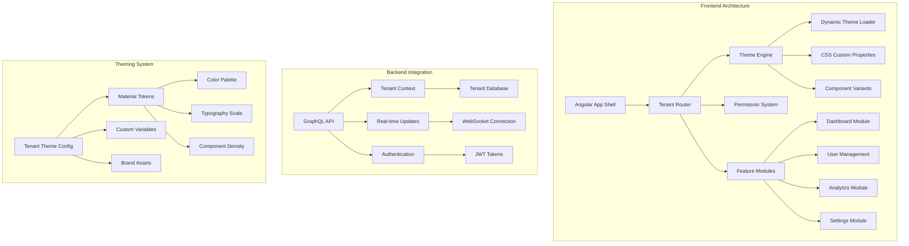

# Advanced SaaS Platform - Multi-Tenant Architecture

## 🎯 **Project Overview**

Build a comprehensive SaaS platform with advanced multi-tenant theming, real-time collaboration features, and enterprise-grade architecture patterns. This project demonstrates advanced Angular Material 3 implementation with complex business logic.

## 🏗️ **Architecture Diagram**



## 🎨 **Features & Components**

### **Core Platform Features**
- **Multi-tenant Architecture** - Complete isolation between tenants
- **Dynamic Theming** - Per-tenant brand customization
- **Real-time Collaboration** - Live updates and notifications
- **Advanced Analytics** - Interactive dashboards and reports
- **Permission System** - Role-based access control
- **API Integration** - GraphQL with real-time subscriptions

### **Advanced Material Components**
- Custom Material Dashboard with advanced layouts
- Dynamic data tables with virtual scrolling
- Interactive charts with Material theming
- Advanced form builders with validation
- Real-time notification system
- Responsive navigation with tenant branding

## 🛠️ **Technical Implementation**

### **Project Structure**
```
src/
├── app/
│   ├── core/
│   │   ├── tenant/
│   │   │   ├── tenant.service.ts
│   │   │   ├── tenant-theme.service.ts
│   │   │   └── tenant-resolver.service.ts
│   │   ├── auth/
│   │   │   ├── auth.service.ts
│   │   │   ├── permission.service.ts
│   │   │   └── jwt.interceptor.ts
│   │   └── graphql/
│   │       ├── apollo.config.ts
│   │       ├── operations/
│   │       └── subscriptions/
│   ├── shared/
│   │   ├── components/
│   │   │   ├── tenant-header/
│   │   │   ├── dashboard-shell/
│   │   │   ├── data-visualization/
│   │   │   └── notification-center/
│   │   └── theming/
│   │       ├── theme-manager.service.ts
│   │       ├── material-theme.builder.ts
│   │       └── dynamic-styles.service.ts
│   ├── features/
│   │   ├── dashboard/
│   │   ├── analytics/
│   │   ├── user-management/
│   │   ├── settings/
│   │   └── collaboration/
│   └── theming/
│       ├── tenant-themes/
│       ├── material-overrides/
│       └── component-themes/
```

### **Advanced Theming Architecture**

#### **1. Tenant Theme Service**
```typescript
@Injectable({ providedIn: 'root' })
export class TenantThemeService {
  private currentTheme$ = new BehaviorSubject<TenantTheme | null>(null);
  
  constructor(
    private tenantService: TenantService,
    private dynamicStyles: DynamicStylesService
  ) {}
  
  async loadTenantTheme(tenantId: string): Promise<void> {
    const theme = await this.fetchTenantTheme(tenantId);
    
    // Generate Material Design tokens
    const materialTokens = this.generateMaterialTokens(theme);
    
    // Apply dynamic CSS custom properties
    this.dynamicStyles.applyTheme(materialTokens);
    
    // Update component variants
    this.updateComponentVariants(theme);
    
    this.currentTheme$.next(theme);
  }
  
  private generateMaterialTokens(theme: TenantTheme): MaterialTokens {
    return {
      'md-sys-color-primary': theme.colors.primary,
      'md-sys-color-secondary': theme.colors.secondary,
      'md-sys-color-surface': theme.colors.surface,
      'md-sys-typescale-headline-large-font': theme.typography.headline,
      'md-sys-shape-corner-large': `${theme.shapes.borderRadius}px`,
      // ... comprehensive token mapping
    };
  }
}
```

#### **2. Dynamic Material Theme Builder**
```typescript
@Injectable({ providedIn: 'root' })
export class MaterialThemeBuilder {
  buildTheme(tenantConfig: TenantThemeConfig): Theme {
    const palette = this.createPalette(tenantConfig.colors);
    const typography = this.createTypography(tenantConfig.typography);
    const density = this.createDensity(tenantConfig.density);
    
    return {
      primary: palette.primary,
      accent: palette.accent,
      warn: palette.warn,
      typography,
      density,
      // Custom component overrides
      components: {
        MatButton: this.createButtonTheme(tenantConfig),
        MatCard: this.createCardTheme(tenantConfig),
        MatToolbar: this.createToolbarTheme(tenantConfig),
        // ... all Material components
      }
    };
  }
  
  private createButtonTheme(config: TenantThemeConfig): ComponentTheme {
    return {
      styleOverrides: {
        root: {
          borderRadius: config.shapes.borderRadius,
          fontWeight: config.typography.button.fontWeight,
          textTransform: config.typography.button.textTransform,
          boxShadow: config.shadows.button,
          // Advanced button variants
          '&.mat-primary': {
            background: `linear-gradient(45deg, ${config.colors.primary}, ${config.colors.primaryVariant})`,
            '&:hover': {
              transform: 'translateY(-2px)',
              boxShadow: config.shadows.buttonHover,
            }
          }
        }
      }
    };
  }
}
```

#### **3. Real-time Theme Updates**
```typescript
@Component({
  selector: 'app-theme-customizer',
  template: `
    <mat-sidenav-container class="theme-customizer">
      <mat-sidenav mode="side" opened class="customizer-panel">
        <mat-toolbar color="primary">
          <mat-icon>palette</mat-icon>
          <span>Theme Customizer</span>
        </mat-toolbar>
        
        <div class="customizer-content">
          <!-- Real-time color picker -->
          <mat-expansion-panel>
            <mat-expansion-panel-header>
              <mat-panel-title>Colors</mat-panel-title>
            </mat-expansion-panel-header>
            
            <div class="color-section">
              <app-color-picker
                label="Primary Color"
                [value]="themeConfig.colors.primary"
                (colorChange)="updatePrimary($event)">
              </app-color-picker>
              
              <app-color-picker
                label="Secondary Color"
                [value]="themeConfig.colors.secondary"
                (colorChange)="updateSecondary($event)">
              </app-color-picker>
            </div>
          </mat-expansion-panel>
          
          <!-- Typography controls -->
          <mat-expansion-panel>
            <mat-expansion-panel-header>
              <mat-panel-title>Typography</mat-panel-title>
            </mat-expansion-panel-header>
            
            <app-typography-controls
              [config]="themeConfig.typography"
              (configChange)="updateTypography($event)">
            </app-typography-controls>
          </mat-expansion-panel>
          
          <!-- Shape and density -->
          <mat-expansion-panel>
            <mat-expansion-panel-header>
              <mat-panel-title>Layout</mat-panel-title>
            </mat-expansion-panel-header>
            
            <app-layout-controls
              [config]="themeConfig.layout"
              (configChange)="updateLayout($event)">
            </app-layout-controls>
          </mat-expansion-panel>
        </div>
      </mat-sidenav>
      
      <mat-sidenav-content class="preview-area">
        <app-theme-preview [config]="themeConfig"></app-theme-preview>
      </mat-sidenav-content>
    </mat-sidenav-container>
  `
})
export class ThemeCustomizerComponent {
  themeConfig: TenantThemeConfig = this.getDefaultConfig();
  
  constructor(
    private themeService: TenantThemeService,
    private previewService: ThemePreviewService
  ) {}
  
  updatePrimary(color: string): void {
    this.themeConfig = {
      ...this.themeConfig,
      colors: {
        ...this.themeConfig.colors,
        primary: color
      }
    };
    
    this.applyThemeUpdate();
  }
  
  private applyThemeUpdate(): void {
    // Real-time preview
    this.previewService.updatePreview(this.themeConfig);
    
    // Debounced save
    this.debouncedSave();
  }
  
  private debouncedSave = debounceTime(500)(
    () => this.themeService.saveTenantTheme(this.themeConfig)
  );
}
```

## 🚀 **Advanced Features**

### **1. Multi-Tenant Dashboard**
- Dynamic widget system with tenant-specific configurations
- Real-time data visualization with custom Material charts
- Responsive layout with advanced grid system
- Drag-and-drop dashboard customization

### **2. Collaboration Features**
- Real-time cursor tracking with user avatars
- Live document editing with conflict resolution
- Notification system with Material toast notifications
- Activity feeds with infinite scrolling

### **3. Analytics Platform**
- Interactive charts with Material Design principles
- Advanced data filtering with Material form controls
- Export functionality with custom Material dialogs
- Real-time metric updates with smooth animations

## 🧪 **Testing Strategy**

### **Unit Testing**
```typescript
describe('TenantThemeService', () => {
  let service: TenantThemeService;
  let mockTenantService: jasmine.SpyObj<TenantService>;
  
  beforeEach(() => {
    const spy = jasmine.createSpyObj('TenantService', ['getCurrentTenant']);
    
    TestBed.configureTestingModule({
      providers: [
        TenantThemeService,
        { provide: TenantService, useValue: spy }
      ]
    });
    
    service = TestBed.inject(TenantThemeService);
    mockTenantService = TestBed.inject(TenantService) as jasmine.SpyObj<TenantService>;
  });
  
  it('should load tenant theme correctly', async () => {
    const mockTheme: TenantTheme = {
      id: 'tenant-1',
      colors: { primary: '#1976d2', secondary: '#dc004e' },
      typography: { fontFamily: 'Roboto' },
      shapes: { borderRadius: 8 }
    };
    
    spyOn(service as any, 'fetchTenantTheme').and.returnValue(Promise.resolve(mockTheme));
    
    await service.loadTenantTheme('tenant-1');
    
    expect(service.getCurrentTheme()).toEqual(mockTheme);
  });
});
```

### **Integration Testing**
```typescript
describe('Theme Integration', () => {
  let component: DashboardComponent;
  let fixture: ComponentFixture<DashboardComponent>;
  let themeService: TenantThemeService;
  
  beforeEach(() => {
    TestBed.configureTestingModule({
      declarations: [DashboardComponent],
      imports: [MaterialModule, NoopAnimationsModule],
      providers: [TenantThemeService]
    });
    
    fixture = TestBed.createComponent(DashboardComponent);
    component = fixture.componentInstance;
    themeService = TestBed.inject(TenantThemeService);
  });
  
  it('should apply tenant theme to dashboard', async () => {
    const mockTheme = createMockTheme();
    await themeService.loadTenantTheme('tenant-1');
    
    fixture.detectChanges();
    
    const toolbar = fixture.debugElement.query(By.css('mat-toolbar'));
    const computedStyle = getComputedStyle(toolbar.nativeElement);
    
    expect(computedStyle.backgroundColor).toContain(mockTheme.colors.primary);
  });
});
```

## 📊 **Performance Optimization**

### **1. Theme Loading Strategy**
- Lazy loading of tenant-specific theme bundles
- CSS custom property caching
- Critical CSS inlining for first paint

### **2. Real-time Updates**
- WebSocket connection pooling
- Optimistic UI updates
- Efficient change detection strategies

### **3. Bundle Optimization**
- Dynamic imports for tenant-specific features
- Tree shaking of unused Material components
- Progressive web app optimization

## 🔒 **Security Implementation**

### **1. Tenant Isolation**
- Strict tenant data separation
- Row-level security policies
- Encrypted tenant configurations

### **2. Theme Security**
- CSS injection prevention
- Sanitized custom CSS input
- Content Security Policy compliance

## 📈 **Monitoring & Analytics**

### **1. Performance Metrics**
- Theme loading time tracking
- Real-time update latency
- Bundle size monitoring

### **2. User Experience**
- Theme customization analytics
- Feature usage tracking
- Error reporting and monitoring

## 🎯 **Learning Outcomes**

After completing this project, you will have mastered:

- ✅ **Multi-tenant Architecture** - Complete tenant isolation and customization
- ✅ **Advanced Theming Patterns** - Dynamic theme generation and real-time updates
- ✅ **Real-time Features** - WebSocket integration with Angular Material
- ✅ **Performance Optimization** - Advanced caching and loading strategies
- ✅ **Security Best Practices** - Tenant isolation and secure theming
- ✅ **Enterprise Patterns** - Scalable architecture and monitoring

## 🚀 **Next Steps**

1. **Implementation Phase** - Follow the detailed project guide
2. **Testing Phase** - Implement comprehensive test suite
3. **Optimization Phase** - Apply performance improvements
4. **Deployment Phase** - Set up CI/CD pipeline
5. **Monitoring Phase** - Implement analytics and monitoring

---

*This project represents the pinnacle of Angular Material 3 implementation, combining advanced theming, real-time features, and enterprise architecture patterns.*
