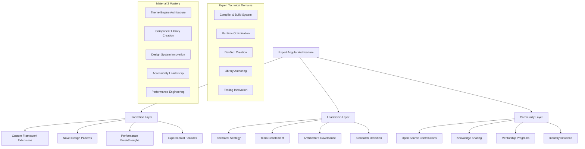
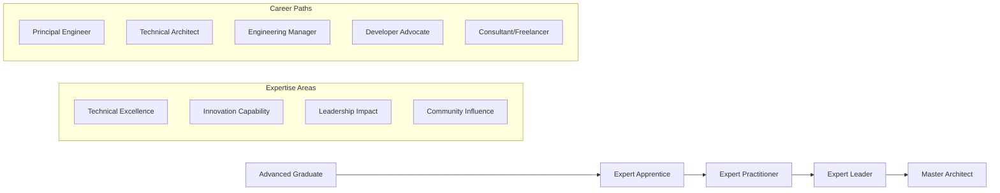

# Expert Level - Angular Material 3 Mastery

## 🚀 **Expert Level Overview**

Welcome to the **Expert Level** of Angular Material 3 Mastery! This is the pinnacle of Angular development expertise, designed for architects, tech leads, and senior engineers who are ready to shape the future of Angular development through innovation, leadership, and technical excellence.

## 🎯 **Expert Level Philosophy**

### **Innovation-Driven Development**
At the expert level, you're not just consuming existing patterns – you're **creating new paradigms** and **pushing the boundaries** of what's possible with Angular and Material 3. Every project involves research, experimentation, and breakthrough thinking.

### **Architectural Leadership**
Expert-level developers are **system architects** who design solutions that scale across organizations, influence industry standards, and set the technical direction for entire development teams and communities.

### **Community Impact**
Your work at this level contributes to the **broader Angular ecosystem** through open-source contributions, technical leadership, conference presentations, and mentoring the next generation of developers.

## 🏗️ **Expert Architecture Paradigms**

## 📋 **Expert Projects Portfolio**

### **🏗️ Project 1: Custom Angular Material Library** (3-4 weeks)
**Complexity**: ⭐⭐⭐⭐⭐ **Extreme**

Create a production-ready Angular Material extension library with:
- **Custom CDK Primitives**: Novel interaction patterns and accessibility features
- **Advanced Component Architecture**: Headless components with multiple rendering strategies
- **Theme Engine Extensions**: Advanced theming capabilities beyond Material 3
- **Performance Innovations**: Zero-cost abstractions and compile-time optimizations
- **Community Distribution**: NPM package with comprehensive documentation

**Key Technologies**: Angular CDK, Angular CLI Library Support, TypeScript Advanced Types, Rollup, ng-packagr

### **🎨 Project 2: Visual Theme Builder Engine** (4-5 weeks)
**Complexity**: ⭐⭐⭐⭐⭐ **Extreme**

Build a visual theme creation engine that revolutionizes Material 3 theming:
- **Visual Color Science**: Perceptual color space manipulation and accessibility optimization
- **AI-Powered Design**: Machine learning for optimal theme generation
- **Real-Time Compilation**: Live SCSS/CSS generation with hot module replacement
- **Cross-Platform Export**: Themes for Web, iOS, Android, Flutter, and design tools
- **Enterprise Integration**: API-first architecture for design system management

**Key Technologies**: Color Science Libraries, TensorFlow.js, Webpack Hot Module Replacement, Canvas API, WebGL

### **🔧 Project 3: Angular Development Toolkit** (4-5 weeks)
**Complexity**: ⭐⭐⭐⭐⭐ **Extreme**

Develop a comprehensive development toolkit that enhances Angular productivity:
- **Visual Component Builder**: Drag-and-drop Angular component creation
- **Code Generation Engine**: Template-driven code generation with AI assistance
- **Performance Profiler**: Advanced Angular application performance analysis
- **Architecture Analyzer**: Code smell detection and architectural guidance
- **Testing Automation**: Intelligent test generation and maintenance

**Key Technologies**: Angular Language Service, TypeScript Compiler API, AST Manipulation, Monaco Editor, Chrome DevTools Protocol

### **🌐 Project 4: Micro-Frontend Framework** (5-6 weeks)
**Complexity**: ⭐⭐⭐⭐⭐ **Extreme**

Create a next-generation micro-frontend framework built on Angular:
- **Dynamic Module Loading**: Runtime module federation with dependency resolution
- **Shared State Management**: Cross-application state synchronization
- **Theme Consistency**: Automatic theme propagation across micro-frontends
- **Performance Optimization**: Intelligent bundle splitting and caching strategies
- **Development Experience**: CLI tools and development server integration

**Key Technologies**: Module Federation, Single-SPA, SystemJS, Webpack 5, Custom CLI, Service Workers

## 🎓 **Expert Learning Objectives**

### **🏗️ Framework Architecture Mastery**
- **Compiler Understanding**: Deep knowledge of Angular compiler and build system
- **Runtime Optimization**: Advanced understanding of Angular runtime and change detection
- **Custom Schematics**: Building Angular CLI schematics and workspace extensions
- **Library Architecture**: Creating reusable, distributable Angular libraries
- **Performance Engineering**: Micro-optimizations and performance profiling

### **🎨 Advanced Material Design**
- **Design System Architecture**: Building scalable, maintainable design systems
- **Theme Engine Development**: Creating advanced theming solutions
- **Accessibility Innovation**: Pushing accessibility boundaries and standards
- **Cross-Platform Design**: Unified design across web, mobile, and desktop
- **Visual Design Tools**: Building tools that enhance designer-developer collaboration

### **👥 Technical Leadership**
- **Architecture Decision Making**: Making high-impact technical decisions
- **Team Enablement**: Building tools and processes that enhance team productivity
- **Standards Development**: Creating and maintaining coding standards and best practices
- **Mentorship Excellence**: Training and developing other developers
- **Community Leadership**: Contributing to open source and industry standards

### **🚀 Innovation & Research**
- **Experimental Features**: Exploring and implementing cutting-edge web technologies
- **Performance Research**: Investigating and implementing performance improvements
- **User Experience Innovation**: Creating novel interaction patterns and experiences
- **Tooling Development**: Building development tools that improve productivity
- **Academic Contribution**: Publishing research and contributing to academic knowledge

## ⏱️ **Time Investment & Mastery Path**

### **Estimated Duration**: 16-20 weeks total
- **Project 1**: 3-4 weeks (Custom Library Creation)
- **Project 2**: 4-5 weeks (Visual Theme Builder)
- **Project 3**: 4-5 weeks (Development Toolkit)
- **Project 4**: 5-6 weeks (Micro-Frontend Framework)

### **Mastery Progression**

### **Prerequisites Assessment**
- **Required**: Completion of all advanced-level projects with excellence scores
- **Architecture Knowledge**: Deep understanding of software architecture patterns
- **Performance Expertise**: Advanced knowledge of web performance optimization
- **Community Involvement**: Active participation in Angular community
- **Leadership Experience**: Experience leading technical teams or initiatives
- **Innovation Mindset**: Demonstrated ability to create novel solutions

## 📊 **Expert Skills Matrix**

### **Technical Excellence Criteria**
| Skill Category | Advanced Level | Expert Level |
|---|---|---|
| **Architecture** | Design scalable systems | Innovate architectural patterns |
| **Performance** | Optimize applications | Research performance breakthroughs |
| **Testing** | Comprehensive test suites | Invent testing methodologies |
| **DevOps** | CI/CD mastery | Create deployment innovations |
| **Security** | Implement best practices | Define security standards |
| **Accessibility** | WCAG compliance | Accessibility innovation |

### **Leadership Impact Metrics**
| Leadership Area | Measurable Impact |
|---|---|
| **Team Productivity** | 50%+ improvement in team velocity |
| **Code Quality** | Significant reduction in production issues |
| **Architecture Quality** | Measurable improvement in system maintainability |
| **Developer Experience** | Tools and processes that enhance productivity |
| **Knowledge Transfer** | Successful mentorship and skill development |
| **Community Impact** | Open source contributions and thought leadership |

## 🎯 **Expert Success Metrics**

### **Technical Innovation Metrics**
- **Novel Solutions**: Creation of genuinely innovative technical solutions
- **Performance Breakthroughs**: Measurable performance improvements in Angular applications
- **Tool Creation**: Development of tools that enhance developer productivity
- **Standard Setting**: Contribution to industry standards and best practices
- **Research Impact**: Publication of research or significant technical insights

### **Leadership Impact Metrics**
- **Team Development**: Success in mentoring and developing other developers
- **Architectural Influence**: Successful implementation of architectural decisions
- **Process Innovation**: Creation of processes that improve team effectiveness
- **Community Leadership**: Recognition as a thought leader in the Angular community
- **Business Impact**: Technical decisions that drive significant business value

## 🌟 **Expert Recognition Path**

### **Technical Recognition**
- **Angular Team Recognition**: Contribution to Angular framework or ecosystem
- **Conference Speaking**: Presenting at major Angular conferences
- **Open Source Impact**: Significant contributions to widely-used open source projects
- **Technical Writing**: Publication of influential technical articles or books
- **Industry Standards**: Participation in web standards development

### **Professional Growth**
- **Principal/Staff Engineer**: Technical leadership roles in major organizations
- **Technical Architect**: System architecture and technical strategy roles
- **Developer Relations**: Developer advocacy and community engagement roles
- **Consulting Excellence**: Independent consulting with major clients
- **Startup Leadership**: Technical founding or leadership roles in startups

## 🔬 **Research & Innovation Areas**

### **Emerging Technologies**
- **WebAssembly Integration**: Advanced WASM usage in Angular applications
- **Machine Learning**: ML integration for UI/UX enhancement
- **Web Standards**: Participation in developing new web standards
- **Performance Optimization**: Novel approaches to application performance
- **Accessibility Innovation**: Breakthrough accessibility techniques

### **Framework Evolution**
- **Angular Signals**: Advanced usage and extension of Angular Signals
- **Standalone Components**: Novel patterns with standalone architecture
- **SSR Innovation**: Advanced server-side rendering techniques
- **Build Optimization**: Compiler and build system improvements
- **DevTool Development**: Tools that enhance Angular development experience

## 📚 **Expert Resources & Community**

### **Advanced Learning Resources**
- [Angular Framework Source Code](https://github.com/angular/angular)
- [Angular Compiler and CLI Internals](https://github.com/angular/angular-cli)
- [Web Platform Standards](https://www.w3.org/standards/)
- [Performance Research Papers](https://research.google/pubs/?area=systems)
- [Accessibility Research](https://www.w3.org/WAI/research/)

### **Expert Community Engagement**
- **Angular Team Collaboration**: Direct engagement with Angular core team
- **RFC Participation**: Contributing to Angular Request for Comments process
- **Conference Organization**: Organizing or co-organizing major Angular events
- **Mentorship Programs**: Leading or participating in developer mentorship
- **Open Source Maintenance**: Maintaining widely-used open source projects

## 🚀 **Ready for Expert Challenges?**

### **Expert Readiness Assessment**
Before beginning expert-level projects, ensure you can demonstrate:

- [ ] **Innovation Capability**: History of creating novel technical solutions
- [ ] **Architecture Excellence**: Successful design and implementation of complex systems
- [ ] **Performance Mastery**: Deep understanding of performance optimization
- [ ] **Leadership Experience**: Success in leading technical teams or initiatives
- [ ] **Community Impact**: Contributions to the broader Angular community
- [ ] **Continuous Learning**: Commitment to staying at the forefront of technology

### **Expert Development Path**
1. **Choose Your Specialization**: Focus on your area of greatest interest and impact
2. **Build Your Research Network**: Connect with other experts and researchers
3. **Define Your Innovation Goals**: Identify problems you want to solve
4. **Create Your Impact Plan**: Define how you'll measure and communicate success
5. **Start Your Legacy Project**: Begin building something that will outlast your involvement

---

**Welcome to Expert Level!** 🚀

*At this level, you're not just mastering existing technologies – you're helping to define the future of Angular development. Your innovations, leadership, and contributions will shape how thousands of other developers work and what's possible with Angular and Material 3.*

**The future of Angular is in your hands. Let's build it together!** ⚡

---

*Expert-level developers are the architects of tomorrow's web. Every line of code you write, every tool you create, and every developer you mentor contributes to the advancement of our entire industry.*
