# Angular Development Toolkit - Advanced Material 3 Extension Suite

## 🎯 **Project Overview**

Build a comprehensive Angular development toolkit that provides advanced Material Design 3 development tools, including a VS Code extension, CLI tools, automated testing utilities, and development accelerators. This expert-level project showcases the pinnacle of Angular Material tooling and developer experience.

## 🛠️ **Architecture Diagram**



```mermaid
graph TB
    subgraph "VS Code Extension"
        A[Theme Generator] --> B[Component Builder]
        A --> C[Token Inspector]
        A --> D[Live Preview]
        
        B --> E[Material Components]
        B --> F[Custom Components]
        B --> G[Layout Templates]
        
        C --> H[Token Browser]
        C --> I[Usage Finder]
        C --> J[Accessibility Checker]
    end
    
    subgraph "CLI Tools"
        K[Angular CLI Integration] --> L[Theme Commands]
        K --> M[Component Generation]
        K --> N[Migration Tools]
        
        L --> O[ng generate theme]
        L --> P[ng build theme]
        L --> Q[ng test theme]
        
        M --> R[ng generate mat-component]
        M --> S[ng generate design-system]
    end
    
    subgraph "Development Server"
        T[Local Development Server] --> U[Hot Reload]
        T --> V[Theme Switching]
        T --> W[Component Playground]
        
        U --> X[Real-time Updates]
        V --> Y[Multi-theme Preview]
        W --> Z[Interactive Testing]
    end
    
    subgraph "Testing & QA Tools"
        AA[Visual Testing] --> BB[Screenshot Comparison]
        AA --> CC[Accessibility Testing]
        AA --> DD[Performance Testing]
        
        BB --> EE[Cross-browser Testing]
        CC --> FF[WCAG Compliance]
        DD --> GG[Bundle Analysis]
    end
    
    subgraph "Documentation Generator"
        HH[Auto Documentation] --> II[Component Docs]
        HH --> JJ[Theme Docs]
        HH --> KK[API Reference]
        
        II --> LL[Storybook Integration]
        JJ --> MM[Design Token Docs]
        KK --> NN[TypeScript Definitions]
    end
```

## 🚀 **Features & Components**

### **VS Code Extension Features**
- **Theme Generator** - Visual theme creation with live preview
- **Component Builder** - Drag-and-drop Material component creation
- **Token Inspector** - Real-time Material Design token browser
- **Code Completion** - Intelligent Material component snippets
- **Accessibility Checker** - Automated accessibility validation
- **Performance Monitor** - Bundle size and performance analysis

### **CLI Tool Suite**
- **Theme Management** - Complete theme lifecycle management
- **Component Generation** - Advanced Material component scaffolding
- **Migration Tools** - Automated upgrades and migrations
- **Testing Utilities** - Comprehensive testing automation
- **Build Optimization** - Advanced build and bundle optimization

## 📁 **Project Structure**

```
angular-material-toolkit/
├── packages/
│   ├── vscode-extension/
│   │   ├── src/
│   │   │   ├── commands/
│   │   │   │   ├── generate-theme.ts
│   │   │   │   ├── create-component.ts
│   │   │   │   └── inspect-tokens.ts
│   │   │   ├── providers/
│   │   │   │   ├── theme-provider.ts
│   │   │   │   ├── component-provider.ts
│   │   │   │   └── token-provider.ts
│   │   │   ├── webview/
│   │   │   │   ├── theme-editor/
│   │   │   │   ├── component-builder/
│   │   │   │   └── token-inspector/
│   │   │   └── utilities/
│   │   │       ├── ast-parser.ts
│   │   │       ├── file-generator.ts
│   │   │       └── workspace-scanner.ts
│   │   ├── package.json
│   │   └── README.md
│   │
│   ├── cli-tools/
│   │   ├── src/
│   │   │   ├── commands/
│   │   │   │   ├── generate/
│   │   │   │   ├── build/
│   │   │   │   ├── test/
│   │   │   │   └── migrate/
│   │   │   ├── schematics/
│   │   │   │   ├── theme/
│   │   │   │   ├── component/
│   │   │   │   └── design-system/
│   │   │   ├── builders/
│   │   │   │   ├── theme-builder/
│   │   │   │   └── optimization-builder/
│   │   │   └── utilities/
│   │   ├── package.json
│   │   └── collection.json
│   │
│   ├── dev-server/
│   │   ├── src/
│   │   │   ├── server/
│   │   │   │   ├── app.ts
│   │   │   │   ├── theme-middleware.ts
│   │   │   │   └── hot-reload.ts
│   │   │   ├── client/
│   │   │   │   ├── theme-switcher/
│   │   │   │   ├── component-playground/
│   │   │   │   └── live-preview/
│   │   │   └── shared/
│   │   │       ├── types/
│   │   │       └── utilities/
│   │   └── package.json
│   │
│   ├── testing-tools/
│   │   ├── src/
│   │   │   ├── visual-testing/
│   │   │   │   ├── screenshot-service.ts
│   │   │   │   └── comparison-service.ts
│   │   │   ├── accessibility-testing/
│   │   │   │   ├── a11y-checker.ts
│   │   │   │   └── wcag-validator.ts
│   │   │   ├── performance-testing/
│   │   │   │   ├── bundle-analyzer.ts
│   │   │   │   └── performance-monitor.ts
│   │   │   └── utilities/
│   │   └── package.json
│   │
│   └── documentation/
│       ├── src/
│       │   ├── generators/
│       │   │   ├── component-docs.ts
│       │   │   ├── theme-docs.ts
│       │   │   └── api-docs.ts
│       │   ├── templates/
│       │   └── utilities/
│       └── package.json
│
├── examples/
│   ├── basic-usage/
│   ├── advanced-theming/
│   └── enterprise-setup/
│
├── docs/
│   ├── getting-started.md
│   ├── api-reference.md
│   └── examples/
│
└── tools/
    ├── build-scripts/
    ├── test-scripts/
    └── release-scripts/
```

## 🎨 **VS Code Extension Implementation**

### **1. Theme Generator Command**
```typescript
// packages/vscode-extension/src/commands/generate-theme.ts
import * as vscode from 'vscode';
import { ThemeGeneratorPanel } from '../webview/theme-generator-panel';
import { WorkspaceService } from '../services/workspace.service';
import { ThemeService } from '../services/theme.service';

export class GenerateThemeCommand {
  public static readonly commandId = 'angular-material-toolkit.generateTheme';
  
  constructor(
    private context: vscode.ExtensionContext,
    private workspaceService: WorkspaceService,
    private themeService: ThemeService
  ) {}
  
  public register(): vscode.Disposable {
    return vscode.commands.registerCommand(
      GenerateThemeCommand.commandId,
      this.execute,
      this
    );
  }
  
  private async execute(): Promise<void> {
    try {
      // Validate Angular workspace
      const isAngularWorkspace = await this.workspaceService.isAngularProject();
      if (!isAngularWorkspace) {
        vscode.window.showErrorMessage(
          'Angular Material Toolkit requires an Angular workspace'
        );
        return;
      }
      
      // Check for Material dependency
      const hasMaterial = await this.workspaceService.hasMaterialDependency();
      if (!hasMaterial) {
        const installMaterial = await vscode.window.showInformationMessage(
          'Angular Material is not installed. Would you like to install it?',
          'Yes',
          'No'
        );
        
        if (installMaterial === 'Yes') {
          await this.installAngularMaterial();
        } else {
          return;
        }
      }
      
      // Open theme generator panel
      const panel = ThemeGeneratorPanel.createOrShow(this.context);
      
      // Set up panel event handlers
      panel.onDidReceiveMessage(async (message) => {
        switch (message.command) {
          case 'generateTheme':
            await this.handleGenerateTheme(message.data);
            break;
          case 'previewTheme':
            await this.handlePreviewTheme(message.data);
            break;
          case 'exportTheme':
            await this.handleExportTheme(message.data);
            break;
        }
      });
      
    } catch (error) {
      vscode.window.showErrorMessage(
        `Failed to generate theme: ${error.message}`
      );
    }
  }
  
  private async installAngularMaterial(): Promise<void> {
    const terminal = vscode.window.createTerminal('Angular Material Installation');
    terminal.sendText('ng add @angular/material');
    terminal.show();
    
    // Wait for installation to complete
    await new Promise<void>((resolve) => {
      const disposable = vscode.window.onDidCloseTerminal((closedTerminal) => {
        if (closedTerminal === terminal) {
          disposable.dispose();
          resolve();
        }
      });
    });
  }
  
  private async handleGenerateTheme(themeData: ThemeConfiguration): Promise<void> {
    try {
      // Generate theme files
      const themeFiles = await this.themeService.generateThemeFiles(themeData);
      
      // Write files to workspace
      for (const [filePath, content] of Object.entries(themeFiles)) {
        await this.workspaceService.writeFile(filePath, content);
      }
      
      // Update angular.json
      await this.workspaceService.updateAngularJson(themeData);
      
      // Show success message
      vscode.window.showInformationMessage(
        `Theme "${themeData.name}" generated successfully!`,
        'Open Theme File'
      ).then((action) => {
        if (action === 'Open Theme File') {
          vscode.workspace.openTextDocument(
            vscode.Uri.file(themeFiles['src/theme.scss'])
          ).then(doc => {
            vscode.window.showTextDocument(doc);
          });
        }
      });
      
    } catch (error) {
      vscode.window.showErrorMessage(
        `Failed to generate theme: ${error.message}`
      );
    }
  }
  
  private async handlePreviewTheme(themeData: ThemeConfiguration): Promise<void> {
    // Start development server with theme preview
    const devServer = await this.workspaceService.startDevServer(themeData);
    
    // Open preview in browser
    vscode.env.openExternal(vscode.Uri.parse(devServer.url));
  }
  
  private async handleExportTheme(themeData: ThemeConfiguration): Promise<void> {
    const saveLocation = await vscode.window.showSaveDialog({
      defaultUri: vscode.Uri.file(`${themeData.name}-theme.zip`),
      filters: {
        'Zip Files': ['zip']
      }
    });
    
    if (saveLocation) {
      await this.themeService.exportTheme(themeData, saveLocation.fsPath);
      vscode.window.showInformationMessage(
        `Theme exported to ${saveLocation.fsPath}`
      );
    }
  }
}
```

### **2. Theme Generator WebView Panel**
```typescript
// packages/vscode-extension/src/webview/theme-generator-panel.ts
import * as vscode from 'vscode';
import * as path from 'path';

export class ThemeGeneratorPanel {
  public static currentPanel: ThemeGeneratorPanel | undefined;
  public static readonly viewType = 'themeGenerator';
  
  private readonly _panel: vscode.WebviewPanel;
  private readonly _extensionUri: vscode.Uri;
  private _disposables: vscode.Disposable[] = [];
  
  public static createOrShow(context: vscode.ExtensionContext): ThemeGeneratorPanel {
    const column = vscode.window.activeTextEditor
      ? vscode.window.activeTextEditor.viewColumn
      : undefined;
    
    if (ThemeGeneratorPanel.currentPanel) {
      ThemeGeneratorPanel.currentPanel._panel.reveal(column);
      return ThemeGeneratorPanel.currentPanel;
    }
    
    const panel = vscode.window.createWebviewPanel(
      ThemeGeneratorPanel.viewType,
      'Material Theme Generator',
      column || vscode.ViewColumn.One,
      {
        enableScripts: true,
        localResourceRoots: [
          vscode.Uri.joinPath(context.extensionUri, 'media'),
          vscode.Uri.joinPath(context.extensionUri, 'out')
        ],
        retainContextWhenHidden: true
      }
    );
    
    ThemeGeneratorPanel.currentPanel = new ThemeGeneratorPanel(
      panel,
      context.extensionUri
    );
    
    return ThemeGeneratorPanel.currentPanel;
  }
  
  private constructor(panel: vscode.WebviewPanel, extensionUri: vscode.Uri) {
    this._panel = panel;
    this._extensionUri = extensionUri;
    
    this._update();
    
    this._panel.onDidDispose(() => this.dispose(), null, this._disposables);
    
    this._panel.webview.onDidReceiveMessage(
      (message) => {
        this._onDidReceiveMessageEmitter.fire(message);
      },
      null,
      this._disposables
    );
  }
  
  private readonly _onDidReceiveMessageEmitter = new vscode.EventEmitter<any>();
  public readonly onDidReceiveMessage = this._onDidReceiveMessageEmitter.event;
  
  public dispose(): void {
    ThemeGeneratorPanel.currentPanel = undefined;
    
    this._panel.dispose();
    
    while (this._disposables.length) {
      const disposable = this._disposables.pop();
      if (disposable) {
        disposable.dispose();
      }
    }
  }
  
  private _update(): void {
    const webview = this._panel.webview;
    this._panel.webview.html = this._getHtmlForWebview(webview);
  }
  
  private _getHtmlForWebview(webview: vscode.Webview): string {
    // Get resources
    const scriptUri = webview.asWebviewUri(
      vscode.Uri.joinPath(this._extensionUri, 'media', 'main.js')
    );
    const styleUri = webview.asWebviewUri(
      vscode.Uri.joinPath(this._extensionUri, 'media', 'main.css')
    );
    const materialIconsUri = webview.asWebviewUri(
      vscode.Uri.joinPath(this._extensionUri, 'media', 'material-icons.css')
    );
    
    // Generate nonce for security
    const nonce = this._getNonce();
    
    return `
<!DOCTYPE html>
<html lang="en">
<head>
  <meta charset="UTF-8">
  <meta name="viewport" content="width=device-width, initial-scale=1.0">
  <meta http-equiv="Content-Security-Policy" content="default-src 'none'; 
    style-src ${webview.cspSource} 'unsafe-inline'; 
    script-src 'nonce-${nonce}'; 
    font-src ${webview.cspSource};">
  
  <link href="${materialIconsUri}" rel="stylesheet">
  <link href="${styleUri}" rel="stylesheet">
  
  <title>Material Theme Generator</title>
</head>
<body>
  <div id="theme-generator-root">
    <!-- Theme Generator App -->
    <div class="theme-generator-container">
      <!-- Header -->
      <header class="generator-header">
        <h1>
          <span class="material-icons">palette</span>
          Material Theme Generator
        </h1>
        <p>Create custom Angular Material 3 themes with visual tools</p>
      </header>
      
      <!-- Main Content -->
      <main class="generator-content">
        <!-- Theme Configuration Panel -->
        <section class="config-panel">
          <h2>Theme Configuration</h2>
          
          <!-- Basic Settings -->
          <div class="config-section">
            <h3>Basic Settings</h3>
            <div class="form-group">
              <label for="theme-name">Theme Name</label>
              <input type="text" id="theme-name" placeholder="My Custom Theme">
            </div>
            <div class="form-group">
              <label for="theme-description">Description</label>
              <textarea id="theme-description" placeholder="Theme description..."></textarea>
            </div>
          </div>
          
          <!-- Color Configuration -->
          <div class="config-section">
            <h3>Colors</h3>
            <div class="color-grid">
              <div class="color-input-group">
                <label for="primary-color">Primary</label>
                <input type="color" id="primary-color" value="#1976d2">
                <input type="text" id="primary-color-text" value="#1976d2">
              </div>
              <div class="color-input-group">
                <label for="secondary-color">Secondary</label>
                <input type="color" id="secondary-color" value="#dc004e">
                <input type="text" id="secondary-color-text" value="#dc004e">
              </div>
              <div class="color-input-group">
                <label for="tertiary-color">Tertiary</label>
                <input type="color" id="tertiary-color" value="#9c27b0">
                <input type="text" id="tertiary-color-text" value="#9c27b0">
              </div>
              <div class="color-input-group">
                <label for="error-color">Error</label>
                <input type="color" id="error-color" value="#f44336">
                <input type="text" id="error-color-text" value="#f44336">
              </div>
            </div>
          </div>
          
          <!-- Typography Configuration -->
          <div class="config-section">
            <h3>Typography</h3>
            <div class="typography-controls">
              <div class="form-group">
                <label for="font-family">Font Family</label>
                <select id="font-family">
                  <option value="Roboto">Roboto</option>
                  <option value="Inter">Inter</option>
                  <option value="Poppins">Poppins</option>
                  <option value="Open Sans">Open Sans</option>
                </select>
              </div>
              <div class="form-group">
                <label for="font-scale">Font Scale</label>
                <select id="font-scale">
                  <option value="small">Small</option>
                  <option value="medium">Medium</option>
                  <option value="large">Large</option>
                </select>
              </div>
            </div>
          </div>
          
          <!-- Shape Configuration -->
          <div class="config-section">
            <h3>Shapes</h3>
            <div class="shape-controls">
              <div class="form-group">
                <label for="border-radius">Border Radius</label>
                <input type="range" id="border-radius" min="0" max="24" value="4">
                <span class="range-value">4px</span>
              </div>
            </div>
          </div>
          
          <!-- Actions -->
          <div class="config-actions">
            <button class="btn btn-primary" id="generate-theme">
              <span class="material-icons">build</span>
              Generate Theme
            </button>
            <button class="btn btn-secondary" id="preview-theme">
              <span class="material-icons">visibility</span>
              Preview
            </button>
            <button class="btn btn-secondary" id="export-theme">
              <span class="material-icons">download</span>
              Export
            </button>
          </div>
        </section>
        
        <!-- Live Preview Panel -->
        <section class="preview-panel">
          <h2>Live Preview</h2>
          <div class="preview-container">
            <div class="component-preview">
              <!-- Material Component Examples -->
              <div class="component-group">
                <h4>Buttons</h4>
                <div class="component-examples">
                  <button class="mat-raised-button mat-primary">Primary</button>
                  <button class="mat-raised-button mat-secondary">Secondary</button>
                  <button class="mat-stroked-button">Outlined</button>
                  <button class="mat-flat-button">Text</button>
                </div>
              </div>
              
              <div class="component-group">
                <h4>Cards</h4>
                <div class="component-examples">
                  <div class="mat-card">
                    <div class="mat-card-header">
                      <h3>Card Title</h3>
                      <p>Card subtitle</p>
                    </div>
                    <div class="mat-card-content">
                      <p>This is card content with the custom theme applied.</p>
                    </div>
                    <div class="mat-card-actions">
                      <button class="mat-button">Action</button>
                      <button class="mat-button">Action</button>
                    </div>
                  </div>
                </div>
              </div>
              
              <div class="component-group">
                <h4>Form Controls</h4>
                <div class="component-examples">
                  <div class="mat-form-field">
                    <label>Input Label</label>
                    <input type="text" placeholder="Placeholder text">
                  </div>
                  <div class="mat-form-field">
                    <label>Select Label</label>
                    <select>
                      <option>Option 1</option>
                      <option>Option 2</option>
                    </select>
                  </div>
                </div>
              </div>
            </div>
          </div>
        </section>
      </main>
    </div>
  </div>
  
  <script nonce="${nonce}" src="${scriptUri}"></script>
</body>
</html>
    `;
  }
  
  private _getNonce(): string {
    let text = '';
    const possible = 'ABCDEFGHIJKLMNOPQRSTUVWXYZabcdefghijklmnopqrstuvwxyz0123456789';
    for (let i = 0; i < 32; i++) {
      text += possible.charAt(Math.floor(Math.random() * possible.length));
    }
    return text;
  }
}
```

### **3. Component Builder Service**
```typescript
// packages/vscode-extension/src/services/component-builder.service.ts
import * as vscode from 'vscode';
import { WorkspaceService } from './workspace.service';
import { ASTParser } from '../utilities/ast-parser';
import { FileGenerator } from '../utilities/file-generator';

export interface ComponentConfiguration {
  name: string;
  selector: string;
  templateType: 'inline' | 'file';
  styleType: 'inline' | 'file' | 'scss';
  materialComponents: string[];
  customProperties: { [key: string]: any };
  themeIntegration: boolean;
}

export class ComponentBuilderService {
  constructor(
    private workspaceService: WorkspaceService,
    private astParser: ASTParser,
    private fileGenerator: FileGenerator
  ) {}
  
  async buildComponent(config: ComponentConfiguration): Promise<ComponentFiles> {
    const files: ComponentFiles = {};
    
    // Generate component TypeScript file
    files[`${config.name}.component.ts`] = this.generateComponentTS(config);
    
    // Generate template file (if external)
    if (config.templateType === 'file') {
      files[`${config.name}.component.html`] = this.generateComponentHTML(config);
    }
    
    // Generate style file (if external)
    if (config.styleType === 'file' || config.styleType === 'scss') {
      const extension = config.styleType === 'scss' ? 'scss' : 'css';
      files[`${config.name}.component.${extension}`] = this.generateComponentStyles(config);
    }
    
    // Generate spec file
    files[`${config.name}.component.spec.ts`] = this.generateComponentSpec(config);
    
    return files;
  }
  
  private generateComponentTS(config: ComponentConfiguration): string {
    const imports = this.generateImports(config);
    const componentDecorator = this.generateComponentDecorator(config);
    const componentClass = this.generateComponentClass(config);
    
    return `${imports}

${componentDecorator}
export class ${this.toPascalCase(config.name)}Component implements OnInit {
${componentClass}
}`;
  }
  
  private generateImports(config: ComponentConfiguration): string {
    const imports = [
      "import { Component, OnInit } from '@angular/core';"
    ];
    
    // Add Material imports
    const materialImports = config.materialComponents.map(component => {
      const moduleName = this.getMatModuleName(component);
      return `import { ${moduleName} } from '@angular/material/${component}';`;
    });
    
    imports.push(...materialImports);
    
    // Add theme service import if theme integration is enabled
    if (config.themeIntegration) {
      imports.push("import { ThemeService } from '../services/theme.service';");
    }
    
    return imports.join('\n');
  }
  
  private generateComponentDecorator(config: ComponentConfiguration): string {
    let template = '';
    let styles = '';
    
    if (config.templateType === 'inline') {
      template = `template: \`${this.generateInlineTemplate(config)}\`,`;
    } else {
      template = `templateUrl: './${config.name}.component.html',`;
    }
    
    if (config.styleType === 'inline') {
      styles = `styles: [\`${this.generateInlineStyles(config)}\`],`;
    } else {
      const extension = config.styleType === 'scss' ? 'scss' : 'css';
      styles = `styleUrls: ['./${config.name}.component.${extension}'],`;
    }
    
    return `@Component({
  selector: '${config.selector}',
  ${template}
  ${styles}
  changeDetection: ChangeDetectionStrategy.OnPush
})`;
  }
  
  private generateComponentHTML(config: ComponentConfiguration): string {
    return `<div class="${config.name}-container">
  <!-- Component content generated by Angular Material Toolkit -->
  ${this.generateComponentMarkup(config)}
</div>`;
  }
  
  private generateComponentMarkup(config: ComponentConfiguration): string {
    const markup: string[] = [];
    
    config.materialComponents.forEach(component => {
      switch (component) {
        case 'button':
          markup.push(`
  <button mat-raised-button color="primary">
    Primary Button
  </button>
  <button mat-stroked-button color="accent">
    Secondary Button
  </button>`);
          break;
          
        case 'card':
          markup.push(`
  <mat-card class="example-card">
    <mat-card-header>
      <mat-card-title>Card Title</mat-card-title>
      <mat-card-subtitle>Card Subtitle</mat-card-subtitle>
    </mat-card-header>
    <mat-card-content>
      <p>Card content goes here...</p>
    </mat-card-content>
    <mat-card-actions>
      <button mat-button>Action 1</button>
      <button mat-button>Action 2</button>
    </mat-card-actions>
  </mat-card>`);
          break;
          
        case 'form-field':
          markup.push(`
  <mat-form-field appearance="outline">
    <mat-label>Input Label</mat-label>
    <input matInput placeholder="Placeholder text">
    <mat-hint>Helper text</mat-hint>
  </mat-form-field>`);
          break;
          
        case 'toolbar':
          markup.push(`
  <mat-toolbar color="primary">
    <mat-toolbar-row>
      <span>Toolbar Title</span>
      <span class="toolbar-spacer"></span>
      <button mat-icon-button>
        <mat-icon>menu</mat-icon>
      </button>
    </mat-toolbar-row>
  </mat-toolbar>`);
          break;
      }
    });
    
    return markup.join('\n');
  }
  
  private generateComponentStyles(config: ComponentConfiguration): string {
    let styles = `// Styles for ${config.name} component
// Generated by Angular Material Toolkit

.${config.name}-container {
  padding: 16px;
}

.toolbar-spacer {
  flex: 1 1 auto;
}

.example-card {
  max-width: 400px;
  margin: 16px;
}
`;
    
    // Add theme integration styles
    if (config.themeIntegration) {
      styles += `
// Theme integration styles
.${config.name}-container {
  background-color: var(--md-sys-color-surface);
  color: var(--md-sys-color-on-surface);
}

// Custom theme properties
${Object.entries(config.customProperties).map(([prop, value]) => 
  `.${config.name}-container {\n  ${prop}: ${value};\n}`
).join('\n')}
`;
    }
    
    return styles;
  }
  
  private generateComponentClass(config: ComponentConfiguration): string {
    let classContent = `
  constructor(${config.themeIntegration ? 'private themeService: ThemeService' : ''}) {}
  
  ngOnInit(): void {
    // Component initialization
  }`;
    
    // Add custom properties
    if (Object.keys(config.customProperties).length > 0) {
      const properties = Object.entries(config.customProperties)
        .map(([key, value]) => `  ${key} = ${JSON.stringify(value)};`)
        .join('\n');
      
      classContent = `${properties}\n${classContent}`;
    }
    
    return classContent;
  }
  
  private generateComponentSpec(config: ComponentConfiguration): string {
    return `import { ComponentFixture, TestBed } from '@angular/core/testing';
import { NoopAnimationsModule } from '@angular/platform-browser/animations';
import { MatButtonModule } from '@angular/material/button';
import { MatCardModule } from '@angular/material/card';
import { MatFormFieldModule } from '@angular/material/form-field';
import { MatInputModule } from '@angular/material/input';
import { MatToolbarModule } from '@angular/material/toolbar';

import { ${this.toPascalCase(config.name)}Component } from './${config.name}.component';

describe('${this.toPascalCase(config.name)}Component', () => {
  let component: ${this.toPascalCase(config.name)}Component;
  let fixture: ComponentFixture<${this.toPascalCase(config.name)}Component>;

  beforeEach(async () => {
    await TestBed.configureTestingModule({
      declarations: [${this.toPascalCase(config.name)}Component],
      imports: [
        NoopAnimationsModule,
        MatButtonModule,
        MatCardModule,
        MatFormFieldModule,
        MatInputModule,
        MatToolbarModule
      ]
    }).compileComponents();

    fixture = TestBed.createComponent(${this.toPascalCase(config.name)}Component);
    component = fixture.componentInstance;
    fixture.detectChanges();
  });

  it('should create', () => {
    expect(component).toBeTruthy();
  });

  it('should render correctly', () => {
    const compiled = fixture.nativeElement;
    expect(compiled.querySelector('.${config.name}-container')).toBeTruthy();
  });
});`;
  }
  
  private toPascalCase(str: string): string {
    return str.replace(/(?:^|-)(.)/g, (_, char) => char.toUpperCase());
  }
  
  private getMatModuleName(component: string): string {
    const moduleMap: { [key: string]: string } = {
      'button': 'MatButtonModule',
      'card': 'MatCardModule',
      'form-field': 'MatFormFieldModule',
      'input': 'MatInputModule',
      'toolbar': 'MatToolbarModule',
      'icon': 'MatIconModule',
      'menu': 'MatMenuModule',
      'table': 'MatTableModule',
      'paginator': 'MatPaginatorModule',
      'sort': 'MatSortModule'
    };
    
    return moduleMap[component] || `Mat${this.toPascalCase(component)}Module`;
  }
}

interface ComponentFiles {
  [filename: string]: string;
}
```

## 🛠️ **CLI Tools Implementation**

### **1. Theme Generation Schematic**
```typescript
// packages/cli-tools/src/schematics/theme/index.ts
import {
  Rule,
  Tree,
  SchematicsException,
  apply,
  url,
  template,
  move,
  chain,
  mergeWith,
  SchematicContext,
  Source
} from '@angular-devkit/schematics';
import { strings, normalize, experimental } from '@angular-devkit/core';
import { Schema as ThemeOptions } from './schema';

export function theme(options: ThemeOptions): Rule {
  return (tree: Tree, _context: SchematicContext) => {
    if (!options.name) {
      throw new SchematicsException('Theme name is required');
    }
    
    const workspace = getWorkspace(tree);
    const project = getProject(workspace, options.project);
    
    if (!project) {
      throw new SchematicsException('Project not found');
    }
    
    const projectRoot = project.root;
    const sourceRoot = project.sourceRoot || 'src';
    
    const templateSource = apply(url('./files'), [
      template({
        ...strings,
        ...options,
        name: strings.dasherize(options.name),
        classify: strings.classify(options.name),
        camelize: strings.camelize(options.name)
      }),
      move(normalize(`${sourceRoot}/theme`))
    ]);
    
    return chain([
      mergeWith(templateSource),
      updateAngularJson(options),
      updateMainStyles(options),
      updateAppModule(options)
    ]);
  };
}

function updateAngularJson(options: ThemeOptions): Rule {
  return (tree: Tree) => {
    const angularJsonPath = 'angular.json';
    const angularJsonBuffer = tree.read(angularJsonPath);
    
    if (!angularJsonBuffer) {
      throw new SchematicsException('angular.json not found');
    }
    
    const angularJson = JSON.parse(angularJsonBuffer.toString());
    const project = angularJson.projects[options.project || Object.keys(angularJson.projects)[0]];
    
    // Add theme styles to build configuration
    const buildOptions = project.architect.build.options;
    if (!buildOptions.styles) {
      buildOptions.styles = [];
    }
    
    const themeStylePath = `src/theme/${strings.dasherize(options.name)}.theme.scss`;
    if (!buildOptions.styles.includes(themeStylePath)) {
      buildOptions.styles.push(themeStylePath);
    }
    
    tree.overwrite(angularJsonPath, JSON.stringify(angularJson, null, 2));
    
    return tree;
  };
}

function updateMainStyles(options: ThemeOptions): Rule {
  return (tree: Tree) => {
    const stylesPath = 'src/styles.scss';
    const existingStyles = tree.read(stylesPath);
    
    const themeImport = `@import 'theme/${strings.dasherize(options.name)}.theme';`;
    
    if (existingStyles) {
      const content = existingStyles.toString();
      if (!content.includes(themeImport)) {
        const updatedContent = `${themeImport}\n\n${content}`;
        tree.overwrite(stylesPath, updatedContent);
      }
    } else {
      tree.create(stylesPath, `${themeImport}\n\n/* Global styles */\n`);
    }
    
    return tree;
  };
}

function updateAppModule(options: ThemeOptions): Rule {
  return (tree: Tree) => {
    const appModulePath = 'src/app/app.module.ts';
    const appModuleBuffer = tree.read(appModulePath);
    
    if (!appModuleBuffer) {
      return tree;
    }
    
    let content = appModuleBuffer.toString();
    
    // Add theme service import
    const themeServiceImport = `import { ThemeService } from './theme/${strings.dasherize(options.name)}.theme.service';`;
    const importRegex = /import\s+{[^}]*}\s+from\s+['"][^'"]*['"];?\s*$/gm;
    const imports = content.match(importRegex) || [];
    const lastImport = imports[imports.length - 1];
    
    if (lastImport && !content.includes(themeServiceImport)) {
      content = content.replace(lastImport, `${lastImport}\n${themeServiceImport}`);
    }
    
    // Add theme service to providers
    const providersMatch = content.match(/providers:\s*\[([\s\S]*?)\]/);
    if (providersMatch) {
      const providers = providersMatch[1].trim();
      const updatedProviders = providers ? `${providers},\n    ThemeService` : 'ThemeService';
      content = content.replace(
        /providers:\s*\[([\s\S]*?)\]/,
        `providers: [\n    ${updatedProviders}\n  ]`
      );
    }
    
    tree.overwrite(appModulePath, content);
    
    return tree;
  };
}

function getWorkspace(tree: Tree): experimental.workspace.WorkspaceSchema {
  const angularJson = tree.read('angular.json');
  if (!angularJson) {
    throw new SchematicsException('angular.json not found');
  }
  
  return JSON.parse(angularJson.toString()) as experimental.workspace.WorkspaceSchema;
}

function getProject(
  workspace: experimental.workspace.WorkspaceSchema,
  projectName?: string
): experimental.workspace.WorkspaceProject {
  const project = projectName || workspace.defaultProject;
  if (!project) {
    throw new SchematicsException('No project specified');
  }
  
  return workspace.projects[project];
}
```

### **2. Theme Files Templates**
```scss
// packages/cli-tools/src/schematics/theme/files/__name@dasherize__.theme.scss.template
// Generated theme: <%= name %>
// Created by Angular Material Toolkit

@use '@angular/material' as mat;

// Define the color palette
<% if (primaryColor) { %>
$<%= camelize(name) %>-primary: mat.define-palette(mat.$<%= primaryPalette %>-palette, <%= primaryHue %>);
<% } else { %>
$<%= camelize(name) %>-primary: mat.define-palette(mat.$indigo-palette, 500);
<% } %>

<% if (accentColor) { %>
$<%= camelize(name) %>-accent: mat.define-palette(mat.$<%= accentPalette %>-palette, <%= accentHue %>);
<% } else { %>
$<%= camelize(name) %>-accent: mat.define-palette(mat.$pink-palette, A200, A100, A400);
<% } %>

<% if (warnColor) { %>
$<%= camelize(name) %>-warn: mat.define-palette(mat.$<%= warnPalette %>-palette, <%= warnHue %>);
<% } else { %>
$<%= camelize(name) %>-warn: mat.define-palette(mat.$red-palette);
<% } %>

// Create the theme
$<%= camelize(name) %>-theme: mat.define-<%= darkMode ? 'dark' : 'light' %>-theme((
  color: (
    primary: $<%= camelize(name) %>-primary,
    accent: $<%= camelize(name) %>-accent,
    warn: $<%= camelize(name) %>-warn,
  ),
  typography: <%= typography ? '$' + camelize(name) + '-typography' : 'mat.define-typography-config()' %>,
  density: <%= density || 0 %>
));

<% if (typography) { %>
// Define typography configuration
$<%= camelize(name) %>-typography: mat.define-typography-config(
  $font-family: '<%= fontFamily || 'Roboto, sans-serif' %>',
  $headline-1: mat.define-typography-level(<%= headlineLevels.h1.size %>, <%= headlineLevels.h1.lineHeight %>, <%= headlineLevels.h1.weight %>),
  $headline-2: mat.define-typography-level(<%= headlineLevels.h2.size %>, <%= headlineLevels.h2.lineHeight %>, <%= headlineLevels.h2.weight %>),
  $headline-3: mat.define-typography-level(<%= headlineLevels.h3.size %>, <%= headlineLevels.h3.lineHeight %>, <%= headlineLevels.h3.weight %>),
  $headline-4: mat.define-typography-level(<%= headlineLevels.h4.size %>, <%= headlineLevels.h4.lineHeight %>, <%= headlineLevels.h4.weight %>),
  $headline-5: mat.define-typography-level(<%= headlineLevels.h5.size %>, <%= headlineLevels.h5.lineHeight %>, <%= headlineLevels.h5.weight %>),
  $headline-6: mat.define-typography-level(<%= headlineLevels.h6.size %>, <%= headlineLevels.h6.lineHeight %>, <%= headlineLevels.h6.weight %>),
  $subtitle-1: mat.define-typography-level(<%= bodyLevels.subtitle1.size %>, <%= bodyLevels.subtitle1.lineHeight %>, <%= bodyLevels.subtitle1.weight %>),
  $subtitle-2: mat.define-typography-level(<%= bodyLevels.subtitle2.size %>, <%= bodyLevels.subtitle2.lineHeight %>, <%= bodyLevels.subtitle2.weight %>),
  $body-1: mat.define-typography-level(<%= bodyLevels.body1.size %>, <%= bodyLevels.body1.lineHeight %>, <%= bodyLevels.body1.weight %>),
  $body-2: mat.define-typography-level(<%= bodyLevels.body2.size %>, <%= bodyLevels.body2.lineHeight %>, <%= bodyLevels.body2.weight %>),
  $caption: mat.define-typography-level(<%= bodyLevels.caption.size %>, <%= bodyLevels.caption.lineHeight %>, <%= bodyLevels.caption.weight %>),
  $button: mat.define-typography-level(<%= bodyLevels.button.size %>, <%= bodyLevels.button.lineHeight %>, <%= bodyLevels.button.weight %>),
  $overline: mat.define-typography-level(<%= bodyLevels.overline.size %>, <%= bodyLevels.overline.lineHeight %>, <%= bodyLevels.overline.weight %>)
);
<% } %>

// Include theme styles for core and common features
@include mat.core();

// Include theme styles for Angular Material components
@include mat.all-component-themes($<%= camelize(name) %>-theme);

<% if (customComponents && customComponents.length > 0) { %>
// Custom component themes
<% customComponents.forEach(function(component) { %>
@include <%= component %>-theme($<%= camelize(name) %>-theme);
<% }); %>
<% } %>

<% if (customProperties && Object.keys(customProperties).length > 0) { %>
// Custom CSS properties
:root {
<% Object.entries(customProperties).forEach(function([property, value]) { %>
  --<%= property %>: <%= value %>;
<% }); %>
}
<% } %>

<% if (utilities) { %>
// Utility classes
.mat-theme-<%= dasherize(name) %> {
  // Theme-specific utility classes
  .text-primary {
    color: mat.get-color-from-palette($<%= camelize(name) %>-primary);
  }
  
  .text-accent {
    color: mat.get-color-from-palette($<%= camelize(name) %>-accent);
  }
  
  .text-warn {
    color: mat.get-color-from-palette($<%= camelize(name) %>-warn);
  }
  
  .bg-primary {
    background-color: mat.get-color-from-palette($<%= camelize(name) %>-primary);
    color: mat.get-color-from-palette($<%= camelize(name) %>-primary, default-contrast);
  }
  
  .bg-accent {
    background-color: mat.get-color-from-palette($<%= camelize(name) %>-accent);
    color: mat.get-color-from-palette($<%= camelize(name) %>-accent, default-contrast);
  }
  
  .bg-warn {
    background-color: mat.get-color-from-palette($<%= camelize(name) %>-warn);
    color: mat.get-color-from-palette($<%= camelize(name) %>-warn, default-contrast);
  }
}
<% } %>
```

## 🧪 **Testing & Quality Assurance**

### **1. Visual Testing Service**
```typescript
// packages/testing-tools/src/visual-testing/screenshot-service.ts
import puppeteer, { Browser, Page } from 'puppeteer';
import { PNG } from 'pngjs';
import pixelmatch from 'pixelmatch';

export interface ScreenshotOptions {
  width?: number;
  height?: number;
  deviceScaleFactor?: number;
  timeout?: number;
  selector?: string;
  fullPage?: boolean;
}

export interface ComparisonResult {
  matches: boolean;
  difference: number;
  diffImage?: Buffer;
  threshold: number;
}

export class ScreenshotService {
  private browser: Browser | null = null;
  
  async initialize(): Promise<void> {
    this.browser = await puppeteer.launch({
      headless: true,
      args: ['--no-sandbox', '--disable-setuid-sandbox']
    });
  }
  
  async takeScreenshot(
    url: string,
    outputPath: string,
    options: ScreenshotOptions = {}
  ): Promise<Buffer> {
    if (!this.browser) {
      await this.initialize();
    }
    
    const page = await this.browser!.newPage();
    
    try {
      // Set viewport
      await page.setViewport({
        width: options.width || 1200,
        height: options.height || 800,
        deviceScaleFactor: options.deviceScaleFactor || 1
      });
      
      // Navigate to page
      await page.goto(url, {
        waitUntil: 'networkidle0',
        timeout: options.timeout || 30000
      });
      
      // Wait for Angular to load
      await page.waitForFunction(
        () => (window as any).ng && (window as any).ng.getInjector,
        { timeout: 10000 }
      );
      
      // Take screenshot
      const screenshotOptions: any = {
        path: outputPath,
        fullPage: options.fullPage || false
      };
      
      if (options.selector) {
        const element = await page.$(options.selector);
        if (element) {
          return await element.screenshot(screenshotOptions);
        }
      }
      
      return await page.screenshot(screenshotOptions);
      
    } finally {
      await page.close();
    }
  }
  
  async compareScreenshots(
    baselinePath: string,
    currentPath: string,
    diffPath?: string,
    threshold: number = 0.2
  ): Promise<ComparisonResult> {
    const baselineBuffer = require('fs').readFileSync(baselinePath);
    const currentBuffer = require('fs').readFileSync(currentPath);
    
    const baseline = PNG.sync.read(baselineBuffer);
    const current = PNG.sync.read(currentBuffer);
    
    const { width, height } = baseline;
    const diff = new PNG({ width, height });
    
    const numDiffPixels = pixelmatch(
      baseline.data,
      current.data,
      diff.data,
      width,
      height,
      { threshold }
    );
    
    const difference = numDiffPixels / (width * height);
    const matches = difference <= threshold;
    
    let diffImage: Buffer | undefined;
    if (!matches && diffPath) {
      diffImage = PNG.sync.write(diff);
      require('fs').writeFileSync(diffPath, diffImage);
    }
    
    return {
      matches,
      difference,
      diffImage,
      threshold
    };
  }
  
  async close(): Promise<void> {
    if (this.browser) {
      await this.browser.close();
      this.browser = null;
    }
  }
}
```

### **2. Accessibility Testing Service**
```typescript
// packages/testing-tools/src/accessibility-testing/a11y-checker.ts
import { AxePuppeteer } from '@axe-core/puppeteer';
import puppeteer, { Browser, Page } from 'puppeteer';

export interface AccessibilityResult {
  violations: AccessibilityViolation[];
  passes: AccessibilityCheck[];
  incomplete: AccessibilityCheck[];
  url: string;
  timestamp: Date;
}

export interface AccessibilityViolation {
  id: string;
  impact: 'minor' | 'moderate' | 'serious' | 'critical';
  description: string;
  help: string;
  helpUrl: string;
  nodes: AccessibilityNode[];
}

export interface AccessibilityNode {
  html: string;
  target: string[];
  failureSummary: string;
}

export interface AccessibilityCheck {
  id: string;
  description: string;
  help: string;
}

export class AccessibilityChecker {
  private browser: Browser | null = null;
  
  async initialize(): Promise<void> {
    this.browser = await puppeteer.launch({
      headless: true,
      args: ['--no-sandbox', '--disable-setuid-sandbox']
    });
  }
  
  async checkAccessibility(
    url: string,
    options: {
      tags?: string[];
      rules?: { [key: string]: { enabled: boolean } };
      selectors?: string[];
    } = {}
  ): Promise<AccessibilityResult> {
    if (!this.browser) {
      await this.initialize();
    }
    
    const page = await this.browser!.newPage();
    
    try {
      // Navigate to page
      await page.goto(url, { waitUntil: 'networkidle0' });
      
      // Wait for Angular to load
      await page.waitForFunction(
        () => (window as any).ng && (window as any).ng.getInjector,
        { timeout: 10000 }
      );
      
      // Run axe-core accessibility tests
      const axeResults = await new AxePuppeteer(page)
        .withTags(options.tags || ['wcag2a', 'wcag2aa', 'wcag21aa'])
        .configure(options.rules || {})
        .analyze();
      
      return {
        violations: axeResults.violations.map(violation => ({
          id: violation.id,
          impact: violation.impact as any,
          description: violation.description,
          help: violation.help,
          helpUrl: violation.helpUrl,
          nodes: violation.nodes.map(node => ({
            html: node.html,
            target: node.target,
            failureSummary: node.failureSummary || ''
          }))
        })),
        passes: axeResults.passes.map(pass => ({
          id: pass.id,
          description: pass.description,
          help: pass.help
        })),
        incomplete: axeResults.incomplete.map(incomplete => ({
          id: incomplete.id,
          description: incomplete.description,
          help: incomplete.help
        })),
        url,
        timestamp: new Date()
      };
      
    } finally {
      await page.close();
    }
  }
  
  async generateAccessibilityReport(
    results: AccessibilityResult[],
    outputPath: string
  ): Promise<void> {
    const report = {
      summary: this.generateSummary(results),
      results,
      generatedAt: new Date().toISOString()
    };
    
    const htmlReport = this.generateHTMLReport(report);
    
    require('fs').writeFileSync(outputPath, htmlReport);
  }
  
  private generateSummary(results: AccessibilityResult[]): any {
    const totalViolations = results.reduce((sum, result) => sum + result.violations.length, 0);
    const criticalViolations = results.reduce((sum, result) => 
      sum + result.violations.filter(v => v.impact === 'critical').length, 0
    );
    const seriousViolations = results.reduce((sum, result) => 
      sum + result.violations.filter(v => v.impact === 'serious').length, 0
    );
    
    return {
      totalPages: results.length,
      totalViolations,
      criticalViolations,
      seriousViolations,
      averageViolationsPerPage: totalViolations / results.length
    };
  }
  
  private generateHTMLReport(report: any): string {
    return `
<!DOCTYPE html>
<html lang="en">
<head>
  <meta charset="UTF-8">
  <meta name="viewport" content="width=device-width, initial-scale=1.0">
  <title>Accessibility Report</title>
  <style>
    body { font-family: -apple-system, BlinkMacSystemFont, 'Segoe UI', sans-serif; margin: 0; padding: 20px; }
    .header { background: #1976d2; color: white; padding: 20px; margin: -20px -20px 20px; }
    .summary { display: grid; grid-template-columns: repeat(auto-fit, minmax(200px, 1fr)); gap: 20px; margin-bottom: 30px; }
    .summary-card { background: #f5f5f5; padding: 20px; border-radius: 8px; text-align: center; }
    .violation { background: #ffebee; border-left: 4px solid #f44336; padding: 15px; margin-bottom: 15px; }
    .violation.critical { border-color: #d32f2f; background: #ffcdd2; }
    .violation.serious { border-color: #f57c00; background: #ffe0b2; }
    .violation.moderate { border-color: #fbc02d; background: #fff9c4; }
    .violation.minor { border-color: #689f38; background: #e8f5e8; }
  </style>
</head>
<body>
  <div class="header">
    <h1>Accessibility Report</h1>
    <p>Generated on ${new Date(report.generatedAt).toLocaleString()}</p>
  </div>
  
  <div class="summary">
    <div class="summary-card">
      <h3>Total Pages</h3>
      <div style="font-size: 2em; font-weight: bold;">${report.summary.totalPages}</div>
    </div>
    <div class="summary-card">
      <h3>Total Violations</h3>
      <div style="font-size: 2em; font-weight: bold; color: #f44336;">${report.summary.totalViolations}</div>
    </div>
    <div class="summary-card">
      <h3>Critical Issues</h3>
      <div style="font-size: 2em; font-weight: bold; color: #d32f2f;">${report.summary.criticalViolations}</div>
    </div>
    <div class="summary-card">
      <h3>Serious Issues</h3>
      <div style="font-size: 2em; font-weight: bold; color: #f57c00;">${report.summary.seriousViolations}</div>
    </div>
  </div>
  
  ${report.results.map((result: AccessibilityResult) => `
    <div class="page-results">
      <h2>Page: ${result.url}</h2>
      ${result.violations.length === 0 ? 
        '<p style="color: #4caf50; font-weight: bold;">✓ No accessibility violations found!</p>' :
        result.violations.map((violation: AccessibilityViolation) => `
          <div class="violation ${violation.impact}">
            <h3>${violation.description}</h3>
            <p><strong>Impact:</strong> ${violation.impact}</p>
            <p>${violation.help}</p>
            <p><a href="${violation.helpUrl}" target="_blank">Learn more</a></p>
            <details>
              <summary>Affected Elements (${violation.nodes.length})</summary>
              ${violation.nodes.map(node => `
                <div style="margin: 10px 0; padding: 10px; background: rgba(0,0,0,0.05);">
                  <code>${node.html}</code>
                  <p><strong>Selector:</strong> ${node.target.join(', ')}</p>
                  ${node.failureSummary ? `<p><strong>Issue:</strong> ${node.failureSummary}</p>` : ''}
                </div>
              `).join('')}
            </details>
          </div>
        `).join('')
      }
    </div>
  `).join('')}
</body>
</html>
    `;
  }
  
  async close(): Promise<void> {
    if (this.browser) {
      await this.browser.close();
      this.browser = null;
    }
  }
}
```

## 🎯 **Learning Outcomes**

After completing this project, you will have mastered:

- ✅ **VS Code Extension Development** - Building sophisticated development tools
- ✅ **CLI Tool Creation** - Advanced Angular schematics and builders
- ✅ **Developer Experience** - Creating seamless development workflows
- ✅ **Testing Automation** - Comprehensive testing tool suites
- ✅ **Code Generation** - Automated scaffolding and code creation
- ✅ **Quality Assurance** - Accessibility and performance validation

## 🚀 **Advanced Extensions**

### **1. AI-Powered Features**
- Intelligent component suggestions
- Automated accessibility fixes
- Performance optimization recommendations
- Code quality analysis

### **2. Integration Ecosystem**
- Figma design token sync
- GitHub Actions integration
- Continuous accessibility monitoring
- Design system documentation

### **3. Enterprise Features**
- Team collaboration tools
- Design system governance
- Multi-project theme management
- Advanced analytics and reporting

---

*This expert-level project represents the ultimate Angular Material 3 development experience, providing comprehensive tooling for professional developers and teams.*
