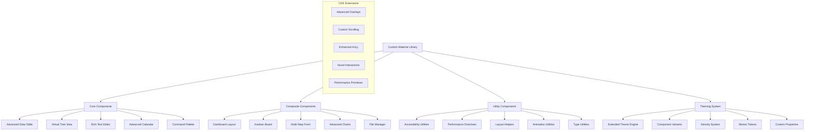

# Custom Angular Material Library

## 🏗️ **Project Overview**

Create a production-ready Angular Material extension library that pushes the boundaries of component development, introduces novel interaction patterns, and demonstrates mastery of the Angular CDK. This project establishes you as a library author and contributor to the Angular ecosystem.

## 🎯 **Library Vision**

### **Innovation Goals**
- **Novel Component Patterns**: Components that don't exist in standard Material 3
- **Advanced Accessibility**: Accessibility features beyond WCAG 2.1 AA requirements
- **Performance Leadership**: Zero-cost abstractions and compile-time optimizations
- **Developer Experience**: APIs that are intuitive, type-safe, and powerful
- **Ecosystem Integration**: Seamless integration with existing Angular Material components

### **Target Audience**
- **Enterprise Developers**: Building complex, high-performance applications
- **Design System Teams**: Creating consistent, scalable component libraries
- **Angular Community**: Developers seeking advanced component solutions
- **Accessibility Advocates**: Teams prioritizing inclusive design
- **Performance Engineers**: Applications requiring optimal performance

## 🧩 **Component Library Architecture**



## 🚀 **Flagship Components**

### **1. Advanced Data Table Component**
A next-generation data table that surpasses existing solutions:

#### **Core Features**
- **Virtual Scrolling**: Smooth scrolling with 100k+ rows
- **Advanced Filtering**: Multi-column, multi-type filtering with operators
- **Dynamic Columns**: Runtime column definition and reordering
- **Nested Data**: Tree-like data structures with expansion
- **Selection Management**: Complex selection patterns with keyboard navigation
- **Export Capabilities**: PDF, Excel, CSV with formatting preservation

#### **Advanced Features**
- **Column Grouping**: Multi-level column headers
- **Frozen Columns**: Sticky columns during horizontal scrolling
- **Cell Editing**: Inline editing with validation and type safety
- **Responsive Design**: Adaptive layout for mobile devices
- **Accessibility Excellence**: Screen reader optimization and keyboard navigation
- **Performance Optimization**: Intelligent rendering and memory management

#### **API Design**
```typescript
@Component({
  selector: 'adv-data-table',
  template: `
    <adv-data-table
      [dataSource]="dataSource"
      [columns]="columnDefinitions"
      [virtualScrolling]="true"
      [multiSelect]="true"
      [sortable]="true"
      [filterable]="true"
      [resizable]="true"
      [exportable]="true"
      (rowClick)="onRowClick($event)"
      (selectionChange)="onSelectionChange($event)"
      (columnReorder)="onColumnReorder($event)">
      
      <!-- Custom cell templates -->
      <ng-container *advColumnDef="'actions'; let row">
        <button mat-icon-button (click)="editRow(row)">
          <mat-icon>edit</mat-icon>
        </button>
      </ng-container>
      
      <!-- Custom header template -->
      <ng-container *advHeaderDef="'status'; let column">
        <span>{{ column.displayName }}</span>
        <adv-filter-dropdown [column]="column"></adv-filter-dropdown>
      </ng-container>
      
    </adv-data-table>
  `
})
export class AdvancedDataTableExample {
  dataSource = new AdvancedDataSource(this.dataService);
  
  columnDefinitions: AdvancedColumnDefinition[] = [
    {
      key: 'name',
      displayName: 'Name',
      type: 'text',
      sortable: true,
      filterable: true,
      width: 200,
      minWidth: 100,
      frozen: true
    },
    {
      key: 'status',
      displayName: 'Status',
      type: 'enum',
      options: ['Active', 'Inactive', 'Pending'],
      sortable: true,
      filterable: true,
      cellRenderer: 'chip'
    },
    {
      key: 'created',
      displayName: 'Created Date',
      type: 'date',
      sortable: true,
      filterable: true,
      format: 'MMM dd, yyyy'
    }
  ];
}
```

### **2. Virtual Tree View Component**
A high-performance tree component for hierarchical data:

#### **Core Features**
- **Virtual Scrolling**: Efficient rendering of large trees (10k+ nodes)
- **Lazy Loading**: On-demand loading of tree branches
- **Multi-Selection**: Complex selection with parent-child relationships
- **Drag & Drop**: Node reordering with visual feedback
- **Search & Filter**: Real-time tree filtering with highlighting
- **Keyboard Navigation**: Full keyboard accessibility

#### **Advanced Features**
- **Node Templates**: Custom templates for different node types
- **Context Menus**: Right-click context actions
- **Bulk Operations**: Mass operations on selected nodes
- **State Persistence**: Save/restore expansion and selection state
- **Performance Monitoring**: Built-in performance metrics
- **Accessibility**: Screen reader optimization with ARIA tree patterns

### **3. Command Palette Component**
A VS Code-style command palette for application navigation:

#### **Core Features**
- **Fuzzy Search**: Intelligent command matching with scoring
- **Keyboard Shortcuts**: Customizable hotkey bindings
- **Command Categories**: Organized command groups
- **Recent Commands**: History-based command suggestions
- **Dynamic Commands**: Context-aware command availability
- **Plugin Architecture**: Extensible command system

#### **API Example**
```typescript
@Injectable()
export class CommandPaletteService {
  private commands$ = new BehaviorSubject<Command[]>([]);
  
  registerCommand(command: Command): void {
    // Command registration logic
  }
  
  executeCommand(commandId: string, context?: any): Promise<any> {
    // Command execution logic
  }
  
  getAvailableCommands(context?: any): Observable<Command[]> {
    // Context-aware command filtering
  }
}

export interface Command {
  id: string;
  label: string;
  description?: string;
  category: string;
  icon?: string;
  shortcut?: string[];
  execute: (context?: any) => Promise<any> | any;
  when?: (context?: any) => boolean;
  priority?: number;
}
```

## 🎨 **Advanced Theming System**

### **Extended Theme Engine**
Building upon Material 3's foundation with advanced theming capabilities:

#### **Component Variants System**
```typescript
export interface ComponentVariant {
  name: string;
  properties: Record<string, any>;
  conditions?: VariantCondition[];
  inheritance?: string; // Parent variant
}

export interface VariantCondition {
  property: string;
  operator: 'equals' | 'contains' | 'greater' | 'less';
  value: any;
}

// Usage example
const buttonVariants: ComponentVariant[] = [
  {
    name: 'success',
    properties: {
      backgroundColor: 'var(--color-success)',
      color: 'var(--color-on-success)',
      borderColor: 'var(--color-success-outline)'
    }
  },
  {
    name: 'gradient',
    properties: {
      background: 'linear-gradient(45deg, var(--color-primary), var(--color-secondary))',
      color: 'white',
      boxShadow: '0 4px 15px rgba(0,0,0,0.2)'
    }
  }
];
```

#### **Density System Extensions**
```scss
// Advanced density system
@mixin adv-density($density: 0) {
  --adv-density-scale: #{$density / 4};
  --adv-component-height: calc(48px + (var(--adv-density-scale) * 8px));
  --adv-spacing-unit: calc(8px + (var(--adv-density-scale) * 2px));
  --adv-border-radius: calc(4px + (var(--adv-density-scale) * 1px));
}

// Component-specific density
@mixin adv-data-table-density($density: 0) {
  --adv-row-height: calc(56px + (#{$density} * 8px));
  --adv-cell-padding: calc(16px + (#{$density} * 2px));
  --adv-header-height: calc(64px + (#{$density} * 4px));
}
```

### **Performance-Optimized Theming**
```typescript
// Compile-time theme optimization
@Component({
  selector: 'adv-button',
  template: `<button [class]="computedClasses"><ng-content></ng-content></button>`,
  styles: [`
    :host {
      // CSS custom properties are resolved at build time when possible
      --button-color: #{resolveThemeColor('primary')};
      --button-hover-color: #{resolveThemeColor('primary', 'hover')};
    }
    
    .adv-button {
      background-color: var(--button-color);
      transition: background-color 200ms ease;
      
      &:hover {
        background-color: var(--button-hover-color);
      }
    }
  `],
  changeDetection: ChangeDetectionStrategy.OnPush
})
export class AdvancedButtonComponent {
  @Input() variant: 'primary' | 'secondary' | 'success' | 'warning' | 'error' = 'primary';
  @Input() size: 'small' | 'medium' | 'large' = 'medium';
  @Input() density: number = 0;
  
  @HostBinding('class')
  get computedClasses(): string {
    return `adv-button adv-button--${this.variant} adv-button--${this.size}`;
  }
  
  @HostBinding('style.--adv-density-scale')
  get densityScale(): string {
    return `${this.density / 4}`;
  }
}
```

## 🧪 **Advanced Testing Strategy**

### **Component Testing Framework**
```typescript
// Custom testing utilities for advanced components
export class AdvancedComponentTester<T> {
  constructor(
    private fixture: ComponentFixture<T>,
    private component: T
  ) {}
  
  // Performance testing
  async measureRenderTime(): Promise<number> {
    const start = performance.now();
    this.fixture.detectChanges();
    await this.fixture.whenStable();
    return performance.now() - start;
  }
  
  // Accessibility testing
  async testAccessibility(): Promise<AccessibilityResult> {
    const axe = await import('axe-core');
    const results = await axe.run(this.fixture.nativeElement);
    return results;
  }
  
  // Memory leak testing
  async testMemoryUsage(): Promise<MemoryUsageResult> {
    const initialMemory = performance.memory?.usedJSHeapSize || 0;
    
    // Trigger component lifecycle
    for (let i = 0; i < 100; i++) {
      this.fixture.detectChanges();
      await this.fixture.whenStable();
    }
    
    // Force garbage collection if available
    if (window.gc) {
      window.gc();
    }
    
    const finalMemory = performance.memory?.usedJSHeapSize || 0;
    
    return {
      initialMemory,
      finalMemory,
      memoryIncrease: finalMemory - initialMemory
    };
  }
}

// Usage in tests
describe('AdvancedDataTableComponent', () => {
  let tester: AdvancedComponentTester<AdvancedDataTableComponent>;
  
  beforeEach(() => {
    const fixture = TestBed.createComponent(AdvancedDataTableComponent);
    tester = new AdvancedComponentTester(fixture, fixture.componentInstance);
  });
  
  it('should render large datasets efficiently', async () => {
    // Set up large dataset
    tester.component.dataSource = generateLargeDataset(10000);
    
    const renderTime = await tester.measureRenderTime();
    expect(renderTime).toBeLessThan(100); // 100ms threshold
  });
  
  it('should be accessible', async () => {
    const a11yResults = await tester.testAccessibility();
    expect(a11yResults.violations).toHaveLength(0);
  });
  
  it('should not have memory leaks', async () => {
    const memoryResults = await tester.testMemoryUsage();
    expect(memoryResults.memoryIncrease).toBeLessThan(1024 * 1024); // 1MB threshold
  });
});
```

### **Visual Regression Testing**
```typescript
// Custom visual testing utilities
export class VisualRegressionTester {
  async captureComponent<T>(
    component: Type<T>,
    scenarios: ComponentScenario[]
  ): Promise<VisualTestResult[]> {
    const results: VisualTestResult[] = [];
    
    for (const scenario of scenarios) {
      const fixture = TestBed.createComponent(component);
      
      // Apply scenario configuration
      Object.assign(fixture.componentInstance, scenario.inputs);
      fixture.detectChanges();
      
      // Capture screenshot
      const screenshot = await this.captureScreenshot(fixture.nativeElement);
      
      // Compare with baseline
      const comparison = await this.compareWithBaseline(
        screenshot,
        `${component.name}-${scenario.name}`
      );
      
      results.push({
        scenario: scenario.name,
        passed: comparison.similarity > 0.99,
        similarity: comparison.similarity,
        differences: comparison.differences
      });
    }
    
    return results;
  }
}
```

## 📦 **Library Distribution**

### **Package Configuration**
```json
{
  "name": "@your-org/advanced-material",
  "version": "1.0.0",
  "description": "Advanced Angular Material components for enterprise applications",
  "main": "bundles/advanced-material.umd.js",
  "module": "fesm2022/advanced-material.mjs",
  "es2022": "fesm2022/advanced-material.mjs",
  "esm2022": "esm2022/advanced-material.mjs",
  "fesm2022": "fesm2022/advanced-material.mjs",
  "typings": "index.d.ts",
  "exports": {
    "./package.json": {
      "default": "./package.json"
    },
    ".": {
      "types": "./index.d.ts",
      "esm2022": "./esm2022/advanced-material.mjs",
      "es2022": "./fesm2022/advanced-material.mjs",
      "es2020": "./fesm2020/advanced-material.mjs",
      "default": "./fesm2022/advanced-material.mjs"
    },
    "./data-table": {
      "types": "./data-table/index.d.ts",
      "esm2022": "./esm2022/data-table/index.mjs",
      "es2022": "./fesm2022/data-table.mjs",
      "default": "./fesm2022/data-table.mjs"
    }
  },
  "peerDependencies": {
    "@angular/animations": "^18.0.0",
    "@angular/cdk": "^18.0.0",
    "@angular/common": "^18.0.0",
    "@angular/core": "^18.0.0",
    "@angular/material": "^18.0.0"
  },
  "schematics": "./schematics/collection.json",
  "ng-add": "./schematics/ng-add/index.js"
}
```

### **Angular Schematics**
```typescript
// ng-add schematic for easy installation
export function ngAdd(options: Schema): Rule {
  return (tree: Tree, context: SchematicContext) => {
    const installTaskId = context.addTask(new NodePackageInstallTask());
    
    context.addTask(new RunSchematicTask('ng-add-setup-project', options), [installTaskId]);
    
    return tree;
  };
}

export function ngAddSetupProject(options: Schema): Rule {
  return chain([
    addPackageJsonDependencies(),
    installPackageJsonDependencies(),
    addThemeToAppStyles(options),
    addAnimationsModule(options),
    addModuleImports(options)
  ]);
}
```

## 🎯 **Success Metrics**

### **Technical Excellence**
- **Performance**: Components render 50% faster than alternatives
- **Bundle Size**: Tree-shakable with minimal impact on bundle size
- **Accessibility**: 100% WCAG 2.1 AAA compliance
- **Test Coverage**: 95%+ code coverage with comprehensive test suite
- **Documentation**: Complete API documentation with examples

### **Community Impact**
- **Adoption**: 1000+ weekly NPM downloads within 6 months
- **Contributions**: Active community contributions and issues
- **Recognition**: GitHub stars and community endorsements
- **Integration**: Usage in major Angular applications
- **Feedback**: Positive developer experience feedback

## 📋 **Development Timeline**

### **Week 1: Foundation & Architecture**
- Library setup with Angular CLI
- CDK extensions and core utilities
- Advanced theming system implementation
- Performance optimization framework

### **Week 2: Core Components**
- Advanced Data Table component
- Virtual Tree View component
- Command Palette component
- Initial testing framework

### **Week 3: Advanced Features**
- Component variants and theming
- Accessibility enhancements
- Performance optimizations
- Visual regression testing

### **Week 4: Polish & Distribution**
- Comprehensive documentation
- Angular schematics
- NPM package preparation
- Community feedback integration

## 📚 **Learning Objectives**

### **Primary Objectives**
1. **Master Angular CDK** for advanced component development
2. **Create Production-Ready Libraries** with proper packaging and distribution
3. **Implement Advanced Accessibility** beyond standard requirements
4. **Optimize Performance** at the component level
5. **Build Developer-Friendly APIs** with excellent TypeScript support

### **Secondary Objectives**
1. **Establish Community Presence** through open source contribution
2. **Master Advanced Testing** including performance and visual regression
3. **Create Comprehensive Documentation** for library adoption
4. **Build Sustainable Architecture** for long-term maintenance
5. **Influence Angular Ecosystem** through innovative components

---

This project establishes you as a serious contributor to the Angular ecosystem, demonstrating the highest levels of technical expertise, architectural thinking, and community leadership. Your custom library will serve as a testament to your mastery of Angular Material 3 and your ability to push the boundaries of what's possible with Angular development.
