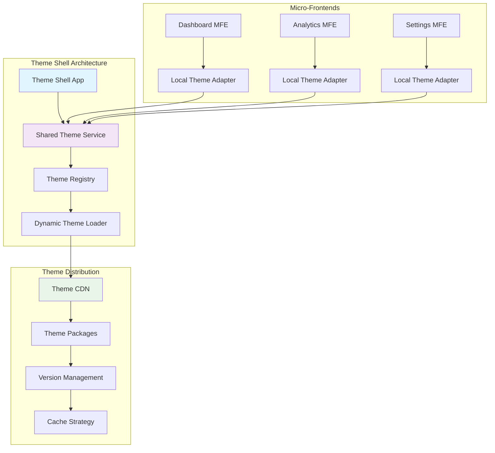

# Project: Micro-Frontend Framework with Unified Theming

## 🎯 **Project Overview**

Build a comprehensive micro-frontend framework that enables multiple Angular applications to share a unified Material Design 3 theming system while maintaining independent development and deployment cycles.

## 🏗️ **Architecture Diagram**



## 🚀 **Key Features**

### **🎨 Unified Theme Distribution**
- Centralized theme management across micro-frontends
- Runtime theme switching without page reload
- Version-controlled theme packages
- CDN-based theme distribution

### **🔧 Framework Integration**
- Module Federation integration
- Single-SPA compatibility
- Custom element wrapper support
- Web Components bridge

### **📊 Advanced Monitoring**
- Theme performance metrics
- Loading time analytics
- Error tracking and reporting
- Usage statistics collection

## 🛠️ **Technical Implementation**

### **Core Architecture Files**

```
project-micro-frontend-framework/
├── 📋 README.md
├── 🏗️ architecture/
│   ├── shell-application/
│   │   ├── src/app/
│   │   │   ├── theme/
│   │   │   │   ├── theme-shell.service.ts
│   │   │   │   ├── theme-registry.service.ts
│   │   │   │   ├── theme-loader.service.ts
│   │   │   │   └── theme-adapter.interface.ts
│   │   │   ├── microfrontend/
│   │   │   │   ├── mfe-loader.service.ts
│   │   │   │   ├── mfe-registry.ts
│   │   │   │   └── mfe-theme-bridge.ts
│   │   │   └── shared/
│   │   │       ├── event-bus.service.ts
│   │   │       └── communication.interface.ts
│   │   ├── webpack.config.js
│   │   └── module-federation.config.js
├── 🎨 theme-packages/
│   ├── material-3-core/
│   │   ├── tokens/
│   │   ├── components/
│   │   ├── utilities/
│   │   └── distribution/
│   ├── brand-themes/
│   │   ├── corporate-theme/
│   │   ├── modern-theme/
│   │   └── minimal-theme/
│   └── custom-themes/
│       └── theme-builder-output/
├── 🚀 microfrontends/
│   ├── dashboard-mfe/
│   │   ├── src/app/theme/
│   │   │   ├── theme-adapter.service.ts
│   │   │   ├── local-theme.service.ts
│   │   │   └── theme-sync.service.ts
│   │   └── webpack.config.js
│   ├── analytics-mfe/
│   │   └── [similar structure]
│   └── settings-mfe/
│       └── [similar structure]
├── 📊 monitoring/
│   ├── theme-analytics.service.ts
│   ├── performance-metrics.ts
│   ├── error-tracking.ts
│   └── dashboard/
│       ├── theme-usage-dashboard.component.ts
│       └── performance-dashboard.component.ts
├── 🧪 testing/
│   ├── integration-tests/
│   ├── theme-consistency-tests/
│   ├── performance-tests/
│   └── cross-mfe-tests/
├── 🚀 deployment/
│   ├── kubernetes/
│   │   ├── shell-deployment.yaml
│   │   ├── mfe-deployments.yaml
│   │   └── theme-cdn-service.yaml
│   ├── docker/
│   │   ├── shell.Dockerfile
│   │   ├── mfe.Dockerfile
│   │   └── theme-cdn.Dockerfile
│   └── ci-cd/
│       ├── build-pipeline.yml
│       ├── deploy-pipeline.yml
│       └── theme-sync-pipeline.yml
└── 📚 documentation/
    ├── architecture-guide.md
    ├── integration-guide.md
    ├── theme-development.md
    ├── deployment-guide.md
    └── troubleshooting.md
```

## 🎯 **Learning Objectives**

### **🏗️ Architecture Mastery**
- [ ] Design distributed theme systems
- [ ] Implement Module Federation patterns
- [ ] Master micro-frontend communication
- [ ] Build scalable theme distribution

### **🔧 Advanced Integration**
- [ ] Single-SPA integration patterns
- [ ] Web Components bridge development
- [ ] Custom Element wrappers
- [ ] Runtime module loading

### **📊 Performance Engineering**
- [ ] Theme lazy loading strategies
- [ ] Cache optimization techniques
- [ ] Bundle splitting for themes
- [ ] Performance monitoring implementation

### **🚀 DevOps Excellence**
- [ ] Multi-application CI/CD pipelines
- [ ] Container orchestration
- [ ] Theme versioning strategies
- [ ] Rollback and deployment strategies

## 🛠️ **Core Implementation**

### **Theme Shell Service**

```typescript
// theme-shell.service.ts
@Injectable({
  providedIn: 'root'
})
export class ThemeShellService {
  private themeRegistry = inject(ThemeRegistryService);
  private themeLoader = inject(ThemeLoaderService);
  private eventBus = inject(EventBusService);
  
  private currentTheme$ = new BehaviorSubject<ThemeConfiguration | null>(null);
  private mfeThemeAdapters = new Map<string, ThemeAdapter>();
  
  constructor() {
    this.initializeThemeSystem();
    this.setupMFECommunication();
  }
  
  async switchTheme(themeId: string): Promise<void> {
    const theme = await this.themeLoader.loadTheme(themeId);
    
    // Update all registered MFEs
    await Promise.all(
      Array.from(this.mfeThemeAdapters.values())
        .map(adapter => adapter.applyTheme(theme))
    );
    
    this.currentTheme$.next(theme);
    this.eventBus.emit('theme-changed', { theme });
  }
  
  registerMicroFrontend(mfeId: string, adapter: ThemeAdapter): void {
    this.mfeThemeAdapters.set(mfeId, adapter);
    
    // Apply current theme to new MFE
    const currentTheme = this.currentTheme$.value;
    if (currentTheme) {
      adapter.applyTheme(currentTheme);
    }
  }
  
  private async initializeThemeSystem(): Promise<void> {
    // Load default theme
    const defaultTheme = await this.themeRegistry.getDefaultTheme();
    this.currentTheme$.next(defaultTheme);
    
    // Setup theme preloading
    this.preloadPopularThemes();
  }
  
  private setupMFECommunication(): void {
    // Listen for MFE registration events
    this.eventBus.on('mfe-ready', (event) => {
      this.handleMFERegistration(event.mfeId, event.adapter);
    });
    
    // Handle theme sync requests
    this.eventBus.on('theme-sync-request', (event) => {
      this.syncThemeToMFE(event.mfeId);
    });
  }
}
```

### **Theme Loader Service**

```typescript
// theme-loader.service.ts
@Injectable({
  providedIn: 'root'
})
export class ThemeLoaderService {
  private themeCache = new Map<string, ThemeConfiguration>();
  private loadingPromises = new Map<string, Promise<ThemeConfiguration>>();
  
  async loadTheme(themeId: string): Promise<ThemeConfiguration> {
    // Check cache first
    if (this.themeCache.has(themeId)) {
      return this.themeCache.get(themeId)!;
    }
    
    // Check if already loading
    if (this.loadingPromises.has(themeId)) {
      return this.loadingPromises.get(themeId)!;
    }
    
    // Start loading
    const loadingPromise = this.fetchThemeFromCDN(themeId);
    this.loadingPromises.set(themeId, loadingPromise);
    
    try {
      const theme = await loadingPromise;
      this.themeCache.set(themeId, theme);
      return theme;
    } finally {
      this.loadingPromises.delete(themeId);
    }
  }
  
  private async fetchThemeFromCDN(themeId: string): Promise<ThemeConfiguration> {
    const response = await fetch(`${THEME_CDN_URL}/themes/${themeId}/latest.json`);
    
    if (!response.ok) {
      throw new Error(`Failed to load theme: ${themeId}`);
    }
    
    const themeData = await response.json();
    
    // Load CSS files
    await this.loadThemeStyles(themeData.cssFiles);
    
    return {
      id: themeId,
      version: themeData.version,
      tokens: themeData.tokens,
      cssFiles: themeData.cssFiles,
      metadata: themeData.metadata
    };
  }
  
  private async loadThemeStyles(cssFiles: string[]): Promise<void> {
    const loadPromises = cssFiles.map(file => this.loadStylesheet(file));
    await Promise.all(loadPromises);
  }
  
  private loadStylesheet(url: string): Promise<void> {
    return new Promise((resolve, reject) => {
      const link = document.createElement('link');
      link.rel = 'stylesheet';
      link.href = url;
      
      link.onload = () => resolve();
      link.onerror = () => reject(new Error(`Failed to load stylesheet: ${url}`));
      
      document.head.appendChild(link);
    });
  }
}
```

### **MFE Theme Adapter**

```typescript
// theme-adapter.service.ts (in each MFE)
@Injectable({
  providedIn: 'root'
})
export class MFEThemeAdapterService implements ThemeAdapter {
  private localThemeService = inject(LocalThemeService);
  private eventBus = inject(EventBusService);
  
  constructor() {
    this.registerWithShell();
  }
  
  async applyTheme(theme: ThemeConfiguration): Promise<void> {
    // Apply theme tokens to local CSS custom properties
    this.applyThemeTokens(theme.tokens);
    
    // Update local theme service
    this.localThemeService.setTheme(theme);
    
    // Notify local components
    this.eventBus.emit('local-theme-changed', { theme });
  }
  
  private applyThemeTokens(tokens: ThemeTokens): void {
    const root = document.documentElement;
    
    Object.entries(tokens).forEach(([key, value]) => {
      root.style.setProperty(`--${key}`, value);
    });
  }
  
  private registerWithShell(): void {
    // Wait for shell to be available
    if ((window as any).themeShell) {
      (window as any).themeShell.registerMicroFrontend(
        this.getMFEId(),
        this
      );
    } else {
      // Retry registration
      setTimeout(() => this.registerWithShell(), 1000);
    }
  }
  
  private getMFEId(): string {
    return 'dashboard-mfe'; // Or get from config
  }
}
```

## 📊 **Performance Monitoring**

### **Theme Analytics Service**

```typescript
// theme-analytics.service.ts
@Injectable({
  providedIn: 'root'
})
export class ThemeAnalyticsService {
  private metrics = {
    themeLoadTimes: new Map<string, number[]>(),
    themeSwitchCount: new Map<string, number>(),
    errorCount: new Map<string, number>(),
    mfePerformance: new Map<string, PerformanceData>()
  };
  
  recordThemeLoadTime(themeId: string, loadTime: number): void {
    if (!this.metrics.themeLoadTimes.has(themeId)) {
      this.metrics.themeLoadTimes.set(themeId, []);
    }
    
    this.metrics.themeLoadTimes.get(themeId)!.push(loadTime);
    
    // Send to analytics service
    this.sendMetric('theme-load-time', {
      themeId,
      loadTime,
      timestamp: Date.now()
    });
  }
  
  recordThemeSwitch(themeId: string): void {
    const current = this.metrics.themeSwitchCount.get(themeId) || 0;
    this.metrics.themeSwitchCount.set(themeId, current + 1);
    
    this.sendMetric('theme-switch', {
      themeId,
      count: current + 1,
      timestamp: Date.now()
    });
  }
  
  recordError(themeId: string, error: Error): void {
    const current = this.metrics.errorCount.get(themeId) || 0;
    this.metrics.errorCount.set(themeId, current + 1);
    
    this.sendMetric('theme-error', {
      themeId,
      error: error.message,
      stack: error.stack,
      timestamp: Date.now()
    });
  }
  
  getPerformanceReport(): PerformanceReport {
    return {
      averageLoadTimes: this.calculateAverageLoadTimes(),
      popularThemes: this.getPopularThemes(),
      errorRates: this.calculateErrorRates(),
      mfeHealth: this.getMFEHealthStatus()
    };
  }
}
```

## 🚀 **Deployment Strategy**

### **Kubernetes Configuration**

```yaml
# shell-deployment.yaml
apiVersion: apps/v1
kind: Deployment
metadata:
  name: theme-shell
spec:
  replicas: 3
  selector:
    matchLabels:
      app: theme-shell
  template:
    metadata:
      labels:
        app: theme-shell
    spec:
      containers:
      - name: theme-shell
        image: theme-shell:latest
        ports:
        - containerPort: 80
        env:
        - name: THEME_CDN_URL
          value: "https://themes.company.com"
        - name: MFE_REGISTRY_URL
          value: "https://mfe-registry.company.com"
        resources:
          requests:
            memory: "256Mi"
            cpu: "250m"
          limits:
            memory: "512Mi"
            cpu: "500m"
---
apiVersion: v1
kind: Service
metadata:
  name: theme-shell-service
spec:
  selector:
    app: theme-shell
  ports:
  - port: 80
    targetPort: 80
  type: LoadBalancer
```

## 🧪 **Testing Strategy**

### **Cross-MFE Integration Tests**

```typescript
// cross-mfe-theme-sync.spec.ts
describe('Cross-MFE Theme Synchronization', () => {
  let themeShell: ThemeShellService;
  let mockMFEs: MockMicroFrontend[];
  
  beforeEach(() => {
    themeShell = TestBed.inject(ThemeShellService);
    mockMFEs = [
      new MockMicroFrontend('dashboard'),
      new MockMicroFrontend('analytics'),
      new MockMicroFrontend('settings')
    ];
    
    // Register mock MFEs
    mockMFEs.forEach(mfe => {
      themeShell.registerMicroFrontend(mfe.id, mfe.adapter);
    });
  });
  
  it('should synchronize theme across all MFEs', async () => {
    const testTheme = createTestTheme('modern-blue');
    
    await themeShell.switchTheme('modern-blue');
    
    // Verify all MFEs received the theme
    mockMFEs.forEach(mfe => {
      expect(mfe.adapter.currentTheme).toEqual(testTheme);
      expect(mfe.adapter.applyThemeCalled).toBe(true);
    });
  });
  
  it('should handle MFE registration after theme is already set', async () => {
    const testTheme = createTestTheme('corporate-red');
    await themeShell.switchTheme('corporate-red');
    
    // Register new MFE
    const lateMFE = new MockMicroFrontend('reports');
    themeShell.registerMicroFrontend('reports', lateMFE.adapter);
    
    // Should immediately receive current theme
    expect(lateMFE.adapter.currentTheme).toEqual(testTheme);
  });
  
  it('should recover gracefully from MFE theme application failures', async () => {
    const faultyMFE = new MockMicroFrontend('faulty');
    faultyMFE.adapter.shouldFail = true;
    
    themeShell.registerMicroFrontend('faulty', faultyMFE.adapter);
    
    // Should not affect other MFEs
    await expect(
      themeShell.switchTheme('test-theme')
    ).not.toThrow();
    
    // Working MFEs should still receive theme
    expect(mockMFEs[0].adapter.currentTheme).toBeDefined();
  });
});
```

## 📈 **Success Metrics**

### **Performance Targets**
- [ ] Theme load time < 200ms
- [ ] Theme switch time < 100ms
- [ ] MFE registration time < 50ms
- [ ] Cache hit ratio > 90%

### **Reliability Targets**
- [ ] 99.9% uptime
- [ ] < 0.1% error rate
- [ ] Graceful degradation
- [ ] Automatic recovery

### **Developer Experience**
- [ ] Simple integration API
- [ ] Comprehensive documentation
- [ ] Rich debugging tools
- [ ] Performance insights

## 🎯 **Next Steps**

1. **Complete Core Implementation** - Finish all service implementations
2. **Build Sample MFEs** - Create example micro-frontends
3. **Implement Monitoring** - Add comprehensive analytics
4. **Create Documentation** - Write integration guides
5. **Performance Testing** - Validate performance targets
6. **Production Deployment** - Deploy to staging/production

---

**This project represents the pinnacle of micro-frontend theming architecture, combining cutting-edge Angular patterns with enterprise-grade scalability and performance.**
