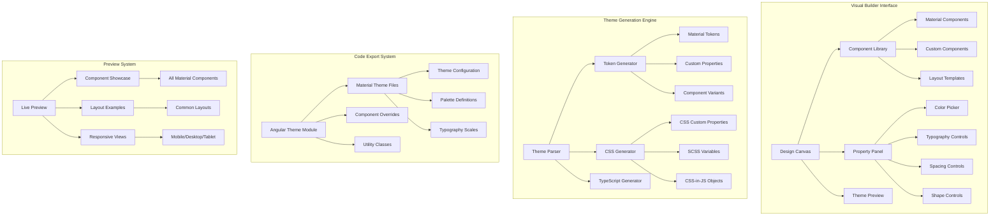

# Visual Theme Builder - Interactive Design System Creator

## 🎯 **Project Overview**

Build a sophisticated visual theme builder that allows users to create, customize, and export complete Material Design 3 theme systems through an intuitive drag-and-drop interface. This expert-level project showcases advanced Angular Material implementation with real-time theme generation and visual design tools.

## 🎨 **Architecture Diagram**



## 🛠️ **Features & Components**

### **Core Builder Features**
- **Visual Design Canvas** - Drag-and-drop interface with Material components
- **Real-time Theme Generation** - Live preview of theme changes
- **Component Customization** - Per-component styling and variants
- **Code Export** - Generate complete theme packages
- **Design System Templates** - Pre-built design system starting points
- **Collaboration Tools** - Share and collaborate on theme designs

### **Advanced Material Components**
- Custom Material design canvas with zoom and pan
- Advanced color picker with accessibility validation
- Typography control panel with live preview
- Component variant builder with custom properties
- Responsive preview panels
- Code generation and export system

## 🏗️ **Technical Implementation**

### **Project Structure**
```
src/
├── app/
│   ├── core/
│   │   ├── theme-engine/
│   │   │   ├── theme-generator.service.ts
│   │   │   ├── token-parser.service.ts
│   │   │   ├── css-generator.service.ts
│   │   │   └── code-exporter.service.ts
│   │   ├── design-canvas/
│   │   │   ├── canvas.service.ts
│   │   │   ├── drag-drop.service.ts
│   │   │   ├── selection.service.ts
│   │   │   └── undo-redo.service.ts
│   │   └── component-library/
│   │       ├── material-components.service.ts
│   │       ├── custom-components.service.ts
│   │       └── component-registry.service.ts
│   ├── shared/
│   │   ├── components/
│   │   │   ├── design-canvas/
│   │   │   ├── property-panel/
│   │   │   ├── component-library/
│   │   │   ├── theme-preview/
│   │   │   └── code-export/
│   │   └── models/
│   │       ├── theme.models.ts
│   │       ├── component.models.ts
│   │       └── design.models.ts
│   ├── features/
│   │   ├── builder/
│   │   │   ├── builder-workspace/
│   │   │   ├── theme-editor/
│   │   │   └── preview-panel/
│   │   ├── templates/
│   │   │   ├── design-system-templates/
│   │   │   └── component-templates/
│   │   └── export/
│   │       ├── code-generator/
│   │       └── package-builder/
│   └── theming/
│       ├── builder-themes/
│       ├── preview-themes/
│       └── generated-themes/
```

### **Advanced Theme Generation Architecture**

#### **1. Theme Generator Service**
```typescript
@Injectable({ providedIn: 'root' })
export class ThemeGeneratorService {
  private currentTheme$ = new BehaviorSubject<DesignTheme>(null);
  private generatedTokens$ = new BehaviorSubject<MaterialTokens>(null);
  
  constructor(
    private tokenParser: TokenParserService,
    private cssGenerator: CSSGeneratorService,
    private codeExporter: CodeExporterService
  ) {}
  
  generateTheme(designConfig: DesignConfiguration): DesignTheme {
    // Parse design configuration into Material tokens
    const materialTokens = this.tokenParser.parseDesignConfig(designConfig);
    
    // Generate component variants
    const componentVariants = this.generateComponentVariants(designConfig, materialTokens);
    
    // Create theme object
    const theme: DesignTheme = {
      id: generateId(),
      name: designConfig.name,
      description: designConfig.description,
      materialTokens,
      componentVariants,
      customProperties: this.generateCustomProperties(designConfig),
      breakpoints: this.generateBreakpoints(designConfig),
      animations: this.generateAnimations(designConfig),
      accessibility: this.generateAccessibilityFeatures(designConfig)
    };
    
    // Generate CSS output
    theme.cssOutput = this.cssGenerator.generateCSS(theme);
    
    // Generate TypeScript output
    theme.typescriptOutput = this.generateTypeScriptModule(theme);
    
    this.currentTheme$.next(theme);
    this.generatedTokens$.next(materialTokens);
    
    return theme;
  }
  
  private generateComponentVariants(
    config: DesignConfiguration,
    tokens: MaterialTokens
  ): ComponentVariants {
    const variants: ComponentVariants = {};
    
    // Generate button variants
    variants.MatButton = this.generateButtonVariants(config, tokens);
    variants.MatCard = this.generateCardVariants(config, tokens);
    variants.MatToolbar = this.generateToolbarVariants(config, tokens);
    variants.MatFormField = this.generateFormFieldVariants(config, tokens);
    
    // Add all other Material components
    Object.keys(MATERIAL_COMPONENTS).forEach(componentName => {
      if (!variants[componentName]) {
        variants[componentName] = this.generateGenericVariant(
          componentName,
          config,
          tokens
        );
      }
    });
    
    return variants;
  }
  
  private generateButtonVariants(
    config: DesignConfiguration,
    tokens: MaterialTokens
  ): ComponentVariant {
    return {
      styleOverrides: {
        root: {
          borderRadius: tokens['md-sys-shape-corner-medium'],
          fontFamily: tokens['md-sys-typescale-label-large-font'],
          fontSize: tokens['md-sys-typescale-label-large-size'],
          fontWeight: tokens['md-sys-typescale-label-large-weight'],
          textTransform: config.components.button?.textTransform || 'none',
          minHeight: config.components.button?.minHeight || '40px',
          padding: `${config.components.button?.paddingY || 8}px ${config.components.button?.paddingX || 16}px`,
          transition: 'all 0.2s ease-in-out',
          
          // Primary variant
          '&.mat-primary': {
            backgroundColor: tokens['md-sys-color-primary'],
            color: tokens['md-sys-color-on-primary'],
            boxShadow: config.components.button?.elevation ? 
              `0 2px 4px ${tokens['md-sys-color-shadow']}` : 'none',
            
            '&:hover': {
              backgroundColor: tokens['md-sys-color-primary-container'],
              transform: config.components.button?.hoverEffect ? 
                'translateY(-1px)' : 'none',
              boxShadow: config.components.button?.elevation ? 
                `0 4px 8px ${tokens['md-sys-color-shadow']}` : 'none'
            },
            
            '&:active': {
              transform: 'translateY(0)',
              boxShadow: config.components.button?.elevation ? 
                `0 1px 2px ${tokens['md-sys-color-shadow']}` : 'none'
            }
          },
          
          // Secondary variant
          '&.mat-accent': {
            backgroundColor: tokens['md-sys-color-secondary'],
            color: tokens['md-sys-color-on-secondary'],
            
            '&:hover': {
              backgroundColor: tokens['md-sys-color-secondary-container']
            }
          },
          
          // Outlined variant
          '&.mat-stroked-button': {
            border: `1px solid ${tokens['md-sys-color-outline']}`,
            backgroundColor: 'transparent',
            color: tokens['md-sys-color-primary'],
            
            '&:hover': {
              backgroundColor: tokens['md-sys-color-surface-variant'],
              borderColor: tokens['md-sys-color-primary']
            }
          }
        }
      },
      
      // Custom variants
      variants: [
        {
          props: { variant: 'gradient' },
          style: {
            background: `linear-gradient(45deg, ${tokens['md-sys-color-primary']}, ${tokens['md-sys-color-tertiary']})`,
            color: tokens['md-sys-color-on-primary'],
            border: 'none',
            
            '&:hover': {
              background: `linear-gradient(45deg, ${tokens['md-sys-color-primary-container']}, ${tokens['md-sys-color-tertiary-container']})`
            }
          }
        },
        
        {
          props: { variant: 'glass' },
          style: {
            backgroundColor: `${tokens['md-sys-color-surface']}80`,
            backdropFilter: 'blur(10px)',
            border: `1px solid ${tokens['md-sys-color-outline-variant']}`,
            color: tokens['md-sys-color-on-surface'],
            
            '&:hover': {
              backgroundColor: `${tokens['md-sys-color-surface-variant']}90`
            }
          }
        }
      ]
    };
  }
  
  private generateTypeScriptModule(theme: DesignTheme): string {
    return `
// Generated theme module - ${theme.name}
// Generated on: ${new Date().toISOString()}

import { NgModule } from '@angular/core';
import { MatButtonModule } from '@angular/material/button';
import { MatCardModule } from '@angular/material/card';
// ... other imports

export const ${toCamelCase(theme.name)}Theme = {
  materialTokens: ${JSON.stringify(theme.materialTokens, null, 2)},
  
  componentOverrides: {
    MuiButton: ${JSON.stringify(theme.componentVariants.MatButton, null, 2)},
    // ... other component overrides
  },
  
  customProperties: ${JSON.stringify(theme.customProperties, null, 2)}
};

@NgModule({
  imports: [
    MatButtonModule,
    MatCardModule,
    // ... other Material modules
  ],
  providers: [
    {
      provide: 'THEME_CONFIG',
      useValue: ${toCamelCase(theme.name)}Theme
    }
  ]
})
export class ${toPascalCase(theme.name)}ThemeModule { }
    `.trim();
  }
}
```

#### **2. Visual Design Canvas Component**
```typescript
@Component({
  selector: 'app-design-canvas',
  template: `
    <div class="design-canvas-container" 
         [style.transform]="'scale(' + zoomLevel + ')'"
         [style.transform-origin]="'top left'"
         (wheel)="onWheel($event)"
         (mousedown)="onMouseDown($event)"
         (mousemove)="onMouseMove($event)"
         (mouseup)="onMouseUp($event)">
      
      <!-- Canvas background -->
      <div class="canvas-background"
           [style.width.px]="canvasWidth"
           [style.height.px]="canvasHeight">
           
        <!-- Grid overlay -->
        <div class="grid-overlay" 
             *ngIf="showGrid"
             [style.background-size]="gridSize + 'px ' + gridSize + 'px'">
        </div>
        
        <!-- Rulers -->
        <div class="rulers" *ngIf="showRulers">
          <div class="horizontal-ruler"></div>
          <div class="vertical-ruler"></div>
        </div>
      </div>
      
      <!-- Design elements -->
      <div class="design-elements" 
           cdkDropList
           [cdkDropListData]="designElements"
           (cdkDropListDropped)="onElementDropped($event)">
        
        <div *ngFor="let element of designElements; trackBy: trackElement"
             class="design-element"
             [class.selected]="isSelected(element)"
             [style.left.px]="element.position.x"
             [style.top.px]="element.position.y"
             [style.width.px]="element.dimensions.width"
             [style.height.px]="element.dimensions.height"
             [style.transform]="'rotate(' + element.rotation + 'deg)'"
             cdkDrag
             [cdkDragData]="element"
             (cdkDragStarted)="onDragStart(element)"
             (cdkDragMoved)="onDragMove($event, element)"
             (cdkDragEnded)="onDragEnd(element)"
             (click)="selectElement(element, $event)">
          
          <!-- Element content -->
          <ng-container [ngSwitch]="element.type">
            <!-- Material Button -->
            <button *ngSwitchCase="'button'"
                    mat-raised-button
                    [color]="element.properties.color"
                    [disabled]="element.properties.disabled"
                    [style]="getElementStyles(element)">
              {{element.properties.text || 'Button'}}
            </button>
            
            <!-- Material Card -->
            <mat-card *ngSwitchCase="'card'"
                      [style]="getElementStyles(element)">
              <mat-card-header *ngIf="element.properties.showHeader">
                <mat-card-title>{{element.properties.title || 'Card Title'}}</mat-card-title>
                <mat-card-subtitle>{{element.properties.subtitle}}</mat-card-subtitle>
              </mat-card-header>
              
              <mat-card-content>
                {{element.properties.content || 'Card content goes here...'}}
              </mat-card-content>
              
              <mat-card-actions *ngIf="element.properties.showActions">
                <button mat-button>Action 1</button>
                <button mat-button>Action 2</button>
              </mat-card-actions>
            </mat-card>
            
            <!-- Material Form Field -->
            <mat-form-field *ngSwitchCase="'form-field'"
                           [appearance]="element.properties.appearance"
                           [style]="getElementStyles(element)">
              <mat-label>{{element.properties.label || 'Label'}}</mat-label>
              <input matInput 
                     [placeholder]="element.properties.placeholder"
                     [value]="element.properties.value">
              <mat-hint *ngIf="element.properties.hint">
                {{element.properties.hint}}
              </mat-hint>
            </mat-form-field>
            
            <!-- Custom text element -->
            <div *ngSwitchCase="'text'"
                 [style]="getElementStyles(element)"
                 [innerHTML]="element.properties.html || element.properties.text || 'Text'">
            </div>
            
            <!-- Container/Layout element -->
            <div *ngSwitchCase="'container'"
                 class="container-element"
                 [style]="getElementStyles(element)"
                 cdkDropList
                 [cdkDropListData]="element.children"
                 (cdkDropListDropped)="onNestedElementDropped($event, element)">
              
              <app-design-canvas-element
                *ngFor="let child of element.children"
                [element]="child"
                [parent]="element"
                (elementSelect)="selectElement($event)"
                (elementUpdate)="updateElement($event)">
              </app-design-canvas-element>
            </div>
          </ng-container>
          
          <!-- Selection handles -->
          <div *ngIf="isSelected(element)" class="selection-handles">
            <div class="handle handle-nw" (mousedown)="startResize(element, 'nw', $event)"></div>
            <div class="handle handle-ne" (mousedown)="startResize(element, 'ne', $event)"></div>
            <div class="handle handle-sw" (mousedown)="startResize(element, 'sw', $event)"></div>
            <div class="handle handle-se" (mousedown)="startResize(element, 'se', $event)"></div>
            <div class="handle handle-n" (mousedown)="startResize(element, 'n', $event)"></div>
            <div class="handle handle-s" (mousedown)="startResize(element, 's', $event)"></div>
            <div class="handle handle-w" (mousedown)="startResize(element, 'w', $event)"></div>
            <div class="handle handle-e" (mousedown)="startResize(element, 'e', $event)"></div>
            
            <!-- Rotation handle -->
            <div class="handle handle-rotate" (mousedown)="startRotate(element, $event)">
              <mat-icon>rotate_right</mat-icon>
            </div>
          </div>
        </div>
      </div>
      
      <!-- Selection rectangle -->
      <div *ngIf="selectionRect" 
           class="selection-rectangle"
           [style.left.px]="selectionRect.x"
           [style.top.px]="selectionRect.y"
           [style.width.px]="selectionRect.width"
           [style.height.px]="selectionRect.height">
      </div>
      
      <!-- Snap guides -->
      <div class="snap-guides">
        <div *ngFor="let guide of snapGuides"
             class="snap-guide"
             [class.horizontal]="guide.type === 'horizontal'"
             [class.vertical]="guide.type === 'vertical'"
             [style.left.px]="guide.type === 'vertical' ? guide.position : 0"
             [style.top.px]="guide.type === 'horizontal' ? guide.position : 0"
             [style.width]="guide.type === 'horizontal' ? '100%' : '1px'"
             [style.height]="guide.type === 'vertical' ? '100%' : '1px'">
        </div>
      </div>
    </div>
    
    <!-- Canvas toolbar -->
    <mat-toolbar class="canvas-toolbar" color="primary">
      <mat-toolbar-row>
        <button mat-icon-button (click)="undo()" [disabled]="!canUndo">
          <mat-icon>undo</mat-icon>
        </button>
        <button mat-icon-button (click)="redo()" [disabled]="!canRedo">
          <mat-icon>redo</mat-icon>
        </button>
        
        <mat-divider vertical></mat-divider>
        
        <mat-button-toggle-group [value]="currentTool" (change)="setTool($event.value)">
          <mat-button-toggle value="select">
            <mat-icon>mouse</mat-icon>
          </mat-button-toggle>
          <mat-button-toggle value="pan">
            <mat-icon>pan_tool</mat-icon>
          </mat-button-toggle>
        </mat-button-toggle-group>
        
        <mat-divider vertical></mat-divider>
        
        <mat-slide-toggle [(ngModel)]="showGrid">Grid</mat-slide-toggle>
        <mat-slide-toggle [(ngModel)]="showRulers">Rulers</mat-slide-toggle>
        <mat-slide-toggle [(ngModel)]="snapToGrid">Snap</mat-slide-toggle>
        
        <span class="toolbar-spacer"></span>
        
        <!-- Zoom controls -->
        <button mat-icon-button (click)="zoomOut()">
          <mat-icon>zoom_out</mat-icon>
        </button>
        <span class="zoom-level">{{Math.round(zoomLevel * 100)}}%</span>
        <button mat-icon-button (click)="zoomIn()">
          <mat-icon>zoom_in</mat-icon>
        </button>
        <button mat-icon-button (click)="resetZoom()">
          <mat-icon>center_focus_weak</mat-icon>
        </button>
      </mat-toolbar-row>
    </mat-toolbar>
  `,
  styleUrls: ['./design-canvas.component.scss']
})
export class DesignCanvasComponent implements OnInit, OnDestroy {
  @Input() designElements: DesignElement[] = [];
  @Input() canvasWidth = 1200;
  @Input() canvasHeight = 800;
  
  @Output() elementSelected = new EventEmitter<DesignElement>();
  @Output() elementUpdated = new EventEmitter<DesignElement>();
  @Output() elementsChanged = new EventEmitter<DesignElement[]>();
  
  selectedElements: DesignElement[] = [];
  zoomLevel = 1;
  currentTool = 'select';
  showGrid = true;
  showRulers = true;
  snapToGrid = true;
  gridSize = 20;
  
  selectionRect: SelectionRect | null = null;
  snapGuides: SnapGuide[] = [];
  
  private dragState: DragState | null = null;
  private resizeState: ResizeState | null = null;
  private rotateState: RotateState | null = null;
  private panState: PanState | null = null;
  
  private undoStack: CanvasState[] = [];
  private redoStack: CanvasState[] = [];
  private maxUndoSteps = 50;
  
  private destroy$ = new Subject<void>();
  
  constructor(
    private canvasService: CanvasService,
    private selectionService: SelectionService,
    private undoRedoService: UndoRedoService,
    private snapService: SnapService,
    private themeService: ThemeGeneratorService
  ) {}
  
  ngOnInit(): void {
    this.initializeCanvas();
  }
  
  ngOnDestroy(): void {
    this.destroy$.next();
    this.destroy$.complete();
  }
  
  trackElement(index: number, element: DesignElement): string {
    return element.id;
  }
  
  isSelected(element: DesignElement): boolean {
    return this.selectedElements.some(selected => selected.id === element.id);
  }
  
  selectElement(element: DesignElement, event?: MouseEvent): void {
    if (event) {
      event.stopPropagation();
      
      if (event.ctrlKey || event.metaKey) {
        // Multi-select
        if (this.isSelected(element)) {
          this.selectedElements = this.selectedElements.filter(e => e.id !== element.id);
        } else {
          this.selectedElements.push(element);
        }
      } else {
        // Single select
        this.selectedElements = [element];
      }
    } else {
      this.selectedElements = [element];
    }
    
    this.elementSelected.emit(element);
    this.selectionService.setSelection(this.selectedElements);
  }
  
  onElementDropped(event: CdkDragDrop<DesignElement[]>): void {
    if (event.previousContainer === event.container) {
      moveItemInArray(
        event.container.data,
        event.previousIndex,
        event.currentIndex
      );
    } else {
      transferArrayItem(
        event.previousContainer.data,
        event.container.data,
        event.previousIndex,
        event.currentIndex
      );
    }
    
    this.saveState();
    this.elementsChanged.emit(this.designElements);
  }
  
  onDragStart(element: DesignElement): void {
    this.dragState = {
      element,
      startPosition: { ...element.position },
      offset: { x: 0, y: 0 }
    };
    
    this.snapGuides = this.snapService.generateSnapGuides(
      this.designElements.filter(e => e.id !== element.id)
    );
  }
  
  onDragMove(event: CdkDragMove, element: DesignElement): void {
    if (!this.dragState) return;
    
    const newPosition = {
      x: this.dragState.startPosition.x + event.distance.x / this.zoomLevel,
      y: this.dragState.startPosition.y + event.distance.y / this.zoomLevel
    };
    
    // Apply snapping
    if (this.snapToGrid) {
      newPosition.x = Math.round(newPosition.x / this.gridSize) * this.gridSize;
      newPosition.y = Math.round(newPosition.y / this.gridSize) * this.gridSize;
    }
    
    // Apply guide snapping
    const snappedPosition = this.snapService.snapToGuides(newPosition, this.snapGuides);
    
    element.position = snappedPosition;
    this.elementUpdated.emit(element);
  }
  
  onDragEnd(element: DesignElement): void {
    this.dragState = null;
    this.snapGuides = [];
    this.saveState();
  }
  
  startResize(element: DesignElement, handle: string, event: MouseEvent): void {
    event.stopPropagation();
    
    this.resizeState = {
      element,
      handle,
      startPosition: { ...element.position },
      startDimensions: { ...element.dimensions },
      startMouse: { x: event.clientX, y: event.clientY }
    };
    
    document.addEventListener('mousemove', this.onResizeMove);
    document.addEventListener('mouseup', this.onResizeEnd);
  }
  
  private onResizeMove = (event: MouseEvent): void => {
    if (!this.resizeState) return;
    
    const deltaX = (event.clientX - this.resizeState.startMouse.x) / this.zoomLevel;
    const deltaY = (event.clientY - this.resizeState.startMouse.y) / this.zoomLevel;
    
    const newDimensions = this.calculateNewDimensions(
      this.resizeState.handle,
      this.resizeState.startDimensions,
      deltaX,
      deltaY
    );
    
    const newPosition = this.calculateNewPosition(
      this.resizeState.handle,
      this.resizeState.startPosition,
      this.resizeState.startDimensions,
      newDimensions
    );
    
    this.resizeState.element.dimensions = newDimensions;
    this.resizeState.element.position = newPosition;
    
    this.elementUpdated.emit(this.resizeState.element);
  };
  
  private onResizeEnd = (): void => {
    document.removeEventListener('mousemove', this.onResizeMove);
    document.removeEventListener('mouseup', this.onResizeEnd);
    
    this.resizeState = null;
    this.saveState();
  };
  
  getElementStyles(element: DesignElement): { [key: string]: any } {
    const styles: { [key: string]: any } = {};
    
    // Apply theme-based styles
    const theme = this.themeService.getCurrentTheme();
    if (theme && element.themeProperties) {
      Object.entries(element.themeProperties).forEach(([property, tokenPath]) => {
        const tokenValue = this.getTokenValue(theme.materialTokens, tokenPath);
        if (tokenValue) {
          styles[property] = tokenValue;
        }
      });
    }
    
    // Apply custom styles
    if (element.customStyles) {
      Object.assign(styles, element.customStyles);
    }
    
    return styles;
  }
  
  private getTokenValue(tokens: MaterialTokens, path: string): any {
    return path.split('.').reduce((obj, key) => obj?.[key], tokens);
  }
  
  undo(): void {
    if (this.canUndo) {
      const currentState = this.getCurrentState();
      this.redoStack.push(currentState);
      
      const previousState = this.undoStack.pop()!;
      this.restoreState(previousState);
    }
  }
  
  redo(): void {
    if (this.canRedo) {
      const currentState = this.getCurrentState();
      this.undoStack.push(currentState);
      
      const nextState = this.redoStack.pop()!;
      this.restoreState(nextState);
    }
  }
  
  get canUndo(): boolean {
    return this.undoStack.length > 0;
  }
  
  get canRedo(): boolean {
    return this.redoStack.length > 0;
  }
  
  private saveState(): void {
    const currentState = this.getCurrentState();
    this.undoStack.push(currentState);
    
    if (this.undoStack.length > this.maxUndoSteps) {
      this.undoStack.shift();
    }
    
    // Clear redo stack when new action is performed
    this.redoStack = [];
  }
  
  private getCurrentState(): CanvasState {
    return {
      elements: JSON.parse(JSON.stringify(this.designElements)),
      selectedElements: [...this.selectedElements],
      zoomLevel: this.zoomLevel,
      timestamp: Date.now()
    };
  }
  
  private restoreState(state: CanvasState): void {
    this.designElements = state.elements;
    this.selectedElements = state.selectedElements;
    this.zoomLevel = state.zoomLevel;
    
    this.elementsChanged.emit(this.designElements);
    this.selectionService.setSelection(this.selectedElements);
  }
  
  zoomIn(): void {
    this.zoomLevel = Math.min(this.zoomLevel * 1.2, 5);
  }
  
  zoomOut(): void {
    this.zoomLevel = Math.max(this.zoomLevel / 1.2, 0.1);
  }
  
  resetZoom(): void {
    this.zoomLevel = 1;
  }
  
  private initializeCanvas(): void {
    // Initialize canvas services
    this.canvasService.initialize(this.canvasWidth, this.canvasHeight);
    
    // Set up keyboard shortcuts
    fromEvent<KeyboardEvent>(document, 'keydown').pipe(
      takeUntil(this.destroy$)
    ).subscribe(event => {
      this.handleKeyboardShortcut(event);
    });
    
    // Set up canvas background click
    fromEvent<MouseEvent>(document, 'click').pipe(
      takeUntil(this.destroy$),
      filter(event => !event.target || !(event.target as Element).closest('.design-element'))
    ).subscribe(() => {
      this.selectedElements = [];
      this.selectionService.clearSelection();
    });
  }
  
  private handleKeyboardShortcut(event: KeyboardEvent): void {
    if (event.ctrlKey || event.metaKey) {
      switch (event.key) {
        case 'z':
          event.preventDefault();
          if (event.shiftKey) {
            this.redo();
          } else {
            this.undo();
          }
          break;
        case 'y':
          event.preventDefault();
          this.redo();
          break;
        case 'c':
          event.preventDefault();
          this.copySelectedElements();
          break;
        case 'v':
          event.preventDefault();
          this.pasteElements();
          break;
        case 'a':
          event.preventDefault();
          this.selectAllElements();
          break;
        case 'd':
          event.preventDefault();
          this.duplicateSelectedElements();
          break;
      }
    }
    
    if (event.key === 'Delete' || event.key === 'Backspace') {
      event.preventDefault();
      this.deleteSelectedElements();
    }
  }
  
  private copySelectedElements(): void {
    if (this.selectedElements.length > 0) {
      const copiedElements = JSON.parse(JSON.stringify(this.selectedElements));
      this.canvasService.setCopiedElements(copiedElements);
    }
  }
  
  private pasteElements(): void {
    const copiedElements = this.canvasService.getCopiedElements();
    if (copiedElements.length > 0) {
      const pastedElements = copiedElements.map(element => ({
        ...element,
        id: generateId(),
        position: {
          x: element.position.x + 20,
          y: element.position.y + 20
        }
      }));
      
      this.designElements.push(...pastedElements);
      this.selectedElements = pastedElements;
      
      this.saveState();
      this.elementsChanged.emit(this.designElements);
    }
  }
  
  private selectAllElements(): void {
    this.selectedElements = [...this.designElements];
    this.selectionService.setSelection(this.selectedElements);
  }
  
  private duplicateSelectedElements(): void {
    if (this.selectedElements.length > 0) {
      this.copySelectedElements();
      this.pasteElements();
    }
  }
  
  private deleteSelectedElements(): void {
    if (this.selectedElements.length > 0) {
      this.designElements = this.designElements.filter(
        element => !this.selectedElements.some(selected => selected.id === element.id)
      );
      
      this.selectedElements = [];
      this.selectionService.clearSelection();
      
      this.saveState();
      this.elementsChanged.emit(this.designElements);
    }
  }
}
```

## 🚀 **Advanced Features**

### **1. Real-time Theme Preview System**
```typescript
@Component({
  selector: 'app-theme-preview',
  template: `
    <div class="preview-container">
      <!-- Device frame selector -->
      <mat-toolbar class="preview-toolbar">
        <mat-button-toggle-group [value]="selectedDevice" (change)="setDevice($event.value)">
          <mat-button-toggle value="desktop">
            <mat-icon>desktop_mac</mat-icon>
            Desktop
          </mat-button-toggle>
          <mat-button-toggle value="tablet">
            <mat-icon>tablet_mac</mat-icon>
            Tablet
          </mat-button-toggle>
          <mat-button-toggle value="mobile">
            <mat-icon>phone_iphone</mat-icon>
            Mobile
          </mat-button-toggle>
        </mat-button-toggle-group>
        
        <span class="toolbar-spacer"></span>
        
        <button mat-raised-button color="primary" (click)="exportTheme()">
          <mat-icon>download</mat-icon>
          Export Theme
        </button>
      </mat-toolbar>
      
      <!-- Preview iframe -->
      <div class="preview-frame" 
           [class.desktop]="selectedDevice === 'desktop'"
           [class.tablet]="selectedDevice === 'tablet'"
           [class.mobile]="selectedDevice === 'mobile'">
        
        <iframe #previewFrame
                class="preview-iframe"
                [src]="previewUrl"
                frameborder="0">
        </iframe>
      </div>
      
      <!-- Component showcase -->
      <mat-tab-group class="preview-tabs">
        <mat-tab label="Components">
          <div class="component-showcase">
            <app-component-preview 
              *ngFor="let component of materialComponents"
              [component]="component"
              [theme]="currentTheme">
            </app-component-preview>
          </div>
        </mat-tab>
        
        <mat-tab label="Typography">
          <app-typography-preview [theme]="currentTheme"></app-typography-preview>
        </mat-tab>
        
        <mat-tab label="Colors">
          <app-color-preview [theme]="currentTheme"></app-color-preview>
        </mat-tab>
        
        <mat-tab label="Layout">
          <app-layout-preview [theme]="currentTheme"></app-layout-preview>
        </mat-tab>
      </mat-tab-group>
    </div>
  `
})
export class ThemePreviewComponent {
  @Input() currentTheme: DesignTheme;
  
  selectedDevice = 'desktop';
  previewUrl: SafeResourceUrl;
  materialComponents = MATERIAL_COMPONENTS_LIST;
  
  constructor(
    private sanitizer: DomSanitizer,
    private previewService: PreviewService,
    private codeExporter: CodeExporterService
  ) {}
  
  setDevice(device: string): void {
    this.selectedDevice = device;
    this.updatePreviewFrame();
  }
  
  exportTheme(): void {
    this.codeExporter.exportTheme(this.currentTheme);
  }
  
  private updatePreviewFrame(): void {
    const previewHtml = this.generatePreviewHtml();
    const blob = new Blob([previewHtml], { type: 'text/html' });
    const url = URL.createObjectURL(blob);
    this.previewUrl = this.sanitizer.bypassSecurityTrustResourceUrl(url);
  }
  
  private generatePreviewHtml(): string {
    return `
<!DOCTYPE html>
<html>
<head>
  <meta charset="utf-8">
  <meta name="viewport" content="width=device-width, initial-scale=1">
  <title>Theme Preview</title>
  <style>
    ${this.currentTheme.cssOutput}
    
    body {
      margin: 0;
      padding: 20px;
      font-family: var(--md-sys-typescale-body-large-font);
      background-color: var(--md-sys-color-background);
      color: var(--md-sys-color-on-background);
    }
    
    .preview-content {
      max-width: 1200px;
      margin: 0 auto;
    }
    
    .component-section {
      margin-bottom: 40px;
      padding: 20px;
      background-color: var(--md-sys-color-surface);
      border-radius: var(--md-sys-shape-corner-large);
    }
  </style>
</head>
<body>
  <div class="preview-content">
    ${this.generateComponentPreviews()}
  </div>
</body>
</html>
    `;
  }
  
  private generateComponentPreviews(): string {
    return this.materialComponents.map(component => `
      <div class="component-section">
        <h2>${component.name}</h2>
        ${component.previewHtml}
      </div>
    `).join('');
  }
}
```

### **2. Code Export System**
```typescript
@Injectable({ providedIn: 'root' })
export class CodeExporterService {
  constructor(
    private zipService: ZipService,
    private fileGenerator: FileGeneratorService
  ) {}
  
  async exportTheme(theme: DesignTheme): Promise<void> {
    const exportPackage = await this.generateExportPackage(theme);
    await this.downloadPackage(exportPackage, theme.name);
  }
  
  private async generateExportPackage(theme: DesignTheme): Promise<ExportPackage> {
    return {
      // Angular theme module
      'src/app/theme/theme.module.ts': this.generateThemeModule(theme),
      'src/app/theme/theme.service.ts': this.generateThemeService(theme),
      
      // CSS files
      'src/assets/themes/theme.css': theme.cssOutput,
      'src/assets/themes/theme-variables.scss': this.generateScssVariables(theme),
      
      // TypeScript definitions
      'src/app/theme/theme.types.ts': this.generateTypeDefinitions(theme),
      'src/app/theme/theme.config.ts': this.generateThemeConfig(theme),
      
      // Component overrides
      'src/app/theme/components/button.theme.ts': this.generateButtonTheme(theme),
      'src/app/theme/components/card.theme.ts': this.generateCardTheme(theme),
      // ... other component themes
      
      // Documentation
      'README.md': this.generateReadme(theme),
      'CHANGELOG.md': this.generateChangelog(theme),
      
      // Package configuration
      'package.json': this.generatePackageJson(theme),
      'angular.json': this.generateAngularConfig(theme),
      
      // Examples
      'examples/basic-usage/app.component.ts': this.generateBasicExample(theme),
      'examples/advanced-usage/app.component.ts': this.generateAdvancedExample(theme)
    };
  }
  
  private generateThemeModule(theme: DesignTheme): string {
    return `
import { NgModule } from '@angular/core';
import { MatButtonModule } from '@angular/material/button';
import { MatCardModule } from '@angular/material/card';
import { MatToolbarModule } from '@angular/material/toolbar';
import { MatFormFieldModule } from '@angular/material/form-field';
import { MatInputModule } from '@angular/material/input';
// Import other Material modules as needed

import { ThemeService } from './theme.service';
import { THEME_CONFIG } from './theme.config';

@NgModule({
  imports: [
    MatButtonModule,
    MatCardModule,
    MatToolbarModule,
    MatFormFieldModule,
    MatInputModule,
    // Add other Material modules
  ],
  providers: [
    ThemeService,
    {
      provide: THEME_CONFIG,
      useValue: ${JSON.stringify(theme, null, 2)}
    }
  ],
  exports: [
    MatButtonModule,
    MatCardModule,
    MatToolbarModule,
    MatFormFieldModule,
    MatInputModule,
    // Export other Material modules
  ]
})
export class ${toPascalCase(theme.name)}ThemeModule {
  constructor(private themeService: ThemeService) {
    this.themeService.applyTheme();
  }
}
    `.trim();
  }
  
  private generateThemeService(theme: DesignTheme): string {
    return `
import { Injectable, Inject } from '@angular/core';
import { DOCUMENT } from '@angular/common';
import { THEME_CONFIG } from './theme.config';
import { DesignTheme } from './theme.types';

@Injectable({
  providedIn: 'root'
})
export class ThemeService {
  constructor(
    @Inject(DOCUMENT) private document: Document,
    @Inject(THEME_CONFIG) private themeConfig: DesignTheme
  ) {}
  
  applyTheme(): void {
    this.applyCustomProperties();
    this.applyCSSClasses();
  }
  
  private applyCustomProperties(): void {
    const root = this.document.documentElement;
    
    Object.entries(this.themeConfig.materialTokens).forEach(([token, value]) => {
      root.style.setProperty(\`--\${token}\`, value);
    });
    
    Object.entries(this.themeConfig.customProperties).forEach(([property, value]) => {
      root.style.setProperty(\`--\${property}\`, value);
    });
  }
  
  private applyCSSClasses(): void {
    const styleElement = this.document.createElement('style');
    styleElement.textContent = \`
      ${theme.cssOutput}
    \`;
    
    this.document.head.appendChild(styleElement);
  }
  
  updateThemeProperty(property: string, value: string): void {
    this.document.documentElement.style.setProperty(\`--\${property}\`, value);
  }
  
  getThemeProperty(property: string): string {
    return getComputedStyle(this.document.documentElement)
      .getPropertyValue(\`--\${property}\`).trim();
  }
}
    `.trim();
  }
  
  private generateReadme(theme: DesignTheme): string {
    return `
# ${theme.name} - Angular Material Theme

${theme.description || 'Custom Angular Material 3 theme generated with Visual Theme Builder.'}

## Installation

1. Install the theme package:
\`\`\`bash
npm install ${kebabCase(theme.name)}-theme
\`\`\`

2. Import the theme module in your app:
\`\`\`typescript
import { ${toPascalCase(theme.name)}ThemeModule } from '${kebabCase(theme.name)}-theme';

@NgModule({
  imports: [
    ${toPascalCase(theme.name)}ThemeModule,
    // other imports
  ],
})
export class AppModule { }
\`\`\`

## Usage

### Basic Usage

The theme will be automatically applied when you import the module. All Material components will use the custom theme.

### Custom Properties

You can access theme tokens as CSS custom properties:

\`\`\`css
.my-component {
  background-color: var(--md-sys-color-primary);
  color: var(--md-sys-color-on-primary);
  border-radius: var(--md-sys-shape-corner-medium);
}
\`\`\`

### Theme Service

Use the ThemeService to dynamically update theme properties:

\`\`\`typescript
import { ThemeService } from '${kebabCase(theme.name)}-theme';

constructor(private themeService: ThemeService) {}

updatePrimaryColor(color: string) {
  this.themeService.updateThemeProperty('md-sys-color-primary', color);
}
\`\`\`

## Customization

### Material Tokens

The theme includes the following Material Design tokens:

${Object.entries(theme.materialTokens).map(([token, value]) => `- \`${token}\`: ${value}`).join('\n')}

### Component Variants

${Object.keys(theme.componentVariants).map(component => `- **${component}**: Custom styling and variants`).join('\n')}

## Examples

See the \`examples/\` directory for usage examples.

## License

MIT License - see LICENSE file for details.

---

*Generated with Visual Theme Builder on ${new Date().toLocaleDateString()}*
    `.trim();
  }
  
  private async downloadPackage(exportPackage: ExportPackage, themeName: string): Promise<void> {
    const zip = this.zipService.createZip();
    
    Object.entries(exportPackage).forEach(([filePath, content]) => {
      zip.addFile(filePath, content);
    });
    
    const zipBlob = await zip.generateAsync({ type: 'blob' });
    const url = URL.createObjectURL(zipBlob);
    
    const link = document.createElement('a');
    link.href = url;
    link.download = `${kebabCase(themeName)}-theme.zip`;
    document.body.appendChild(link);
    link.click();
    document.body.removeChild(link);
    
    URL.revokeObjectURL(url);
  }
}
```

## 🧪 **Testing Strategy**

### **1. Visual Regression Testing**
```typescript
describe('Visual Theme Builder', () => {
  let component: DesignCanvasComponent;
  let fixture: ComponentFixture<DesignCanvasComponent>;
  
  beforeEach(() => {
    TestBed.configureTestingModule({
      declarations: [DesignCanvasComponent],
      imports: [MaterialModule, NoopAnimationsModule, DragDropModule]
    });
    
    fixture = TestBed.createComponent(DesignCanvasComponent);
    component = fixture.componentInstance;
  });
  
  it('should generate consistent theme output', () => {
    const mockDesign = createMockDesignConfiguration();
    const theme = component.generateTheme(mockDesign);
    
    expect(theme.cssOutput).toMatchSnapshot();
    expect(theme.materialTokens).toMatchSnapshot();
  });
  
  it('should handle element manipulation correctly', () => {
    const element = createMockDesignElement();
    component.designElements = [element];
    
    component.selectElement(element);
    expect(component.selectedElements).toContain(element);
    
    component.moveElement(element, { x: 100, y: 100 });
    expect(element.position).toEqual({ x: 100, y: 100 });
  });
});
```

### **2. Theme Generation Testing**
```typescript
describe('ThemeGeneratorService', () => {
  let service: ThemeGeneratorService;
  
  beforeEach(() => {
    TestBed.configureTestingModule({
      providers: [ThemeGeneratorService]
    });
    service = TestBed.inject(ThemeGeneratorService);
  });
  
  it('should generate valid Material tokens', () => {
    const config = createTestDesignConfig();
    const theme = service.generateTheme(config);
    
    expect(theme.materialTokens['md-sys-color-primary']).toBeDefined();
    expect(theme.materialTokens['md-sys-typescale-body-large-font']).toBeDefined();
    expect(theme.materialTokens['md-sys-shape-corner-medium']).toBeDefined();
  });
  
  it('should generate exportable code', () => {
    const theme = service.generateTheme(createTestDesignConfig());
    
    expect(theme.typescriptOutput).toContain('@NgModule');
    expect(theme.cssOutput).toContain('--md-sys-color-primary');
  });
});
```

## 🎯 **Learning Outcomes**

After completing this project, you will have mastered:

- ✅ **Visual Design Tools** - Building drag-and-drop design interfaces
- ✅ **Theme Generation** - Algorithmic creation of complete design systems
- ✅ **Code Export** - Automated generation of production-ready code
- ✅ **Advanced Canvas Operations** - Complex UI manipulation and rendering
- ✅ **Real-time Preview** - Live theme application and testing
- ✅ **Design System Architecture** - Complete design system implementation

## 🚀 **Advanced Extensions**

### **1. AI-Powered Features**
- Automatic color palette generation
- Smart component suggestions
- Accessibility optimization
- Design trend analysis

### **2. Collaboration Features**
- Real-time collaborative editing
- Version control and branching
- Team design libraries
- Design review workflows

### **3. Enterprise Integration**
- Design token management
- Brand guideline enforcement
- Automated design QA
- Design system documentation

---

*This expert-level project represents the cutting edge of Angular Material 3 theming, combining visual design tools with sophisticated code generation capabilities.*
