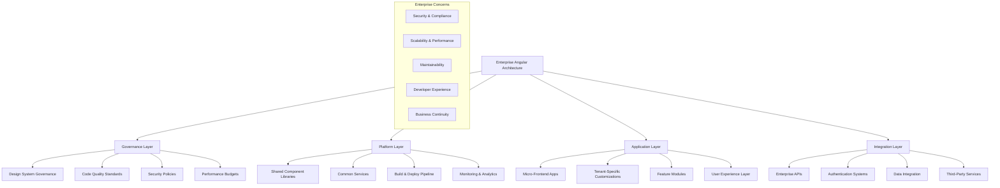
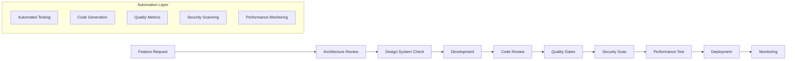

# Enterprise Patterns - Angular Material 3 Mastery

## 🏢 **Enterprise Patterns Overview**

Welcome to the **Enterprise Patterns** level of Angular Material 3 Mastery! This specialized track focuses on architectural patterns, governance frameworks, and organizational strategies that enable Angular Material 3 to scale across large enterprises with thousands of developers and millions of users.

## 🎯 **Enterprise Context & Challenges**

### **Organizational Scale**
Enterprise Angular applications face unique challenges that don't exist in smaller projects:
- **Team Coordination**: 50+ developers working on interconnected systems
- **Code Consistency**: Maintaining design and code standards across teams
- **Performance at Scale**: Applications serving millions of concurrent users
- **Security & Compliance**: Meeting enterprise security and regulatory requirements
- **Legacy Integration**: Connecting with existing enterprise systems and infrastructure

### **Technical Complexity**
- **Micro-Frontend Architecture**: Distributed development with independent deployments
- **Multi-Tenant Systems**: Serving different customers with isolated data and branding
- **Global Deployment**: Applications deployed across multiple regions and data centers
- **Enterprise Integration**: Seamless integration with ERP, CRM, and other enterprise systems
- **Observability & Monitoring**: Comprehensive monitoring, logging, and alerting systems

## 🏗️ **Enterprise Architecture Patterns**



## 📋 **Enterprise Pattern Modules**

### **🔒 Module 1: Security & Compliance Patterns** (2-3 weeks)
**Focus**: Enterprise-grade security implementation and compliance frameworks

#### **Core Security Patterns**
- **Zero Trust Architecture**: Never trust, always verify security model
- **Multi-Factor Authentication**: Advanced MFA with biometric and hardware keys
- **Role-Based Access Control**: Granular permissions with attribute-based extensions
- **Data Loss Prevention**: Client-side data protection and monitoring
- **Security Headers**: Advanced CSP, HSTS, and security header implementation
- **Audit Logging**: Comprehensive user action and system event logging

#### **Compliance Frameworks**
- **SOC 2 Compliance**: Security controls and audit trail implementation
- **GDPR Compliance**: Data privacy, consent management, and right to erasure
- **HIPAA Compliance**: Healthcare data protection and encryption
- **PCI DSS**: Payment card industry security standards
- **ISO 27001**: Information security management systems
- **FedRAMP**: Federal risk and authorization management program

### **🚀 Module 2: Scalability & Performance Patterns** (3-4 weeks)
**Focus**: Building applications that scale to millions of users

#### **Scalability Patterns**
- **Horizontal Scaling**: Stateless application design for cloud scaling
- **Micro-Frontend Architecture**: Independent scaling of application modules
- **Edge Computing**: CDN integration and edge-side rendering
- **Database Sharding**: Client-side data partitioning strategies
- **Caching Hierarchies**: Multi-level caching with intelligent invalidation
- **Load Balancing**: Client-side load balancing and failover strategies

#### **Performance Engineering**
- **Bundle Optimization**: Advanced webpack optimization and code splitting
- **Runtime Performance**: Memory management and CPU optimization
- **Network Optimization**: HTTP/3, connection pooling, and request optimization
- **Rendering Performance**: Virtual DOM optimization and rendering strategies
- **Monitoring & Profiling**: Real-time performance monitoring and alerting
- **Performance Budgets**: Automated performance regression prevention

### **🎨 Module 3: Multi-Tenant Theming Architecture** (2-3 weeks)
**Focus**: Scalable theming systems for multi-tenant applications

#### **Advanced Theming Patterns**
- **Tenant Isolation**: Complete theme and asset isolation between tenants
- **Dynamic Theme Loading**: Runtime theme switching without page reload
- **Theme Inheritance**: Hierarchical theme systems with cascading overrides
- **Brand Consistency**: Automated brand guideline enforcement
- **Performance Optimization**: Efficient theme loading and caching strategies
- **Designer Integration**: Tools for non-technical theme customization

#### **Implementation Architecture**
```typescript
// Enterprise theme architecture
export interface EnterpriseThemeSystem {
  tenantManagement: {
    isolation: TenantIsolationStrategy;
    inheritance: ThemeInheritanceTree;
    customization: ThemeCustomizationRules;
    validation: ThemeValidationPipeline;
  };
  
  performance: {
    loading: LazyThemeLoadingStrategy;
    caching: ThemeCachingStrategy;
    optimization: ThemeOptimizationPipeline;
    bundling: ThemeBundlingStrategy;
  };
  
  governance: {
    approvalWorkflow: ThemeApprovalProcess;
    versionControl: ThemeVersioningSystem;
    rollback: ThemeRollbackStrategy;
    monitoring: ThemePerformanceMonitoring;
  };
}
```

### **🔧 Module 4: Developer Experience & Tooling** (3-4 weeks)
**Focus**: Building tools and processes that enhance developer productivity

#### **Development Infrastructure**
- **CLI Extensions**: Custom Angular CLI schematics for enterprise patterns
- **Code Generation**: Automated component and service generation
- **Quality Gates**: Automated code quality and security scanning
- **Development Environment**: Standardized development setup and tooling
- **Testing Infrastructure**: Advanced testing patterns and automation
- **Documentation Systems**: Automated documentation generation and maintenance

#### **Enterprise Development Workflow**


## 🎯 **Enterprise Learning Objectives**

### **🏗️ Architectural Excellence**
- **System Design**: Design systems that scale across organizational boundaries
- **Pattern Recognition**: Identify and implement proven enterprise patterns
- **Integration Strategy**: Seamlessly integrate with existing enterprise infrastructure
- **Governance Framework**: Establish and maintain architectural governance
- **Risk Management**: Identify and mitigate technical and business risks

### **👥 Organizational Impact**
- **Team Enablement**: Create tools and processes that enhance team productivity
- **Knowledge Transfer**: Establish patterns for sharing knowledge across teams
- **Standards Development**: Create and maintain enterprise development standards
- **Process Optimization**: Streamline development and deployment processes
- **Culture Building**: Foster a culture of technical excellence and collaboration

### **🚀 Business Alignment**
- **Strategic Thinking**: Align technical decisions with business objectives
- **ROI Optimization**: Demonstrate and optimize return on technology investment
- **Risk Mitigation**: Identify and address business risks through technology
- **Innovation Leadership**: Drive innovation while maintaining stability
- **Stakeholder Communication**: Effectively communicate technical concepts to business leaders

## 📊 **Enterprise Success Metrics**

### **Technical Metrics**
- **Performance**: 99.99% uptime with sub-second response times
- **Scalability**: Support for 10x user growth without architecture changes
- **Security**: Zero security incidents and compliance audit success
- **Quality**: 95%+ code coverage with minimal production defects
- **Efficiency**: 50% reduction in development time for new features

### **Business Metrics**
- **Developer Productivity**: Measurable improvement in team velocity
- **Time to Market**: Faster delivery of new features and products
- **Operational Efficiency**: Reduced infrastructure and maintenance costs
- **Risk Reduction**: Improved security posture and compliance
- **Innovation Rate**: Increased ability to experiment and innovate

### **Organizational Metrics**
- **Team Satisfaction**: High developer satisfaction and retention
- **Knowledge Sharing**: Effective knowledge transfer across teams
- **Standard Adoption**: High adoption of enterprise standards and patterns
- **Process Efficiency**: Streamlined development and deployment processes
- **Cultural Impact**: Positive impact on engineering culture and practices

## 🎓 **Enterprise Career Paths**

### **Technical Leadership Tracks**
- **Principal Engineer**: Deep technical expertise with organizational impact
- **Technical Architect**: System design and architectural decision making
- **Distinguished Engineer**: Industry-wide technical leadership and innovation
- **Chief Technology Officer**: Strategic technology leadership for the organization

### **Engineering Management Tracks**
- **Engineering Manager**: Leading development teams and technical initiatives
- **Director of Engineering**: Managing multiple teams and technical strategy
- **Vice President of Engineering**: Organizational technology leadership
- **Chief Engineering Officer**: Executive-level engineering leadership

### **Specialized Expert Tracks**
- **Developer Experience Engineer**: Focus on tools and developer productivity
- **Security Architect**: Specialized in enterprise security and compliance
- **Performance Engineer**: Expert in scalability and performance optimization
- **Platform Engineer**: Building and maintaining developer platforms

## 🛠️ **Enterprise Toolchain**

### **Development Tools**
- **IDE Extensions**: Custom VS Code extensions for enterprise patterns
- **CLI Tools**: Specialized Angular CLI schematics and builders
- **Code Analysis**: Advanced static analysis and quality metrics
- **Documentation**: Automated API documentation and architecture diagrams
- **Testing**: Comprehensive testing frameworks and utilities

### **Infrastructure Tools**
- **CI/CD Pipelines**: Advanced deployment and release management
- **Monitoring**: Application performance monitoring and alerting
- **Security**: Vulnerability scanning and compliance checking
- **Analytics**: Developer productivity and application usage analytics
- **Governance**: Automated policy enforcement and compliance reporting

### **Collaboration Tools**
- **Design Systems**: Integrated design system management and versioning
- **Code Review**: Advanced code review workflows and automation
- **Knowledge Management**: Technical documentation and knowledge bases
- **Communication**: Async communication tools for distributed teams
- **Project Management**: Integration with enterprise project management systems

## 🔄 **Enterprise Implementation Strategy**

### **Phase 1: Assessment & Planning** (2-4 weeks)
- **Current State Analysis**: Comprehensive assessment of existing systems
- **Future State Design**: Architecture and roadmap for enterprise patterns
- **Risk Assessment**: Identification of technical and business risks
- **Resource Planning**: Team structure and skill development planning
- **Stakeholder Alignment**: Buy-in from technical and business leadership

### **Phase 2: Foundation Building** (6-8 weeks)
- **Core Infrastructure**: Shared libraries, tooling, and development environment
- **Governance Framework**: Standards, processes, and quality gates
- **Security Implementation**: Authentication, authorization, and compliance
- **Performance Foundation**: Monitoring, optimization, and performance budgets
- **Team Enablement**: Training, documentation, and support systems

### **Phase 3: Pattern Implementation** (8-12 weeks)
- **Pilot Projects**: Implementation of patterns in selected applications
- **Template Development**: Reusable patterns and code templates
- **Tool Development**: Custom tools for enterprise-specific needs
- **Process Refinement**: Continuous improvement of development processes
- **Knowledge Transfer**: Training and documentation for broader adoption

### **Phase 4: Scale & Optimize** (Ongoing)
- **Organization-wide Rollout**: Gradual adoption across all teams
- **Continuous Improvement**: Regular assessment and optimization
- **Innovation Integration**: Adoption of new technologies and patterns
- **Community Building**: Internal communities of practice
- **External Engagement**: Industry leadership and open source contribution

## 📚 **Enterprise Resources**

### **Architecture References**
- [Enterprise Integration Patterns](https://www.enterpriseintegrationpatterns.com/)
- [Building Evolutionary Architectures](https://www.thoughtworks.com/books/building-evolutionary-architectures)
- [Microservices Patterns](https://microservices.io/patterns/)
- [Domain-Driven Design](https://domainlanguage.com/ddd/)

### **Security & Compliance**
- [OWASP Security Guidelines](https://owasp.org/www-project-web-security-testing-guide/)
- [NIST Cybersecurity Framework](https://www.nist.gov/cyberframework)
- [SOC 2 Compliance Guide](https://www.aicpa.org/interestareas/frc/assuranceadvisoryservices/aicpasoc2report.html)
- [GDPR Implementation Guide](https://gdpr.eu/implementation/)

### **Performance & Scalability**
- [High Performance Browser Networking](https://hpbn.co/)
- [Designing Data-Intensive Applications](https://dataintensive.net/)
- [Site Reliability Engineering](https://sre.google/books/)
- [Web Performance Optimization](https://web.dev/performance/)

## 🚀 **Ready for Enterprise Mastery?**

### **Enterprise Readiness Assessment**
Before beginning enterprise pattern implementation, ensure you have:

- [ ] **Technical Leadership Experience**: Successfully led technical teams or initiatives
- [ ] **Architecture Expertise**: Deep understanding of system architecture patterns
- [ ] **Business Acumen**: Understanding of business strategy and organizational dynamics
- [ ] **Communication Skills**: Ability to communicate technical concepts to diverse audiences
- [ ] **Change Management**: Experience with organizational change and adoption strategies
- [ ] **Enterprise Context**: Understanding of enterprise constraints and requirements

### **Getting Started with Enterprise Patterns**
1. **Assess Current State**: Evaluate existing architecture and organizational maturity
2. **Build Coalition**: Establish support from technical and business leadership
3. **Start Small**: Begin with pilot projects to prove value and learn
4. **Measure Impact**: Establish metrics to demonstrate success and guide decisions
5. **Scale Gradually**: Expand adoption based on success and organizational readiness

---

**Welcome to Enterprise Mastery!** 🏢

*At this level, your impact extends far beyond individual applications. You're shaping the technical foundation that enables entire organizations to deliver value at scale while maintaining quality, security, and developer productivity.*

**Transform your organization through technical excellence!** ⚡

---

*Enterprise patterns are about more than just code – they're about creating sustainable, scalable systems that enable organizations to achieve their strategic objectives while empowering developers to do their best work.*
