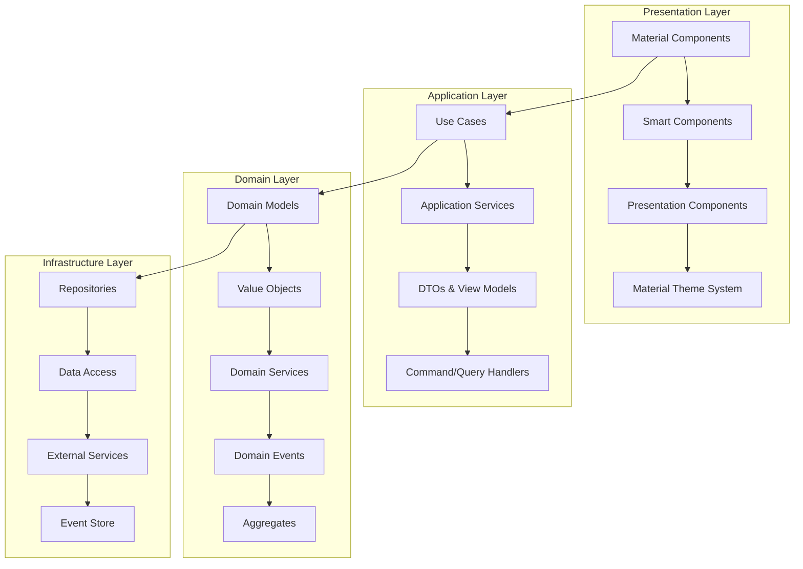

# Domain-Driven Design with Angular Material - Enterprise Implementation

## 🎯 **Overview**

Implement Domain-Driven Design (DDD) principles in Angular Material 3 applications to create maintainable, scalable enterprise systems with clear business logic separation and robust architecture.

## 🏗️ **DDD Architecture with Angular Material**



## 🎨 **Implementation Guide**

### **1. Domain Model Implementation**

#### **User Domain Model**
```typescript
// libs/shared/domain/src/lib/models/user.domain.ts
export class User {
  constructor(
    private readonly id: UserId,
    private readonly profile: UserProfile,
    private readonly preferences: UserPreferences,
    private readonly permissions: UserPermissions
  ) {}
  
  updateProfile(profile: Partial<UserProfile>): User {
    const updatedProfile = UserProfile.create({
      ...this.profile.getValue(),
      ...profile
    });
    
    return new User(this.id, updatedProfile, this.preferences, this.permissions);
  }
  
  updateThemePreferences(theme: ThemePreferences): Result<User, DomainError> {
    // Domain validation
    if (!this.canUpdateTheme()) {
      return Result.failure(new InsufficientPermissionsError('Theme update not allowed'));
    }
    
    const validatedTheme = this.validateThemePreferences(theme);
    if (validatedTheme.isFailure()) {
      return Result.failure(validatedTheme.getError());
    }
    
    const updatedPreferences = this.preferences.updateTheme(validatedTheme.getValue());
    
    // Emit domain event
    DomainEvents.raise(new UserThemeUpdatedEvent(this.id, theme));
    
    return Result.success(
      new User(this.id, this.profile, updatedPreferences, this.permissions)
    );
  }
  
  hasPermission(permission: Permission): boolean {
    return this.permissions.has(permission);
  }
  
  canAccessFeature(feature: Feature): boolean {
    return this.hasPermission(feature.requiredPermission) &&
           feature.isEnabledForUser(this);
  }
  
  private canUpdateTheme(): boolean {
    return this.hasPermission(Permission.UPDATE_THEME) &&
           this.profile.isActive();
  }
  
  private validateThemePreferences(theme: ThemePreferences): Result<ThemePreferences, DomainError> {
    // Validate theme constraints
    if (!theme.isValid()) {
      return Result.failure(new InvalidThemeError('Invalid theme configuration'));
    }
    
    // Check organization policies
    if (!this.permissions.allowsThemeCustomization()) {
      return Result.failure(new ThemePolicyViolationError('Organization policy violation'));
    }
    
    return Result.success(theme);
  }
  
  // Getters for value objects
  getId(): UserId { return this.id; }
  getProfile(): UserProfile { return this.profile; }
  getPreferences(): UserPreferences { return this.preferences; }
  getPermissions(): UserPermissions { return this.permissions; }
}

// Value Objects
export class UserId {
  constructor(private readonly value: string) {
    if (!value || value.trim().length === 0) {
      throw new Error('UserId cannot be empty');
    }
  }
  
  getValue(): string { return this.value; }
  equals(other: UserId): boolean { return this.value === other.value; }
}

export class UserProfile {
  private constructor(
    private readonly firstName: string,
    private readonly lastName: string,
    private readonly email: string,
    private readonly avatar: string,
    private readonly isActive: boolean
  ) {}
  
  static create(data: {
    firstName: string;
    lastName: string;
    email: string;
    avatar?: string;
    isActive?: boolean;
  }): UserProfile {
    // Validation
    if (!data.firstName || !data.lastName || !data.email) {
      throw new Error('Required profile fields missing');
    }
    
    if (!this.isValidEmail(data.email)) {
      throw new Error('Invalid email format');
    }
    
    return new UserProfile(
      data.firstName,
      data.lastName,
      data.email,
      data.avatar || '',
      data.isActive ?? true
    );
  }
  
  getFullName(): string {
    return `${this.firstName} ${this.lastName}`;
  }
  
  getInitials(): string {
    return `${this.firstName.charAt(0)}${this.lastName.charAt(0)}`.toUpperCase();
  }
  
  isActive(): boolean { return this.isActive; }
  
  getValue(): {
    firstName: string;
    lastName: string;
    email: string;
    avatar: string;
    isActive: boolean;
  } {
    return {
      firstName: this.firstName,
      lastName: this.lastName,
      email: this.email,
      avatar: this.avatar,
      isActive: this.isActive
    };
  }
  
  private static isValidEmail(email: string): boolean {
    const emailRegex = /^[^\s@]+@[^\s@]+\.[^\s@]+$/;
    return emailRegex.test(email);
  }
}
```

#### **Theme Domain Model**
```typescript
// libs/shared/domain/src/lib/models/theme.domain.ts
export class Theme {
  constructor(
    private readonly id: ThemeId,
    private readonly name: string,
    private readonly colors: ThemeColors,
    private readonly typography: ThemeTypography,
    private readonly spacing: ThemeSpacing,
    private readonly organizationId: OrganizationId,
    private readonly isPublic: boolean,
    private readonly version: Version
  ) {}
  
  updateColors(colors: Partial<ThemeColorsData>): Result<Theme, DomainError> {
    const updatedColors = this.colors.update(colors);
    if (updatedColors.isFailure()) {
      return Result.failure(updatedColors.getError());
    }
    
    // Validate accessibility requirements
    const accessibilityResult = this.validateAccessibility(updatedColors.getValue());
    if (accessibilityResult.isFailure()) {
      return Result.failure(accessibilityResult.getError());
    }
    
    return Result.success(
      new Theme(
        this.id,
        this.name,
        updatedColors.getValue(),
        this.typography,
        this.spacing,
        this.organizationId,
        this.isPublic,
        this.version.increment()
      )
    );
  }
  
  createVariant(name: string, modifications: ThemeModifications): Result<Theme, DomainError> {
    // Validate variant name
    if (!name || name.trim().length === 0) {
      return Result.failure(new InvalidThemeNameError('Variant name cannot be empty'));
    }
    
    // Apply modifications
    const modifiedColors = modifications.colors ? 
      this.colors.update(modifications.colors) : Result.success(this.colors);
    
    if (modifiedColors.isFailure()) {
      return Result.failure(modifiedColors.getError());
    }
    
    const modifiedTypography = modifications.typography ?
      this.typography.update(modifications.typography) : this.typography;
    
    const newThemeId = ThemeId.generate();
    
    return Result.success(
      new Theme(
        newThemeId,
        name,
        modifiedColors.getValue(),
        modifiedTypography,
        this.spacing,
        this.organizationId,
        false, // Variants are private by default
        Version.initial()
      )
    );
  }
  
  canBeAccessedBy(user: User): boolean {
    return this.isPublic || 
           user.getProfile().getOrganizationId().equals(this.organizationId) ||
           user.hasPermission(Permission.ACCESS_ALL_THEMES);
  }
  
  generateMaterialTokens(): MaterialTokens {
    return {
      // Color tokens
      'md-sys-color-primary': this.colors.getPrimary(),
      'md-sys-color-on-primary': this.colors.getOnPrimary(),
      'md-sys-color-secondary': this.colors.getSecondary(),
      'md-sys-color-on-secondary': this.colors.getOnSecondary(),
      'md-sys-color-surface': this.colors.getSurface(),
      'md-sys-color-on-surface': this.colors.getOnSurface(),
      
      // Typography tokens
      'md-sys-typescale-headline-large-font': this.typography.getHeadlineFont(),
      'md-sys-typescale-headline-large-size': this.typography.getHeadlineSize(),
      'md-sys-typescale-body-large-font': this.typography.getBodyFont(),
      'md-sys-typescale-body-large-size': this.typography.getBodySize(),
      
      // Spacing tokens
      'md-sys-spacing-small': this.spacing.getSmall(),
      'md-sys-spacing-medium': this.spacing.getMedium(),
      'md-sys-spacing-large': this.spacing.getLarge(),
      
      // Shape tokens
      'md-sys-shape-corner-small': '4px',
      'md-sys-shape-corner-medium': '8px',
      'md-sys-shape-corner-large': '12px'
    };
  }
  
  private validateAccessibility(colors: ThemeColors): Result<void, DomainError> {
    const contrastRatio = colors.calculateContrastRatio();
    
    if (contrastRatio < 4.5) {
      return Result.failure(
        new AccessibilityViolationError('Color contrast ratio must be at least 4.5:1')
      );
    }
    
    return Result.success(void 0);
  }
  
  // Getters
  getId(): ThemeId { return this.id; }
  getName(): string { return this.name; }
  getColors(): ThemeColors { return this.colors; }
  getTypography(): ThemeTypography { return this.typography; }
  getSpacing(): ThemeSpacing { return this.spacing; }
  getOrganizationId(): OrganizationId { return this.organizationId; }
  isPublicTheme(): boolean { return this.isPublic; }
  getVersion(): Version { return this.version; }
}

// Value Objects for Theme
export class ThemeColors {
  private constructor(
    private readonly primary: string,
    private readonly onPrimary: string,
    private readonly secondary: string,
    private readonly onSecondary: string,
    private readonly surface: string,
    private readonly onSurface: string,
    private readonly error: string,
    private readonly onError: string
  ) {}
  
  static create(data: ThemeColorsData): Result<ThemeColors, DomainError> {
    // Validate color formats
    const colors = [data.primary, data.onPrimary, data.secondary, data.onSecondary, 
                   data.surface, data.onSurface, data.error, data.onError];
    
    for (const color of colors) {
      if (!this.isValidColor(color)) {
        return Result.failure(new InvalidColorError(`Invalid color format: ${color}`));
      }
    }
    
    return Result.success(new ThemeColors(
      data.primary,
      data.onPrimary,
      data.secondary,
      data.onSecondary,
      data.surface,
      data.onSurface,
      data.error,
      data.onError
    ));
  }
  
  update(updates: Partial<ThemeColorsData>): Result<ThemeColors, DomainError> {
    const newData = {
      primary: updates.primary ?? this.primary,
      onPrimary: updates.onPrimary ?? this.onPrimary,
      secondary: updates.secondary ?? this.secondary,
      onSecondary: updates.onSecondary ?? this.onSecondary,
      surface: updates.surface ?? this.surface,
      onSurface: updates.onSurface ?? this.onSurface,
      error: updates.error ?? this.error,
      onError: updates.onError ?? this.onError
    };
    
    return ThemeColors.create(newData);
  }
  
  calculateContrastRatio(): number {
    // Calculate WCAG contrast ratio between primary colors
    return this.calculateWCAGContrast(this.primary, this.onPrimary);
  }
  
  private static isValidColor(color: string): boolean {
    // Validate hex, rgb, hsl, or named colors
    const hexRegex = /^#([A-Fa-f0-9]{6}|[A-Fa-f0-9]{3})$/;
    const rgbRegex = /^rgb\((\d{1,3}),\s*(\d{1,3}),\s*(\d{1,3})\)$/;
    const hslRegex = /^hsl\((\d{1,3}),\s*(\d{1,3})%,\s*(\d{1,3})%\)$/;
    
    return hexRegex.test(color) || rgbRegex.test(color) || hslRegex.test(color);
  }
  
  private calculateWCAGContrast(color1: string, color2: string): number {
    // Implementation of WCAG contrast calculation
    const rgb1 = this.hexToRgb(color1);
    const rgb2 = this.hexToRgb(color2);
    
    const l1 = this.getLuminance(rgb1);
    const l2 = this.getLuminance(rgb2);
    
    const lighter = Math.max(l1, l2);
    const darker = Math.min(l1, l2);
    
    return (lighter + 0.05) / (darker + 0.05);
  }
  
  private hexToRgb(hex: string): { r: number; g: number; b: number } {
    const result = /^#?([a-f\d]{2})([a-f\d]{2})([a-f\d]{2})$/i.exec(hex);
    return result ? {
      r: parseInt(result[1], 16),
      g: parseInt(result[2], 16),
      b: parseInt(result[3], 16)
    } : { r: 0, g: 0, b: 0 };
  }
  
  private getLuminance(rgb: { r: number; g: number; b: number }): number {
    const { r, g, b } = rgb;
    const [rs, gs, bs] = [r, g, b].map(c => {
      c = c / 255;
      return c <= 0.03928 ? c / 12.92 : Math.pow((c + 0.055) / 1.055, 2.4);
    });
    
    return 0.2126 * rs + 0.7152 * gs + 0.0722 * bs;
  }
  
  // Getters
  getPrimary(): string { return this.primary; }
  getOnPrimary(): string { return this.onPrimary; }
  getSecondary(): string { return this.secondary; }
  getOnSecondary(): string { return this.onSecondary; }
  getSurface(): string { return this.surface; }
  getOnSurface(): string { return this.onSurface; }
  getError(): string { return this.error; }
  getOnError(): string { return this.onError; }
}
```

### **2. Domain Services**

#### **Theme Domain Service**
```typescript
// libs/shared/domain/src/lib/services/theme.domain.service.ts
@Injectable()
export class ThemeDomainService {
  constructor(
    private readonly organizationRepository: OrganizationRepository,
    private readonly accessibilityValidator: AccessibilityValidator
  ) {}
  
  async canUserCreateTheme(user: User): Promise<boolean> {
    // Check user permissions
    if (!user.hasPermission(Permission.CREATE_THEME)) {
      return false;
    }
    
    // Check organization limits
    const organization = await this.organizationRepository.findById(
      user.getProfile().getOrganizationId()
    );
    
    if (!organization) {
      return false;
    }
    
    return organization.hasAvailableThemeSlots();
  }
  
  async validateThemeForOrganization(
    theme: Theme,
    organization: Organization
  ): Promise<Result<void, DomainError>> {
    const validationErrors: DomainError[] = [];
    
    // Brand compliance validation
    const brandValidation = this.validateBrandCompliance(theme, organization);
    if (brandValidation.isFailure()) {
      validationErrors.push(brandValidation.getError());
    }
    
    // Accessibility validation
    const accessibilityValidation = await this.validateAccessibility(theme);
    if (accessibilityValidation.isFailure()) {
      validationErrors.push(accessibilityValidation.getError());
    }
    
    // Performance validation
    const performanceValidation = this.validatePerformance(theme);
    if (performanceValidation.isFailure()) {
      validationErrors.push(performanceValidation.getError());
    }
    
    if (validationErrors.length > 0) {
      return Result.failure(new ThemeValidationError(validationErrors));
    }
    
    return Result.success(void 0);
  }
  
  calculateThemeCompatibility(theme1: Theme, theme2: Theme): ThemeCompatibility {
    const colorCompatibility = this.calculateColorCompatibility(
      theme1.getColors(),
      theme2.getColors()
    );
    
    const typographyCompatibility = this.calculateTypographyCompatibility(
      theme1.getTypography(),
      theme2.getTypography()
    );
    
    const spacingCompatibility = this.calculateSpacingCompatibility(
      theme1.getSpacing(),
      theme2.getSpacing()
    );
    
    return new ThemeCompatibility(
      colorCompatibility,
      typographyCompatibility,
      spacingCompatibility
    );
  }
  
  async generateThemeRecommendations(
    baseTheme: Theme,
    userPreferences: UserPreferences,
    organizationConstraints: OrganizationConstraints
  ): Promise<ThemeRecommendation[]> {
    const recommendations: ThemeRecommendation[] = [];
    
    // Accessibility improvements
    const accessibilityRecommendations = await this.generateAccessibilityRecommendations(baseTheme);
    recommendations.push(...accessibilityRecommendations);
    
    // Performance optimizations
    const performanceRecommendations = this.generatePerformanceRecommendations(baseTheme);
    recommendations.push(...performanceRecommendations);
    
    // Brand compliance suggestions
    const brandRecommendations = this.generateBrandRecommendations(baseTheme, organizationConstraints);
    recommendations.push(...brandRecommendations);
    
    // User preference alignments
    const preferenceRecommendations = this.generatePreferenceRecommendations(baseTheme, userPreferences);
    recommendations.push(...preferenceRecommendations);
    
    return recommendations.sort((a, b) => b.priority - a.priority);
  }
  
  private validateBrandCompliance(
    theme: Theme,
    organization: Organization
  ): Result<void, DomainError> {
    const brandGuidelines = organization.getBrandGuidelines();
    
    // Validate primary colors
    if (!brandGuidelines.isPrimaryColorAllowed(theme.getColors().getPrimary())) {
      return Result.failure(
        new BrandComplianceError('Primary color violates brand guidelines')
      );
    }
    
    // Validate typography
    if (!brandGuidelines.isTypographyAllowed(theme.getTypography())) {
      return Result.failure(
        new BrandComplianceError('Typography violates brand guidelines')
      );
    }
    
    return Result.success(void 0);
  }
  
  private async validateAccessibility(theme: Theme): Promise<Result<void, DomainError>> {
    const validationResult = await this.accessibilityValidator.validate(theme);
    
    if (!validationResult.isValid()) {
      return Result.failure(
        new AccessibilityViolationError(validationResult.getViolations())
      );
    }
    
    return Result.success(void 0);
  }
  
  private validatePerformance(theme: Theme): Result<void, DomainError> {
    const tokens = theme.generateMaterialTokens();
    const tokenCount = Object.keys(tokens).length;
    
    // Validate token count
    if (tokenCount > 500) {
      return Result.failure(
        new PerformanceError('Theme has too many tokens, may impact performance')
      );
    }
    
    // Validate color complexity
    const colors = theme.getColors();
    if (this.hasComplexColorCalculations(colors)) {
      return Result.failure(
        new PerformanceError('Theme has complex color calculations that may impact performance')
      );
    }
    
    return Result.success(void 0);
  }
  
  private calculateColorCompatibility(colors1: ThemeColors, colors2: ThemeColors): number {
    // Calculate color harmony score between two color schemes
    const primaryHarmony = this.calculateColorHarmony(colors1.getPrimary(), colors2.getPrimary());
    const secondaryHarmony = this.calculateColorHarmony(colors1.getSecondary(), colors2.getSecondary());
    const surfaceHarmony = this.calculateColorHarmony(colors1.getSurface(), colors2.getSurface());
    
    return (primaryHarmony + secondaryHarmony + surfaceHarmony) / 3;
  }
  
  private calculateColorHarmony(color1: string, color2: string): number {
    // Implementation of color harmony calculation
    // This would involve color theory algorithms
    // Returns a score between 0 and 1
    
    const hsl1 = this.hexToHsl(color1);
    const hsl2 = this.hexToHsl(color2);
    
    const hueDifference = Math.abs(hsl1.h - hsl2.h);
    const saturationDifference = Math.abs(hsl1.s - hsl2.s);
    const lightnessDifference = Math.abs(hsl1.l - hsl2.l);
    
    // Calculate harmony based on color theory rules
    const harmonyScore = 1 - (
      (hueDifference / 360) * 0.4 +
      (saturationDifference / 100) * 0.3 +
      (lightnessDifference / 100) * 0.3
    );
    
    return Math.max(0, harmonyScore);
  }
  
  private hexToHsl(hex: string): { h: number; s: number; l: number } {
    // Convert hex to HSL for color harmony calculations
    const rgb = this.hexToRgb(hex);
    const r = rgb.r / 255;
    const g = rgb.g / 255;
    const b = rgb.b / 255;
    
    const max = Math.max(r, g, b);
    const min = Math.min(r, g, b);
    let h: number, s: number;
    const l = (max + min) / 2;
    
    if (max === min) {
      h = s = 0; // achromatic
    } else {
      const d = max - min;
      s = l > 0.5 ? d / (2 - max - min) : d / (max + min);
      
      switch (max) {
        case r: h = (g - b) / d + (g < b ? 6 : 0); break;
        case g: h = (b - r) / d + 2; break;
        case b: h = (r - g) / d + 4; break;
        default: h = 0;
      }
      
      h /= 6;
    }
    
    return { h: h * 360, s: s * 100, l: l * 100 };
  }
  
  private hexToRgb(hex: string): { r: number; g: number; b: number } {
    const result = /^#?([a-f\d]{2})([a-f\d]{2})([a-f\d]{2})$/i.exec(hex);
    return result ? {
      r: parseInt(result[1], 16),
      g: parseInt(result[2], 16),
      b: parseInt(result[3], 16)
    } : { r: 0, g: 0, b: 0 };
  }
  
  private hasComplexColorCalculations(colors: ThemeColors): boolean {
    // Check if theme uses complex color calculations that might impact performance
    // This is a simplified check - in reality, this would be more sophisticated
    return false;
  }
}
```

### **3. Application Services**

#### **Theme Application Service**
```typescript
// libs/theme-management/application/src/lib/services/theme-application.service.ts
@Injectable()
export class ThemeApplicationService {
  constructor(
    private readonly themeRepository: ThemeRepository,
    private readonly userRepository: UserRepository,
    private readonly organizationRepository: OrganizationRepository,
    private readonly themeDomainService: ThemeDomainService,
    private readonly eventBus: EventBus,
    private readonly logger: Logger
  ) {}
  
  async createTheme(command: CreateThemeCommand): Promise<Result<ThemeDto, ApplicationError>> {
    try {
      // Get user
      const user = await this.userRepository.findById(new UserId(command.userId));
      if (!user) {
        return Result.failure(new UserNotFoundError(command.userId));
      }
      
      // Check permissions
      const canCreate = await this.themeDomainService.canUserCreateTheme(user);
      if (!canCreate) {
        return Result.failure(new InsufficientPermissionsError('Cannot create theme'));
      }
      
      // Create theme domain object
      const themeResult = this.createThemeFromCommand(command, user);
      if (themeResult.isFailure()) {
        return Result.failure(themeResult.getError());
      }
      
      const theme = themeResult.getValue();
      
      // Validate theme
      const organization = await this.organizationRepository.findById(
        user.getProfile().getOrganizationId()
      );
      
      if (organization) {
        const validationResult = await this.themeDomainService.validateThemeForOrganization(
          theme,
          organization
        );
        
        if (validationResult.isFailure()) {
          return Result.failure(validationResult.getError());
        }
      }
      
      // Save theme
      await this.themeRepository.save(theme);
      
      // Publish domain event
      this.eventBus.publish(new ThemeCreatedEvent(theme.getId().getValue(), command.userId));
      
      // Log success
      this.logger.info(`Theme created: ${theme.getId().getValue()} by user: ${command.userId}`);
      
      // Return DTO
      return Result.success(this.mapToDto(theme));
      
    } catch (error) {
      this.logger.error(`Failed to create theme: ${error.message}`, error);
      return Result.failure(new ApplicationError('Failed to create theme'));
    }
  }
  
  async updateTheme(command: UpdateThemeCommand): Promise<Result<ThemeDto, ApplicationError>> {
    try {
      // Get existing theme
      const existingTheme = await this.themeRepository.findById(new ThemeId(command.themeId));
      if (!existingTheme) {
        return Result.failure(new ThemeNotFoundError(command.themeId));
      }
      
      // Get user
      const user = await this.userRepository.findById(new UserId(command.userId));
      if (!user) {
        return Result.failure(new UserNotFoundError(command.userId));
      }
      
      // Check permissions
      if (!this.canUserUpdateTheme(user, existingTheme)) {
        return Result.failure(new InsufficientPermissionsError('Cannot update theme'));
      }
      
      // Apply updates
      const updatedTheme = this.applyThemeUpdates(existingTheme, command);
      if (updatedTheme.isFailure()) {
        return Result.failure(updatedTheme.getError());
      }
      
      // Validate updated theme
      const organization = await this.organizationRepository.findById(
        user.getProfile().getOrganizationId()
      );
      
      if (organization) {
        const validationResult = await this.themeDomainService.validateThemeForOrganization(
          updatedTheme.getValue(),
          organization
        );
        
        if (validationResult.isFailure()) {
          return Result.failure(validationResult.getError());
        }
      }
      
      // Save updated theme
      await this.themeRepository.save(updatedTheme.getValue());
      
      // Publish domain event
      this.eventBus.publish(new ThemeUpdatedEvent(command.themeId, command.userId));
      
      this.logger.info(`Theme updated: ${command.themeId} by user: ${command.userId}`);
      
      return Result.success(this.mapToDto(updatedTheme.getValue()));
      
    } catch (error) {
      this.logger.error(`Failed to update theme: ${error.message}`, error);
      return Result.failure(new ApplicationError('Failed to update theme'));
    }
  }
  
  async getThemesByUser(query: GetThemesByUserQuery): Promise<Result<ThemeDto[], ApplicationError>> {
    try {
      const user = await this.userRepository.findById(new UserId(query.userId));
      if (!user) {
        return Result.failure(new UserNotFoundError(query.userId));
      }
      
      const themes = await this.themeRepository.findByUser(user);
      
      // Filter themes based on access permissions
      const accessibleThemes = themes.filter(theme => theme.canBeAccessedBy(user));
      
      const themeDtos = accessibleThemes.map(theme => this.mapToDto(theme));
      
      return Result.success(themeDtos);
      
    } catch (error) {
      this.logger.error(`Failed to get themes for user: ${error.message}`, error);
      return Result.failure(new ApplicationError('Failed to get themes'));
    }
  }
  
  async generateThemeRecommendations(
    query: GenerateThemeRecommendationsQuery
  ): Promise<Result<ThemeRecommendationDto[], ApplicationError>> {
    try {
      const user = await this.userRepository.findById(new UserId(query.userId));
      if (!user) {
        return Result.failure(new UserNotFoundError(query.userId));
      }
      
      const baseTheme = await this.themeRepository.findById(new ThemeId(query.baseThemeId));
      if (!baseTheme) {
        return Result.failure(new ThemeNotFoundError(query.baseThemeId));
      }
      
      const organization = await this.organizationRepository.findById(
        user.getProfile().getOrganizationId()
      );
      
      const organizationConstraints = organization?.getConstraints() || new OrganizationConstraints();
      
      const recommendations = await this.themeDomainService.generateThemeRecommendations(
        baseTheme,
        user.getPreferences(),
        organizationConstraints
      );
      
      const recommendationDtos = recommendations.map(rec => this.mapRecommendationToDto(rec));
      
      return Result.success(recommendationDtos);
      
    } catch (error) {
      this.logger.error(`Failed to generate theme recommendations: ${error.message}`, error);
      return Result.failure(new ApplicationError('Failed to generate recommendations'));
    }
  }
  
  private createThemeFromCommand(command: CreateThemeCommand, user: User): Result<Theme, DomainError> {
    // Create theme colors
    const colorsResult = ThemeColors.create({
      primary: command.colors.primary,
      onPrimary: command.colors.onPrimary,
      secondary: command.colors.secondary,
      onSecondary: command.colors.onSecondary,
      surface: command.colors.surface,
      onSurface: command.colors.onSurface,
      error: command.colors.error,
      onError: command.colors.onError
    });
    
    if (colorsResult.isFailure()) {
      return Result.failure(colorsResult.getError());
    }
    
    // Create theme typography
    const typography = ThemeTypography.create(command.typography);
    
    // Create theme spacing
    const spacing = ThemeSpacing.create(command.spacing);
    
    // Create theme
    const theme = new Theme(
      ThemeId.generate(),
      command.name,
      colorsResult.getValue(),
      typography,
      spacing,
      user.getProfile().getOrganizationId(),
      command.isPublic || false,
      Version.initial()
    );
    
    return Result.success(theme);
  }
  
  private canUserUpdateTheme(user: User, theme: Theme): boolean {
    return user.hasPermission(Permission.UPDATE_THEME) &&
           (theme.canBeAccessedBy(user) || user.hasPermission(Permission.UPDATE_ALL_THEMES));
  }
  
  private applyThemeUpdates(theme: Theme, command: UpdateThemeCommand): Result<Theme, DomainError> {
    let updatedTheme = theme;
    
    // Update colors if provided
    if (command.colors) {
      const colorUpdateResult = updatedTheme.updateColors(command.colors);
      if (colorUpdateResult.isFailure()) {
        return Result.failure(colorUpdateResult.getError());
      }
      updatedTheme = colorUpdateResult.getValue();
    }
    
    // Update other properties as needed
    // ... additional update logic
    
    return Result.success(updatedTheme);
  }
  
  private mapToDto(theme: Theme): ThemeDto {
    return {
      id: theme.getId().getValue(),
      name: theme.getName(),
      colors: {
        primary: theme.getColors().getPrimary(),
        onPrimary: theme.getColors().getOnPrimary(),
        secondary: theme.getColors().getSecondary(),
        onSecondary: theme.getColors().getOnSecondary(),
        surface: theme.getColors().getSurface(),
        onSurface: theme.getColors().getOnSurface(),
        error: theme.getColors().getError(),
        onError: theme.getColors().getOnError()
      },
      typography: this.mapTypographyToDto(theme.getTypography()),
      spacing: this.mapSpacingToDto(theme.getSpacing()),
      organizationId: theme.getOrganizationId().getValue(),
      isPublic: theme.isPublicTheme(),
      version: theme.getVersion().getValue(),
      materialTokens: theme.generateMaterialTokens()
    };
  }
  
  private mapTypographyToDto(typography: ThemeTypography): any {
    // Implementation details for mapping typography to DTO
    return {
      headlineFont: typography.getHeadlineFont(),
      bodyFont: typography.getBodyFont(),
      // ... other typography properties
    };
  }
  
  private mapSpacingToDto(spacing: ThemeSpacing): any {
    // Implementation details for mapping spacing to DTO
    return {
      small: spacing.getSmall(),
      medium: spacing.getMedium(),
      large: spacing.getLarge()
    };
  }
  
  private mapRecommendationToDto(recommendation: ThemeRecommendation): ThemeRecommendationDto {
    return {
      id: recommendation.getId(),
      title: recommendation.getTitle(),
      description: recommendation.getDescription(),
      priority: recommendation.getPriority(),
      category: recommendation.getCategory(),
      changes: recommendation.getChanges()
    };
  }
}
```

## 🎯 **Key Benefits**

### **1. Clear Business Logic Separation**
- Domain logic isolated from infrastructure concerns
- Business rules enforced through domain models
- Consistent validation across the application

### **2. Maintainable Architecture**
- Changes to business logic don't affect infrastructure
- Easy to test domain logic in isolation
- Clear boundaries between layers

### **3. Scalable Design**
- Domain services handle complex business operations
- Repository pattern abstracts data access
- Event-driven architecture enables loose coupling

### **4. Enterprise-Ready**
- Comprehensive error handling and validation
- Audit trail through domain events
- Security and permissions built into domain logic

## 🧪 **Testing Strategy**

### **1. Domain Model Tests**
```typescript
describe('Theme Domain Model', () => {
  it('should create valid theme with proper colors', () => {
    const colorsResult = ThemeColors.create({
      primary: '#1976d2',
      onPrimary: '#ffffff',
      secondary: '#dc004e',
      onSecondary: '#ffffff',
      surface: '#ffffff',
      onSurface: '#000000',
      error: '#f44336',
      onError: '#ffffff'
    });
    
    expect(colorsResult.isSuccess()).toBe(true);
    
    const colors = colorsResult.getValue();
    expect(colors.getPrimary()).toBe('#1976d2');
    expect(colors.calculateContrastRatio()).toBeGreaterThan(4.5);
  });
  
  it('should validate accessibility requirements', () => {
    const theme = createTestTheme();
    const lowContrastColors = ThemeColors.create({
      primary: '#ffffff',
      onPrimary: '#f0f0f0', // Low contrast
      // ... other colors
    });
    
    const updateResult = theme.updateColors(lowContrastColors.getValue().getValue());
    expect(updateResult.isFailure()).toBe(true);
    expect(updateResult.getError()).toBeInstanceOf(AccessibilityViolationError);
  });
});
```

### **2. Domain Service Tests**
```typescript
describe('ThemeDomainService', () => {
  it('should generate appropriate theme recommendations', async () => {
    const service = new ThemeDomainService(mockOrganizationRepo, mockAccessibilityValidator);
    const baseTheme = createTestTheme();
    const userPreferences = createTestUserPreferences();
    const orgConstraints = createTestOrgConstraints();
    
    const recommendations = await service.generateThemeRecommendations(
      baseTheme,
      userPreferences,
      orgConstraints
    );
    
    expect(recommendations).toBeDefined();
    expect(recommendations.length).toBeGreaterThan(0);
    expect(recommendations[0].getPriority()).toBeGreaterThan(0);
  });
});
```

### **3. Application Service Tests**
```typescript
describe('ThemeApplicationService', () => {
  it('should create theme with proper validation', async () => {
    const command = new CreateThemeCommand({
      userId: 'user-123',
      name: 'Test Theme',
      colors: createValidColors(),
      // ... other properties
    });
    
    const result = await service.createTheme(command);
    
    expect(result.isSuccess()).toBe(true);
    expect(mockThemeRepository.save).toHaveBeenCalled();
    expect(mockEventBus.publish).toHaveBeenCalledWith(
      expect.any(ThemeCreatedEvent)
    );
  });
});
```

---

*Domain-Driven Design provides the foundation for building maintainable, scalable Angular Material 3 applications with clear business logic separation and robust architecture.*
