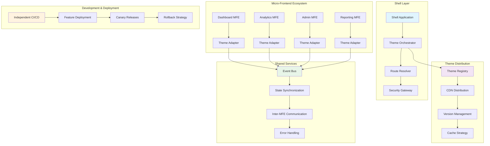

# Enterprise Micro-Frontend Patterns

## 🏗️ **Architectural Overview**

This guide provides comprehensive patterns for implementing micro-frontends at enterprise scale with Angular Material 3, focusing on theme consistency, performance optimization, and organizational scalability.

## 📊 **Architecture Diagram**



## 🎯 **Core Patterns**

### **1. Theme Orchestration Pattern**

```typescript
// Theme orchestration across multiple MFEs
@Injectable({
  providedIn: 'root'
})
export class ThemeOrchestrationService {
  private mfeRegistry = new Map<string, MicroFrontendInfo>();
  private themeState$ = new BehaviorSubject<GlobalThemeState>({
    currentTheme: null,
    loading: false,
    error: null
  });
  
  async orchestrateThemeChange(themeId: string): Promise<void> {
    this.themeState$.next({
      ...this.themeState$.value,
      loading: true
    });
    
    try {
      // Load theme configuration
      const theme = await this.loadTheme(themeId);
      
      // Apply to all MFEs in dependency order
      const sortedMFEs = this.getSortedMFEsByDependency();
      
      for (const mfe of sortedMFEs) {
        await this.applyThemeToMFE(mfe, theme);
        
        // Verify theme application
        await this.verifyThemeApplication(mfe, theme);
      }
      
      this.themeState$.next({
        currentTheme: theme,
        loading: false,
        error: null
      });
      
    } catch (error) {
      this.themeState$.next({
        ...this.themeState$.value,
        loading: false,
        error: error as Error
      });
      
      // Implement rollback strategy
      await this.rollbackThemeChange();
    }
  }
  
  private getSortedMFEsByDependency(): MicroFrontendInfo[] {
    // Implement topological sort based on dependencies
    const graph = new Map<string, string[]>();
    const visited = new Set<string>();
    const result: MicroFrontendInfo[] = [];
    
    // Build dependency graph
    for (const [mfeId, info] of this.mfeRegistry) {
      graph.set(mfeId, info.dependencies || []);
    }
    
    // Topological sort implementation
    const visit = (mfeId: string) => {
      if (visited.has(mfeId)) return;
      visited.add(mfeId);
      
      const dependencies = graph.get(mfeId) || [];
      dependencies.forEach(depId => visit(depId));
      
      const mfeInfo = this.mfeRegistry.get(mfeId);
      if (mfeInfo) {
        result.push(mfeInfo);
      }
    };
    
    for (const mfeId of this.mfeRegistry.keys()) {
      visit(mfeId);
    }
    
    return result;
  }
}
```

### **2. Inter-MFE Communication Pattern**

```typescript
// Secure communication between micro-frontends
@Injectable({
  providedIn: 'root'
})
export class InterMFECommunicationService {
  private communicationBridge = new Map<string, MessageChannel>();
  private securityTokens = new Map<string, string>();
  
  establishSecureChannel(
    sourceMFE: string, 
    targetMFE: string, 
    permissions: string[]
  ): string {
    const channelId = this.generateChannelId(sourceMFE, targetMFE);
    const securityToken = this.generateSecurityToken();
    
    // Create message channel
    const channel = new MessageChannel();
    this.communicationBridge.set(channelId, channel);
    this.securityTokens.set(channelId, securityToken);
    
    // Setup message handlers with security validation
    channel.port1.onmessage = (event) => {
      this.handleSecureMessage(event, sourceMFE, targetMFE, permissions);
    };
    
    return channelId;
  }
  
  sendSecureMessage(
    channelId: string, 
    message: InterMFEMessage, 
    securityToken: string
  ): void {
    // Validate security token
    if (!this.validateSecurityToken(channelId, securityToken)) {
      throw new Error('Invalid security token');
    }
    
    // Encrypt message payload
    const encryptedMessage = this.encryptMessage(message);
    
    // Send message through secure channel
    const channel = this.communicationBridge.get(channelId);
    if (channel) {
      channel.port2.postMessage(encryptedMessage);
    }
  }
  
  private handleSecureMessage(
    event: MessageEvent,
    sourceMFE: string,
    targetMFE: string,
    permissions: string[]
  ): void {
    try {
      // Decrypt message
      const message = this.decryptMessage(event.data);
      
      // Validate permissions
      if (!this.validatePermissions(message.action, permissions)) {
        throw new Error('Insufficient permissions');
      }
      
      // Route message to appropriate handler
      this.routeMessage(targetMFE, message);
      
    } catch (error) {
      console.error('Failed to handle inter-MFE message:', error);
      this.reportSecurityViolation(sourceMFE, targetMFE, error);
    }
  }
}
```

### **3. Distributed State Management Pattern**

```typescript
// State synchronization across micro-frontends
@Injectable({
  providedIn: 'root'
})
export class DistributedStateService {
  private stateSlices = new Map<string, StateSlice>();
  private stateSubscriptions = new Map<string, Subscription[]>();
  private conflictResolution = new ConflictResolutionStrategy();
  
  registerStateSlice(
    mfeId: string, 
    sliceName: string, 
    initialState: any
  ): void {
    const sliceKey = `${mfeId}.${sliceName}`;
    
    const stateSlice: StateSlice = {
      id: sliceKey,
      mfeId,
      sliceName,
      state: initialState,
      version: 1,
      lastModified: Date.now(),
      subscribers: new Set()
    };
    
    this.stateSlices.set(sliceKey, stateSlice);
    
    // Setup state synchronization
    this.setupStateSynchronization(sliceKey);
  }
  
  updateStateSlice(
    sliceKey: string, 
    updates: Partial<any>, 
    version: number
  ): void {
    const slice = this.stateSlices.get(sliceKey);
    if (!slice) {
      throw new Error(`State slice not found: ${sliceKey}`);
    }
    
    // Handle version conflicts
    if (version !== slice.version) {
      const resolvedState = this.conflictResolution.resolve(
        slice.state,
        updates,
        slice.version,
        version
      );
      
      slice.state = resolvedState;
      slice.version = Math.max(slice.version, version) + 1;
    } else {
      slice.state = { ...slice.state, ...updates };
      slice.version += 1;
    }
    
    slice.lastModified = Date.now();
    
    // Notify subscribers
    this.notifySubscribers(sliceKey, slice.state);
    
    // Synchronize with other MFEs
    this.synchronizeState(sliceKey, slice);
  }
  
  subscribeToStateSlice(
    sliceKey: string, 
    callback: (state: any) => void
  ): Subscription {
    const slice = this.stateSlices.get(sliceKey);
    if (!slice) {
      throw new Error(`State slice not found: ${sliceKey}`);
    }
    
    slice.subscribers.add(callback);
    
    // Return subscription for cleanup
    return {
      unsubscribe: () => {
        slice.subscribers.delete(callback);
      }
    };
  }
  
  private setupStateSynchronization(sliceKey: string): void {
    // Setup periodic state synchronization
    const syncInterval = setInterval(() => {
      this.synchronizeStateWithRemotes(sliceKey);
    }, 5000); // Sync every 5 seconds
    
    // Cleanup on slice removal
    const slice = this.stateSlices.get(sliceKey);
    if (slice) {
      slice.syncInterval = syncInterval;
    }
  }
  
  private synchronizeState(sliceKey: string, slice: StateSlice): void {
    // Broadcast state changes to other MFEs
    const message: StateSync = {
      type: 'STATE_SYNC',
      sliceKey,
      state: slice.state,
      version: slice.version,
      timestamp: slice.lastModified
    };
    
    this.broadcastToMFEs(message, slice.mfeId);
  }
}
```

### **4. Micro-Frontend Registry Pattern**

```typescript
// Dynamic micro-frontend registration and discovery
@Injectable({
  providedIn: 'root'
})
export class MicroFrontendRegistryService {
  private registry = new Map<string, MicroFrontendDescriptor>();
  private healthChecks = new Map<string, HealthCheckResult>();
  private loadBalancer = new LoadBalancerService();
  
  async registerMicroFrontend(
    descriptor: MicroFrontendDescriptor
  ): Promise<void> {
    // Validate descriptor
    this.validateDescriptor(descriptor);
    
    // Check compatibility
    await this.checkCompatibility(descriptor);
    
    // Register MFE
    this.registry.set(descriptor.id, descriptor);
    
    // Initialize health monitoring
    this.initializeHealthMonitoring(descriptor.id);
    
    // Load MFE if needed
    if (descriptor.loadOnRegistration) {
      await this.loadMicroFrontend(descriptor.id);
    }
    
    console.log(`Micro-frontend registered: ${descriptor.id}`);
  }
  
  async loadMicroFrontend(mfeId: string): Promise<void> {
    const descriptor = this.registry.get(mfeId);
    if (!descriptor) {
      throw new Error(`Micro-frontend not registered: ${mfeId}`);
    }
    
    try {
      // Check health before loading
      const health = await this.performHealthCheck(mfeId);
      if (health.status !== 'healthy') {
        throw new Error(`Micro-frontend unhealthy: ${health.message}`);
      }
      
      // Load based on type
      switch (descriptor.type) {
        case 'module-federation':
          await this.loadModuleFederation(descriptor);
          break;
        case 'single-spa':
          await this.loadSingleSPA(descriptor);
          break;
        case 'web-component':
          await this.loadWebComponent(descriptor);
          break;
        default:
          throw new Error(`Unsupported MFE type: ${descriptor.type}`);
      }
      
      // Register with theme system
      await this.registerWithThemeSystem(mfeId);
      
    } catch (error) {
      console.error(`Failed to load micro-frontend ${mfeId}:`, error);
      throw error;
    }
  }
  
  async unregisterMicroFrontend(mfeId: string): Promise<void> {
    const descriptor = this.registry.get(mfeId);
    if (!descriptor) {
      return;
    }
    
    // Cleanup health monitoring
    this.cleanupHealthMonitoring(mfeId);
    
    // Unload MFE
    await this.unloadMicroFrontend(descriptor);
    
    // Remove from registry
    this.registry.delete(mfeId);
    
    console.log(`Micro-frontend unregistered: ${mfeId}`);
  }
  
  getMicroFrontends(
    filter?: MicroFrontendFilter
  ): MicroFrontendDescriptor[] {
    let mfes = Array.from(this.registry.values());
    
    if (filter) {
      mfes = mfes.filter(mfe => this.matchesFilter(mfe, filter));
    }
    
    return mfes;
  }
  
  async performHealthCheck(mfeId: string): Promise<HealthCheckResult> {
    const descriptor = this.registry.get(mfeId);
    if (!descriptor) {
      return {
        status: 'unhealthy',
        message: 'Micro-frontend not registered',
        timestamp: Date.now()
      };
    }
    
    try {
      // Perform HTTP health check
      const response = await fetch(`${descriptor.baseUrl}/health`, {
        method: 'GET',
        timeout: 5000
      });
      
      if (response.ok) {
        const result: HealthCheckResult = {
          status: 'healthy',
          message: 'OK',
          timestamp: Date.now(),
          metadata: await response.json()
        };
        
        this.healthChecks.set(mfeId, result);
        return result;
      } else {
        throw new Error(`Health check failed: ${response.statusText}`);
      }
      
    } catch (error) {
      const result: HealthCheckResult = {
        status: 'unhealthy',
        message: (error as Error).message,
        timestamp: Date.now()
      };
      
      this.healthChecks.set(mfeId, result);
      return result;
    }
  }
  
  private async loadModuleFederation(
    descriptor: MicroFrontendDescriptor
  ): Promise<void> {
    // Load module federation entry point
    const script = document.createElement('script');
    script.src = `${descriptor.baseUrl}/remoteEntry.js`;
    script.type = 'text/javascript';
    script.async = true;
    
    return new Promise((resolve, reject) => {
      script.onload = () => {
        // Module federation setup
        this.setupModuleFederation(descriptor)
          .then(resolve)
          .catch(reject);
      };
      
      script.onerror = () => {
        reject(new Error(`Failed to load remote entry: ${descriptor.id}`));
      };
      
      document.head.appendChild(script);
    });
  }
  
  private initializeHealthMonitoring(mfeId: string): void {
    // Setup periodic health checks
    const interval = setInterval(async () => {
      await this.performHealthCheck(mfeId);
    }, 30000); // Check every 30 seconds
    
    // Store interval for cleanup
    const descriptor = this.registry.get(mfeId);
    if (descriptor) {
      descriptor.healthCheckInterval = interval;
    }
  }
}
```

## 🔒 **Security Patterns**

### **5. MFE Security Gateway Pattern**

```typescript
// Security gateway for micro-frontend access control
@Injectable({
  providedIn: 'root'
})
export class MFESecurityGatewayService {
  private securityPolicies = new Map<string, SecurityPolicy>();
  private accessTokens = new Map<string, AccessToken>();
  private auditLogger = inject(AuditLoggerService);
  
  async authorizeAccess(
    mfeId: string, 
    userId: string, 
    action: string
  ): Promise<AuthorizationResult> {
    try {
      // Get security policy for MFE
      const policy = this.securityPolicies.get(mfeId);
      if (!policy) {
        return this.denyAccess('No security policy defined', mfeId, userId, action);
      }
      
      // Validate user permissions
      const hasPermission = await this.validatePermissions(
        userId, 
        action, 
        policy.requiredPermissions
      );
      
      if (!hasPermission) {
        return this.denyAccess('Insufficient permissions', mfeId, userId, action);
      }
      
      // Check rate limits
      const withinRateLimit = await this.checkRateLimit(userId, mfeId);
      if (!withinRateLimit) {
        return this.denyAccess('Rate limit exceeded', mfeId, userId, action);
      }
      
      // Generate access token
      const accessToken = this.generateAccessToken(mfeId, userId, action);
      
      // Log successful authorization
      this.auditLogger.logAccess(mfeId, userId, action, 'GRANTED');
      
      return {
        authorized: true,
        accessToken,
        expiresAt: accessToken.expiresAt,
        permissions: policy.grantedPermissions
      };
      
    } catch (error) {
      this.auditLogger.logError(mfeId, userId, action, error);
      return this.denyAccess('Authorization error', mfeId, userId, action);
    }
  }
  
  validateAccessToken(
    token: string, 
    mfeId: string, 
    action: string
  ): boolean {
    const accessToken = this.accessTokens.get(token);
    
    if (!accessToken) {
      return false;
    }
    
    // Check expiration
    if (Date.now() > accessToken.expiresAt) {
      this.accessTokens.delete(token);
      return false;
    }
    
    // Check MFE and action match
    if (accessToken.mfeId !== mfeId || !accessToken.actions.includes(action)) {
      return false;
    }
    
    return true;
  }
  
  revokeAccess(token: string): void {
    const accessToken = this.accessTokens.get(token);
    if (accessToken) {
      this.accessTokens.delete(token);
      this.auditLogger.logAccess(
        accessToken.mfeId, 
        accessToken.userId, 
        'REVOKE', 
        'GRANTED'
      );
    }
  }
  
  private denyAccess(
    reason: string, 
    mfeId: string, 
    userId: string, 
    action: string
  ): AuthorizationResult {
    this.auditLogger.logAccess(mfeId, userId, action, 'DENIED', reason);
    
    return {
      authorized: false,
      reason,
      retryAfter: this.calculateRetryDelay(reason)
    };
  }
}
```

## 📊 **Performance Optimization Patterns**

### **6. MFE Performance Optimization Pattern**

```typescript
// Performance optimization for micro-frontends
@Injectable({
  providedIn: 'root'
})
export class MFEPerformanceOptimizerService {
  private performanceMetrics = new Map<string, PerformanceMetrics>();
  private resourceCache = new Map<string, CachedResource>();
  private preloadStrategy = new AdaptivePreloadStrategy();
  
  async optimizeLoading(mfeId: string): Promise<void> {
    const startTime = performance.now();
    
    try {
      // Analyze current performance
      const metrics = await this.analyzePerformance(mfeId);
      
      // Apply optimization strategies
      await this.applyOptimizations(mfeId, metrics);
      
      // Measure improvement
      const loadTime = performance.now() - startTime;
      this.recordOptimizationResult(mfeId, loadTime, metrics);
      
    } catch (error) {
      console.error(`Failed to optimize MFE ${mfeId}:`, error);
    }
  }
  
  private async applyOptimizations(
    mfeId: string, 
    metrics: PerformanceMetrics
  ): Promise<void> {
    const optimizations: Promise<void>[] = [];
    
    // Bundle splitting optimization
    if (metrics.bundleSize > this.getBundleSizeThreshold()) {
      optimizations.push(this.optimizeBundleSplitting(mfeId));
    }
    
    // Resource preloading
    if (metrics.resourceLoadTime > this.getLoadTimeThreshold()) {
      optimizations.push(this.optimizeResourcePreloading(mfeId));
    }
    
    // Code splitting
    if (metrics.parseTime > this.getParseTimeThreshold()) {
      optimizations.push(this.optimizeCodeSplitting(mfeId));
    }
    
    // Cache optimization
    if (metrics.cacheHitRatio < this.getCacheHitThreshold()) {
      optimizations.push(this.optimizeCaching(mfeId));
    }
    
    await Promise.all(optimizations);
  }
  
  private async optimizeResourcePreloading(mfeId: string): Promise<void> {
    const descriptor = this.getMFEDescriptor(mfeId);
    if (!descriptor) return;
    
    // Implement intelligent preloading
    const criticalResources = await this.identifyCriticalResources(descriptor);
    
    for (const resource of criticalResources) {
      if (!this.resourceCache.has(resource.url)) {
        await this.preloadResource(resource);
      }
    }
  }
  
  private async preloadResource(resource: ResourceDescriptor): Promise<void> {
    try {
      const response = await fetch(resource.url, {
        method: 'GET',
        cache: 'force-cache'
      });
      
      const content = await response.text();
      
      this.resourceCache.set(resource.url, {
        content,
        timestamp: Date.now(),
        etag: response.headers.get('etag'),
        lastModified: response.headers.get('last-modified')
      });
      
    } catch (error) {
      console.warn(`Failed to preload resource ${resource.url}:`, error);
    }
  }
}
```

## 🚀 **Deployment Patterns**

### **7. Blue-Green Deployment Pattern for MFEs**

```typescript
// Blue-green deployment strategy for micro-frontends
@Injectable({
  providedIn: 'root'
})
export class MFEBlueGreenDeploymentService {
  private deploymentSlots = new Map<string, DeploymentSlot>();
  private trafficSplitter = new TrafficSplitterService();
  private healthMonitor = new HealthMonitorService();
  
  async initiateDeployment(
    mfeId: string, 
    newVersion: string, 
    deploymentConfig: DeploymentConfig
  ): Promise<DeploymentResult> {
    try {
      // Prepare blue-green slots
      const activeSlot = this.getActiveSlot(mfeId);
      const standbySlot = this.getStandbySlot(mfeId);
      
      // Deploy to standby slot
      await this.deployToSlot(standbySlot, newVersion, deploymentConfig);
      
      // Health check new deployment
      const healthCheck = await this.performDeploymentHealthCheck(
        standbySlot, 
        deploymentConfig.healthCheckConfig
      );
      
      if (!healthCheck.healthy) {
        throw new Error(`Health check failed: ${healthCheck.issues.join(', ')}`);
      }
      
      // Gradual traffic switching
      await this.performGradualSwitch(
        mfeId, 
        activeSlot, 
        standbySlot, 
        deploymentConfig.switchStrategy
      );
      
      // Monitor and validate
      const validationResult = await this.validateDeployment(
        standbySlot, 
        deploymentConfig.validationConfig
      );
      
      if (validationResult.success) {
        // Complete switch
        await this.completeSwitch(mfeId, standbySlot);
        
        return {
          success: true,
          version: newVersion,
          switchTime: Date.now(),
          metrics: validationResult.metrics
        };
      } else {
        // Rollback
        await this.rollbackDeployment(mfeId, activeSlot, standbySlot);
        throw new Error(`Deployment validation failed: ${validationResult.reason}`);
      }
      
    } catch (error) {
      console.error(`Deployment failed for ${mfeId}:`, error);
      return {
        success: false,
        error: error as Error,
        rollbackPerformed: true
      };
    }
  }
  
  private async performGradualSwitch(
    mfeId: string,
    activeSlot: DeploymentSlot,
    standbySlot: DeploymentSlot,
    strategy: SwitchStrategy
  ): Promise<void> {
    const steps = strategy.steps || [
      { percentage: 10, duration: 300000 },  // 10% for 5 minutes
      { percentage: 50, duration: 600000 },  // 50% for 10 minutes
      { percentage: 100, duration: 0 }       // 100% immediately
    ];
    
    for (const step of steps) {
      // Update traffic split
      await this.trafficSplitter.updateSplit(mfeId, {
        active: 100 - step.percentage,
        standby: step.percentage
      });
      
      // Monitor during switch
      await this.monitorDuringSwitch(
        mfeId, 
        step.duration, 
        strategy.rollbackThresholds
      );
    }
  }
  
  private async monitorDuringSwitch(
    mfeId: string,
    duration: number,
    thresholds: RollbackThresholds
  ): Promise<void> {
    const endTime = Date.now() + duration;
    
    while (Date.now() < endTime) {
      const metrics = await this.healthMonitor.getMetrics(mfeId);
      
      // Check rollback conditions
      if (this.shouldRollback(metrics, thresholds)) {
        throw new Error('Rollback threshold exceeded during switch');
      }
      
      // Wait before next check
      await this.sleep(30000); // Check every 30 seconds
    }
  }
}
```

## 📈 **Monitoring and Observability**

### **8. MFE Observability Pattern**

```typescript
// Comprehensive observability for micro-frontends
@Injectable({
  providedIn: 'root'
})
export class MFEObservabilityService {
  private metricsCollector = new MetricsCollectorService();
  private traceCollector = new TraceCollectorService();
  private logAggregator = new LogAggregatorService();
  
  initializeObservability(mfeId: string): void {
    // Setup metrics collection
    this.setupMetricsCollection(mfeId);
    
    // Setup distributed tracing
    this.setupDistributedTracing(mfeId);
    
    // Setup log aggregation
    this.setupLogAggregation(mfeId);
    
    // Setup alerting
    this.setupAlerting(mfeId);
  }
  
  private setupMetricsCollection(mfeId: string): void {
    // Core performance metrics
    this.collectPerformanceMetrics(mfeId);
    
    // Business metrics
    this.collectBusinessMetrics(mfeId);
    
    // Error metrics
    this.collectErrorMetrics(mfeId);
    
    // Resource utilization metrics
    this.collectResourceMetrics(mfeId);
  }
  
  private collectPerformanceMetrics(mfeId: string): void {
    // First Contentful Paint
    this.metricsCollector.observe(`${mfeId}.fcp`, () => {
      const navigation = performance.getEntriesByType('navigation')[0] as PerformanceNavigationTiming;
      return navigation.loadEventEnd - navigation.loadEventStart;
    });
    
    // Largest Contentful Paint
    this.metricsCollector.observe(`${mfeId}.lcp`, () => {
      return new Promise((resolve) => {
        new PerformanceObserver((list) => {
          const entries = list.getEntries();
          const lastEntry = entries[entries.length - 1];
          resolve(lastEntry.startTime);
        }).observe({ entryTypes: ['largest-contentful-paint'] });
      });
    });
    
    // Cumulative Layout Shift
    this.metricsCollector.observe(`${mfeId}.cls`, () => {
      return new Promise((resolve) => {
        let clsValue = 0;
        new PerformanceObserver((list) => {
          for (const entry of list.getEntries()) {
            if (!(entry as any).hadRecentInput) {
              clsValue += (entry as any).value;
            }
          }
          resolve(clsValue);
        }).observe({ entryTypes: ['layout-shift'] });
      });
    });
  }
}
```

This comprehensive enterprise micro-frontend patterns guide provides the foundation for building scalable, secure, and maintainable micro-frontend architectures with Angular Material 3. Each pattern addresses specific enterprise challenges while maintaining theme consistency across the entire ecosystem.

---

**Next Steps:**
1. **Security Hardening** - Implement advanced security patterns
2. **Performance Optimization** - Fine-tune performance strategies  
3. **Monitoring Integration** - Connect with enterprise monitoring tools
4. **Testing Automation** - Implement comprehensive testing strategies
