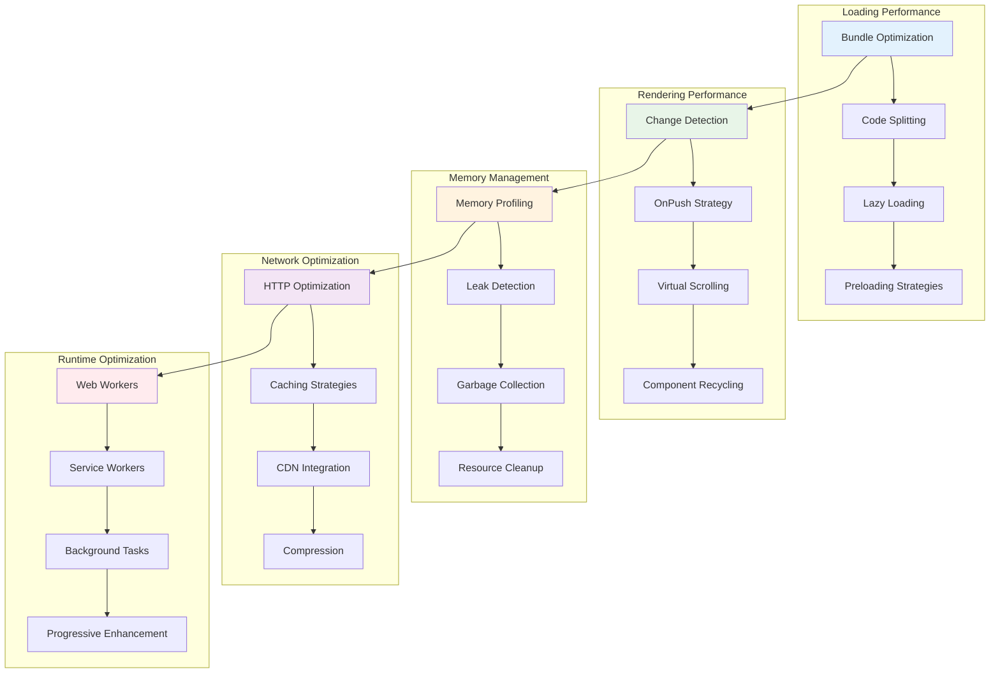

# Enterprise Performance Optimization Patterns

## ⚡ **Performance Architecture Overview**

This guide provides comprehensive performance optimization patterns for enterprise Angular Material applications, covering rendering optimization, bundle optimization, runtime performance, and scalability patterns.

## 📊 **Performance Architecture Diagram**



## 🚀 **Core Performance Patterns**

### **1. Advanced Bundle Optimization Pattern**

```typescript
// Dynamic bundle optimization service
@Injectable({
  providedIn: 'root'
})
export class BundleOptimizationService {
  private bundleMetrics = new Map<string, BundleMetrics>();
  private loadingStrategies = new Map<string, LoadingStrategy>();
  private performanceObserver: PerformanceObserver;
  
  constructor() {
    this.initializePerformanceMonitoring();
    this.setupAdaptiveLoading();
  }
  
  // Adaptive module loading based on user behavior
  async loadModuleAdaptively(
    moduleId: string, 
    priority: LoadPriority = 'normal'
  ): Promise<any> {
    const strategy = this.getOptimalLoadingStrategy(moduleId, priority);
    
    switch (strategy.type) {
      case 'immediate':
        return this.loadModuleImmediately(moduleId);
        
      case 'deferred':
        return this.loadModuleDeferred(moduleId, strategy.delay);
        
      case 'ondemand':
        return this.loadModuleOnDemand(moduleId);
        
      case 'preload':
        return this.preloadModule(moduleId);
        
      default:
        return this.loadModuleImmediately(moduleId);
    }
  }
  
  // Intelligent code splitting
  optimizeCodeSplitting(routes: Route[]): Route[] {
    return routes.map(route => {
      if (this.shouldSplitRoute(route)) {
        return {
          ...route,
          loadChildren: () => this.createOptimizedLoader(route.path!)
        };
      }
      return route;
    });
  }
  
  private async createOptimizedLoader(routePath: string): Promise<any> {
    const metrics = this.bundleMetrics.get(routePath);
    
    // Pre-warm the module if frequently accessed
    if (metrics?.accessFrequency > 0.8) {
      this.prewarmModule(routePath);
    }
    
    // Use adaptive loading based on network conditions
    const networkInfo = this.getNetworkInfo();
    
    if (networkInfo.effectiveType === 'slow-2g' || networkInfo.effectiveType === '2g') {
      // Load minimal version for slow connections
      return this.loadMinimalVersion(routePath);
    } else {
      // Load full version for faster connections
      return this.loadFullVersion(routePath);
    }
  }
  
  private getOptimalLoadingStrategy(
    moduleId: string, 
    priority: LoadPriority
  ): LoadingStrategy {
    const existingStrategy = this.loadingStrategies.get(moduleId);
    
    if (existingStrategy) {
      return this.adaptStrategy(existingStrategy, priority);
    }
    
    // Analyze module characteristics
    const moduleInfo = this.analyzeModule(moduleId);
    
    return {
      type: this.determineStrategyType(moduleInfo, priority),
      delay: this.calculateOptimalDelay(moduleInfo),
      prefetch: this.shouldPrefetch(moduleInfo),
      preload: this.shouldPreload(moduleInfo)
    };
  }
  
  private analyzeModule(moduleId: string): ModuleAnalysis {
    return {
      size: this.getModuleSize(moduleId),
      dependencies: this.getModuleDependencies(moduleId),
      usageFrequency: this.getUsageFrequency(moduleId),
      criticality: this.getCriticality(moduleId),
      loadTime: this.getAverageLoadTime(moduleId)
    };
  }
  
  // Resource hints optimization
  optimizeResourceHints(): void {
    const criticalResources = this.identifyCriticalResources();
    
    criticalResources.forEach(resource => {
      switch (resource.priority) {
        case 'critical':
          this.addPreloadHint(resource.url, resource.type);
          break;
        case 'important':
          this.addPrefetchHint(resource.url);
          break;
        case 'nice-to-have':
          this.addDNSPrefetch(resource.domain);
          break;
      }
    });
  }
  
  private addPreloadHint(url: string, type: string): void {
    const link = document.createElement('link');
    link.rel = 'preload';
    link.href = url;
    link.as = type;
    document.head.appendChild(link);
  }
  
  private addPrefetchHint(url: string): void {
    const link = document.createElement('link');
    link.rel = 'prefetch';
    link.href = url;
    document.head.appendChild(link);
  }
}
```

### **2. Advanced Change Detection Optimization**

```typescript
// Optimized change detection service
@Injectable({
  providedIn: 'root'
})
export class ChangeDetectionOptimizationService {
  private changeDetectionStats = new Map<string, CDStats>();
  private optimizationStrategies = new Map<string, CDStrategy>();
  
  // Component-level change detection optimization
  optimizeComponent(componentRef: ComponentRef<any>): void {
    const componentName = componentRef.componentType.name;
    
    // Analyze component change patterns
    const analysis = this.analyzeChangePatterns(componentName);
    
    // Apply optimization strategy
    const strategy = this.selectOptimizationStrategy(analysis);
    this.applyOptimizationStrategy(componentRef, strategy);
    
    // Monitor optimization effectiveness
    this.monitorOptimization(componentName, strategy);
  }
  
  private analyzeChangePatterns(componentName: string): ChangePatternAnalysis {
    const stats = this.changeDetectionStats.get(componentName);
    
    return {
      frequency: stats?.checksPerSecond || 0,
      complexity: this.calculateComplexity(componentName),
      inputChanges: stats?.inputChangeFrequency || 0,
      outputEvents: stats?.outputEventFrequency || 0,
      childComponents: this.getChildComponentCount(componentName),
      dataBindings: this.getDataBindingCount(componentName)
    };
  }
  
  private selectOptimizationStrategy(analysis: ChangePatternAnalysis): CDStrategy {
    // High-frequency, low-complexity components
    if (analysis.frequency > 10 && analysis.complexity < 5) {
      return {
        type: 'onpush',
        batchUpdates: true,
        throttleMs: 16, // 60fps
        memoization: true
      };
    }
    
    // Complex components with many children
    if (analysis.childComponents > 10) {
      return {
        type: 'detach',
        manualTrigger: true,
        zoneOptimization: true,
        batchUpdates: true
      };
    }
    
    // Data-heavy components
    if (analysis.dataBindings > 20) {
      return {
        type: 'immutable',
        trackByFn: true,
        virtualization: true,
        lazyRendering: true
      };
    }
    
    // Default strategy
    return {
      type: 'default',
      throttleMs: 50,
      batchUpdates: false
    };
  }
  
  private applyOptimizationStrategy(
    componentRef: ComponentRef<any>, 
    strategy: CDStrategy
  ): void {
    const changeDetectorRef = componentRef.changeDetectorRef;
    
    switch (strategy.type) {
      case 'onpush':
        this.implementOnPushOptimization(componentRef, strategy);
        break;
        
      case 'detach':
        this.implementDetachOptimization(changeDetectorRef, strategy);
        break;
        
      case 'immutable':
        this.implementImmutableOptimization(componentRef, strategy);
        break;
        
      case 'default':
        this.implementDefaultOptimization(changeDetectorRef, strategy);
        break;
    }
  }
  
  private implementOnPushOptimization(
    componentRef: ComponentRef<any>, 
    strategy: CDStrategy
  ): void {
    // Implement OnPush with intelligent batching
    const batchedUpdates = new Set<() => void>();
    let updateScheduled = false;
    
    const originalMarkForCheck = componentRef.changeDetectorRef.markForCheck;
    componentRef.changeDetectorRef.markForCheck = () => {
      if (strategy.batchUpdates) {
        batchedUpdates.add(() => originalMarkForCheck.call(componentRef.changeDetectorRef));
        
        if (!updateScheduled) {
          updateScheduled = true;
          
          setTimeout(() => {
            batchedUpdates.forEach(update => update());
            batchedUpdates.clear();
            updateScheduled = false;
          }, strategy.throttleMs || 16);
        }
      } else {
        originalMarkForCheck.call(componentRef.changeDetectorRef);
      }
    };
  }
  
  private implementDetachOptimization(
    changeDetectorRef: ChangeDetectorRef, 
    strategy: CDStrategy
  ): void {
    // Detach from change detection tree
    changeDetectorRef.detach();
    
    if (strategy.manualTrigger) {
      // Set up manual trigger mechanism
      this.setupManualTrigger(changeDetectorRef, strategy);
    }
    
    if (strategy.zoneOptimization) {
      // Run outside Angular zone for heavy operations
      this.setupZoneOptimization(changeDetectorRef);
    }
  }
  
  private setupManualTrigger(
    changeDetectorRef: ChangeDetectorRef, 
    strategy: CDStrategy
  ): void {
    const triggerCheck = () => {
      if (!changeDetectorRef.destroyed) {
        changeDetectorRef.detectChanges();
      }
    };
    
    // Trigger based on specific events or time intervals
    if (strategy.batchUpdates) {
      let pendingCheck = false;
      
      const batchedTrigger = () => {
        if (!pendingCheck) {
          pendingCheck = true;
          requestAnimationFrame(() => {
            triggerCheck();
            pendingCheck = false;
          });
        }
      };
      
      // Expose batched trigger for component use
      (changeDetectorRef as any).batchedTrigger = batchedTrigger;
    }
  }
}
```

### **3. Memory Management Optimization Pattern**

```typescript
// Advanced memory management service
@Injectable({
  providedIn: 'root'
})
export class MemoryOptimizationService {
  private memoryUsageHistory: MemorySnapshot[] = [];
  private leakDetectors = new Map<string, LeakDetector>();
  private memoryPressureThreshold = 0.8; // 80% of available memory
  
  constructor() {
    this.initializeMemoryMonitoring();
    this.setupMemoryPressureHandling();
  }
  
  // Proactive memory management
  optimizeMemoryUsage(): void {
    const currentUsage = this.getCurrentMemoryUsage();
    
    if (currentUsage.pressure > this.memoryPressureThreshold) {
      this.triggerMemoryOptimization(currentUsage);
    }
    
    // Record memory snapshot
    this.recordMemorySnapshot(currentUsage);
    
    // Analyze memory trends
    this.analyzeMemoryTrends();
  }
  
  private triggerMemoryOptimization(usage: MemoryUsage): void {
    const optimizations: Promise<void>[] = [];
    
    // Cleanup unused components
    optimizations.push(this.cleanupUnusedComponents());
    
    // Clear non-essential caches
    optimizations.push(this.clearNonEssentialCaches());
    
    // Trigger garbage collection hints
    optimizations.push(this.triggerGarbageCollection());
    
    // Reduce image quality temporarily
    optimizations.push(this.reduceImageQuality());
    
    // Virtualize large lists
    optimizations.push(this.enableVirtualization());
    
    Promise.all(optimizations).then(() => {
      console.log('Memory optimization completed');
    });
  }
  
  // Component lifecycle optimization
  optimizeComponentLifecycle(component: any): void {
    const componentName = component.constructor.name;
    
    // Wrap ngOnDestroy for cleanup validation
    const originalOnDestroy = component.ngOnDestroy;
    component.ngOnDestroy = () => {
      // Verify cleanup completion
      this.validateCleanup(component);
      
      // Call original destroy
      if (originalOnDestroy) {
        originalOnDestroy.call(component);
      }
      
      // Final memory check
      this.checkForMemoryLeaks(componentName);
    };
    
    // Set up automatic subscription cleanup
    this.setupSubscriptionCleanup(component);
    
    // Set up DOM cleanup
    this.setupDOMCleanup(component);
  }
  
  private setupSubscriptionCleanup(component: any): void {
    const subscriptions: Subscription[] = [];
    
    // Override subscribe methods to track subscriptions
    const originalSubscribe = component.subscribe;
    component.subscribe = (observable: Observable<any>) => {
      const subscription = observable.subscribe();
      subscriptions.push(subscription);
      return subscription;
    };
    
    // Auto-cleanup on destroy
    const originalOnDestroy = component.ngOnDestroy;
    component.ngOnDestroy = () => {
      subscriptions.forEach(sub => {
        if (!sub.closed) {
          sub.unsubscribe();
        }
      });
      subscriptions.length = 0;
      
      if (originalOnDestroy) {
        originalOnDestroy.call(component);
      }
    };
  }
  
  // Memory leak detection
  detectMemoryLeaks(): MemoryLeakReport {
    const leaks: MemoryLeak[] = [];
    
    // Detect component leaks
    leaks.push(...this.detectComponentLeaks());
    
    // Detect subscription leaks
    leaks.push(...this.detectSubscriptionLeaks());
    
    // Detect DOM leaks
    leaks.push(...this.detectDOMLeaks());
    
    // Detect closure leaks
    leaks.push(...this.detectClosureLeaks());
    
    return {
      totalLeaks: leaks.length,
      leaks,
      severity: this.calculateLeakSeverity(leaks),
      recommendations: this.generateRecommendations(leaks)
    };
  }
  
  private detectComponentLeaks(): MemoryLeak[] {
    const leaks: MemoryLeak[] = [];
    const componentRegistry = this.getComponentRegistry();
    
    componentRegistry.forEach((instances, componentName) => {
      const destroyedInstances = instances.filter(instance => instance.destroyed);
      const stillReferencedInstances = destroyedInstances.filter(instance => 
        this.hasActiveReferences(instance)
      );
      
      if (stillReferencedInstances.length > 0) {
        leaks.push({
          type: 'component',
          name: componentName,
          instances: stillReferencedInstances.length,
          severity: 'high',
          description: `${stillReferencedInstances.length} destroyed components still have active references`
        });
      }
    });
    
    return leaks;
  }
  
  // Intelligent caching optimization
  optimizeCaching(): void {
    const cacheStats = this.analyzeCacheUsage();
    
    cacheStats.forEach((stats, cacheName) => {
      if (stats.hitRatio < 0.3) {
        // Low hit ratio - consider reducing cache size
        this.reduceCacheSize(cacheName, 0.5);
      } else if (stats.hitRatio > 0.9 && stats.memoryUsage < 0.5) {
        // High hit ratio and low memory usage - consider increasing cache size
        this.increaseCacheSize(cacheName, 1.5);
      }
      
      // Implement LRU eviction for frequently changing data
      if (stats.volatility > 0.7) {
        this.enableLRUEviction(cacheName);
      }
    });
  }
  
  private analyzeCacheUsage(): Map<string, CacheStats> {
    const stats = new Map<string, CacheStats>();
    
    // Analyze different cache types
    this.analyzeComponentStateCache(stats);
    this.analyzeHTTPCache(stats);
    this.analyzeImageCache(stats);
    this.analyzeThemeCache(stats);
    
    return stats;
  }
  
  // Predictive memory management
  predictMemoryUsage(operations: Operation[]): MemoryPrediction {
    const baseMemory = this.getCurrentMemoryUsage();
    let predictedUsage = baseMemory.used;
    
    operations.forEach(operation => {
      const operationCost = this.estimateOperationMemoryCost(operation);
      predictedUsage += operationCost;
    });
    
    return {
      currentUsage: baseMemory.used,
      predictedUsage,
      availableMemory: baseMemory.total - predictedUsage,
      riskLevel: this.calculateRiskLevel(predictedUsage, baseMemory.total),
      recommendations: this.generateMemoryRecommendations(predictedUsage, baseMemory.total)
    };
  }
  
  private estimateOperationMemoryCost(operation: Operation): number {
    switch (operation.type) {
      case 'component-creation':
        return this.estimateComponentMemoryCost(operation.componentType);
        
      case 'data-loading':
        return this.estimateDataMemoryCost(operation.dataSize);
        
      case 'image-loading':
        return this.estimateImageMemoryCost(operation.dimensions);
        
      case 'animation':
        return this.estimateAnimationMemoryCost(operation.complexity);
        
      default:
        return 1024 * 1024; // 1MB default estimate
    }
  }
}
```

### **4. Rendering Performance Optimization Pattern**

```typescript
// Advanced rendering optimization service
@Injectable({
  providedIn: 'root'
})
export class RenderingOptimizationService {
  private renderingMetrics = new Map<string, RenderingMetrics>();
  private frameRateTarget = 60; // Target 60 FPS
  private performanceBudget = 16.67; // 16.67ms per frame
  
  // Intelligent rendering optimization
  optimizeRendering(component: ComponentRef<any>): void {
    const componentName = component.componentType.name;
    const metrics = this.analyzeRenderingPerformance(componentName);
    
    if (metrics.averageFrameTime > this.performanceBudget) {
      this.applyRenderingOptimizations(component, metrics);
    }
  }
  
  private applyRenderingOptimizations(
    component: ComponentRef<any>, 
    metrics: RenderingMetrics
  ): void {
    const optimizations: RenderingOptimization[] = [];
    
    // Virtual scrolling for large lists
    if (metrics.listSize > 100) {
      optimizations.push({
        type: 'virtual-scrolling',
        priority: 'high',
        implementation: () => this.enableVirtualScrolling(component)
      });
    }
    
    // Lazy loading for non-visible content
    if (metrics.offScreenElements > 50) {
      optimizations.push({
        type: 'lazy-loading',
        priority: 'medium',
        implementation: () => this.enableLazyLoading(component)
      });
    }
    
    // Component recycling for dynamic content
    if (metrics.componentChurn > 10) {
      optimizations.push({
        type: 'component-recycling',
        priority: 'high',
        implementation: () => this.enableComponentRecycling(component)
      });
    }
    
    // Image optimization
    if (metrics.imageLoadTime > 1000) {
      optimizations.push({
        type: 'image-optimization',
        priority: 'medium',
        implementation: () => this.optimizeImages(component)
      });
    }
    
    // Apply optimizations in priority order
    optimizations
      .sort((a, b) => this.getPriorityScore(a.priority) - this.getPriorityScore(b.priority))
      .forEach(opt => opt.implementation());
  }
  
  // Virtual scrolling implementation
  private enableVirtualScrolling(component: ComponentRef<any>): void {
    const hostElement = component.location.nativeElement;
    const listElements = hostElement.querySelectorAll('[data-virtual-list]');
    
    listElements.forEach(listElement => {
      this.setupVirtualScrolling(listElement as HTMLElement);
    });
  }
  
  private setupVirtualScrolling(listElement: HTMLElement): void {
    const virtualScroller = new VirtualScrollerService();
    
    // Configure virtual scroller
    virtualScroller.configure({
      itemHeight: this.calculateAverageItemHeight(listElement),
      viewportHeight: listElement.clientHeight,
      bufferSize: 10,
      recyclingEnabled: true
    });
    
    // Replace list content with virtual scroller
    this.replaceWithVirtualScroller(listElement, virtualScroller);
  }
  
  // Intelligent image optimization
  optimizeImages(element: HTMLElement): void {
    const images = element.querySelectorAll('img[data-optimize]');
    
    images.forEach(img => {
      const imageElement = img as HTMLImageElement;
      this.optimizeImage(imageElement);
    });
  }
  
  private optimizeImage(img: HTMLImageElement): void {
    // Implement responsive images
    this.makeImageResponsive(img);
    
    // Lazy load off-screen images
    if (!this.isImageInViewport(img)) {
      this.lazyLoadImage(img);
    }
    
    // Progressive loading for large images
    if (this.isLargeImage(img)) {
      this.enableProgressiveLoading(img);
    }
    
    // WebP format optimization
    this.convertToWebP(img);
  }
  
  private makeImageResponsive(img: HTMLImageElement): void {
    const containerWidth = img.parentElement?.clientWidth || 0;
    const devicePixelRatio = window.devicePixelRatio || 1;
    
    // Calculate optimal image dimensions
    const optimalWidth = Math.ceil(containerWidth * devicePixelRatio);
    const optimalHeight = Math.ceil((img.naturalHeight / img.naturalWidth) * optimalWidth);
    
    // Generate srcset for different screen sizes
    const srcset = this.generateSrcSet(img.src, optimalWidth, optimalHeight);
    
    img.srcset = srcset;
    img.sizes = `(max-width: ${containerWidth}px) 100vw, ${containerWidth}px`;
  }
  
  // Frame rate optimization
  maintainFrameRate(callback: () => void): void {
    let lastFrameTime = performance.now();
    let frameCount = 0;
    let frameTimeAccumulator = 0;
    
    const optimizedCallback = () => {
      const currentTime = performance.now();
      const frameTime = currentTime - lastFrameTime;
      
      frameTimeAccumulator += frameTime;
      frameCount++;
      
      // Calculate average frame time over last 60 frames
      if (frameCount >= 60) {
        const averageFrameTime = frameTimeAccumulator / frameCount;
        
        if (averageFrameTime > this.performanceBudget) {
          // Frame rate is dropping, apply optimizations
          this.applyFrameRateOptimizations();
        }
        
        frameCount = 0;
        frameTimeAccumulator = 0;
      }
      
      lastFrameTime = currentTime;
      callback();
    };
    
    // Use requestAnimationFrame for smooth animations
    requestAnimationFrame(optimizedCallback);
  }
  
  private applyFrameRateOptimizations(): void {
    // Reduce animation quality
    this.reduceAnimationQuality();
    
    // Throttle non-critical updates
    this.throttleNonCriticalUpdates();
    
    // Defer heavy computations
    this.deferHeavyComputations();
    
    // Reduce rendering complexity
    this.reduceRenderingComplexity();
  }
}
```

### **5. Network Performance Optimization Pattern**

```typescript
// Advanced network optimization service
@Injectable({
  providedIn: 'root'
})
export class NetworkOptimizationService {
  private networkInfo: NetworkInformation | undefined;
  private connectionQuality: ConnectionQuality = 'unknown';
  private adaptiveStrategies = new Map<string, AdaptiveStrategy>();
  
  constructor() {
    this.initializeNetworkMonitoring();
    this.setupAdaptiveLoading();
  }
  
  // Adaptive loading based on network conditions
  loadResourceAdaptively<T>(
    resource: ResourceDescriptor, 
    options: AdaptiveLoadingOptions = {}
  ): Promise<T> {
    const strategy = this.selectLoadingStrategy(resource, options);
    
    switch (strategy.type) {
      case 'aggressive':
        return this.loadAggressively(resource);
        
      case 'conservative':
        return this.loadConservatively(resource);
        
      case 'progressive':
        return this.loadProgressively(resource);
        
      case 'deferred':
        return this.loadDeferred(resource, strategy.delay);
        
      default:
        return this.loadNormally(resource);
    }
  }
  
  private selectLoadingStrategy(
    resource: ResourceDescriptor, 
    options: AdaptiveLoadingOptions
  ): LoadingStrategy {
    const networkConditions = this.analyzeNetworkConditions();
    const deviceCapabilities = this.analyzeDeviceCapabilities();
    const userPreferences = this.getUserPreferences();
    
    // High-speed connection + powerful device
    if (networkConditions.speed === 'fast' && deviceCapabilities.performance === 'high') {
      return {
        type: 'aggressive',
        parallelRequests: 6,
        prefetchNext: true,
        compressionLevel: 'medium'
      };
    }
    
    // Slow connection or limited data
    if (networkConditions.speed === 'slow' || userPreferences.dataSaver) {
      return {
        type: 'conservative',
        parallelRequests: 2,
        compressionLevel: 'high',
        qualityReduction: true
      };
    }
    
    // Progressive loading for large resources
    if (resource.size > 1024 * 1024) { // > 1MB
      return {
        type: 'progressive',
        chunkSize: 256 * 1024, // 256KB chunks
        priorityOrder: this.calculatePriorityOrder(resource)
      };
    }
    
    return { type: 'normal' };
  }
  
  // HTTP/2 optimization with multiplexing
  optimizeHTTP2Multiplexing(): void {
    const maxConcurrentStreams = this.getMaxConcurrentStreams();
    const streamPriorities = this.calculateStreamPriorities();
    
    // Configure HTTP/2 stream priorities
    this.configureStreamPriorities(streamPriorities);
    
    // Implement server push for critical resources
    this.setupServerPush();
    
    // Optimize request ordering
    this.optimizeRequestOrdering();
  }
  
  private configureStreamPriorities(priorities: StreamPriority[]): void {
    priorities.forEach(priority => {
      const link = document.createElement('link');
      link.rel = 'preload';
      link.href = priority.url;
      link.as = priority.resourceType;
      
      // Set priority hints
      if ('importance' in link) {
        (link as any).importance = priority.importance;
      }
      
      document.head.appendChild(link);
    });
  }
  
  // Intelligent caching with service worker
  setupIntelligentCaching(): void {
    if ('serviceWorker' in navigator) {
      navigator.serviceWorker.register('/sw.js').then(registration => {
        this.configureServiceWorkerCaching(registration);
      });
    }
  }
  
  private configureServiceWorkerCaching(registration: ServiceWorkerRegistration): void {
    const strategies = {
      static: 'cache-first',      // CSS, JS, images
      api: 'network-first',       // API calls
      documents: 'stale-while-revalidate', // HTML pages
      images: 'cache-first-with-fallback'  // Images with fallback
    };
    
    // Send caching strategies to service worker
    registration.active?.postMessage({
      type: 'CONFIGURE_CACHING',
      strategies
    });
  }
  
  // Resource bundling optimization
  optimizeResourceBundling(): void {
    const criticalResources = this.identifyCriticalResources();
    const nonCriticalResources = this.identifyNonCriticalResources();
    
    // Create optimized bundles
    const criticalBundle = this.createCriticalBundle(criticalResources);
    const asyncBundle = this.createAsyncBundle(nonCriticalResources);
    
    // Load critical bundle immediately
    this.loadBundle(criticalBundle, 'immediate');
    
    // Load async bundle after page load
    this.loadBundle(asyncBundle, 'deferred');
  }
  
  private createCriticalBundle(resources: Resource[]): Bundle {
    return {
      id: 'critical',
      resources: resources.sort((a, b) => b.priority - a.priority),
      compressionType: 'gzip',
      cacheStrategy: 'immutable',
      loadingStrategy: 'preload'
    };
  }
  
  // Compression and optimization
  optimizeResourceCompression(): void {
    const compressionOptions = this.getOptimalCompressionOptions();
    
    // Configure different compression for different resource types
    this.configureTextCompression(compressionOptions.text);
    this.configureImageCompression(compressionOptions.images);
    this.configureVideoCompression(compressionOptions.videos);
  }
  
  private getOptimalCompressionOptions(): CompressionOptions {
    const networkSpeed = this.connectionQuality;
    const deviceCapabilities = this.analyzeDeviceCapabilities();
    
    if (networkSpeed === 'slow' || deviceCapabilities.cpu === 'low') {
      return {
        text: { algorithm: 'gzip', level: 9 },
        images: { format: 'webp', quality: 60 },
        videos: { codec: 'h264', bitrate: 'low' }
      };
    } else {
      return {
        text: { algorithm: 'brotli', level: 6 },
        images: { format: 'avif', quality: 80 },
        videos: { codec: 'av1', bitrate: 'adaptive' }
      };
    }
  }
}
```

## 📊 **Performance Monitoring Integration**

### **6. Real-time Performance Monitoring**

```typescript
// Comprehensive performance monitoring
@Injectable({
  providedIn: 'root'
})
export class PerformanceMonitoringService {
  private performanceObserver: PerformanceObserver;
  private metrics = new Map<string, PerformanceMetric[]>();
  private alerts = new Map<string, PerformanceAlert>();
  
  initializeMonitoring(): void {
    this.setupWebVitalsMonitoring();
    this.setupCustomMetricsMonitoring();
    this.setupRealTimeAlerting();
    this.setupPerformanceBudgets();
  }
  
  private setupWebVitalsMonitoring(): void {
    // Core Web Vitals monitoring
    this.monitorLCP(); // Largest Contentful Paint
    this.monitorFID(); // First Input Delay
    this.monitorCLS(); // Cumulative Layout Shift
    this.monitorFCP(); // First Contentful Paint
    this.monitorTTFB(); // Time to First Byte
  }
  
  private monitorLCP(): void {
    new PerformanceObserver((list) => {
      const entries = list.getEntries();
      const lastEntry = entries[entries.length - 1];
      
      this.recordMetric('LCP', {
        value: lastEntry.startTime,
        timestamp: Date.now(),
        url: window.location.href,
        elementId: (lastEntry as any).id,
        elementType: (lastEntry as any).tagName
      });
      
      // Alert if LCP exceeds threshold
      if (lastEntry.startTime > 2500) {
        this.triggerAlert('LCP_SLOW', {
          value: lastEntry.startTime,
          threshold: 2500,
          severity: 'high'
        });
      }
    }).observe({ entryTypes: ['largest-contentful-paint'] });
  }
  
  private setupPerformanceBudgets(): void {
    const budgets: PerformanceBudget[] = [
      { metric: 'LCP', threshold: 2500, severity: 'error' },
      { metric: 'FID', threshold: 100, severity: 'warning' },
      { metric: 'CLS', threshold: 0.1, severity: 'error' },
      { metric: 'FCP', threshold: 1800, severity: 'warning' },
      { metric: 'TTFB', threshold: 800, severity: 'info' }
    ];
    
    budgets.forEach(budget => {
      this.setupBudgetMonitoring(budget);
    });
  }
  
  generatePerformanceReport(): PerformanceReport {
    const report: PerformanceReport = {
      timestamp: Date.now(),
      url: window.location.href,
      webVitals: this.getWebVitalsReport(),
      customMetrics: this.getCustomMetricsReport(),
      resourceMetrics: this.getResourceMetricsReport(),
      recommendations: this.generateRecommendations(),
      score: this.calculatePerformanceScore()
    };
    
    return report;
  }
  
  private generateRecommendations(): PerformanceRecommendation[] {
    const recommendations: PerformanceRecommendation[] = [];
    
    // Analyze metrics and generate recommendations
    const lcpMetrics = this.metrics.get('LCP') || [];
    const avgLCP = lcpMetrics.reduce((sum, m) => sum + m.value, 0) / lcpMetrics.length;
    
    if (avgLCP > 2500) {
      recommendations.push({
        type: 'optimization',
        priority: 'high',
        title: 'Optimize Largest Contentful Paint',
        description: 'LCP is slower than recommended threshold',
        actions: [
          'Optimize image loading and compression',
          'Implement resource preloading',
          'Reduce server response times',
          'Use CDN for static assets'
        ],
        impact: 'high',
        difficulty: 'medium'
      });
    }
    
    return recommendations;
  }
}
```

This comprehensive performance optimization guide provides enterprise-grade patterns for maximizing Angular Material application performance across all critical dimensions: loading, rendering, memory, network, and monitoring.

---

**Key Performance Benefits:**
- ⚡ **Bundle Optimization** - Intelligent code splitting and loading
- 🚀 **Rendering Performance** - Advanced change detection and virtualization
- 💾 **Memory Management** - Proactive leak detection and optimization
- 🌐 **Network Performance** - Adaptive loading and HTTP/2 optimization
- 📊 **Real-time Monitoring** - Comprehensive performance tracking and alerting
