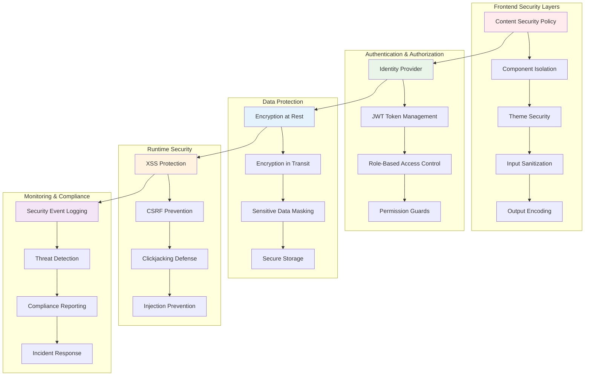

# Enterprise Security Patterns for Angular Material

## 🔒 **Security Architecture Overview**

This guide provides comprehensive security patterns specifically designed for enterprise Angular Material applications, covering theme security, component protection, and data safeguarding.

## 🛡️ **Security Architecture Diagram**



## 🎯 **Core Security Patterns**

### **1. Theme Security Validation Pattern**

```typescript
// Secure theme validation and sanitization
@Injectable({
  providedIn: 'root'
})
export class ThemeSecurityService {
  private readonly ALLOWED_CSS_PROPERTIES = new Set([
    'color', 'background-color', 'border-color',
    'font-family', 'font-size', 'font-weight',
    'margin', 'padding', 'border-radius',
    'box-shadow', 'text-shadow', 'opacity'
  ]);
  
  private readonly FORBIDDEN_VALUES = [
    /javascript:/i,
    /data:/i,
    /vbscript:/i,
    /expression\s*\(/i,
    /url\s*\(\s*[^)]*script/i,
    /@import/i
  ];
  
  validateThemeConfiguration(theme: any): ThemeValidationResult {
    const result: ThemeValidationResult = {
      isValid: true,
      violations: [],
      sanitizedTheme: null
    };
    
    try {
      // Deep clone for sanitization
      const sanitizedTheme = this.deepClone(theme);
      
      // Validate theme structure
      this.validateThemeStructure(theme, result);
      
      // Sanitize CSS properties and values
      this.sanitizeThemeTokens(sanitizedTheme, result);
      
      // Validate custom CSS
      this.validateCustomCSS(sanitizedTheme, result);
      
      // Check for malicious patterns
      this.scanForMaliciousPatterns(sanitizedTheme, result);
      
      if (result.violations.length > 0) {
        result.isValid = false;
      }
      
      result.sanitizedTheme = sanitizedTheme;
      
    } catch (error) {
      result.isValid = false;
      result.violations.push({
        type: 'VALIDATION_ERROR',
        message: 'Theme validation failed',
        severity: 'HIGH',
        details: (error as Error).message
      });
    }
    
    return result;
  }
  
  sanitizeThemeTokens(theme: any, result: ThemeValidationResult): void {
    this.traverseObject(theme, (key: string, value: any, path: string) => {
      if (typeof value === 'string') {
        // Check for forbidden patterns
        for (const pattern of this.FORBIDDEN_VALUES) {
          if (pattern.test(value)) {
            result.violations.push({
              type: 'MALICIOUS_VALUE',
              message: `Forbidden pattern detected in theme token: ${path}`,
              severity: 'HIGH',
              details: { path, value, pattern: pattern.source }
            });
            
            // Remove malicious value
            this.setNestedProperty(theme, path, '');
            return;
          }
        }
        
        // Sanitize CSS values
        if (this.isCSSProperty(key)) {
          const sanitizedValue = this.sanitizeCSSValue(value);
          if (sanitizedValue !== value) {
            this.setNestedProperty(theme, path, sanitizedValue);
            result.violations.push({
              type: 'VALUE_SANITIZED',
              message: `CSS value sanitized: ${path}`,
              severity: 'MEDIUM',
              details: { path, original: value, sanitized: sanitizedValue }
            });
          }
        }
      }
    });
  }
  
  validateCustomCSS(theme: any, result: ThemeValidationResult): void {
    if (theme.customCSS) {
      const cssValidation = this.validateCSSContent(theme.customCSS);
      
      if (!cssValidation.isValid) {
        result.violations.push({
          type: 'INVALID_CSS',
          message: 'Custom CSS contains invalid or dangerous content',
          severity: 'HIGH',
          details: cssValidation.errors
        });
        
        // Remove dangerous CSS
        delete theme.customCSS;
      }
    }
  }
  
  private validateCSSContent(css: string): CSSValidationResult {
    const result: CSSValidationResult = {
      isValid: true,
      errors: []
    };
    
    // Check for dangerous CSS patterns
    const dangerousPatterns = [
      /javascript:/gi,
      /expression\s*\(/gi,
      /@import\s+url\(/gi,
      /behavior\s*:/gi,
      /-moz-binding/gi,
      /filter\s*:\s*progid/gi
    ];
    
    for (const pattern of dangerousPatterns) {
      if (pattern.test(css)) {
        result.isValid = false;
        result.errors.push(`Dangerous CSS pattern detected: ${pattern.source}`);
      }
    }
    
    // Validate CSS syntax
    try {
      // Simple CSS parsing validation
      this.parseCSSRules(css);
    } catch (error) {
      result.isValid = false;
      result.errors.push(`CSS syntax error: ${(error as Error).message}`);
    }
    
    return result;
  }
  
  private sanitizeCSSValue(value: string): string {
    // Remove potentially dangerous functions
    let sanitized = value.replace(/javascript\s*:/gi, '');
    sanitized = sanitized.replace(/data\s*:/gi, '');
    sanitized = sanitized.replace(/vbscript\s*:/gi, '');
    sanitized = sanitized.replace(/expression\s*\([^)]*\)/gi, '');
    
    // Encode special characters
    sanitized = sanitized.replace(/[<>]/g, '');
    
    return sanitized.trim();
  }
}
```

### **2. Component Access Control Pattern**

```typescript
// Role-based component access control
@Injectable({
  providedIn: 'root'
})
export class ComponentAccessControlService {
  private userRoles$ = new BehaviorSubject<string[]>([]);
  private permissions$ = new BehaviorSubject<ComponentPermission[]>([]);
  
  setUserRoles(roles: string[]): void {
    this.userRoles$.next(roles);
    this.loadPermissionsForRoles(roles);
  }
  
  canAccessComponent(componentId: string, action: string = 'view'): Observable<boolean> {
    return combineLatest([this.userRoles$, this.permissions$]).pipe(
      map(([roles, permissions]) => {
        const componentPermission = permissions.find(p => p.componentId === componentId);
        
        if (!componentPermission) {
          // Default deny if no permission defined
          return false;
        }
        
        // Check if user has required roles
        const hasRequiredRole = componentPermission.requiredRoles.some(role => 
          roles.includes(role)
        );
        
        if (!hasRequiredRole) {
          return false;
        }
        
        // Check specific action permission
        const actionPermission = componentPermission.actions[action];
        if (actionPermission === undefined) {
          return componentPermission.defaultAccess;
        }
        
        return actionPermission;
      })
    );
  }
  
  private async loadPermissionsForRoles(roles: string[]): Promise<void> {
    try {
      const response = await fetch('/api/security/component-permissions', {
        method: 'POST',
        headers: {
          'Content-Type': 'application/json',
          'Authorization': `Bearer ${this.getAuthToken()}`
        },
        body: JSON.stringify({ roles })
      });
      
      if (response.ok) {
        const permissions = await response.json();
        this.permissions$.next(permissions);
      }
    } catch (error) {
      console.error('Failed to load component permissions:', error);
    }
  }
}

// Secure component decorator
export function SecureComponent(options: SecureComponentOptions) {
  return function (target: any) {
    const originalOnInit = target.prototype.ngOnInit;
    
    target.prototype.ngOnInit = function () {
      const accessControl = inject(ComponentAccessControlService);
      const router = inject(Router);
      
      // Check component access
      accessControl.canAccessComponent(options.componentId).subscribe(canAccess => {
        if (!canAccess) {
          if (options.redirectTo) {
            router.navigate([options.redirectTo]);
          } else {
            throw new Error('Access denied to component');
          }
        }
      });
      
      // Call original ngOnInit
      if (originalOnInit) {
        originalOnInit.call(this);
      }
    };
  };
}

// Usage example
@SecureComponent({
  componentId: 'admin-dashboard',
  redirectTo: '/unauthorized'
})
@Component({
  selector: 'app-admin-dashboard',
  template: `...`
})
export class AdminDashboardComponent implements OnInit {
  ngOnInit() {
    // Component initialization logic
  }
}
```

### **3. Secure Data Handling Pattern**

```typescript
// Secure data handling for Material components
@Injectable({
  providedIn: 'root'
})
export class SecureDataService {
  private encryptionKey: string;
  private sensitiveDataCache = new Map<string, EncryptedData>();
  
  constructor() {
    this.encryptionKey = this.generateEncryptionKey();
  }
  
  // Encrypt sensitive data before storing
  async encryptSensitiveData(data: any, dataType: SensitiveDataType): Promise<string> {
    try {
      const serializedData = JSON.stringify(data);
      const encrypted = await this.encrypt(serializedData);
      
      const encryptedData: EncryptedData = {
        data: encrypted,
        dataType,
        timestamp: Date.now(),
        checksum: await this.calculateChecksum(serializedData)
      };
      
      const dataId = this.generateDataId();
      this.sensitiveDataCache.set(dataId, encryptedData);
      
      return dataId;
      
    } catch (error) {
      console.error('Failed to encrypt sensitive data:', error);
      throw new Error('Data encryption failed');
    }
  }
  
  // Decrypt sensitive data for use
  async decryptSensitiveData(dataId: string): Promise<any> {
    try {
      const encryptedData = this.sensitiveDataCache.get(dataId);
      if (!encryptedData) {
        throw new Error('Data not found');
      }
      
      // Check data expiration
      if (this.isDataExpired(encryptedData)) {
        this.sensitiveDataCache.delete(dataId);
        throw new Error('Data has expired');
      }
      
      const decrypted = await this.decrypt(encryptedData.data);
      const parsedData = JSON.parse(decrypted);
      
      // Verify data integrity
      const checksum = await this.calculateChecksum(decrypted);
      if (checksum !== encryptedData.checksum) {
        throw new Error('Data integrity check failed');
      }
      
      return parsedData;
      
    } catch (error) {
      console.error('Failed to decrypt sensitive data:', error);
      throw new Error('Data decryption failed');
    }
  }
  
  // Secure data masking for display
  maskSensitiveData(data: string, type: SensitiveDataType, showLastChars: number = 4): string {
    if (!data) return '';
    
    switch (type) {
      case 'email':
        const [localPart, domain] = data.split('@');
        return `${localPart.charAt(0)}***@${domain}`;
        
      case 'phone':
        return data.replace(/(\d{3})\d{3}(\d{4})/, '$1-***-$2');
        
      case 'ssn':
        return data.replace(/(\d{3})\d{2}(\d{4})/, '$1-**-$2');
        
      case 'creditCard':
        return `****-****-****-${data.slice(-4)}`;
        
      case 'generic':
      default:
        if (data.length <= showLastChars) {
          return '*'.repeat(data.length);
        }
        return '*'.repeat(data.length - showLastChars) + data.slice(-showLastChars);
    }
  }
  
  // Secure input sanitization
  sanitizeInput(input: string, context: InputContext): string {
    let sanitized = input;
    
    switch (context) {
      case 'html':
        sanitized = this.sanitizeHTML(input);
        break;
        
      case 'url':
        sanitized = this.sanitizeURL(input);
        break;
        
      case 'sql':
        sanitized = this.sanitizeSQL(input);
        break;
        
      case 'script':
        // For script contexts, be very restrictive
        sanitized = input.replace(/<script\b[^<]*(?:(?!<\/script>)<[^<]*)*<\/script>/gi, '');
        break;
        
      default:
        sanitized = this.sanitizeGeneric(input);
    }
    
    return sanitized;
  }
  
  private sanitizeHTML(input: string): string {
    // Use DOMPurify or similar library in production
    return input
      .replace(/&/g, '&amp;')
      .replace(/</g, '&lt;')
      .replace(/>/g, '&gt;')
      .replace(/"/g, '&quot;')
      .replace(/'/g, '&#x27;')
      .replace(/\//g, '&#x2F;');
  }
  
  private sanitizeURL(input: string): string {
    try {
      const url = new URL(input);
      
      // Only allow safe protocols
      const allowedProtocols = ['http:', 'https:', 'mailto:'];
      if (!allowedProtocols.includes(url.protocol)) {
        throw new Error('Unsafe protocol');
      }
      
      return url.toString();
    } catch {
      return '';
    }
  }
  
  private async encrypt(data: string): Promise<string> {
    // Implement proper encryption (AES-GCM recommended)
    const encoder = new TextEncoder();
    const dataBuffer = encoder.encode(data);
    
    // In production, use Web Crypto API
    const key = await crypto.subtle.importKey(
      'raw',
      encoder.encode(this.encryptionKey),
      { name: 'AES-GCM' },
      false,
      ['encrypt']
    );
    
    const iv = crypto.getRandomValues(new Uint8Array(12));
    const encrypted = await crypto.subtle.encrypt(
      { name: 'AES-GCM', iv },
      key,
      dataBuffer
    );
    
    // Combine IV and encrypted data
    const combined = new Uint8Array(iv.length + encrypted.byteLength);
    combined.set(iv);
    combined.set(new Uint8Array(encrypted), iv.length);
    
    return btoa(String.fromCharCode(...combined));
  }
  
  private async decrypt(encryptedData: string): Promise<string> {
    const combined = new Uint8Array(
      atob(encryptedData).split('').map(c => c.charCodeAt(0))
    );
    
    const iv = combined.slice(0, 12);
    const data = combined.slice(12);
    
    const encoder = new TextEncoder();
    const key = await crypto.subtle.importKey(
      'raw',
      encoder.encode(this.encryptionKey),
      { name: 'AES-GCM' },
      false,
      ['decrypt']
    );
    
    const decrypted = await crypto.subtle.decrypt(
      { name: 'AES-GCM', iv },
      key,
      data
    );
    
    const decoder = new TextDecoder();
    return decoder.decode(decrypted);
  }
}
```

### **4. XSS Protection Pattern**

```typescript
// XSS protection for Material components
@Injectable({
  providedIn: 'root'
})
export class XSSProtectionService {
  private readonly CSP_NONCE = this.generateNonce();
  
  // Content Security Policy implementation
  implementCSP(): void {
    const cspDirectives = [
      "default-src 'self'",
      `script-src 'self' 'nonce-${this.CSP_NONCE}'`,
      "style-src 'self' 'unsafe-inline'", // Material Design needs inline styles
      "img-src 'self' data: https:",
      "font-src 'self' https://fonts.gstatic.com",
      "connect-src 'self' https://api.company.com",
      "frame-src 'none'",
      "object-src 'none'",
      "base-uri 'self'",
      "form-action 'self'"
    ].join('; ');
    
    // Set CSP header
    const meta = document.createElement('meta');
    meta.httpEquiv = 'Content-Security-Policy';
    meta.content = cspDirectives;
    document.head.appendChild(meta);
  }
  
  // Secure HTML sanitization
  sanitizeHTML(html: string, allowedTags?: string[]): string {
    const allowedTagsSet = new Set(allowedTags || [
      'p', 'br', 'strong', 'em', 'u', 'ol', 'ul', 'li',
      'h1', 'h2', 'h3', 'h4', 'h5', 'h6'
    ]);
    
    // Create a DOM parser
    const doc = new DOMParser().parseFromString(html, 'text/html');
    
    // Remove dangerous elements
    this.removeDangerousElements(doc);
    
    // Sanitize remaining elements
    this.sanitizeElements(doc, allowedTagsSet);
    
    return doc.body.innerHTML;
  }
  
  private removeDangerousElements(doc: Document): void {
    const dangerousTags = [
      'script', 'iframe', 'object', 'embed', 'form',
      'input', 'textarea', 'button', 'select', 'option',
      'link', 'meta', 'style', 'title', 'base'
    ];
    
    dangerousTags.forEach(tag => {
      const elements = doc.querySelectorAll(tag);
      elements.forEach(el => el.remove());
    });
  }
  
  private sanitizeElements(doc: Document, allowedTags: Set<string>): void {
    const walker = doc.createTreeWalker(
      doc.body,
      NodeFilter.SHOW_ELEMENT,
      null
    );
    
    const elementsToRemove: Element[] = [];
    
    let node = walker.nextNode() as Element;
    while (node) {
      if (!allowedTags.has(node.tagName.toLowerCase())) {
        elementsToRemove.push(node);
      } else {
        // Sanitize attributes
        this.sanitizeAttributes(node);
      }
      node = walker.nextNode() as Element;
    }
    
    // Remove disallowed elements
    elementsToRemove.forEach(el => {
      // Move children to parent before removing
      while (el.firstChild) {
        el.parentNode?.insertBefore(el.firstChild, el);
      }
      el.remove();
    });
  }
  
  private sanitizeAttributes(element: Element): void {
    const allowedAttributes = new Set([
      'class', 'id', 'title', 'alt', 'src', 'href'
    ]);
    
    const attributesToRemove: string[] = [];
    
    for (let i = 0; i < element.attributes.length; i++) {
      const attr = element.attributes[i];
      
      if (!allowedAttributes.has(attr.name.toLowerCase())) {
        attributesToRemove.push(attr.name);
        continue;
      }
      
      // Sanitize attribute values
      if (attr.name.toLowerCase() === 'href' || attr.name.toLowerCase() === 'src') {
        const sanitizedValue = this.sanitizeURL(attr.value);
        if (sanitizedValue !== attr.value) {
          element.setAttribute(attr.name, sanitizedValue);
        }
      }
    }
    
    // Remove dangerous attributes
    attributesToRemove.forEach(attrName => {
      element.removeAttribute(attrName);
    });
  }
  
  private sanitizeURL(url: string): string {
    try {
      const urlObj = new URL(url);
      
      // Only allow safe protocols
      const safeProtocols = ['http:', 'https:', 'mailto:', 'tel:'];
      if (!safeProtocols.includes(urlObj.protocol)) {
        return '#';
      }
      
      return urlObj.toString();
    } catch {
      return '#';
    }
  }
  
  private generateNonce(): string {
    const array = new Uint8Array(16);
    crypto.getRandomValues(array);
    return btoa(String.fromCharCode(...array));
  }
}
```

### **5. CSRF Protection Pattern**

```typescript
// CSRF protection for Angular Material forms
@Injectable({
  providedIn: 'root'
})
export class CSRFProtectionService {
  private csrfToken: string | null = null;
  private tokenRefreshInterval: any;
  
  async initializeCSRFProtection(): Promise<void> {
    try {
      // Get initial CSRF token
      await this.refreshCSRFToken();
      
      // Setup automatic token refresh
      this.setupTokenRefresh();
      
      // Intercept HTTP requests to add CSRF token
      this.setupRequestInterception();
      
    } catch (error) {
      console.error('Failed to initialize CSRF protection:', error);
    }
  }
  
  async refreshCSRFToken(): Promise<void> {
    try {
      const response = await fetch('/api/security/csrf-token', {
        method: 'GET',
        credentials: 'include'
      });
      
      if (response.ok) {
        const data = await response.json();
        this.csrfToken = data.token;
      } else {
        throw new Error('Failed to get CSRF token');
      }
    } catch (error) {
      console.error('CSRF token refresh failed:', error);
      throw error;
    }
  }
  
  getCSRFToken(): string | null {
    return this.csrfToken;
  }
  
  private setupTokenRefresh(): void {
    // Refresh token every 30 minutes
    this.tokenRefreshInterval = setInterval(() => {
      this.refreshCSRFToken().catch(error => {
        console.error('Automatic CSRF token refresh failed:', error);
      });
    }, 30 * 60 * 1000);
  }
  
  private setupRequestInterception(): void {
    // Monkey patch fetch to add CSRF token
    const originalFetch = window.fetch;
    
    window.fetch = async (input: RequestInfo | URL, init?: RequestInit): Promise<Response> => {
      const request = new Request(input, init);
      
      // Add CSRF token to state-changing requests
      if (this.isStateMutatingRequest(request.method) && this.csrfToken) {
        request.headers.set('X-CSRF-Token', this.csrfToken);
      }
      
      return originalFetch(request);
    };
  }
  
  private isStateMutatingRequest(method: string): boolean {
    const stateMutatingMethods = ['POST', 'PUT', 'PATCH', 'DELETE'];
    return stateMutatingMethods.includes(method.toUpperCase());
  }
}

// CSRF-protected form directive
@Directive({
  selector: 'form[csrfProtected]'
})
export class CSRFProtectedDirective implements OnInit {
  constructor(
    private el: ElementRef<HTMLFormElement>,
    private csrfService: CSRFProtectionService
  ) {}
  
  ngOnInit(): void {
    this.addCSRFTokenToForm();
  }
  
  private addCSRFTokenToForm(): void {
    const form = this.el.nativeElement;
    const token = this.csrfService.getCSRFToken();
    
    if (token) {
      // Add hidden input with CSRF token
      const input = document.createElement('input');
      input.type = 'hidden';
      input.name = '_csrf';
      input.value = token;
      
      form.appendChild(input);
    }
  }
}
```

### **6. Secure Session Management Pattern**

```typescript
// Secure session management
@Injectable({
  providedIn: 'root'
})
export class SecureSessionService {
  private sessionData = new Map<string, SessionData>();
  private sessionTimeout = 30 * 60 * 1000; // 30 minutes
  private inactivityTimer: any;
  
  initializeSession(userId: string, sessionId: string): void {
    const sessionData: SessionData = {
      userId,
      sessionId,
      createdAt: Date.now(),
      lastActivity: Date.now(),
      isActive: true,
      permissions: [],
      securityLevel: 'standard'
    };
    
    this.sessionData.set(sessionId, sessionData);
    this.setupInactivityMonitoring();
    this.setupSecurityMonitoring(sessionId);
  }
  
  validateSession(sessionId: string): boolean {
    const session = this.sessionData.get(sessionId);
    
    if (!session) {
      return false;
    }
    
    // Check if session is active
    if (!session.isActive) {
      return false;
    }
    
    // Check for session timeout
    const timeSinceLastActivity = Date.now() - session.lastActivity;
    if (timeSinceLastActivity > this.sessionTimeout) {
      this.terminateSession(sessionId, 'timeout');
      return false;
    }
    
    // Update last activity
    session.lastActivity = Date.now();
    
    return true;
  }
  
  elevateSessionSecurity(sessionId: string, reason: string): boolean {
    const session = this.sessionData.get(sessionId);
    
    if (!session || !session.isActive) {
      return false;
    }
    
    // Require re-authentication for security elevation
    session.securityLevel = 'elevated';
    session.elevationReason = reason;
    session.elevatedAt = Date.now();
    
    // Reduce timeout for elevated sessions
    this.sessionTimeout = 10 * 60 * 1000; // 10 minutes
    
    return true;
  }
  
  terminateSession(sessionId: string, reason: string): void {
    const session = this.sessionData.get(sessionId);
    
    if (session) {
      session.isActive = false;
      session.terminatedAt = Date.now();
      session.terminationReason = reason;
      
      // Log session termination
      this.logSecurityEvent('SESSION_TERMINATED', {
        sessionId,
        userId: session.userId,
        reason,
        duration: Date.now() - session.createdAt
      });
      
      // Clear sensitive data
      this.clearSessionData(sessionId);
    }
  }
  
  private setupInactivityMonitoring(): void {
    // Monitor user activity
    const activityEvents = ['mousedown', 'mousemove', 'keypress', 'scroll', 'touchstart'];
    
    activityEvents.forEach(eventType => {
      document.addEventListener(eventType, () => {
        this.resetInactivityTimer();
      }, { passive: true });
    });
    
    this.resetInactivityTimer();
  }
  
  private resetInactivityTimer(): void {
    if (this.inactivityTimer) {
      clearTimeout(this.inactivityTimer);
    }
    
    this.inactivityTimer = setTimeout(() => {
      this.handleInactivityTimeout();
    }, this.sessionTimeout);
  }
  
  private handleInactivityTimeout(): void {
    // Terminate all active sessions
    for (const [sessionId, session] of this.sessionData.entries()) {
      if (session.isActive) {
        this.terminateSession(sessionId, 'inactivity');
      }
    }
    
    // Redirect to login
    window.location.href = '/login?reason=timeout';
  }
  
  private setupSecurityMonitoring(sessionId: string): void {
    // Monitor for suspicious activity
    this.monitorFailedLoginAttempts(sessionId);
    this.monitorUnusualNetworkActivity(sessionId);
    this.monitorPrivilegeEscalation(sessionId);
  }
  
  private logSecurityEvent(eventType: string, details: any): void {
    const securityEvent = {
      type: eventType,
      timestamp: Date.now(),
      details,
      userAgent: navigator.userAgent,
      ipAddress: 'client-side' // Would be set server-side
    };
    
    // Send to security monitoring system
    fetch('/api/security/events', {
      method: 'POST',
      headers: {
        'Content-Type': 'application/json'
      },
      body: JSON.stringify(securityEvent)
    }).catch(error => {
      console.error('Failed to log security event:', error);
    });
  }
}
```

## 🔐 **Security Guard Implementations**

### **7. Angular Guards for Security**

```typescript
// Authentication guard
@Injectable({
  providedIn: 'root'
})
export class AuthenticationGuard implements CanActivate {
  constructor(
    private sessionService: SecureSessionService,
    private router: Router
  ) {}
  
  canActivate(
    route: ActivatedRouteSnapshot,
    state: RouterStateSnapshot
  ): boolean {
    const sessionId = this.getSessionId();
    
    if (!sessionId || !this.sessionService.validateSession(sessionId)) {
      this.router.navigate(['/login'], {
        queryParams: { returnUrl: state.url }
      });
      return false;
    }
    
    return true;
  }
  
  private getSessionId(): string | null {
    return localStorage.getItem('sessionId');
  }
}

// Authorization guard
@Injectable({
  providedIn: 'root'
})
export class AuthorizationGuard implements CanActivate {
  constructor(
    private accessControl: ComponentAccessControlService,
    private router: Router
  ) {}
  
  canActivate(
    route: ActivatedRouteSnapshot,
    state: RouterStateSnapshot
  ): Observable<boolean> {
    const requiredPermission = route.data['permission'];
    const componentId = route.data['componentId'];
    
    if (!requiredPermission || !componentId) {
      return of(true); // No permission required
    }
    
    return this.accessControl.canAccessComponent(componentId, requiredPermission).pipe(
      tap(canAccess => {
        if (!canAccess) {
          this.router.navigate(['/unauthorized']);
        }
      })
    );
  }
}
```

This comprehensive security patterns guide provides enterprise-grade security implementations for Angular Material applications, covering all major security concerns from theme validation to session management and access control.

---

**Key Security Benefits:**
- ✅ **Theme Security** - Prevents malicious CSS injection
- ✅ **Component Protection** - Role-based access control
- ✅ **Data Security** - Encryption and secure handling
- ✅ **XSS Prevention** - Comprehensive input sanitization
- ✅ **CSRF Protection** - Token-based request validation
- ✅ **Session Security** - Secure session management
