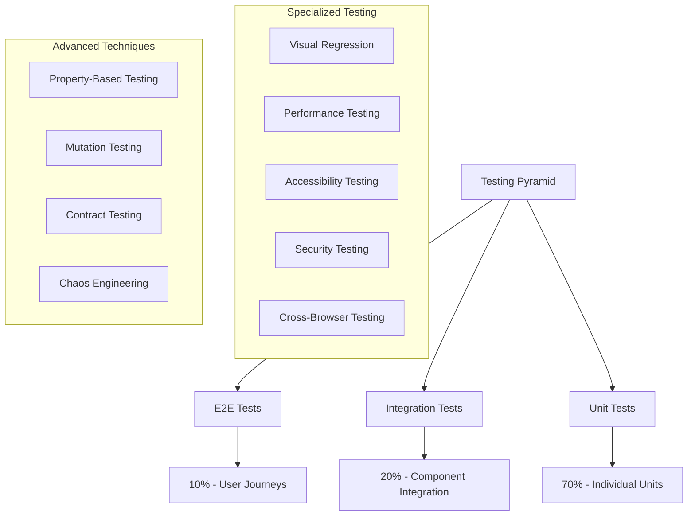

# Testing Laboratory - Angular Material 3 Mastery

## 🧪 **Testing Laboratory Overview**

Welcome to the **Testing Laboratory** – a specialized learning environment focused on mastering comprehensive testing strategies for Angular Material 3 applications. This lab covers everything from unit testing individual components to end-to-end testing of complex enterprise applications.

## 🎯 **Testing Philosophy**

### **Quality-First Approach**
Testing is not an afterthought – it's an integral part of the development process that ensures:
- **Reliability**: Applications work correctly under all conditions
- **Maintainability**: Code can be refactored safely with confidence
- **Performance**: Applications meet performance requirements consistently
- **Accessibility**: Inclusive design works for all users
- **Security**: Applications are protected against vulnerabilities

### **Testing Pyramid Strategy**


## 🔬 **Laboratory Modules**

### **📋 Module 1: Unit Testing Mastery** (2-3 weeks)
**Focus**: Testing individual components, services, and utilities in isolation

#### **Advanced Component Testing**
```typescript
// Advanced component testing patterns
describe('MaterialButtonComponent', () => {
  let component: MaterialButtonComponent;
  let fixture: ComponentFixture<MaterialButtonComponent>;
  
  // Custom testing utilities
  class MaterialButtonTester {
    constructor(private fixture: ComponentFixture<MaterialButtonComponent>) {}
    
    get button(): HTMLButtonElement {
      return this.fixture.nativeElement.querySelector('button');
    }
    
    get rippleElements(): NodeListOf<Element> {
      return this.fixture.nativeElement.querySelectorAll('.mat-ripple-element');
    }
    
    async clickAndWait(): Promise<void> {
      this.button.click();
      this.fixture.detectChanges();
      await this.fixture.whenStable();
    }
    
    async testRippleAnimation(): Promise<void> {
      const initialRipples = this.rippleElements.length;
      await this.clickAndWait();
      
      // Wait for ripple animation to start
      await new Promise(resolve => setTimeout(resolve, 100));
      
      const activeRipples = this.rippleElements.length;
      expect(activeRipples).toBeGreaterThan(initialRipples);
    }
    
    testAccessibility(): void {
      expect(this.button.getAttribute('aria-label')).toBeTruthy();
      expect(this.button.getAttribute('role')).toBe('button');
      expect(this.button.hasAttribute('disabled')).toBeFalsy();
    }
  }
  
  beforeEach(async () => {
    await TestBed.configureTestingModule({
      imports: [MaterialButtonComponent, NoopAnimationsModule],
      providers: [
        { provide: ElementRef, useValue: { nativeElement: document.createElement('button') } }
      ]
    }).compileComponents();
    
    fixture = TestBed.createComponent(MaterialButtonComponent);
    component = fixture.componentInstance;
  });
  
  it('should handle rapid clicking without memory leaks', async () => {
    const tester = new MaterialButtonTester(fixture);
    const initialMemory = (performance as any).memory?.usedJSHeapSize || 0;
    
    // Perform rapid clicking
    for (let i = 0; i < 100; i++) {
      await tester.clickAndWait();
    }
    
    // Force garbage collection if available
    if ((window as any).gc) {
      (window as any).gc();
    }
    
    const finalMemory = (performance as any).memory?.usedJSHeapSize || 0;
    const memoryIncrease = finalMemory - initialMemory;
    
    // Memory increase should be minimal
    expect(memoryIncrease).toBeLessThan(1024 * 1024); // 1MB threshold
  });
  
  it('should be accessible', () => {
    const tester = new MaterialButtonTester(fixture);
    tester.testAccessibility();
  });
});
```

#### **Service Testing with Advanced Patterns**
```typescript
// Testing services with complex dependencies
describe('ThemeService', () => {
  let service: ThemeService;
  let mockHttpClient: jasmine.SpyObj<HttpClient>;
  let mockLocalStorage: jasmine.SpyObj<Storage>;
  
  beforeEach(() => {
    const httpSpy = jasmine.createSpyObj('HttpClient', ['get', 'post']);
    const storageSpy = jasmine.createSpyObj('Storage', ['getItem', 'setItem', 'removeItem']);
    
    TestBed.configureTestingModule({
      providers: [
        ThemeService,
        { provide: HttpClient, useValue: httpSpy },
        { provide: 'localStorage', useValue: storageSpy }
      ]
    });
    
    service = TestBed.inject(ThemeService);
    mockHttpClient = TestBed.inject(HttpClient) as jasmine.SpyObj<HttpClient>;
    mockLocalStorage = TestBed.inject('localStorage') as jasmine.SpyObj<Storage>;
  });
  
  it('should handle theme loading errors gracefully', fakeAsync(() => {
    // Setup error response
    mockHttpClient.get.and.returnValue(throwError({ status: 404, message: 'Theme not found' }));
    
    let result: any;
    let error: any;
    
    service.loadTheme('non-existent-theme').subscribe({
      next: (theme) => result = theme,
      error: (err) => error = err
    });
    
    tick();
    
    expect(error).toBeDefined();
    expect(result).toBeUndefined();
    expect(service.getCurrentTheme()).toBe(service.getDefaultTheme());
  }));
  
  it('should debounce rapid theme changes', fakeAsync(() => {
    const themeChangeSpy = jasmine.createSpy('themeChange');
    service.themeChange$.subscribe(themeChangeSpy);
    
    // Rapid theme changes
    service.setTheme('theme1');
    service.setTheme('theme2');
    service.setTheme('theme3');
    
    // Should not emit immediately
    expect(themeChangeSpy).not.toHaveBeenCalled();
    
    // After debounce period
    tick(300);
    
    // Should only emit once with the final theme
    expect(themeChangeSpy).toHaveBeenCalledTimes(1);
    expect(themeChangeSpy).toHaveBeenCalledWith('theme3');
  }));
});
```

### **🔗 Module 2: Integration Testing Excellence** (3-4 weeks)
**Focus**: Testing component interactions and complex user flows

#### **Component Integration Testing**
```typescript
// Testing complex component interactions
describe('DataTableWithFiltering', () => {
  let component: DataTableComponent;
  let fixture: ComponentFixture<DataTableComponent>;
  let filterService: FilterService;
  
  class DataTableIntegrationTester {
    constructor(
      private fixture: ComponentFixture<DataTableComponent>,
      private filterService: FilterService
    ) {}
    
    async applyFilter(column: string, value: string): Promise<void> {
      const filterInput = this.fixture.nativeElement.querySelector(`[data-column="${column}"] input`);
      filterInput.value = value;
      filterInput.dispatchEvent(new Event('input'));
      
      this.fixture.detectChanges();
      await this.fixture.whenStable();
    }
    
    async clearAllFilters(): Promise<void> {
      const clearButton = this.fixture.nativeElement.querySelector('[data-testid="clear-filters"]');
      clearButton.click();
      
      this.fixture.detectChanges();
      await this.fixture.whenStable();
    }
    
    getVisibleRows(): NodeListOf<Element> {
      return this.fixture.nativeElement.querySelectorAll('tbody tr:not(.hidden)');
    }
    
    async testFilterPerformance(rowCount: number): Promise<number> {
      const data = generateTestData(rowCount);
      this.fixture.componentInstance.dataSource = data;
      this.fixture.detectChanges();
      
      const startTime = performance.now();
      await this.applyFilter('name', 'test');
      const endTime = performance.now();
      
      return endTime - startTime;
    }
  }
  
  beforeEach(async () => {
    await TestBed.configureTestingModule({
      imports: [DataTableModule, MatInputModule, MatButtonModule],
      providers: [FilterService]
    }).compileComponents();
    
    fixture = TestBed.createComponent(DataTableComponent);
    component = fixture.componentInstance;
    filterService = TestBed.inject(FilterService);
  });
  
  it('should filter data correctly with multiple criteria', async () => {
    const tester = new DataTableIntegrationTester(fixture, filterService);
    
    // Setup test data
    component.dataSource = [
      { id: 1, name: 'Alice', department: 'Engineering', status: 'Active' },
      { id: 2, name: 'Bob', department: 'Marketing', status: 'Active' },
      { id: 3, name: 'Charlie', department: 'Engineering', status: 'Inactive' }
    ];
    fixture.detectChanges();
    
    // Apply multiple filters
    await tester.applyFilter('department', 'Engineering');
    await tester.applyFilter('status', 'Active');
    
    const visibleRows = tester.getVisibleRows();
    expect(visibleRows.length).toBe(1);
    expect(visibleRows[0].textContent).toContain('Alice');
  });
  
  it('should maintain filter performance with large datasets', async () => {
    const tester = new DataTableIntegrationTester(fixture, filterService);
    
    const filterTime = await tester.testFilterPerformance(10000);
    
    // Filter should complete within 100ms for 10k rows
    expect(filterTime).toBeLessThan(100);
  });
});
```

#### **State Management Integration Testing**
```typescript
// Testing NgRx integration with components
describe('TaskListComponent with NgRx', () => {
  let store: MockStore;
  let component: TaskListComponent;
  let fixture: ComponentFixture<TaskListComponent>;
  
  const initialState = {
    tasks: {
      entities: {},
      ids: [],
      loading: false,
      error: null
    }
  };
  
  beforeEach(async () => {
    await TestBed.configureTestingModule({
      imports: [TaskListComponent],
      providers: [
        provideMockStore({ initialState })
      ]
    }).compileComponents();
    
    store = TestBed.inject(MockStore);
    fixture = TestBed.createComponent(TaskListComponent);
    component = fixture.componentInstance;
  });
  
  it('should handle loading and error states correctly', () => {
    // Test loading state
    store.setState({
      ...initialState,
      tasks: { ...initialState.tasks, loading: true }
    });
    fixture.detectChanges();
    
    const loadingSpinner = fixture.nativeElement.querySelector('[data-testid="loading-spinner"]');
    expect(loadingSpinner).toBeTruthy();
    
    // Test error state
    store.setState({
      ...initialState,
      tasks: { ...initialState.tasks, loading: false, error: 'Failed to load tasks' }
    });
    fixture.detectChanges();
    
    const errorMessage = fixture.nativeElement.querySelector('[data-testid="error-message"]');
    expect(errorMessage.textContent).toContain('Failed to load tasks');
  });
  
  it('should dispatch actions correctly', () => {
    const dispatchSpy = spyOn(store, 'dispatch');
    
    const addButton = fixture.nativeElement.querySelector('[data-testid="add-task"]');
    addButton.click();
    
    expect(dispatchSpy).toHaveBeenCalledWith(TaskActions.createTask({ task: jasmine.any(Object) }));
  });
});
```

### **🎭 Module 3: End-to-End Testing Mastery** (3-4 weeks)
**Focus**: Testing complete user journeys and application workflows

#### **Advanced Cypress Testing**
```typescript
// Advanced E2E testing with Cypress
describe('Material 3 Theme System E2E', () => {
  beforeEach(() => {
    cy.visit('/dashboard');
    cy.get('[data-cy="theme-selector"]').should('be.visible');
  });
  
  it('should apply theme changes across the entire application', () => {
    // Test theme persistence
    cy.get('[data-cy="theme-selector"]').click();
    cy.get('[data-cy="theme-option-dark"]').click();
    
    // Verify theme application
    cy.get('body').should('have.class', 'dark-theme');
    cy.get('.mat-toolbar').should('have.css', 'background-color', 'rgb(18, 18, 18)');
    
    // Navigate to different page and verify theme persistence
    cy.get('[data-cy="nav-settings"]').click();
    cy.get('body').should('have.class', 'dark-theme');
    
    // Reload page and verify theme persistence
    cy.reload();
    cy.get('body').should('have.class', 'dark-theme');
  });
  
  it('should handle responsive theme changes', () => {
    // Test desktop theme
    cy.viewport(1200, 800);
    cy.get('[data-cy="sidebar"]').should('be.visible');
    
    // Test tablet theme
    cy.viewport(768, 1024);
    cy.get('[data-cy="sidebar"]').should('not.be.visible');
    cy.get('[data-cy="mobile-menu-button"]').should('be.visible');
    
    // Test mobile theme
    cy.viewport(375, 667);
    cy.get('[data-cy="mobile-menu-button"]').click();
    cy.get('[data-cy="mobile-menu"]').should('be.visible');
  });
  
  // Custom command for accessibility testing
  it('should be accessible across all themes', () => {
    const themes = ['light', 'dark', 'high-contrast'];
    
    themes.forEach(theme => {
      cy.setTheme(theme);
      cy.injectAxe();
      cy.checkA11y(null, {
        rules: {
          'color-contrast': { enabled: true }
        }
      });
    });
  });
});

// Custom Cypress commands
Cypress.Commands.add('setTheme', (theme: string) => {
  cy.get('[data-cy="theme-selector"]').click();
  cy.get(`[data-cy="theme-option-${theme}"]`).click();
  cy.wait(500); // Wait for theme transition
});

Cypress.Commands.add('checkA11y', (context?: any, options?: any) => {
  cy.window().then(win => {
    return (win as any).axe.run(context, options);
  }).then(results => {
    if (results.violations.length > 0) {
      cy.task('log', 'Accessibility violations found:');
      results.violations.forEach((violation: any) => {
        cy.task('log', `${violation.id}: ${violation.description}`);
      });
      throw new Error(`${results.violations.length} accessibility violations found`);
    }
  });
});
```

#### **Playwright Cross-Browser Testing**
```typescript
// Cross-browser testing with Playwright
import { test, expect, Browser } from '@playwright/test';

test.describe('Material 3 Components Cross-Browser', () => {
  ['chromium', 'firefox', 'webkit'].forEach(browserName => {
    test.describe(`${browserName} tests`, () => {
      test('material button should render consistently', async ({ page }) => {
        await page.goto('/component-gallery/button');
        
        // Test button variants
        const variants = ['filled', 'outlined', 'text'];
        
        for (const variant of variants) {
          const button = page.locator(`[data-testid="button-${variant}"]`);
          await expect(button).toBeVisible();
          
          // Test hover state
          await button.hover();
          await expect(button).toHaveClass(/mat-mdc-button-hover/);
          
          // Test focus state
          await button.focus();
          await expect(button).toHaveClass(/mat-mdc-button-focus/);
          
          // Test click interaction
          await button.click();
          await expect(page.locator('[data-testid="click-counter"]')).toContainText('1');
        }
      });
      
      test('data table should handle large datasets', async ({ page }) => {
        await page.goto('/component-gallery/data-table');
        
        // Load large dataset
        await page.locator('[data-testid="load-large-dataset"]').click();
        
        // Wait for data to load
        await page.waitForSelector('[data-testid="data-table-loaded"]');
        
        // Test virtual scrolling performance
        const startTime = Date.now();
        await page.locator('[data-testid="data-table"]').scrollIntoView();
        
        // Scroll through multiple pages
        for (let i = 0; i < 10; i++) {
          await page.keyboard.press('PageDown');
          await page.waitForTimeout(100);
        }
        
        const endTime = Date.now();
        const scrollTime = endTime - startTime;
        
        // Scrolling should be smooth (less than 2 seconds for 10 page downs)
        expect(scrollTime).toBeLessThan(2000);
      });
    });
  });
});
```

### **👁️ Module 4: Visual Regression Testing** (2-3 weeks)
**Focus**: Ensuring consistent visual appearance across changes

#### **Advanced Visual Testing with Storybook**
```typescript
// Visual regression testing setup
import { Meta, StoryObj } from '@storybook/angular';
import { MaterialButtonComponent } from './material-button.component';

const meta: Meta<MaterialButtonComponent> = {
  title: 'Material 3/Button',
  component: MaterialButtonComponent,
  parameters: {
    layout: 'centered',
    chromatic: {
      modes: {
        light: { theme: 'light' },
        dark: { theme: 'dark' },
        'high-contrast': { theme: 'high-contrast' }
      },
      viewports: [320, 768, 1200],
      pauseAnimationAtEnd: true
    }
  },
  argTypes: {
    variant: {
      control: { type: 'select' },
      options: ['filled', 'outlined', 'text']
    },
    size: {
      control: { type: 'select' },
      options: ['small', 'medium', 'large']
    }
  }
};

export default meta;
type Story = StoryObj<MaterialButtonComponent>;

export const AllVariants: Story = {
  render: () => ({
    template: `
      <div style="display: flex; gap: 16px; flex-wrap: wrap;">
        <mat-button variant="filled">Filled Button</mat-button>
        <mat-button variant="outlined">Outlined Button</mat-button>
        <mat-button variant="text">Text Button</mat-button>
        <mat-button variant="filled" disabled>Disabled Button</mat-button>
      </div>
    `
  })
};

export const InteractionStates: Story = {
  render: () => ({
    template: `
      <div style="display: flex; gap: 16px; flex-direction: column;">
        <mat-button class="pseudo-hover">Hover State</mat-button>
        <mat-button class="pseudo-focus">Focus State</mat-button>
        <mat-button class="pseudo-active">Active State</mat-button>
      </div>
    `,
    styles: [`
      .pseudo-hover { 
        background-color: var(--mat-filled-button-hover-state-layer-color); 
      }
      .pseudo-focus { 
        outline: 2px solid var(--mat-filled-button-focus-state-layer-color); 
      }
      .pseudo-active { 
        background-color: var(--mat-filled-button-pressed-state-layer-color); 
      }
    `]
  })
};

// Accessibility testing in Storybook
export const AccessibilityTest: Story = {
  parameters: {
    a11y: {
      config: {
        rules: [
          {
            id: 'color-contrast',
            enabled: true
          },
          {
            id: 'keyboard-navigation',
            enabled: true
          }
        ]
      }
    }
  },
  play: async ({ canvasElement }) => {
    const canvas = within(canvasElement);
    const button = canvas.getByRole('button');
    
    // Test keyboard navigation
    await userEvent.tab();
    expect(button).toHaveFocus();
    
    // Test keyboard activation
    await userEvent.keyboard('{Enter}');
    
    // Test ARIA attributes
    expect(button).toHaveAttribute('role', 'button');
    expect(button).toHaveAttribute('aria-pressed', 'false');
  }
};
```

### **⚡ Module 5: Performance Testing** (2-3 weeks)
**Focus**: Ensuring optimal performance under various conditions

#### **Performance Testing Framework**
```typescript
// Performance testing utilities
export class PerformanceTester {
  static async measureComponentRenderTime<T>(
    component: Type<T>,
    inputs: Partial<T> = {}
  ): Promise<PerformanceResult> {
    const fixture = TestBed.createComponent(component);
    
    // Apply inputs
    Object.assign(fixture.componentInstance, inputs);
    
    // Measure render time
    const startTime = performance.now();
    fixture.detectChanges();
    await fixture.whenStable();
    const endTime = performance.now();
    
    const renderTime = endTime - startTime;
    
    // Measure memory usage
    const memoryBefore = (performance as any).memory?.usedJSHeapSize || 0;
    
    // Create multiple instances to test memory scaling
    const instances = [];
    for (let i = 0; i < 100; i++) {
      const instance = TestBed.createComponent(component);
      Object.assign(instance.componentInstance, inputs);
      instance.detectChanges();
      instances.push(instance);
    }
    
    const memoryAfter = (performance as any).memory?.usedJSHeapSize || 0;
    const memoryPerInstance = (memoryAfter - memoryBefore) / 100;
    
    // Cleanup
    instances.forEach(instance => instance.destroy());
    
    return {
      renderTime,
      memoryPerInstance,
      passed: renderTime < 16 && memoryPerInstance < 1024 // 16ms render, 1KB memory
    };
  }
  
  static async measureScrollPerformance(
    fixture: ComponentFixture<any>,
    scrollDistance: number = 1000
  ): Promise<ScrollPerformanceResult> {
    const scrollContainer = fixture.nativeElement.querySelector('[data-testid="scroll-container"]');
    const frameRates: number[] = [];
    
    let lastFrameTime = performance.now();
    const measureFrameRate = () => {
      const currentTime = performance.now();
      const frameTime = currentTime - lastFrameTime;
      frameRates.push(1000 / frameTime);
      lastFrameTime = currentTime;
    };
    
    // Start measuring
    const observer = new PerformanceObserver(measureFrameRate);
    observer.observe({ entryTypes: ['frame'] });
    
    // Perform scroll
    const scrollSteps = 20;
    const stepSize = scrollDistance / scrollSteps;
    
    for (let i = 0; i < scrollSteps; i++) {
      scrollContainer.scrollTop += stepSize;
      await new Promise(resolve => requestAnimationFrame(resolve));
    }
    
    observer.disconnect();
    
    const averageFrameRate = frameRates.reduce((a, b) => a + b, 0) / frameRates.length;
    const minFrameRate = Math.min(...frameRates);
    
    return {
      averageFrameRate,
      minFrameRate,
      dropped60fps: frameRates.filter(rate => rate < 60).length,
      passed: averageFrameRate >= 55 && minFrameRate >= 30
    };
  }
}

// Performance test examples
describe('Material Data Table Performance', () => {
  it('should render quickly with large datasets', async () => {
    const result = await PerformanceTester.measureComponentRenderTime(
      MaterialDataTableComponent,
      { dataSource: generateLargeDataset(10000) }
    );
    
    expect(result.passed).toBe(true);
    expect(result.renderTime).toBeLessThan(100); // 100ms threshold
  });
  
  it('should maintain smooth scrolling', async () => {
    const fixture = TestBed.createComponent(MaterialDataTableComponent);
    fixture.componentInstance.dataSource = generateLargeDataset(10000);
    fixture.detectChanges();
    
    const result = await PerformanceTester.measureScrollPerformance(fixture);
    
    expect(result.passed).toBe(true);
    expect(result.averageFrameRate).toBeGreaterThan(55);
  });
});
```

## 🎯 **Laboratory Success Metrics**

### **Quality Metrics**
- **Test Coverage**: 95%+ code coverage across all test types
- **Test Reliability**: 99.9% test pass rate with minimal flakes
- **Performance Standards**: All performance tests passing consistently
- **Accessibility Compliance**: 100% WCAG 2.1 AA compliance
- **Cross-Browser Compatibility**: Consistent behavior across all major browsers

### **Efficiency Metrics**
- **Test Execution Speed**: Full test suite completes in under 10 minutes
- **Developer Productivity**: 50% reduction in debugging time
- **Bug Detection**: 90% of bugs caught before production
- **Regression Prevention**: Zero critical regressions reaching production
- **Maintenance Overhead**: Minimal test maintenance required

## 📚 **Laboratory Resources**

### **Testing Frameworks & Tools**
- [Jest Testing Framework](https://jestjs.io/)
- [Angular Testing Utilities](https://angular.io/guide/testing)
- [Cypress E2E Testing](https://cypress.io/)
- [Playwright Cross-Browser Testing](https://playwright.dev/)
- [Storybook Visual Testing](https://storybook.js.org/docs/react/writing-tests/visual-testing)

### **Best Practices & Guides**
- [Testing Best Practices](https://github.com/goldbergyoni/javascript-testing-best-practices)
- [Material Design Testing Guidelines](https://material.io/design/usability/accessibility.html)
- [Web Accessibility Testing](https://www.w3.org/WAI/test-evaluate/)
- [Performance Testing Guide](https://web.dev/performance-testing/)

---

**Master the Art of Testing!** 🧪

*Quality is not an accident – it's the result of intelligent effort, systematic testing, and continuous improvement. Your mastery of testing ensures that every Angular Material 3 application you build is reliable, performant, and accessible to all users.*

**Test with confidence, ship with pride!** ✨
