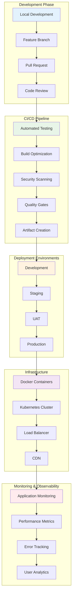

# Deployment Mastery for Angular Material Applications

## 🚀 **Deployment Architecture Overview**

This comprehensive guide covers enterprise-grade deployment patterns for Angular Material applications, from basic hosting to advanced orchestration and monitoring.

## 📊 **Deployment Pipeline Architecture**



## 🏗️ **Container Orchestration with Docker & Kubernetes**

### **Docker Configuration**

#### **Multi-Stage Production Dockerfile**
```dockerfile
# Build stage
FROM node:18-alpine AS builder

# Set working directory
WORKDIR /app

# Copy package files
COPY package*.json ./

# Install dependencies
RUN npm ci --only=production

# Copy source code
COPY . .

# Build application
RUN npm run build:prod

# Runtime stage
FROM nginx:alpine AS runtime

# Copy custom nginx configuration
COPY nginx.conf /etc/nginx/nginx.conf

# Copy built application
COPY --from=builder /app/dist /usr/share/nginx/html

# Add health check
HEALTHCHECK --interval=30s --timeout=3s --start-period=5s --retries=3 \
  CMD curl -f http://localhost/ || exit 1

# Expose port
EXPOSE 80

# Start nginx
CMD ["nginx", "-g", "daemon off;"]
```

#### **Optimized Nginx Configuration**
```nginx
# nginx.conf
events {
    worker_connections 1024;
}

http {
    include       /etc/nginx/mime.types;
    default_type  application/octet-stream;
    
    # Gzip compression
    gzip on;
    gzip_comp_level 6;
    gzip_types
        text/plain
        text/css
        text/xml
        text/javascript
        application/javascript
        application/json
        application/xml+rss;
    
    # Security headers
    add_header X-Frame-Options "SAMEORIGIN";
    add_header X-Content-Type-Options "nosniff";
    add_header X-XSS-Protection "1; mode=block";
    add_header Strict-Transport-Security "max-age=31536000; includeSubDomains";
    
    # Content Security Policy
    add_header Content-Security-Policy "default-src 'self'; script-src 'self' 'unsafe-inline'; style-src 'self' 'unsafe-inline' fonts.googleapis.com; font-src 'self' fonts.gstatic.com; img-src 'self' data: https:; connect-src 'self' https://api.example.com;";
    
    server {
        listen 80;
        server_name localhost;
        root /usr/share/nginx/html;
        index index.html;
        
        # Enable browser caching for static assets
        location ~* \.(js|css|png|jpg|jpeg|gif|ico|svg|woff|woff2|ttf|eot)$ {
            expires 1y;
            add_header Cache-Control "public, immutable";
        }
        
        # Angular routing support
        location / {
            try_files $uri $uri/ /index.html;
        }
        
        # API proxy (if needed)
        location /api/ {
            proxy_pass http://backend-service:8080/;
            proxy_set_header Host $host;
            proxy_set_header X-Real-IP $remote_addr;
            proxy_set_header X-Forwarded-For $proxy_add_x_forwarded_for;
            proxy_set_header X-Forwarded-Proto $scheme;
        }
        
        # Health check endpoint
        location /health {
            access_log off;
            return 200 "healthy\n";
            add_header Content-Type text/plain;
        }
    }
}
```

### **Kubernetes Deployment Configuration**

#### **Deployment Manifest**
```yaml
# deployment.yaml
apiVersion: apps/v1
kind: Deployment
metadata:
  name: angular-material-app
  namespace: production
  labels:
    app: angular-material-app
    version: v1.0.0
spec:
  replicas: 3
  selector:
    matchLabels:
      app: angular-material-app
  template:
    metadata:
      labels:
        app: angular-material-app
        version: v1.0.0
    spec:
      containers:
      - name: angular-material-app
        image: your-registry/angular-material-app:latest
        ports:
        - containerPort: 80
        resources:
          requests:
            memory: "128Mi"
            cpu: "100m"
          limits:
            memory: "256Mi"
            cpu: "200m"
        livenessProbe:
          httpGet:
            path: /health
            port: 80
          initialDelaySeconds: 30
          periodSeconds: 10
        readinessProbe:
          httpGet:
            path: /health
            port: 80
          initialDelaySeconds: 5
          periodSeconds: 5
        env:
        - name: NODE_ENV
          value: "production"
        - name: API_URL
          valueFrom:
            configMapKeyRef:
              name: app-config
              key: api-url
        volumeMounts:
        - name: config-volume
          mountPath: /app/config
          readOnly: true
      volumes:
      - name: config-volume
        configMap:
          name: app-config
      imagePullSecrets:
      - name: registry-secret
---
apiVersion: v1
kind: Service
metadata:
  name: angular-material-app-service
  namespace: production
spec:
  selector:
    app: angular-material-app
  ports:
  - protocol: TCP
    port: 80
    targetPort: 80
  type: ClusterIP
---
apiVersion: networking.k8s.io/v1
kind: Ingress
metadata:
  name: angular-material-app-ingress
  namespace: production
  annotations:
    kubernetes.io/ingress.class: "nginx"
    cert-manager.io/cluster-issuer: "letsencrypt-prod"
    nginx.ingress.kubernetes.io/ssl-redirect: "true"
    nginx.ingress.kubernetes.io/force-ssl-redirect: "true"
spec:
  tls:
  - hosts:
    - your-domain.com
    secretName: angular-material-app-tls
  rules:
  - host: your-domain.com
    http:
      paths:
      - path: /
        pathType: Prefix
        backend:
          service:
            name: angular-material-app-service
            port:
              number: 80
```

#### **ConfigMap for Environment Configuration**
```yaml
# configmap.yaml
apiVersion: v1
kind: ConfigMap
metadata:
  name: app-config
  namespace: production
data:
  api-url: "https://api.your-domain.com"
  environment: "production"
  feature-flags.json: |
    {
      "enableDarkMode": true,
      "enableAnalytics": true,
      "enableNewFeatures": false
    }
  nginx.conf: |
    # Custom nginx configuration
    server {
      listen 80;
      # ... additional configuration
    }
```

## 🔄 **Advanced CI/CD Pipeline**

### **GitHub Actions Workflow**
```yaml
# .github/workflows/deploy.yml
name: Build and Deploy Angular Material App

on:
  push:
    branches: [ main, develop ]
  pull_request:
    branches: [ main ]

env:
  REGISTRY: ghcr.io
  IMAGE_NAME: ${{ github.repository }}

jobs:
  test:
    runs-on: ubuntu-latest
    
    steps:
    - name: Checkout code
      uses: actions/checkout@v4
      
    - name: Setup Node.js
      uses: actions/setup-node@v4
      with:
        node-version: '18'
        cache: 'npm'
        
    - name: Install dependencies
      run: npm ci
      
    - name: Run linting
      run: npm run lint
      
    - name: Run unit tests
      run: npm run test:ci
      
    - name: Run e2e tests
      run: npm run e2e:ci
      
    - name: Upload coverage reports
      uses: codecov/codecov-action@v3
      with:
        file: ./coverage/lcov.info
        
  security-scan:
    runs-on: ubuntu-latest
    needs: test
    
    steps:
    - name: Checkout code
      uses: actions/checkout@v4
      
    - name: Run security audit
      run: npm audit --audit-level moderate
      
    - name: Run Snyk security scan
      uses: snyk/actions/node@master
      env:
        SNYK_TOKEN: ${{ secrets.SNYK_TOKEN }}
        
  build:
    runs-on: ubuntu-latest
    needs: [test, security-scan]
    
    steps:
    - name: Checkout code
      uses: actions/checkout@v4
      
    - name: Setup Node.js
      uses: actions/setup-node@v4
      with:
        node-version: '18'
        cache: 'npm'
        
    - name: Install dependencies
      run: npm ci
      
    - name: Build application
      run: npm run build:prod
      
    - name: Analyze bundle
      run: npm run analyze
      
    - name: Upload build artifacts
      uses: actions/upload-artifact@v3
      with:
        name: dist-files
        path: dist/
        
  docker-build:
    runs-on: ubuntu-latest
    needs: build
    
    steps:
    - name: Checkout code
      uses: actions/checkout@v4
      
    - name: Download build artifacts
      uses: actions/download-artifact@v3
      with:
        name: dist-files
        path: dist/
        
    - name: Set up Docker Buildx
      uses: docker/setup-buildx-action@v3
      
    - name: Log in to Container Registry
      uses: docker/login-action@v3
      with:
        registry: ${{ env.REGISTRY }}
        username: ${{ github.actor }}
        password: ${{ secrets.GITHUB_TOKEN }}
        
    - name: Extract metadata
      id: meta
      uses: docker/metadata-action@v5
      with:
        images: ${{ env.REGISTRY }}/${{ env.IMAGE_NAME }}
        tags: |
          type=ref,event=branch
          type=ref,event=pr
          type=sha,prefix={{branch}}-
          type=raw,value=latest,enable={{is_default_branch}}
          
    - name: Build and push Docker image
      uses: docker/build-push-action@v5
      with:
        context: .
        push: true
        tags: ${{ steps.meta.outputs.tags }}
        labels: ${{ steps.meta.outputs.labels }}
        cache-from: type=gha
        cache-to: type=gha,mode=max
        
  deploy-staging:
    runs-on: ubuntu-latest
    needs: docker-build
    if: github.ref == 'refs/heads/develop'
    environment: staging
    
    steps:
    - name: Deploy to staging
      run: |
        # Deploy to staging environment
        kubectl set image deployment/angular-material-app \
          angular-material-app=${{ env.REGISTRY }}/${{ env.IMAGE_NAME }}:develop-${{ github.sha }} \
          --namespace=staging
        kubectl rollout status deployment/angular-material-app --namespace=staging
        
  deploy-production:
    runs-on: ubuntu-latest
    needs: docker-build
    if: github.ref == 'refs/heads/main'
    environment: production
    
    steps:
    - name: Deploy to production
      run: |
        # Blue-green deployment
        kubectl set image deployment/angular-material-app \
          angular-material-app=${{ env.REGISTRY }}/${{ env.IMAGE_NAME }}:latest \
          --namespace=production
        kubectl rollout status deployment/angular-material-app --namespace=production
        
        # Run smoke tests
        npm run smoke-tests:prod
        
  lighthouse-audit:
    runs-on: ubuntu-latest
    needs: deploy-staging
    if: github.ref == 'refs/heads/develop'
    
    steps:
    - name: Run Lighthouse audit
      uses: treosh/lighthouse-ci-action@v9
      with:
        urls: |
          https://staging.your-domain.com
        uploadArtifacts: true
        temporaryPublicStorage: true
```

## 🌐 **CDN and Performance Optimization**

### **CloudFlare Configuration**
```javascript
// cloudflare-worker.js
addEventListener('fetch', event => {
  event.respondWith(handleRequest(event.request))
})

async function handleRequest(request) {
  const url = new URL(request.url)
  
  // Cache static assets aggressively
  if (url.pathname.match(/\.(js|css|png|jpg|jpeg|gif|ico|svg|woff|woff2|ttf|eot)$/)) {
    const cache = caches.default
    const cacheKey = new Request(url.toString(), request)
    
    let response = await cache.match(cacheKey)
    
    if (!response) {
      response = await fetch(request)
      
      // Cache for 1 year
      const headers = new Headers(response.headers)
      headers.set('Cache-Control', 'public, max-age=31536000, immutable')
      
      response = new Response(response.body, {
        status: response.status,
        statusText: response.statusText,
        headers: headers
      })
      
      event.waitUntil(cache.put(cacheKey, response.clone()))
    }
    
    return response
  }
  
  // Handle SPA routing
  if (url.pathname.startsWith('/') && !url.pathname.includes('.')) {
    return fetch(new Request(url.origin + '/index.html', request))
  }
  
  return fetch(request)
}
```

### **Service Worker for Advanced Caching**
```typescript
// sw.ts
import { precacheAndRoute, cleanupOutdatedCaches } from 'workbox-precaching'
import { registerRoute } from 'workbox-routing'
import { StaleWhileRevalidate, CacheFirst, NetworkFirst } from 'workbox-strategies'

// Precache static assets
precacheAndRoute(self.__WB_MANIFEST)
cleanupOutdatedCaches()

// Cache API responses
registerRoute(
  /^https:\/\/api\.example\.com/,
  new NetworkFirst({
    cacheName: 'api-cache',
    networkTimeoutSeconds: 3,
    plugins: [{
      cacheKeyWillBeUsed: async ({ request }) => {
        return `${request.url}?timestamp=${Math.floor(Date.now() / 1000 / 60)}`
      }
    }]
  })
)

// Cache Google Fonts
registerRoute(
  /^https:\/\/fonts\.googleapis\.com/,
  new StaleWhileRevalidate({
    cacheName: 'google-fonts-stylesheets'
  })
)

registerRoute(
  /^https:\/\/fonts\.gstatic\.com/,
  new CacheFirst({
    cacheName: 'google-fonts-webfonts',
    plugins: [{
      cacheExpiration: {
        maxEntries: 30,
        maxAgeSeconds: 60 * 60 * 24 * 365 // 1 year
      }
    }]
  })
)

// Cache images
registerRoute(
  /\.(?:png|jpg|jpeg|svg|gif|webp)$/,
  new CacheFirst({
    cacheName: 'images',
    plugins: [{
      cacheExpiration: {
        maxEntries: 100,
        maxAgeSeconds: 60 * 60 * 24 * 30 // 30 days
      }
    }]
  })
)

// Handle offline fallback
self.addEventListener('fetch', event => {
  if (event.request.mode === 'navigate') {
    event.respondWith(
      fetch(event.request).catch(() => {
        return caches.match('/offline.html')
      })
    )
  }
})

// Background sync for analytics
self.addEventListener('sync', event => {
  if (event.tag === 'analytics-sync') {
    event.waitUntil(syncAnalytics())
  }
})

async function syncAnalytics() {
  // Sync offline analytics data
  const cache = await caches.open('analytics-cache')
  const requests = await cache.keys()
  
  for (const request of requests) {
    try {
      await fetch(request)
      await cache.delete(request)
    } catch (error) {
      console.error('Failed to sync analytics:', error)
    }
  }
}
```

## 📊 **Monitoring and Observability**

### **Application Performance Monitoring**
```typescript
// monitoring.service.ts
import { Injectable } from '@angular/core'
import { Router, NavigationEnd } from '@angular/router'
import { filter } from 'rxjs/operators'

@Injectable({
  providedIn: 'root'
})
export class MonitoringService {
  private performanceObserver: PerformanceObserver
  private errorCount = 0
  private userSessions = new Map<string, UserSession>()
  
  constructor(private router: Router) {
    this.initializeMonitoring()
    this.setupRouteTracking()
    this.setupErrorTracking()
  }
  
  private initializeMonitoring(): void {
    // Web Vitals monitoring
    this.setupWebVitalsMonitoring()
    
    // Custom performance metrics
    this.setupCustomMetrics()
    
    // Resource timing monitoring
    this.setupResourceTimingMonitoring()
    
    // Memory usage monitoring
    this.setupMemoryMonitoring()
  }
  
  private setupWebVitalsMonitoring(): void {
    // Largest Contentful Paint (LCP)
    new PerformanceObserver((list) => {
      const entries = list.getEntries()
      const lastEntry = entries[entries.length - 1]
      
      this.sendMetric('lcp', {
        value: lastEntry.startTime,
        url: window.location.href,
        timestamp: Date.now()
      })
    }).observe({ entryTypes: ['largest-contentful-paint'] })
    
    // First Input Delay (FID)
    new PerformanceObserver((list) => {
      const entries = list.getEntries()
      
      entries.forEach(entry => {
        this.sendMetric('fid', {
          value: entry.processingStart - entry.startTime,
          url: window.location.href,
          timestamp: Date.now()
        })
      })
    }).observe({ entryTypes: ['first-input'] })
    
    // Cumulative Layout Shift (CLS)
    let clsValue = 0
    new PerformanceObserver((list) => {
      const entries = list.getEntries()
      
      entries.forEach(entry => {
        if (!entry.hadRecentInput) {
          clsValue += entry.value
        }
      })
      
      this.sendMetric('cls', {
        value: clsValue,
        url: window.location.href,
        timestamp: Date.now()
      })
    }).observe({ entryTypes: ['layout-shift'] })
  }
  
  private setupCustomMetrics(): void {
    // Angular-specific metrics
    this.measureAngularBootstrap()
    this.measureComponentRenderTime()
    this.measureChangeDetectionTime()
  }
  
  private measureAngularBootstrap(): void {
    const navigationStart = performance.timing.navigationStart
    const angularBootstrap = performance.now()
    
    this.sendMetric('angular-bootstrap', {
      value: angularBootstrap,
      navigationStart,
      timestamp: Date.now()
    })
  }
  
  private setupRouteTracking(): void {
    this.router.events
      .pipe(filter(event => event instanceof NavigationEnd))
      .subscribe((event: NavigationEnd) => {
        const loadTime = performance.now()
        
        this.sendMetric('route-change', {
          route: event.url,
          loadTime,
          timestamp: Date.now()
        })
        
        // Track page views
        this.trackPageView(event.url)
      })
  }
  
  private setupErrorTracking(): void {
    window.addEventListener('error', (event) => {
      this.errorCount++
      
      this.sendMetric('javascript-error', {
        message: event.message,
        filename: event.filename,
        lineno: event.lineno,
        colno: event.colno,
        stack: event.error?.stack,
        timestamp: Date.now(),
        url: window.location.href,
        userAgent: navigator.userAgent
      })
    })
    
    window.addEventListener('unhandledrejection', (event) => {
      this.sendMetric('unhandled-promise-rejection', {
        reason: event.reason,
        timestamp: Date.now(),
        url: window.location.href
      })
    })
  }
  
  private setupResourceTimingMonitoring(): void {
    new PerformanceObserver((list) => {
      const entries = list.getEntries()
      
      entries.forEach(entry => {
        if (entry.name.includes('.js') || entry.name.includes('.css')) {
          this.sendMetric('resource-timing', {
            name: entry.name,
            duration: entry.duration,
            transferSize: (entry as any).transferSize,
            timestamp: Date.now()
          })
        }
      })
    }).observe({ entryTypes: ['resource'] })
  }
  
  private setupMemoryMonitoring(): void {
    if ('memory' in performance) {
      setInterval(() => {
        const memory = (performance as any).memory
        
        this.sendMetric('memory-usage', {
          used: memory.usedJSHeapSize,
          total: memory.totalJSHeapSize,
          limit: memory.jsHeapSizeLimit,
          timestamp: Date.now()
        })
      }, 30000) // Every 30 seconds
    }
  }
  
  private sendMetric(name: string, data: any): void {
    // Send to monitoring service
    fetch('/api/metrics', {
      method: 'POST',
      headers: {
        'Content-Type': 'application/json'
      },
      body: JSON.stringify({
        metric: name,
        data,
        sessionId: this.getSessionId(),
        userId: this.getUserId()
      })
    }).catch(error => {
      console.error('Failed to send metric:', error)
    })
  }
  
  private trackPageView(url: string): void {
    // Track page views for analytics
    this.sendMetric('page-view', {
      url,
      referrer: document.referrer,
      timestamp: Date.now(),
      viewport: {
        width: window.innerWidth,
        height: window.innerHeight
      }
    })
  }
  
  private getSessionId(): string {
    let sessionId = sessionStorage.getItem('sessionId')
    if (!sessionId) {
      sessionId = this.generateUUID()
      sessionStorage.setItem('sessionId', sessionId)
    }
    return sessionId
  }
  
  private getUserId(): string | null {
    return localStorage.getItem('userId')
  }
  
  private generateUUID(): string {
    return 'xxxxxxxx-xxxx-4xxx-yxxx-xxxxxxxxxxxx'.replace(/[xy]/g, function(c) {
      const r = Math.random() * 16 | 0
      const v = c == 'x' ? r : (r & 0x3 | 0x8)
      return v.toString(16)
    })
  }
}
```

### **Grafana Dashboard Configuration**
```yaml
# grafana-dashboard.yaml
apiVersion: v1
kind: ConfigMap
metadata:
  name: angular-material-dashboard
  namespace: monitoring
data:
  dashboard.json: |
    {
      "dashboard": {
        "title": "Angular Material App Performance",
        "panels": [
          {
            "title": "Core Web Vitals",
            "type": "stat",
            "targets": [
              {
                "expr": "avg(lcp_seconds)",
                "legendFormat": "LCP"
              },
              {
                "expr": "avg(fid_seconds)",
                "legendFormat": "FID"
              },
              {
                "expr": "avg(cls_ratio)",
                "legendFormat": "CLS"
              }
            ]
          },
          {
            "title": "Error Rate",
            "type": "graph",
            "targets": [
              {
                "expr": "rate(javascript_errors_total[5m])",
                "legendFormat": "JavaScript Errors"
              }
            ]
          },
          {
            "title": "Memory Usage",
            "type": "graph",
            "targets": [
              {
                "expr": "avg(memory_used_bytes)",
                "legendFormat": "Memory Used"
              }
            ]
          }
        ]
      }
    }
```

## 🔧 **Advanced Deployment Strategies**

### **Blue-Green Deployment**
```bash
#!/bin/bash
# blue-green-deploy.sh

NAMESPACE="production"
APP_NAME="angular-material-app"
NEW_IMAGE="$1"

# Get current deployment color
CURRENT_COLOR=$(kubectl get deployment $APP_NAME -n $NAMESPACE -o jsonpath='{.metadata.labels.color}')

if [ "$CURRENT_COLOR" = "blue" ]; then
    NEW_COLOR="green"
else
    NEW_COLOR="blue"
fi

echo "Deploying $NEW_COLOR version..."

# Update deployment with new image
kubectl set image deployment/$APP_NAME-$NEW_COLOR \
    $APP_NAME=$NEW_IMAGE \
    -n $NAMESPACE

# Wait for rollout to complete
kubectl rollout status deployment/$APP_NAME-$NEW_COLOR -n $NAMESPACE

# Run health checks
echo "Running health checks..."
kubectl exec -n $NAMESPACE deployment/$APP_NAME-$NEW_COLOR -- curl -f http://localhost/health

if [ $? -eq 0 ]; then
    echo "Health checks passed. Switching traffic..."
    
    # Update service to point to new deployment
    kubectl patch service $APP_NAME-service -n $NAMESPACE \
        -p '{"spec":{"selector":{"color":"'$NEW_COLOR'"}}}'
    
    echo "Traffic switched to $NEW_COLOR. Deployment complete!"
    
    # Scale down old deployment
    kubectl scale deployment $APP_NAME-$CURRENT_COLOR --replicas=0 -n $NAMESPACE
else
    echo "Health checks failed. Rolling back..."
    kubectl rollout undo deployment/$APP_NAME-$NEW_COLOR -n $NAMESPACE
    exit 1
fi
```

### **Canary Deployment with Istio**
```yaml
# canary-deployment.yaml
apiVersion: argoproj.io/v1alpha1
kind: Rollout
metadata:
  name: angular-material-app
  namespace: production
spec:
  replicas: 10
  strategy:
    canary:
      canaryService: angular-material-app-canary
      stableService: angular-material-app-stable
      trafficRouting:
        istio:
          virtualService:
            name: angular-material-app-vs
          destinationRule:
            name: angular-material-app-dr
            canarySubsetName: canary
            stableSubsetName: stable
      steps:
      - setWeight: 10
      - pause: {duration: 2m}
      - setWeight: 20
      - pause: {duration: 2m}
      - setWeight: 50
      - pause: {duration: 5m}
      - setWeight: 100
      analysis:
        templates:
        - templateName: success-rate
        args:
        - name: service-name
          value: angular-material-app
  selector:
    matchLabels:
      app: angular-material-app
  template:
    metadata:
      labels:
        app: angular-material-app
    spec:
      containers:
      - name: angular-material-app
        image: your-registry/angular-material-app:latest
        ports:
        - containerPort: 80
```

This comprehensive deployment mastery guide provides enterprise-grade deployment patterns that ensure reliable, scalable, and monitored deployments of Angular Material applications. The next sections could cover specific cloud provider integrations, advanced security configurations, and disaster recovery strategies.
