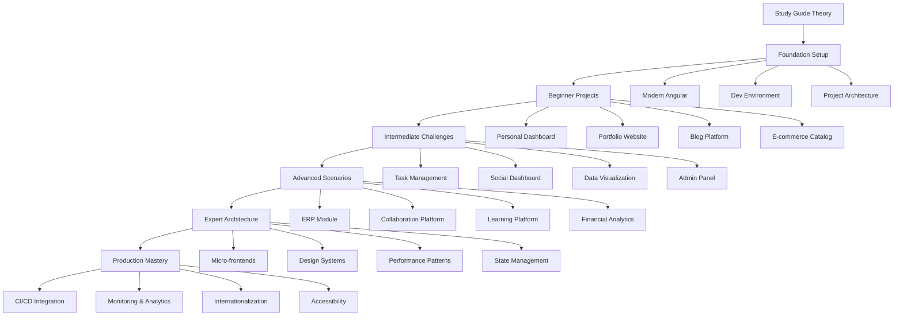

# Learning Roadmap - Angular Material 3 Mastery

## 🎯 Comprehensive Learning Path

This roadmap provides a structured approach to mastering Angular Material 3 through progressive project-based learning. Each level builds upon previous knowledge while introducing new concepts and challenges.

## 📊 Skill Progression Overview

## 🏁 Level 0: Foundation (Week 1) - 15-20 hours

### 📚 Prerequisites Review
**Time**: 2-3 hours
- [ ] Complete Material 3 Study Guide modules 1-4
- [ ] Angular fundamentals (Components, Services, Routing)
- [ ] TypeScript intermediate concepts
- [ ] Basic SCSS/CSS knowledge

### 🛠️ Modern Angular Setup
**Time**: 6-8 hours
- [ ] **Angular 17+ Features** (2 hours)
  - Signals and computed signals
  - Control flow syntax (`@if`, `@for`, `@switch`)
  - Standalone components
  - New lifecycle hooks
- [ ] **Development Environment** (2-3 hours)
  - VS Code setup and extensions
  - Debugging configuration
  - Performance profiling tools
  - Code quality automation
- [ ] **Project Architecture** (2-3 hours)
  - Folder structure patterns
  - Build optimization
  - Code quality gates
  - Team collaboration setup

### 🎯 Success Criteria
- [ ] Create Angular 17+ project with signals
- [ ] Implement standalone components
- [ ] Set up development environment
- [ ] Understand modern Angular patterns

---

## 🌱 Level 1: Beginner (Weeks 2-3) - 25-30 hours

### Project-Based Learning with Guided Instructions

#### Project 1: Personal Dashboard (8-10 hours)
**Skills Focus**: Basic theming, layout components, responsive design

**Week 2 - Days 1-3**
- [ ] **Project Setup** (2 hours)
  - Create Angular project with Material
  - Set up basic theme configuration
  - Implement project structure
- [ ] **Layout Implementation** (3 hours)
  - Sidenav with navigation
  - Toolbar with user profile
  - Card-based dashboard layout
- [ ] **Theming & Styling** (3-4 hours)
  - Custom color palette
  - Typography configuration
  - Responsive breakpoints
- [ ] **Testing & Documentation** (1 hour)
  - Basic unit tests
  - Component documentation

#### Project 2: Portfolio Website (6-8 hours)
**Skills Focus**: Content presentation, advanced theming, animations

**Week 2 - Days 4-5**
- [ ] **Component Architecture** (2 hours)
  - Reusable components
  - Content management
  - Navigation system
- [ ] **Advanced Theming** (2-3 hours)
  - Multiple theme variants
  - Dark/light mode switching
  - Custom component themes
- [ ] **Animation & Interactions** (2-3 hours)
  - Page transitions
  - Hover effects
  - Scroll animations

#### Project 3: Blog Platform (8-10 hours)
**Skills Focus**: Data display, filtering, pagination

**Week 3 - Days 1-3**
- [ ] **Data Management** (3 hours)
  - Article data structure
  - Category filtering
  - Search functionality
- [ ] **UI Components** (3-4 hours)
  - Article cards
  - Category chips
  - Pagination controls
- [ ] **Content Display** (2-3 hours)
  - Article detail view
  - Related articles
  - Author information

#### Project 4: E-commerce Catalog (6-8 hours)
**Skills Focus**: Complex layouts, state management, interactions

**Week 3 - Days 4-5**
- [ ] **Product Display** (3 hours)
  - Product grid layout
  - Image galleries
  - Product details
- [ ] **Shopping Features** (3-4 hours)
  - Add to cart functionality
  - Wishlist management
  - Price filtering
- [ ] **Checkout Process** (1 hour)
  - Shopping cart
  - Basic checkout flow

### 🎯 Level 1 Success Criteria
- [ ] Complete 4 guided projects
- [ ] Implement responsive theming
- [ ] Create reusable components
- [ ] Basic state management with signals
- [ ] Testing and documentation

---

## 🚀 Level 2: Intermediate (Weeks 4-5) - 30-35 hours

### Challenge-Based Projects with Requirements

#### Project 5: Task Management System (8-10 hours)
**Skills Focus**: CRUD operations, drag & drop, real-time updates

**Week 4 - Days 1-3**
- [ ] **Core Features** (4 hours)
  - Task creation and editing
  - Status management
  - Priority system
- [ ] **Advanced Interactions** (3-4 hours)
  - Drag & drop functionality
  - Keyboard shortcuts
  - Bulk operations
- [ ] **Data Persistence** (2-3 hours)
  - Local storage
  - Data synchronization
  - Offline support

#### Project 6: Social Media Dashboard (8-10 hours)
**Skills Focus**: Real-time data, charts, complex state

**Week 4 - Days 4-5**
- [ ] **Dashboard Layout** (3 hours)
  - Multi-panel layout
  - Resizable sections
  - Custom widgets
- [ ] **Data Visualization** (3-4 hours)
  - Chart integration
  - Real-time updates
  - Interactive controls
- [ ] **Social Features** (2-3 hours)
  - Feed management
  - Notification system
  - User interactions

#### Project 7: Data Visualization App (8-10 hours)
**Skills Focus**: Chart libraries, performance optimization

**Week 5 - Days 1-3**
- [ ] **Chart Components** (4 hours)
  - Multiple chart types
  - Interactive legends
  - Data filtering
- [ ] **Performance Optimization** (3-4 hours)
  - Virtual scrolling
  - Lazy loading
  - Memory management
- [ ] **Export & Sharing** (2-3 hours)
  - PDF generation
  - Image export
  - Share functionality

#### Project 8: Multi-tenant Admin Panel (6-8 hours)
**Skills Focus**: Complex routing, permissions, scalability

**Week 5 - Days 4-5**
- [ ] **Authentication System** (2-3 hours)
  - Login/logout
  - Route guards
  - Permission system
- [ ] **Admin Features** (3-4 hours)
  - User management
  - Settings configuration
  - Audit logging
- [ ] **Multi-tenancy** (1-2 hours)
  - Tenant switching
  - Isolated data
  - Branding customization

### 🎯 Level 2 Success Criteria
- [ ] Build 4 independent projects
- [ ] Implement advanced state management
- [ ] Handle complex user interactions
- [ ] Optimize for performance
- [ ] Create scalable architectures

---

## ⚡ Level 3: Advanced (Weeks 6-7) - 40-45 hours

### Real-World Complexity Projects

#### Project 9: ERP Module (12-15 hours)
**Skills Focus**: Enterprise patterns, complex workflows

**Week 6 - Days 1-4**
- [ ] **Module Architecture** (4-5 hours)
  - Feature modules
  - Lazy loading
  - Shared resources
- [ ] **Complex Forms** (4-5 hours)
  - Dynamic form generation
  - Validation patterns
  - Multi-step workflows
- [ ] **Data Management** (4-5 hours)
  - State management
  - Caching strategies
  - Synchronization

#### Project 10: Real-time Collaboration Platform (12-15 hours)
**Skills Focus**: WebSocket integration, real-time updates

**Week 6 - Days 5-7**
- [ ] **Real-time Features** (5-6 hours)
  - WebSocket integration
  - Live cursors
  - Collaborative editing
- [ ] **Conflict Resolution** (4-5 hours)
  - Operational transforms
  - Merge strategies
  - Version control
- [ ] **User Experience** (3-4 hours)
  - Presence indicators
  - Activity feeds
  - Notification system

#### Project 11: Multi-language Learning Platform (8-10 hours)
**Skills Focus**: Internationalization, accessibility, content management

**Week 7 - Days 1-3**
- [ ] **Internationalization** (3-4 hours)
  - Angular i18n
  - Dynamic locale switching
  - RTL support
- [ ] **Accessibility** (3-4 hours)
  - WCAG 2.1 AA compliance
  - Screen reader support
  - Keyboard navigation
- [ ] **Content Management** (2-3 hours)
  - Dynamic content loading
  - Progress tracking
  - Achievement system

#### Project 12: Financial Analytics Dashboard (8-10 hours)
**Skills Focus**: Security, performance, advanced visualizations

**Week 7 - Days 4-5**
- [ ] **Security Implementation** (3-4 hours)
  - Authentication flows
  - Data encryption
  - Secure communication
- [ ] **Advanced Analytics** (3-4 hours)
  - Complex calculations
  - Predictive modeling
  - Real-time monitoring
- [ ] **Performance Optimization** (2-3 hours)
  - Bundle optimization
  - Lazy loading strategies
  - Memory management

### 🎯 Level 3 Success Criteria
- [ ] Handle enterprise-level complexity
- [ ] Implement advanced architectural patterns
- [ ] Ensure security and performance
- [ ] Create accessible applications
- [ ] Build scalable solutions

---

## 🎯 Level 4: Expert (Week 8) - 25-30 hours

### Architecture & Scaling Mastery

#### Project 13: Micro-frontend Architecture (8-10 hours)
**Skills Focus**: Module federation, independent deployments

- [ ] **Architecture Design** (3-4 hours)
  - Module federation setup
  - Inter-app communication
  - Shared dependencies
- [ ] **Development Workflow** (3-4 hours)
  - Independent builds
  - Testing strategies
  - Deployment pipelines
- [ ] **Integration Patterns** (2-3 hours)
  - Event-driven communication
  - Shared state management
  - Error handling

#### Project 14: Design System Creation (8-10 hours)
**Skills Focus**: Component library, design tokens, documentation

- [ ] **Component Library** (4-5 hours)
  - Reusable components
  - Design token system
  - Theme variations
- [ ] **Documentation System** (2-3 hours)
  - Storybook integration
  - Usage examples
  - API documentation
- [ ] **Distribution** (2-3 hours)
  - NPM package creation
  - Versioning strategy
  - Migration guides

#### Project 15: Performance Optimization Patterns (6-8 hours)
**Skills Focus**: Advanced optimization, monitoring, profiling

- [ ] **Performance Analysis** (3-4 hours)
  - Bundle analysis
  - Runtime profiling
  - Memory leak detection
- [ ] **Optimization Strategies** (3-4 hours)
  - Code splitting
  - Lazy loading
  - Service worker integration

#### Project 16: Advanced State Management (6-8 hours)
**Skills Focus**: Complex state patterns, performance optimization

- [ ] **State Architecture** (3-4 hours)
  - Signal-based state
  - Reactive patterns
  - State synchronization
- [ ] **Performance Optimization** (3-4 hours)
  - Change detection
  - Memory management
  - Caching strategies

### 🎯 Level 4 Success Criteria
- [ ] Design scalable architectures
- [ ] Create reusable systems
- [ ] Optimize for enterprise performance
- [ ] Lead technical decisions
- [ ] Mentor other developers

---

## 🏭 Level 5: Production (Ongoing) - 15-20 hours

### Enterprise Patterns & Practices

#### CI/CD Integration (4-5 hours)
- [ ] **Automated Testing** (2 hours)
  - Unit test automation
  - E2E test pipelines
  - Visual regression testing
- [ ] **Deployment Automation** (2-3 hours)
  - Build optimization
  - Environment management
  - Rollback strategies

#### Monitoring & Analytics (4-5 hours)
- [ ] **Performance Monitoring** (2-3 hours)
  - Real user monitoring
  - Performance budgets
  - Alert systems
- [ ] **User Analytics** (2 hours)
  - Usage tracking
  - A/B testing
  - Conversion optimization

#### Advanced Topics (6-10 hours)
- [ ] **Internationalization** (3-4 hours)
  - Multi-language support
  - Cultural adaptations
  - RTL implementation
- [ ] **Accessibility Excellence** (3-4 hours)
  - WCAG 2.1 AAA compliance
  - Assistive technology
  - Inclusive design patterns

### 🎯 Production Success Criteria
- [ ] Deploy production applications
- [ ] Implement monitoring systems
- [ ] Ensure accessibility compliance
- [ ] Maintain high performance
- [ ] Support internationalization

---

## 📈 Progress Tracking

### Weekly Milestones
- **Week 1**: Foundation setup and understanding
- **Week 2**: First 2 beginner projects completed
- **Week 3**: All beginner projects completed
- **Week 4**: First 2 intermediate projects completed
- **Week 5**: All intermediate projects completed
- **Week 6**: First 2 advanced projects completed
- **Week 7**: All advanced projects completed
- **Week 8**: Expert-level architecture mastery

### Skill Validation
- [ ] **Code Reviews**: Peer feedback on implementations
- [ ] **Performance Benchmarks**: Measurable improvements
- [ ] **Portfolio Review**: Professional project showcase
- [ ] **Knowledge Sharing**: Teach others or write articles

### Certification Path
- [ ] **Angular Material Specialist**: Complete all beginner projects
- [ ] **Advanced Developer**: Complete all intermediate projects
- [ ] **Architecture Expert**: Complete all advanced projects
- [ ] **Production Master**: Implement enterprise patterns

---

## 🎯 Next Steps

### Immediate Actions
1. **Review Prerequisites**: Ensure foundation knowledge
2. **Set Up Environment**: Configure development tools
3. **Plan Schedule**: Allocate time for each level
4. **Start Foundation**: Begin with modern Angular setup

### Long-term Goals
- **Build Professional Portfolio**: 16+ production-ready projects
- **Develop Expertise**: Become Angular Material authority
- **Share Knowledge**: Contribute to community
- **Career Advancement**: Use skills for professional growth

---

*This roadmap is designed to be flexible - adjust timeframes based on your schedule and learning pace.*

**Ready to start your mastery journey? Begin with [Foundation Setup](../00-modern-angular-setup/README.md)!**
