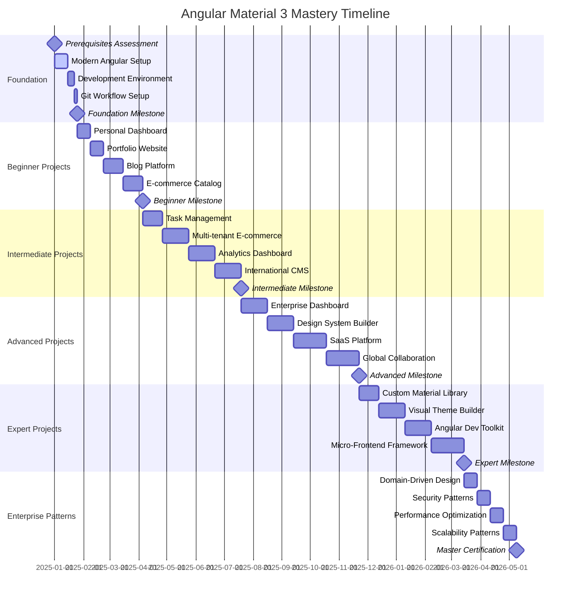

# Angular Material 3 Mastery - Project Timeline

## 📅 **Master Timeline Overview**

This comprehensive timeline provides structured planning for your Angular Material 3 mastery journey, with flexible scheduling options for different learning paces.

## 🗓️ **Timeline Visualization**



## 📊 **Flexible Timeline Options**

### **🚀 Accelerated Track (6 months)**
*For experienced developers with 20+ hours/week*

| Phase | Duration | Projects | Focus |
|-------|----------|----------|-------|
| Foundation | 2 weeks | Setup & Tools | Angular 17+, Material 3 |
| Beginner | 6 weeks | 4 Projects | Core patterns, theming |
| Intermediate | 8 weeks | 4 Projects | Advanced patterns, state |
| Advanced | 10 weeks | 4 Projects | Enterprise features |
| Expert | 8 weeks | 4 Projects | Custom solutions |
| Enterprise | 4 weeks | 4 Patterns | Architecture mastery |

**Weekly Commitment:** 20-25 hours
**Total Duration:** 24 weeks (6 months)
**Target Audience:** Senior developers, full-time learners

### **🎯 Standard Track (9 months)**
*For professional developers with 12-15 hours/week*

| Phase | Duration | Projects | Focus |
|-------|----------|----------|-------|
| Foundation | 3 weeks | Setup & Tools | Solid foundation |
| Beginner | 8 weeks | 4 Projects | Thorough understanding |
| Intermediate | 12 weeks | 4 Projects | Advanced implementation |
| Advanced | 14 weeks | 4 Projects | Enterprise expertise |
| Expert | 10 weeks | 4 Projects | Innovation skills |
| Enterprise | 6 weeks | 4 Patterns | Architecture mastery |

**Weekly Commitment:** 12-15 hours
**Total Duration:** 36 weeks (9 months)
**Target Audience:** Working professionals, career changers

### **🌱 Extended Track (12 months)**
*For part-time learners with 8-10 hours/week*

| Phase | Duration | Projects | Focus |
|-------|----------|----------|-------|
| Foundation | 4 weeks | Setup & Tools | Strong foundation |
| Beginner | 12 weeks | 4 Projects | Comprehensive learning |
| Intermediate | 16 weeks | 4 Projects | Deep understanding |
| Advanced | 18 weeks | 4 Projects | Enterprise readiness |
| Expert | 14 weeks | 4 Projects | Mastery development |
| Enterprise | 8 weeks | 4 Patterns | Leadership skills |

**Weekly Commitment:** 8-10 hours
**Total Duration:** 52 weeks (12 months)
**Target Audience:** Students, part-time learners, career explorers

## 📅 **Detailed Project Schedules**

### **Phase 1: Foundation Setup**

#### **Week 1-2: Modern Angular Setup**
```
Week 1:
- Day 1-2: Prerequisites assessment and planning
- Day 3-4: Angular CLI installation and project creation
- Day 5-6: VS Code setup and extension configuration
- Day 7: Initial project structure and basic routing

Week 2:
- Day 1-2: Material Design 3 integration
- Day 3-4: Theme configuration and customization
- Day 5-6: Component library exploration
- Day 7: Development workflow establishment
```

#### **Week 3: Development Environment**
```
- Day 1-2: Testing framework setup (Jest, Cypress)
- Day 3-4: Code quality tools (ESLint, Prettier, Husky)
- Day 5-6: CI/CD pipeline basics
- Day 7: Documentation and standards
```

### **Phase 2: Beginner Projects**

#### **Project 1: Personal Dashboard (2 weeks)**
```
Week 1:
Sprint Planning:
- [ ] Project architecture design
- [ ] Component structure planning
- [ ] Data model definition
- [ ] UI/UX wireframes

Daily Tasks:
- Day 1: Project setup and routing
- Day 2: Header and navigation components
- Day 3: Dashboard layout and cards
- Day 4: Widget components development
- Day 5: Data service implementation
- Day 6: Responsive design implementation
- Day 7: Basic testing setup

Week 2:
Sprint Planning:
- [ ] Theming and styling refinement  
- [ ] Interactive features
- [ ] Performance optimization
- [ ] Testing and documentation

Daily Tasks:
- Day 1: Custom theme implementation
- Day 2: Interactive dashboard widgets
- Day 3: State management basics
- Day 4: Performance optimization
- Day 5: Comprehensive testing
- Day 6: Documentation and code review
- Day 7: Project deployment and showcase
```

#### **Project 2: Portfolio Website (2 weeks)**
```
Week 1: Structure and Content
- [ ] Multi-page architecture
- [ ] Animation system setup
- [ ] Content management
- [ ] SEO optimization

Week 2: Polish and Optimization
- [ ] Advanced animations
- [ ] Performance tuning
- [ ] Accessibility improvements
- [ ] Final testing and deployment
```

#### **Project 3: Blog Platform (3 weeks)**
```
Week 1: Core Features
- [ ] Content management system
- [ ] Dynamic routing
- [ ] Form implementation
- [ ] Search functionality

Week 2: Advanced Features
- [ ] User authentication
- [ ] Comment system
- [ ] Rich text editor
- [ ] Tag management

Week 3: Polish and Deploy
- [ ] Performance optimization
- [ ] SEO implementation
- [ ] Testing and debugging
- [ ] Production deployment
```

#### **Project 4: E-commerce Catalog (3 weeks)**
```
Week 1: Product Management
- [ ] Product catalog structure
- [ ] Search and filtering
- [ ] Product detail pages
- [ ] Shopping cart basics

Week 2: Advanced Features
- [ ] User accounts
- [ ] Wishlist functionality
- [ ] Payment integration mockup
- [ ] Order management

Week 3: Optimization and Testing
- [ ] Performance optimization
- [ ] Advanced testing
- [ ] Documentation
- [ ] Production deployment
```

### **Phase 3: Intermediate Projects**

#### **Project 5: Task Management System (3 weeks)**
```
Week 1: Foundation
- [ ] NgRx setup and architecture
- [ ] Task CRUD operations
- [ ] User authentication
- [ ] Basic UI implementation

Week 2: Advanced Features
- [ ] Real-time updates (WebSocket simulation)
- [ ] Advanced state management
- [ ] Drag and drop functionality
- [ ] Team collaboration features

Week 3: Polish and Testing
- [ ] Performance optimization
- [ ] Comprehensive testing
- [ ] Documentation
- [ ] Deployment
```

## 🎯 **Milestone Tracking System**

### **Milestone Definition Template**
```markdown
## Milestone: [Name]
**Target Date:** [Date]
**Prerequisites:** [List]
**Success Criteria:**
- [ ] Criterion 1
- [ ] Criterion 2
- [ ] Criterion 3

**Deliverables:**
- [ ] Deliverable 1
- [ ] Deliverable 2
- [ ] Deliverable 3

**Review Process:**
- [ ] Code review completed
- [ ] Documentation updated
- [ ] Tests passing
- [ ] Performance benchmarks met
- [ ] Peer feedback incorporated

**Next Steps:**
- [ ] Next milestone preparation
- [ ] Skill assessment update
- [ ] Learning plan adjustment
```

### **Major Milestones**

#### **🏗️ Foundation Milestone**
**Target:** End of Week 3
**Success Criteria:**
- [ ] Development environment fully configured
- [ ] First Angular Material application deployed
- [ ] Git workflow established
- [ ] Testing framework operational
- [ ] Code quality tools active

**Celebration:** Treat yourself to a development tool or book!

#### **🟢 Beginner Milestone**
**Target:** End of Week 13
**Success Criteria:**
- [ ] 4 complete projects in portfolio
- [ ] All projects responsive and accessible
- [ ] Test coverage > 80% on all projects
- [ ] Custom themes implemented
- [ ] Performance scores > 90

**Celebration:** Share your portfolio publicly and get feedback!

#### **🟡 Intermediate Milestone**
**Target:** End of Week 25
**Success Criteria:**
- [ ] Advanced state management mastery
- [ ] Real-time features implemented
- [ ] Security patterns applied
- [ ] Performance optimization demonstrated
- [ ] Mentorship of junior developer

**Celebration:** Write a technical blog post about your journey!

#### **🔴 Advanced Milestone**
**Target:** End of Week 39
**Success Criteria:**
- [ ] Enterprise-grade applications built
- [ ] Micro-frontend architecture implemented
- [ ] Advanced testing strategies proven
- [ ] System design documentation complete
- [ ] Technical leadership demonstrated

**Celebration:** Apply for senior positions or speak at a meetup!

#### **🚀 Expert Milestone**
**Target:** End of Week 49
**Success Criteria:**
- [ ] Custom libraries created and published
- [ ] Development tools built
- [ ] Innovation projects completed
- [ ] Community contributions made
- [ ] Thought leadership established

**Celebration:** Speak at a conference or start a consultancy!

#### **🏢 Master Milestone**
**Target:** End of Week 57
**Success Criteria:**
- [ ] Enterprise patterns mastered
- [ ] Architecture expertise demonstrated
- [ ] Team leadership proven
- [ ] Industry recognition achieved
- [ ] Educational content created

**Celebration:** Apply for architect roles or start your own company!

## 📈 **Progress Tracking Tools**

### **Weekly Progress Template**
```markdown
# Week [Number] Progress Report

## Planned Objectives
- [ ] Objective 1
- [ ] Objective 2
- [ ] Objective 3

## Actual Progress
- ✅ Completed Task 1
- ⚠️ Partially Completed Task 2 (80%)
- ❌ Blocked Task 3 (dependency issue)

## Learnings
- Key insight 1
- Key insight 2
- Challenge encountered and solution

## Next Week Planning
- [ ] Priority task 1
- [ ] Priority task 2
- [ ] Priority task 3

## Adjustments Needed
- Timeline adjustment: [reason]
- Scope change: [reason]
- Resource need: [requirement]
```

### **Monthly Review Template**
```markdown
# Month [Number] Review

## Goals Achievement
- Goal 1: [Status and details]
- Goal 2: [Status and details]
- Goal 3: [Status and details]

## Skill Development
- Technical skills gained
- Soft skills improved
- Tools mastered

## Portfolio Updates
- New projects added
- Existing projects improved
- Documentation enhanced

## Career Progress
- Job market positioning
- Network expansion
- Learning opportunities

## Next Month Focus
- Primary objectives
- Skill development priorities
- Career advancement steps
```

## 🔄 **Timeline Adjustment Guidelines**

### **When to Adjust Timeline**
- **Falling Behind:** Adjust scope or extend timeline
- **Moving Ahead:** Add stretch goals or advance to next phase
- **Life Changes:** Modify commitment level and timeline
- **Career Opportunities:** Prioritize relevant skills

### **Adjustment Strategies**
1. **Reduce Scope:** Focus on core features
2. **Extend Timeline:** Add extra weeks for quality
3. **Change Track:** Switch between accelerated/standard/extended
4. **Parallel Learning:** Combine projects when possible
5. **Intensive Periods:** Sprint during available time

### **Timeline Buffer Planning**
- **Built-in Buffer:** 10-15% extra time for each phase
- **Holiday Adjustments:** Account for vacation and holidays  
- **Learning Curve:** Extra time for challenging topics
- **Review Periods:** Dedicated time for consolidation

## 🎯 **Success Metrics**

### **Quantitative Metrics**
- **Projects Completed:** Target vs. actual
- **Code Quality:** Test coverage, complexity scores
- **Performance:** Lighthouse scores, load times
- **Portfolio Growth:** Number of live projects
- **Community Engagement:** Blog posts, contributions

### **Qualitative Metrics**
- **Skill Confidence:** Self-assessment improvements
- **Problem Solving:** Ability to tackle complex challenges
- **Code Quality:** Cleaner, more maintainable code
- **Leadership:** Mentoring and knowledge sharing
- **Innovation:** Creative solutions and improvements

---

**🎯 Remember: This timeline is a guide, not a rigid schedule. Adjust based on your pace, commitments, and learning style. The goal is mastery, not speed!**
