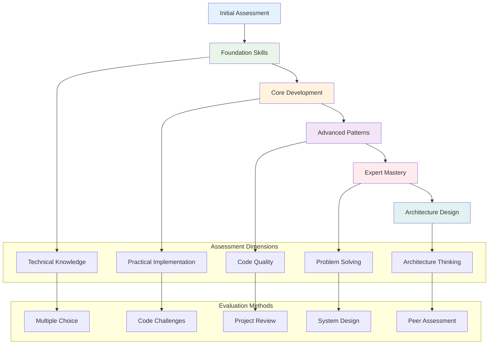

# Angular Material 3 Mastery - Skill Assessment

## 🎯 **Comprehensive Skill Evaluation System**

This assessment provides a detailed evaluation of your Angular Material 3 skills across all competency levels, from beginner to enterprise architect.

## 📊 **Assessment Overview**



## 🔍 **Skill Assessment Matrix**

### **Foundation Level Assessment (0-25%)**

#### **Angular Fundamentals (Weight: 30%)**
**Knowledge Areas:**
- [ ] **Components & Templates** (Score: ___/10)
  - Component lifecycle hooks
  - Template syntax and data binding
  - Input/Output properties
  - ViewChild and ContentChild

- [ ] **Services & Dependency Injection** (Score: ___/10)
  - Service creation and registration
  - Dependency injection patterns
  - Singleton vs. instance services
  - Injection tokens

- [ ] **Routing & Navigation** (Score: ___/10)
  - Route configuration
  - Navigation methods
  - Route guards
  - Lazy loading

**Assessment Questions:**

1. **Multiple Choice (3 points each)**
   ```
   Q1: Which lifecycle hook is called after component initialization?
   a) ngOnInit
   b) ngAfterViewInit
   c) ngOnDestroy
   d) ngOnChanges
   ```

2. **Code Challenge (10 points)**
   ```typescript
   // Create a service that manages user authentication
   // Include login, logout, and isAuthenticated methods
   // Implement proper error handling
   ```

3. **Implementation Task (15 points)**
   ```
   Create a routing module with:
   - Home route (/)
   - Dashboard route (/dashboard) - lazy loaded
   - Login route (/login)
   - Route guard for dashboard
   ```

#### **Material Design Basics (Weight: 25%)**
- [ ] **Component Library** (Score: ___/10)
  - Basic component usage
  - Component configuration
  - Material theming basics
  - Icon integration

- [ ] **Layout Systems** (Score: ___/10)
  - Flex layout
  - Grid system
  - Responsive design
  - Breakpoint management

**Assessment Questions:**

4. **Practical Implementation (20 points)**
   ```html
   <!-- Create a responsive card layout using Material components -->
   <!-- Include: header, content, actions -->
   <!-- Must work on mobile and desktop -->
   ```

#### **TypeScript Proficiency (Weight: 20%)**
- [ ] **Type System** (Score: ___/10)
  - Interface definitions
  - Generic types
  - Union and intersection types
  - Type guards

- [ ] **Advanced Features** (Score: ___/10)
  - Decorators
  - Async/await
  - Observables basics
  - Error handling

#### **Development Tools (Weight: 25%)**
- [ ] **Angular CLI** (Score: ___/10)
  - Project generation
  - Component/service generation
  - Build configuration
  - Testing commands

- [ ] **Debugging & Testing** (Score: ___/10)
  - Browser dev tools
  - Unit testing basics
  - Debugging techniques
  - Error analysis

**Foundation Level Score: ___/100**

### **Core Development Assessment (25-40%)**

#### **Advanced Angular Patterns (Weight: 35%)**
- [ ] **State Management** (Score: ___/15)
  - Service-based state
  - RxJS patterns
  - NgRx basics
  - State synchronization

- [ ] **Component Architecture** (Score: ___/15)
  - Smart vs. dumb components
  - Component communication
  - Content projection
  - Dynamic components

- [ ] **Advanced Templates** (Score: ___/15)
  - Structural directives
  - Attribute directives
  - Template reference variables
  - Control flow syntax (Angular 17+)

**Assessment Questions:**

5. **Architecture Challenge (25 points)**
   ```typescript
   /*
   Design a state management solution for a shopping cart:
   - Add/remove items
   - Update quantities
   - Calculate totals
   - Persist state
   - Handle concurrent updates
   */
   ```

6. **Component Design (20 points)**
   ```typescript
   /*
   Create a reusable data table component:
   - Generic data input
   - Sorting capabilities
   - Pagination
   - Column configuration
   - Action buttons
   */
   ```

#### **Material Design Advanced (Weight: 30%)**
- [ ] **Theming System** (Score: ___/15)
  - Custom theme creation
  - Dynamic theming
  - CSS custom properties
  - Theme inheritance

- [ ] **Component Customization** (Score: ___/15)
  - Style encapsulation
  - Component theming
  - Custom variants
  - Override strategies

**Assessment Questions:**

7. **Theming Challenge (30 points)**
   ```scss
   /*
   Create a custom Material theme with:
   - Primary: Corporate blue (#1976d2)
   - Secondary: Orange accent (#ff9800)
   - Custom typography scale
   - Dark mode support
   - High contrast accessibility
   */
   ```

#### **Performance & Optimization (Weight: 35%)**
- [ ] **Change Detection** (Score: ___/15)
  - OnPush strategy
  - Change detection optimization
  - TrackBy functions
  - Manual change detection

- [ ] **Bundle Optimization** (Score: ___/15)
  - Lazy loading implementation
  - Tree shaking
  - Code splitting
  - Performance budgets

**Core Development Score: ___/100**

### **Advanced Patterns Assessment (40-65%)**

#### **Enterprise Architecture (Weight: 40%)**
- [ ] **Micro-Frontend Patterns** (Score: ___/20)
  - Module federation
  - Shared libraries
  - Communication patterns
  - Deployment strategies

- [ ] **Domain-Driven Design** (Score: ___/20)
  - Bounded contexts
  - Aggregate design
  - Event sourcing
  - CQRS implementation

**Assessment Questions:**

8. **System Design Challenge (40 points)**
   ```
   Design a micro-frontend architecture for:
   - E-commerce platform with 5 teams
   - Shared design system
   - Independent deployments
   - Centralized authentication
   - Analytics and monitoring
   
   Include:
   - Architecture diagram
   - Communication patterns
   - Deployment strategy
   - Technology stack decisions
   ```

#### **Advanced Testing (Weight: 30%)**
- [ ] **Testing Strategies** (Score: ___/20)
  - Unit testing advanced
  - Integration testing
  - E2E testing
  - Visual regression testing

- [ ] **Test Architecture** (Score: ___/10)
  - Test organization
  - Mock strategies
  - Test data management
  - CI/CD integration

#### **Security & Performance (Weight: 30%)**
- [ ] **Security Implementation** (Score: ___/15)
  - Authentication patterns
  - Authorization systems
  - XSS prevention
  - CSRF protection

- [ ] **Performance Engineering** (Score: ___/15)
  - Performance monitoring
  - Optimization techniques
  - Memory management
  - Loading strategies

**Advanced Patterns Score: ___/100**

### **Expert Mastery Assessment (65-85%)**

#### **Custom Library Development (Weight: 35%)**
- [ ] **Component Library Creation** (Score: ___/20)
  - CDK usage
  - Component API design
  - Accessibility implementation
  - Distribution strategies

- [ ] **Tool Development** (Score: ___/15)
  - CLI tools
  - Schematics
  - Build tools
  - IDE extensions

**Assessment Questions:**

9. **Library Development Challenge (50 points)**
   ```typescript
   /*
   Create a custom Angular Material component library:
   - Advanced data grid component
   - Full accessibility support
   - Theming integration
   - Comprehensive testing
   - Documentation with Storybook
   - NPM distribution
   */
   ```

#### **Advanced Integrations (Weight: 35%)**
- [ ] **Third-Party Integration** (Score: ___/20)
  - External API integration
  - WebSocket implementation
  - Web Workers
  - Service Workers

- [ ] **Platform Integration** (Score: ___/15)
  - Server-side rendering
  - Progressive Web Apps
  - Mobile integration
  - Desktop applications

#### **Innovation & Leadership (Weight: 30%)**
- [ ] **Technical Leadership** (Score: ___/15)
  - Architecture decisions
  - Team mentoring
  - Code review practices
  - Technical documentation

- [ ] **Innovation Implementation** (Score: ___/15)
  - Emerging technology adoption
  - Process improvement
  - Tool evaluation
  - Best practice development

**Expert Mastery Score: ___/100**

### **Architecture Design Assessment (85-100%)**

#### **System Architecture (Weight: 50%)**
- [ ] **Large-Scale Design** (Score: ___/25)
  - Scalability patterns
  - Distributed systems
  - Data architecture
  - Integration patterns

- [ ] **Technology Strategy** (Score: ___/25)
  - Technology selection
  - Migration strategies
  - Risk assessment
  - Future-proofing

**Assessment Questions:**

10. **Enterprise Architecture Challenge (60 points)**
    ```
    Design a complete enterprise Angular application:
    - Multi-tenant SaaS platform
    - 10+ development teams
    - Global deployment
    - Compliance requirements (GDPR, SOX)
    - Performance SLAs
    - Security standards
    
    Deliverables:
    - Complete architecture diagram
    - Technology stack justification
    - Scalability plan
    - Security implementation
    - Monitoring strategy
    - Team organization
    ```

#### **Leadership & Governance (Weight: 50%)**
- [ ] **Technical Governance** (Score: ___/25)
  - Standards definition
  - Quality assurance
  - Risk management
  - Compliance frameworks

- [ ] **Team Leadership** (Score: ___/25)
  - Team structure
  - Skill development
  - Process optimization
  - Knowledge sharing

**Architecture Design Score: ___/100**

## 📊 **Assessment Scoring System**

### **Skill Level Calculation**
```typescript
interface SkillAssessment {
  foundation: number;      // 0-100
  coreDevevelopment: number;    // 0-100  
  advancedPatterns: number;     // 0-100
  expertMastery: number;        // 0-100
  architectureDesign: number;   // 0-100
}

function calculateOverallScore(assessment: SkillAssessment): number {
  const weights = {
    foundation: 0.15,
    coreDevevelopment: 0.20,
    advancedPatterns: 0.25,
    expertMastery: 0.25,
    architectureDesign: 0.15
  };
  
  return Object.entries(assessment).reduce((total, [key, score]) => {
    return total + (score * weights[key]);
  }, 0);
}
```

### **Skill Level Determination**
- **🔰 Novice (0-25%)**: Basic understanding, needs guidance
- **🟢 Beginner (25-40%)**: Can follow tutorials and examples
- **🟡 Intermediate (40-65%)**: Can build applications independently
- **🔴 Advanced (65-85%)**: Can solve complex problems and mentor others
- **🚀 Expert (85-95%)**: Can architect solutions and lead teams
- **🏆 Master (95-100%)**: Industry expert, thought leader

## 🎯 **Personalized Learning Plan**

### **Assessment Results Interpretation**

#### **If Score < 25% (Novice)**
**Recommended Path:**
1. Complete Angular fundamentals course
2. Master TypeScript basics
3. Build 3-5 simple projects
4. Focus on Material Design basics
5. Retake assessment in 2-3 months

**Learning Resources:**
- Angular Official Tutorial
- TypeScript Handbook  
- Material Design Guidelines
- Basic project templates

#### **If Score 25-40% (Beginner)**
**Recommended Path:**
1. Complete all beginner-level projects
2. Master component architecture
3. Learn state management basics
4. Implement responsive design
5. Build personal portfolio

**Focus Areas:**
- Component communication
- Service patterns
- Basic theming
- Testing fundamentals

#### **If Score 40-65% (Intermediate)**
**Recommended Path:**
1. Complete intermediate-level projects
2. Master advanced Angular patterns  
3. Implement enterprise features
4. Learn performance optimization
5. Contribute to open source

**Focus Areas:**
- Advanced RxJS
- NgRx state management
- Custom directives
- Testing strategies

#### **If Score 65-85% (Advanced)**
**Recommended Path:**
1. Complete advanced projects
2. Design system architecture
3. Mentor junior developers
4. Lead technical initiatives
5. Speak at conferences

**Focus Areas:**
- Micro-frontend architecture
- Performance engineering
- Security implementation
- Team leadership

#### **If Score 85%+ (Expert/Master)**
**Recommended Path:**
1. Create custom libraries
2. Develop tooling solutions
3. Define architecture standards
4. Build development frameworks
5. Influence industry direction

**Focus Areas:**
- Innovation leadership
- Community contribution
- Standard definition
- Thought leadership

## 📝 **Assessment Report Template**

```markdown
# Angular Material 3 Skill Assessment Report

**Assessment Date:** [Date]
**Assessor:** [Name]
**Overall Score:** [Score]/100 (**[Level]**)

## Score Breakdown
- Foundation Skills: [Score]/100
- Core Development: [Score]/100  
- Advanced Patterns: [Score]/100
- Expert Mastery: [Score]/100
- Architecture Design: [Score]/100

## Strengths
- [Strength 1]
- [Strength 2]
- [Strength 3]

## Areas for Improvement
- [Area 1] - Priority: [High/Medium/Low]
- [Area 2] - Priority: [High/Medium/Low]
- [Area 3] - Priority: [High/Medium/Low]

## Recommended Learning Path
1. [Recommendation 1]
2. [Recommendation 2]
3. [Recommendation 3]

## Next Assessment
**Recommended Date:** [Date]
**Focus Areas:** [Areas]

## Career Recommendations
Based on your assessment, you are qualified for:
- [Role 1]
- [Role 2]
- [Role 3]

Areas to develop for next level:
- [Development Area 1]
- [Development Area 2]
```

## 🔧 **Self-Assessment Tools**

### **Quick Self-Check Questions**
1. Can you create a custom Angular Material theme from scratch?
2. Do you understand the difference between OnPush and Default change detection?
3. Can you implement a micro-frontend architecture?
4. Have you created and published an Angular library?
5. Can you design a scalable enterprise Angular application?

### **Project-Based Assessment**
- [ ] **Beginner**: Build a personal dashboard with Material components
- [ ] **Intermediate**: Create a multi-tenant application with dynamic theming  
- [ ] **Advanced**: Implement a micro-frontend e-commerce platform
- [ ] **Expert**: Design and build a custom component library
- [ ] **Master**: Architect an enterprise-scale application

---

**🎯 Complete this assessment quarterly to track your progress and identify areas for continued growth and development.**
